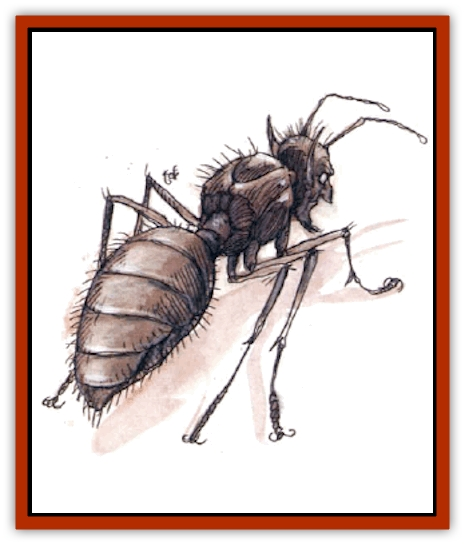

# Pasari-Niml

| Statistic | **Calipha** | **Noble** | **Warrior** |
| --- | --- | --- | --- |
| **Activity Cycle:** | Any | Any | Any |
| **Alignment:** | Lawful evil | Lawful evil | Lawful evil |
| **Armor Class:** | 10 | 4 | 4 |
| **Climate/Terrain:** | Any | Any | Any |
| **Damage/Attack:** | 1 | 1-3 or by weapon | 1-2 or by weapon |
| **Diet:** | Carnivore | Special | Special |
| **Frequency:** | Very Rare | Rare | Uncommon |
| **Hit Dice:** | 3-6 | 2 | 1 |
| **Intelligence:** | Very (11-12) | Very (11-12) | Average (8-10) |
| **Magic Resistance:** | 25% | Nil | Nil |
| **Morale:** | Unsteady (5) | Fanatic (18) | Elite (14) |
| **Movement:** | 1 | 12, Br 3 | 12, Br 3 |
| **No. Appearing:** | 1 | 1-2 | 3-12 |
| **No. of Attacks:** | 1 | 2 | 2 |
| **Organization:** | Colony | Squad | Squad |
| **Size:** | T-S (1-4') | T (6-8&rdquo;) | T (4-6&rdquo;) |
| **Special Attacks:** | Fear aura | Fear aura, burrowing | Fear aura, burrowing |
| **Special Defenses:** | See below | See below | See below |
| **THAC0:** | 3-4 HD: 17 / 5-6 HD: 15 | 19 | 19 |
| **Treasure:** | R,Q&times;2,S | Nil | Nil |
| **XP Value:** | 3 HD: 270 / 4 HD: 420 / 5 HD: 650 / 6 HD: 975 | 420 | 270 |

Pasari-nimal (sometimes called mants) are horrid, tool-using, insectoid predators. They appear to be very large black [[Ant|ants]] with human heads. A pasari-niml's head has pointed ears, bulging eyes, and a long face distorted by malevolence and evil. The skin on the head is wrinkled and brown. It has six legs, two of which can wield weapons or tools.

**Combat:** Upon first seeing a pasari-niml, creatures with hit dice equal to or less than that of the pasari-niml seen must roll a saving throw vs. spell. Those failing are frozen in place until attacked. Those who succeed flee at their top movement rate for 1-3 rounds. Creatures of higher hit dice must roll a successful saving throw vs. spell or flee at their top movement rate for 1-2 rounds.

Pasari-nimal always travel in squads of both warriors and nobles. They attack in an organized manner, directed by the nobles, who are in constant mental contact with the colony's calipha (queen). When a squad sights potential prey, the nobles send a few warriors to test the opponents, analyzing their attacks and defenses. The entire squad then attacks in concert.

Several climb onto a victim, and as many as eight can attack a single man-sized creature. The pasari-nimal burrow rapidly under and around well-armored individuals, creating a pitfall in one round. When the ground collapses, a victim must roll a successful saving throw vs. paralyzation or be trapped in 1 to 3 feet of dirt. A trapped enemy is attacked by several burrowing pasari-nimal. The pasari-nimal cut and pry at armor to make a hole, which takes 1-2 rounds. Afterward, a single pasari-niml attacks the vulnerable area at each hole.

If a squad faces dangerous or numerous opponents, they call for reinforcements; 1d4 additional squads arrive in 1d4+1 rounds. If necessary, the mants pull back and wait.

All warriors and nobles carry two darts and a small knife. Most pasari-nimal also carry tools, such as pry bars and awls.

Pasari-nimal are immune to all spells of the charm or enchantment schools.

**Habitat/Society:** Pasari-nimal live in large colonies containing 6d4x10 warriors, 1d20+20 nobles, and a calipha. They often live under human cities, burrowing in the ground and in walls of houses, sending out raiding parties at night. In the wild, warriors and nobles dig a burrow for their calipha and then construct an ever more elaborate palace above it. At any time, 1d4 squads patrol the outer reaches of the colony.

The calipha keeps a selama of nobles and reproduces rapidly, each day laying as many eggs as she has Hit Dice. Eggs hatch in three weeks; and approximately one in eight produces a noble. Once a year, a 6-HD calipha can produce a calipha egg. The egg hatches in three weeks, and a squad carries the new calipha several miles away and starts a new colony.

Pasari-nimal worship their calipha, performing rituals and carving her face into burrow and castle walls.

Pasari-nimal stay in contact through telepathy that is generated and received by their antennae only. The telepathy can be used within 1 mile of the calipha.

**Ecology:** Pasari-nimal are disruptive to a local ecosystem, preying on any animal or monster. Warriors and nobles bring food to the calipha, who digests and regurgitates some of it to feed them. If the calipha dies, the lesser pasari-nimal die in 1-2 days. If all the warriors and nobles die, the calipha can last three days per Hit Die, during which time new warriors or nobles may hatch.

Only very sturdy predators prey on warrior or noble mants.

**Calipha**

  A calipha exists to eat, receive worship, and reproduce. She has a beautiful, if small, female human head with long tresses and large, feathery antennae. Unfortunately, this spark of beauty is situated on an ugly, mottled, wormlike body.

The calipha has only a weak bite to defend herself, and her legs are small and weak. She cannot use tools, and she moves by wriggling. A queen grows 1 HD and 1 foot per year.

---
## Discovery & Documentation

**Source Publication:** City of Delights (1993)
**Campaign Setting:** Al-Qadim (Forgotten Realms)
**Author(s):** tom Prusa, Tim Beach, Steve Kurtz

### Other Creatures Found in This Source Book
   * [[Afanc|Afanc]]
   * [[Al-Jahar|Al-Jahar]]
   * [[Bird_Talking|Bird, Talking]]
   * [[Cat_Winged|Cat, Winged]]
   * [[Crypt_Servant|Crypt Servant]]
   * [[Elemental_Vermin|Elemental Vermin]]
   * [[Genie_Tasked_Harim_Servant|Genie, Tasked, Harim Servant]]
   * [[Ogre_Zakhara|Ogre (Zakhara)]]
   * [[Opinicus|Opinicus]]
   * [[Parasite|Parasite]]
   * [[Sirine|Sirine]]
   * [[Tatalla|Tatalla]]
   * [[Tree_Singing|Tree, Singing]]
