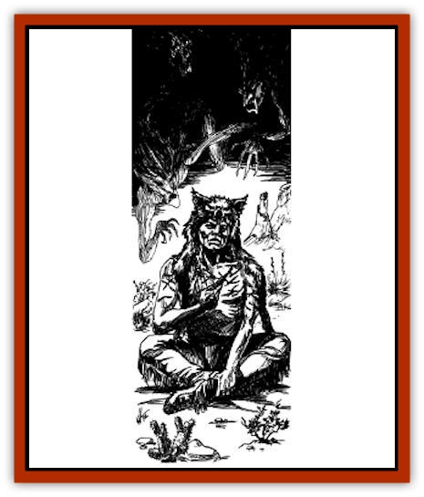
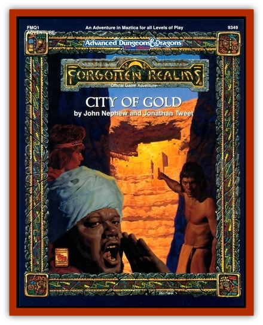

# Pasocada Ghost

| Statistic | **Pasocada Ghost** |
| --- | --- |
| **Activity Cycle:** | Night |
| **Alignment:** | Lawful Evil |
| **Armor Class:** | 0 or 10 |
| **Climate/Terrain:** | Any |
| **Damage/Attack:** | See below |
| **Diet:** | None |
| **Frequency:** | Very Rare |
| **Hit Dice:** | 10 |
| **Intelligence:** | Average (8-10) |
| **Magic Resistance:** | Nil |
| **Morale:** | Special |
| **Movement:** | 9 |
| **No. Appearing:** | 1 |
| **No. of Attacks:** | 1 |
| **Organization:** | Solitary |
| **Size:** | M (5-6' tall) |
| **Special Attacks:** | See below |
| **Special Defenses:** | See below |
| **THAC0:** | N/A |
| **Treasure:** | Nil |
| **XP Value:** | 4,000 |

In the Pasocada Basin and in similar areas of the True World, those who die but are not buried properly often return as [[Ghost|ghosts]] who haunt the places of their deaths. They are usually ethereal, but they become semi-material in order to attack those who enter the areas of their haunt. They appear with much the same form as they had when alive, though they are translucent and always carry bows and arrows.

**Combat:** Pasocada ghosts are usually ethereal but, when someone disturbs them, they become semi-material (and thus visible) and fire ghostly arrows at the intruder. Success is automatic (no attack roll is necessary), and the target must make a saving throw vs. spells or contract a disease (generally the fatal variety described under *cure disease*). A character who saves versus a Pasocada ghost's arrow is immune to that ghost. A character who fails the save will always fail saves against that ghost until rising a level, at which point he again has normal save chances.

While semi-material, a Pasocada ghost can only be struck by silver weapons (half damage) or magical ones (full damage). On the ethereal plane however, their AC is only 10. In addition, they are affected by spells, but only if the caster is ethereal himself.

**Habitat/Society:** Pasocada ghosts have nothing to do with each other. They are cursed to haunt an area until someone inters their corpse correctly, performs a proper burial service, or otherwise satisfies it. Of course, an area where many have died may have many Pasocada ghosts haunting it.

**Ecology:** The Pasocada ghost is a very real danger. They are difficult to hurt and destroy, and once one has struck its targets with disease-arrows, it becomes fully ethereal once again. Folklore of the Pasocada basin, therefore, strongly emphasizes the dangers of entering haunted areas, especially Esh Alakar.

---
## Discovery & Documentation

**Source Publication:** FMQ1 City of Gold (1991)
**Campaign Setting:** Maztica (Forgotten Realms)
**Author(s):** John Nephew and Jonathan Tweet
