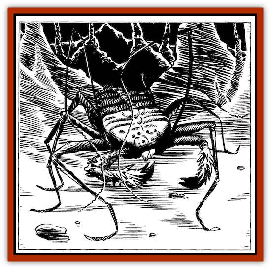
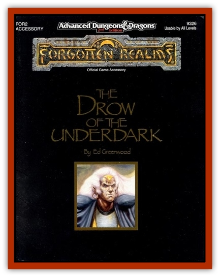

# Pedipalp

| Statistic | **Giant (Uropygus)** | **Huge (Amblypygus)** | **Large (Schizomida)** |
| --- | --- | --- | --- |
| **Activity Cycle:** | Any (most active in darkness) | Any (most active in darkness) | Any (most active in darkness) |
| **Alignment:** | Neutral | Neutral | Neutral |
| **Armor Class:** | 2 | 4 | 7 |
| **Climate/Terrain:** | All except arctic/all except tundra | All except arctic/all except tundra | All except arctic/all except tundra |
| **Damage/Attack:** | 1-8/1-8/2-8 | 1-6/1-6/1-8 | 1-8 |
| **Diet:** | Carnivore | Carnivore | Carnivore |
| **Frequency:** | Very rare | Rare | Rare |
| **Hit Dice:** | 4+4 | 2+2 | 1+1 |
| **Intelligence:** | Non (2) | Non (2) | Non (2) |
| **Magic Resistance:** | Nil | Nil | Nil |
| **Morale:** | Elite (13) | Steady (11) | Average (9) |
| **Movement:** | 6 | 12 | 12 |
| **No. Appearing:** | 1-2 | 1-4 | 1-4 |
| **No. of Attacks:** | 3 | 3 | 1 |
| **Organization:** | Solitary or hunting packs | Solitary or hunting packs | Solitary or hunting packs |
| **Size:** | L (8'-12') | M (4'-6') | S (up to 4' long) |
| **Special Attacks:** | Grip, poison gas | Grip | Nil |
| **Special Defenses:** | Poison immunity | Poison immunity | Poison immunity |
| **THAC0:** | 19 | 19 | 19 |
| **Treasure:** | I | Qx4, T | M, Qx2 |
| **XP Value:** | 650 | 175 | 35 |

Pedipalpi, also known as "whip scorpions," are found on various worlds. They vary somewhat in powers and habits; those of Toril are described here.

Pedipalpi resemble a cross between a [[Spider|spider]] and a [[Scorpion|scorpion]], and can be found in many colors. Brown and tan are the most common, but russet and bottle-green individuals are also numerous. All pedipalpi are immune to all sorts of poisons and corrosives (including acids and noxious vapors). They are often used by [[Elf_Drow|drow]] (cf. "Elf, Drow" in Volume 2 of the Monstrous Compendium) as household guardians, pets, and as the equivalent of hunting dogs.

Pedipalpi of Toril mate once every eight months or so, the female producing a cluster of 2d20 soft-shelled eggs. These are injected into the body of a creature disabled (typically pinned under rocks, and/or with joints broken) by the pedipalp couple, and when they hatch, eat their way to freedom.

**Large Pedipalp**

These scuttling creatures are common in the Underdark of Toril, where they dine on rats, worms, and other small prey. Equipped with two grasping arms and fearsomelooking mandibles, the schizomidae are incapable of grasping prey larger than themselves. "Large" pedipalpi (which may be as little as a foot long, when fully grown) lack the distinctive whip-like feelers of their larger cousins.

**Huge Pedipalp**

These creatures have developed two 8'-long, whip-like feelers (which they use to probe possible traps, fissures, and other unseen areas) in place of one pair of legs. Another pair of legs (the two foremost, closest to the 1-8-damage mandibles) have developed spiny pincers on the ends.

Besides biting in combat, huge pedipalpi (or amblypygi) use these pincers to strike. After a successful (1-6 points of damage) hit, the pedipalp automatically applies a crushing grip, unless the victim makes a successful bend bars/lift gates roll. The grip causes 2-12 damage on the second round, and on every round thereafter, until the victim breaks free (with a successful bend bars roll; one is allowed each round) or the pedipalp is slain. The pedipalp may use its bite on others during this time, if it can reach other prey. If it elects to bite the creature it is gripping, it attacks at +6 to hit. (The grip requires the use of both the pedipalp's pincers: if they elect to attack another being, the grip is broken.)

**Giant Pedipalp**

The uropygi have whip-like feelers and spiny pincers like the smaller amblypygi. They also have dangerous-looking, whip-like tails, that rather resemble the stings of scorpions when held aloft. The tail actually serves only as a feeler; these pedipalpi attack with two pincers and a bite.

After a uropygus scores a pincer hit (1-8 points of damage), it has the option of abandoning its other pincer hit that round in favor of a gripping attack. If it does so, the victim is allowed a bend bars/lift gates roll. If this roll fails, the pedipalp establishes a grip. On the following round, it automatically bites (for 2-8 points of damage), and crushes (for 2-16 points of damage). This damage is repeated each round until the uropygus is slain, breaks its grip to face another opponent (each attack from another creature has only a 1 in 2 chance of causing this; 2 in 12 if the attack hits), or one of the two bone-armored, spined gripping pincers is severed. A pincer will take 20 hit points of damage before being severed (consider these points separately from the pedipalp's true hp total), and has an effective armor class of 0.

Giant pedipalpi can also discharge a noxious vapor three times a day. This acrid, irritating, wet yellow gas expands in a single round, to affect a 20'-radius sphere centered on the pedipalp, before dissipating harmlessly. All nonpedipalpi creatures in this area must save versus poison, or be affected with twitching muscular tremors and spasms for 1-6 rounds (forcing them to fight at -3 on all attack rolls).

**Habitat/Society:** Pedipalpi of Toril are far-wandering hunters, who roam fearlessly in search of food, establishing no territories and heedless of foes. They will team up to face prey or opponents larger than themselves, but otherwise hunt alone or (if weak or young) in pairs. Pedipalpi never fight or hunt other pedipalpi, or other arachnids of any kind.

**Ecology:** Pedipalpi poison-sacks (which resemble fistsized, flexible walnuts) are valued by all who deal in poisons: a strong disabling poison can be distilled from them. The spined foreleg-pincers of pedipalpi serve many goblinkin as maces, and the feelers of a pedipalp can be used in battle as a whip (1d2 damage, 1 vs. L), for 3d4 days after the creature is slain. Thereafter, the feelers dry out too much, and crumble into useless fragility. No other parts of pedipalpi are safe or palatable eating for most creatures.

---
## Discovery & Documentation

**Source Publication:** The Drow of the Underdark (1991)
**Campaign Setting:** Forgotten Realms
**Author(s):** Ed Greenwood

### Other Creatures Found in This Source Book
   * [[Bat_Deep|Bat, Deep]]
   * [[Dragon_Deep|Dragon, Deep]]
   * [[Myrlochar|Myrlochar]]
   * [[Rothe_Deep|Rothe, Deep]]
   * [[Solifugid|Solifugid]]
   * [[Spider_Subterranean|Spider, Subterranean]]
   * [[Spitting_Crawler|Spitting Crawler]]
   * [[Yochlol_Underdark|Yochlol (Underdark)]]
