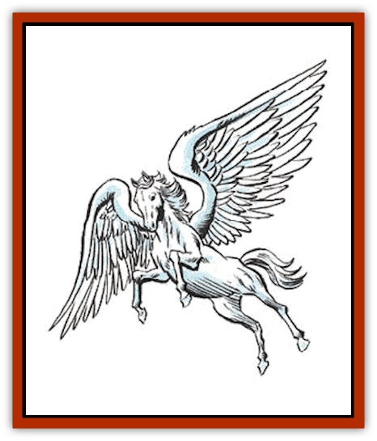

# Pegasus

| Statistic | **Pegasus** |
| --- | --- |
| **Activity Cycle:** | Day |
| **Alignment:** | Chaotic good |
| **Armor Class:** | 6 |
| **Climate/Terrain:** | Temperate and subtropical forests |
| **Damage/Attack:** | 1-8/1-8/1-3 |
| **Diet:** | Herbivore |
| **Frequency:** | Very rare |
| **Hit Dice:** | 4 |
| **Intelligence:** | Average (8-10) |
| **Magic Resistance:** | Nil |
| **Morale:** | Steady (11) |
| **Movement:** | 24, Fl 48 (C, D mounted) |
| **No. Appearing:** | 1-10 |
| **No. of Attacks:** | 3 |
| **Organization:** | Herd |
| **Size:** | L (5½' at the shoulder) |
| **Special Attacks:** | Dive, rear kick |
| **Special Defenses:** | Nil |
| **THAC0:** | 17 |
| **Treasure:** | Nil |
| **XP Value:** | 175 / Greater: 650 |

Pegasi are magnificent winged steeds that often serve the cause of good. These intelligent creatures are very shy and wild, not easily tamed. They serve only good characters, and when they do, they will serve their master with absolute faithfulness for the rest of his life.

A pegasus is a thoroughbred which resembles an Arabian [[Horse|horse]] (though slightly larger) with two large feathered wings. Pegasi are usually white, but brown pegasi are not unknown, and rumors persist of black pegasi. As should be expected, alignments do not vary according to color (all pegasi are chaotic good). Pegasi are 17 hands tall (5 feet at the shoulder) and weigh over 1,500 pounds. Pegasi must be ridden bareback; they will not accept saddles.

Pegasi speak their own language and can communicate with horses. They can understand common, and will obey their master's commands if they are given in that language.

**Combat:** A pegasus attacks with its hooves and teeth. It can attack an opponent who is behind it with its rear hooves, inflicting 2-12 points of damage, but it cannot use any of its other attacks in that round. A pegasus can also dive at an opponent from heights of 50 feet or higher and use its hoof attacks; each attack roll is +2 and does double damage.

In battle, a pegasus will try to lure larger opponents (such as dragons) into tight spaces. As the opponent struggles to maneuver into attack range, the pegasus climbs and attacks with its hooves from above. Against creatures their own size, such as [[Griffon|griffons]], pegasi use their superior speed to outrun them. If griffons are close to a pegasus nest (especially if there are young present), one parent will attack aggressively, get the griffon's attention, and then fly away. By doing this, they hope to lure enemies away from the nest and tire them out over a long distance before returning home.

**Habitat/Society:** Pegasi are egg-laying mammals. If encountered in their lair, there will be one nest for every pair of pegasi. There is a 20% chance per nest that there will be 1-2 eggs (30% chance) or young (70%) of 20-50% maturity. Each egg is worth 3,000 silver pieces, while the young are worth 5,000 silver pieces per head on the open market.

A pegasus can be used as a warhorse; a male can carry weight as a medium warhorse (220/330/440), while a female can carry weight as a light warhorse (170/255/340).

Pegasi are intelligent creatures. They can *detect good* and *detect evil* at will (60 yard range). They use these powers on those who would ride them; they try to throw anyone of non-good alignments who would tame them. If provoked, pegasi will not hesitate to attack creatures whom they perceive as evil.

To tame a pegasus, a person of good alignment must locate a pegasus herd. Then, at night, he can try to sneak up on a pegasus and surprise it. The character must have the airborne riding proficiency. There is an initial +10 penalty to the roll; pegasi do not like to be tamed. A magical bridle enchanted for the purpose will remove this penalty. If the character successfully makes his roll, then the pegasus will be tamed.

A tamed pegasus will obey the commands of its master for as long as it lives, if the master remains of good alignment.

**Ecology:** Pegasi feed on grass, fruits, and other plants. Griffons and [[Hippogriff|hippogriffs]] are the natural enemies of a pegasus. Pegasi have a lifespan of about 40 years.

**Greater Pegasus**

  Legend has it that if a [[Medusa|medusa]] is slain and beheaded, there is a small (5%) chance that a greater pegasus will be born, springing fully born from the medusa's cloven neck. These pegasi have the same attacks and movement rate of a normal pegasus but are worth 6 Hit Dice and have 20% magic resistance. They also have a +1 bonus to their morale rating. There is a 5% chance that the leader of a herd of pegasi will be a greater pegasus. Greater pegasi can be tamed only by the noblest and greatest of heroes, and have a lifespan of 100 years.

---
## Discovery & Documentation

**Source Publication:** MC1 Volume I (w/binder #1) (1991)
**Campaign Setting:** Advanced Dungeons & Dragons 2nd Edition
**Author(s):** Jay Batista, Scott Bennie, Grant Boucher, William W. Connors, Steve Gilbert, Heike Kubasch, James Lowder, David Edward Martin, Bruce Nesmith, Jean Rabe, Rick Swan, John J. Terra, Gary L. Thomas

### Other Creatures Found in This Source Book
   * [[Bat|Bat]]
   * [[Bear|Bear]]
   * [[Behir|Behir]]
   * [[Boar|Boar]]
   * [[Bookworm|Bookworm]]
   * [[Brownie|Brownie]]
   * [[Bugbear|Bugbear]]
   * [[Carrion_Crawler|Carrion Crawler]]
   * [[Cat_Great|Cat, Great]]
   * [[Catoblepas|Catoblepas]]
   * [[Dragon_General_Information|Dragon, General Information]]
   * [[Dragonfish|Dragonfish]]
   * [[Elemental_Air_Kin_Aerial_Servant|Elemental, Air Kin, Aerial Servant]]
   * [[Elemental_Earth_Kin_Sandling|Elemental, Earth Kin, Sandling]]
   * [[Elephant|Elephant]]
   * [[Gnoll|Gnoll]]
   * [[Hobgoblin|Hobgoblin]]
   * [[Homunculus|Homunculus]]
   * [[Hornet_Giant|Hornet, Giant]]
   * [[Horse|Horse]]
   * [[Hyena|Hyena]]
   * [[Jackal|Jackal]]
   * [[Jackalwere|Jackalwere]]
   * [[Korred|Korred]]
   * [[Lich|Lich]]
   * [[Lizard|Lizard]]
   * [[Lizard_Man|Lizard Man]]
   * [[Lycanthrope_General_Information|Lycanthrope, General Information]]
   * [[Lycanthrope_Seawolf|Lycanthrope, Seawolf]]
   * [[Lycanthrope_Werebear|Lycanthrope, Werebear]]
   * [[Lycanthrope_Weretiger|Lycanthrope, Weretiger]]
   * [[Lycanthrope_Werewolf|Lycanthrope, Werewolf]]
   * [[Manticore|Manticore]]
   * [[Medusa|Medusa]]
   * [[Mind_Flayer|Mind Flayer]]
   * [[Minotaur|Minotaur]]
   * [[Mudman|Mudman]]
   * [[Mummy|Mummy]]
   * [[Nixie|Nixie]]
   * [[Nymph|Nymph]]
   * [[Ogre|Ogre]]
   * [[Ooze_Slime_Jelly_I|Ooze/Slime/Jelly I]]
   * [[Ooze_Slime_Jelly_II|Ooze/Slime/Jelly II]]
   * [[Orc|Orc]]
   * [[Owl|Owl]]
   * [[Owlbear_I|Owlbear I]]
   * [[Piercer|Piercer]]
   * [[Pudding_Deadly|Pudding, Deadly]]
   * [[Rakshasa|Rakshasa]]
   * [[Rat|Rat]]
   * [[Ray|Ray]]
   * [[Remorhaz|Remorhaz]]
   * [[Satyr|Satyr]]
   * [[Scorpion|Scorpion]]
   * [[Selkie|Selkie]]
   * [[Shadow|Shadow]]
   * [[Skeleton|Skeleton]]
   * [[Skunk|Skunk]]
   * [[Snake|Snake]]
   * [[Spectre|Spectre]]
   * [[Spider|Spider]]
   * [[Sprite|Sprite]]
   * [[Toad_Giant|Toad, Giant]]
   * [[Treant|Treant]]
   * [[Troll|Troll]]
   * [[Umber_Hulk|Umber Hulk]]
   * [[Unicorn|Unicorn]]
   * [[Vampire|Vampire]]
   * [[Wight|Wight]]
   * [[Will_O'Wisp|Will O'Wisp]]
   * [[Wolf|Wolf]]
   * [[Wolfwere|Wolfwere]]
   * [[Wraith|Wraith]]
   * [[Wyvern|Wyvern]]
   * [[Yeti|Yeti]]
   * [[Yuan-ti|Yuan-ti]]
   * [[Zombie|Zombie]]
