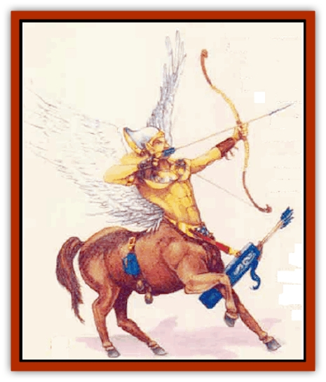

# Pegataur

| Statistic | **Pegataur** |
| --- | --- |
| **Activity Cycle:** | Day |
| **Alignment:** | Neutral good |
| **Armor Class:** | 7 (or better with armor) |
| **Climate/Terrain:** | Temperate mountains |
| **Damage/Attack:** | 1d6/1d6 (hooves)/by weapon |
| **Diet:** | Omnivore |
| **Frequency:** | Very rare |
| **Hit Dice:** | 5 to 8 |
| **Intelligence:** | Average (8-10) |
| **Magic Resistance:** | Nil |
| **Morale:** | Elite (13) |
| **Movement:** | 18, Fl 36 (C; D when encumbered) |
| **No. Appearing:** | 2-20 |
| **No. of Attacks:** | 3 |
| **Organization:** | Tribal |
| **Size:** | L (8' tall) |
| **Special Attacks:** | Dive |
| **Special Defenses:** | 30% immunity to <i>sleep</i> and <i>charm</i> |
| **THAC0:** | 5-6 HD: 15 / 7-8 HD 13 |
| **Treasure:** | M,Q (E) |
| **XP Value:** | 975 / Spellcaster (5 HD): 1,400 / 6 HD leader: 1,400 / 7 HD leader: 2.000 / 8 HD leader: 5,000 |

Pegataurs are winged [[Centaur|centaurs]] with the upper bodies of [[Elf|elves]]. They are skilled warriors sometimes hired as mercenaries.

A pegataur's lower body resembles a strong, healthy [[Horse|horse]]. Most are white, gray, brown, or black. Pegataur wings, normally white, consist of downy but strong feathen.

A pegataur's upper torso and head resemble a high elf. Most have long blond or silver hair. They speak Common, elvish, and their own language - a peculiar dialect related to elvish, but different enough to be a separate language. Pegataurs have an affinity for [[Pegasus|pegasi]] and can communicate with them.

**Combat:** Pegataurs fight to defend themselves or their territory. They also fight if ordered to do so by an employer. Though they prefer not to, pegataurs sometimes carry humans or demihumans into combat.

If a group of pegataurs surprises opponents in the open, a swooping dive at the foes is preferred, often with light lances. This charging attack grants the pegataurs a +2 bonus to attack rolls and a +1 penalty to Armor Class. Since the pegataurs dive only at opponents they surprise, the opponents do not receive the standard initiative bonus associated with a charging attack. A successful attack by a diving centaur inflicts double damage. The diving maneuver is usually performed once at the beginning of combat as a "softening up" measure; it often (60% of such attacks) ruins the lances.

Pegataurs can attack with their front hooves, inflicting 1d6 points of damage with each. A pegataur can attack with a weapon and both hooves all in the same round.

Most adult pegataurs are proficient with long bow, light lance, two-handed sword, and horseman's mace. A standard (5 HD) pegataur is 20% likely to be specialized with one of these weapons. This chance increases by 10% for every Hit Die over 5, so a pegataur with 8 Hit Dice has a 50% chance for a weapon specialization.

Most pegataurs remain unarmored for better mobility in the air. However, there is a 30% chance that a group of pegataurs will be armored as follows: chain mail (50%), leather (25%), elven chain (10%), splint (10%), or plate mail (5%). Armor types of Armor Class 7 or worse provide an AC bonus of -1; thus, a pegataur in leather armor is Armor Class 6. Only 10% of pegataurs carly shields into battle; pegataurs using shields receive a -1 bonus to Armor Class for their humanoid foreparts only. Pegataur leaders have a 5% chance per Hit Die to have enchanted armor. Pegataurs wearing armor or carrying riders are maneuverability class D. Riders may be armed.

Most pegataurs encountered have 5 Hit Dice; of these, approximately one-third can cast spells as 5th-level wizards in addition to their warrior abilities. However, these multi-classed pegataurs never have weapon specialization.

Any group of five or fewer pegataurs has a 40% chance to being accompanied by 1d10 pegasi. For every four pegataurs in a group, there will be a fifth pegataur with 6 Hit Dice. For every ten pegataurs encountered, there will be an additional pegataur with 7 Hit Dice. For every 20 pegataurs encountered, there will be one with 8 Hit Dice, and a 50% chance for either a mage or a cleric of 5th level.

Single-class pegataur wizards can be specialists, but such characters are rare, and are never necromancers. Rare pegataurs may rise to higher levels as wizards, fighters, or priests, but they are not known to advance beyond 14th level in any class.

All pegataurs have 60-foot infravision. Like [[Elf_Half-|half-elves]], pegataurs are 30% resistant to *sleep* and *charm* spells.

**Habitat/Society:** Pegataurs carve abodes in the sides of high mountains. These pegataur-made caves, called rehir, are not dark and cramped, but are instead beautiful affairs with vaulted ceilings and intricately carved walls. Veins of rare crystals provide illumination at night.

A pegataur tribe usually has 2d10+10 adult members and is led by a male with 8 Hit Dice. In addition to the adults, a tribe also has 1d10+5 noncombatant foals and 3d6 pegasi.

Like elves, pegataurs are generally aloof, especially toward nonflyers, though their alignment makes them more approachable than may be initially believed. If paid well and treated with respect, pegataurs can be hired as troops or bodyguards, or for special tasks. Pegataurs never work for evil individuals.

**Ecology:** Pegataurs have been known to work with druids and [[Phanaton|phanatons]] to maintain the balance of nature in a given area. They also train pegasi mounts for ground dwellers.

---
## Discovery & Documentation

**Source Publication:** Monstrous Compendium, 1996 Annual, Volume 3 (1995)
**Campaign Setting:** Advanced Dungeons & Dragons 2nd Edition
**Author(s):** Jon Pickens

### Other Creatures Found in This Source Book
   * [[Alaghi|Alaghi]]
   * [[Alhoon|Alhoon]]
   * [[Aranea_Savage_Coast|Aranea (Savage Coast)]]
   * [[Arcane_Head|Arcane Head]]
   * [[Banedead|Banedead]]
   * [[Banelich|Banelich]]
   * [[Bat_Bonebat|Bat, Bonebat]]
   * [[Beetle|Beetle]]
   * [[Belgoi|Belgoi]]
   * [[Bladeling|Bladeling]]
   * [[Braxat|Braxat]]
   * [[Bunyip|Bunyip]]
   * [[Burbur|Burbur]]
   * [[Bvanen|Bvanen]]
   * [[Cat_Great_Snow_Tiger|Cat, Great, Snow Tiger]]
   * [[Chosen_One|Chosen One]]
   * [[Chronovoid|Chronovoid]]
   * [[Cildabrin|Cildabrin]]
   * [[Coffer_Corpse|Coffer Corpse]]
   * [[Disenchanter|Disenchanter]]
   * [[Dog_Temporal|Dog, Temporal]]
   * [[Dragon_Cerilia|Dragon (Cerilia)]]
   * [[Dragon_Ghost|Dragon, Ghost]]
   * [[Dragon_Lesser_Undead|Dragon, Lesser Undead]]
   * [[Dragon_Neutral_Amber|Dragon, Neutral, Amber]]
   * [[Dread_Warrior|Dread Warrior]]
   * [[Dreamweaver|Dreamweaver]]
   * [[Dream_Spawn_Greater_Ennui|Dream Spawn, Greater, Ennui]]
   * [[Dream_Spawn_Lesser_Morph|Dream Spawn, Lesser, Morph]]
   * [[Dwarf_Arctic|Dwarf, Arctic]]
   * [[Dwarf_Urdunnir|Dwarf, Urdunnir]]
   * [[Eel_Giant_Moray|Eel, Giant Moray]]
   * [[Elemental_Fire_Kin_Tome_Guardian|Elemental, Fire Kin, Tome Guardian]]
   * [[Elf_Rockseer|Elf, Rockseer]]
   * [[Ethyk|Ethyk]]
   * [[Faerie_Faerie_Fiddler|Faerie, Faerie Fiddler]]
   * [[Faerie_Petty_Bramble|Faerie, Petty, Bramble]]
   * [[Faerie_Petty_Gorse|Faerie, Petty, Gorse]]
   * [[Faerie_Petty|Faerie, Petty]]
   * [[Firenewt|Firenewt]]
   * [[Formian|Formian]]
   * [[Gargoyle_II|Gargoyle II]]
   * [[Giant_Cerilia|Giant (Cerilia)]]
   * [[Goblin_Cerilia|Goblin (Cerilia)]]
   * [[Golem_Magic|Golem, Magic]]
   * [[Golem_Shaboath|Golem, Shaboath]]
   * [[Hag_Bheur|Hag, Bheur]]
   * [[Hamadryad|Hamadryad]]
   * [[Hound_of_Ill-Omen|Hound of Ill-Omen]]
   * [[Human_Cerilia|Human (Cerilia)]]
   * [[Hybsil|Hybsil]]
   * [[Ibrandlin|Ibrandlin]]
   * [[Imp_Chaos|Imp, Chaos]]
   * [[Ixitxachitl_Ixzan|Ixitxachitl, Ixzan]]
   * [[Jabberwock|Jabberwock]]
   * [[Kyton|Kyton]]
   * [[Kyuss_Son_of|Kyuss, Son of]]
   * [[Lillend|Lillend]]
   * [[Life-Shaped_Creation_Guardian|Life-Shaped Creation, Guardian]]
   * [[Life-Shaped_Creation_Transport|Life-Shaped Creation, Transport]]
   * [[Lycanthrope_Werecrocodile|Lycanthrope, Werecrocodile]]
   * [[Lycanthrope_Werespider|Lycanthrope, Werespider]]
   * [[Magedoom|Magedoom]]
   * [[Manotaur|Manotaur]]
   * [[Mastiff_Shadow|Mastiff, Shadow]]
   * [[Meazel|Meazel]]
   * [[Mist_Scarlet_Dancer|Mist, Scarlet Dancer]]
   * [[Needleman|Needleman]]
   * [[Orc_Neo-Orog|Orc, Neo-Orog]]
   * [[Orc_Ondonti|Orc, Ondonti]]
   * [[Owlbear_II|Owlbear II]]
   * [[Phaerimm|Phaerimm]]
   * [[Reggelid|Reggelid]]
   * [[Render|Render]]
   * [[Saurial|Saurial]]
   * [[Scalamagdrion|Scalamagdrion]]
   * [[Sharn|Sharn]]
   * [[Snake_Messenger|Snake, Messenger]]
   * [[Spirit_Forest_Uthraki|Spirit, Forest, Uthraki]]
   * [[Spirit_Forest_Wood_Man|Spirit, Forest, Wood Man]]
   * [[Spirit_Ice_Orglash|Spirit, Ice, Orglash]]
   * [[Spirit_Rock_Thomil|Spirit, Rock, Thomil]]
   * [[Strider_Giant|Strider, Giant]]
   * [[Tembo|Tembo]]
   * [[Temporal_Glider|Temporal Glider]]
   * [[Temporal_Stalker|Temporal Stalker]]
   * [[Tether_Beast|Tether Beast]]
   * [[Thessalmonster|Thessalmonster]]
   * [[Time_Dimensional|Time Dimensional]]
   * [[Tomb_Tapper|Tomb Tapper]]
   * [[Undead_Dragon_Slayer|Undead Dragon Slayer]]
   * [[Unicorn_Black_Toril|Unicorn, Black (Toril)]]
   * [[Vaath|Vaath]]
   * [[Vortex_Spider|Vortex Spider]]
   * [[Weredragon|Weredragon]]
   * [[Zhentarim_Spirit|Zhentarim Spirit]]
