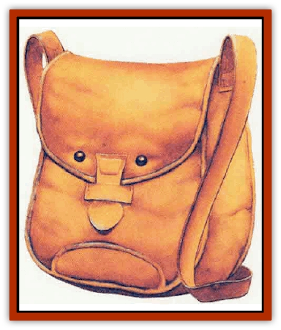

# Peltast

| Statistic | **Greater Peltast** | **Peltast** |
| --- | --- | --- |
| **Activity Cycle:** | Any | Any |
| **Alignment:** | Neutral | Neutral |
| **Armor Class:** | 3 | 7 |
| **Climate/Terrain:** | Any land | Any land |
| **Damage/Attack:** | See below | See below |
| **Diet:** | Special | Special |
| **Frequency:** | Very rare | Very rare |
| **Hit Dice:** | 2+6 | 1+6 |
| **Intelligence:** | Exceptional (15-16) | Average (8-10) |
| **Magic Resistance:** | 33% | 7% |
| **Morale:** | Elite (14) | Steady (12) |
| **Movement:** | 4 | 4 |
| **No. Appearing:** | 1 | 1 |
| **No. of Attacks:** | 1 | 1 |
| **Organization:** | Solitary | Solitary |
| **Size:** | T (amorphous) | T (under 2' long unless stretched very thin) |
| **Special Attacks:** | See below | See below |
| **Special Defenses:** | Immune to poison and crushing attacks | Immune to poison and crushing attacks |
| **THAC0:** | 19 | 19 |
| **Treasure:** | Nil | Nil |
| **XP Value:** | 975 | 65 |

A peltast is an amorphous creature about the size of three human fists in volume. Its skin has a textured, mottled brown hue resembling worn but sturdy leather. A peltast can change its shape to exactly match a leather item in two rounds. If a peltast sees a leather item dropped, it swiftly moves and changes form as to be mistaken for the missing item. A peltast feels and hefts like leather, and does not breathe, give off heat, or make any sound. It has no tanning odor, nor does it radiate magic. A peltast's skin can sense vibrations, smell acutely, and its many tiny, concealable eyes have 60-foot infravision.

**Combat:** In contact with suitable flesh, a peltast exudes a liquid anaesthetic and tissue softener. There is only a 1% chance that a host creature will notice its attack. The peltast dissolves the host's skin in a small, hidden area. Through this, it absorbs 1 hit point/day of blood-borne nutrients. A healthy host may never notice the slight weakncss this causes. If the peltast is removed, there is no telltale peeling, pulling, or blood.

The peltast is resilient and is immune to poison and crushing attacks, but all edged weapons do full damage Peltasts also gain +1 on saving throws vs. fire.

**Habitat/Society:** The peltast infests dungeon settings. The peltast can be encountered in urban settings, especially where there are direct connections with dungeons or sewer systems below; the most common forms these are found in are discarded coin bags, belts, hats, or gloves.

**Ecology:** Peltasts live in symbiosis with humans and all goblinkind. [[Elf|Elves]] and [[Dwarf|dwarves]] aren't right for its needs, and are used only as carriers to more suitable hosts.

A peltast will leave a diseased host, but helps keep its host alive while attached. It neutralizes poisons introduced into the host. Its slight magic resistance is also extended to the host. Should the host be reduced to two hit points or less, the peltast will inject 1d4+2 points of energy back into the host; it can do this only once a day.

A peltast exudes wastes whenever immersed in water, staining and poisoning it; drinkers must save vs. poison at a +2 bonus or become nauseated for 2d4 rounds, unable to attack or defend.

A peltast will never fight another peltast, nor willingly join a host already carrying one. Peltasts can sense each other up to 40 feet away.

**Greater Peltasts**

  These rarer peltasts resemble translucent rock crystals instead of leather. Hard to the touch and about the size of a human fist, they can alter the internal hue and shape of their bodies. No organs or structures are visible in a greater peltast, and over the centuries they have learned to shape themselves into exact resemblances of faceted gems, valued by many creatures. Greater peltasts are found deep underground, and rarely, if ever, in a city. They often hide among real gemstones.

Greater peltasts can be seen feeding: the blood they ingest is visible inside their bodies. They also grow visibly upon draining more than 3 hit points of nutrients (a greater peltast can typically drain up to  12 hit points, half of which are added to its hit point total for a day). Because of this, greater peltasts prefer to feed on sleeping, dead, or disabled creatures, using their magical powers to fetch more meals.

Once a round, a greater peltast can silently use one of its abilities: *call monsters* (like a *monster summoning VI* spell, but used to call hostile creatures against its carrier until a good meal opportunity develops); a powerful *suggestion* (-1 on subject saving throws) to influence called creatures and other beings around them into creating the maximum possible bloodshed without depriving the greater peltast of all potential host-creatures; and *slow* on any being touching or carrying the greater peltast.

These "false gems" have exceptional intelligence and are more powrrful than the common variety. They otherwise drain a host, and give benefits, exactly as do their lesser cousins.

---
## Discovery & Documentation

**Source Publication:** City of Splendors (1994)
**Campaign Setting:** Forgotten Realms
**Author(s):** Ed Greenwood, Elain Cunningham

### Other Creatures Found in This Source Book
   * [[Curst|Curst]]
   * [[Doppelganger_Greater|Doppelganger, Greater]]
   * [[Duhlarkin|Duhlarkin]]
   * [[Gulguthhydra|Gulguthhydra]]
   * [[Hakeashar|Hakeashar]]
   * [[Leucrotta_Greater|Leucrotta, Greater]]
   * [[Lycanthrope_Wereshark|Lycanthrope, Wereshark]]
   * [[Nyth|Nyth]]
   * [[Ooze_Slime_Jelly_Ghaunadan|Ooze/Slime/Jelly, Ghaunadan]]
   * [[Palimpsest|Palimpsest]]
   * [[Raggamoffyn|Raggamoffyn]]
   * [[Shadowrath|Shadowrath]]
   * [[Snake_Sewerm|Snake, Sewerm]]
   * [[Watchspider|Watchspider]]
