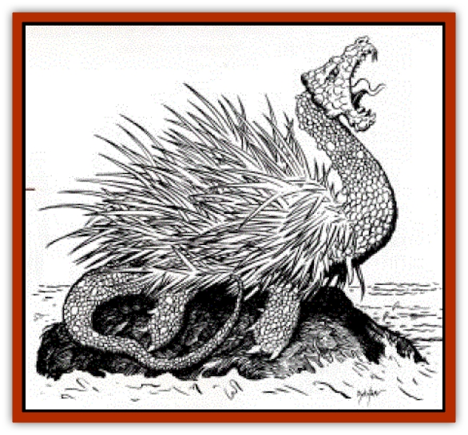

# Peluda

| Statistic | **Peluda** |
| --- | --- |
| **Activity Cycle:** | Night |
| **Alignment:** | Neutral evil |
| **Armor Class:** | 3 |
| **Climate/Terrain:** | Temperate swamp or woodland |
| **Damage/Attack:** | 1-10 or 2-16 |
| **Diet:** | Carnivore |
| **Frequency:** | Rare |
| **Hit Dice:** | 18 |
| **Intelligence:** | Low (7) |
| **Magic Resistance:** | Nil |
| **Morale:** | Fearless (19) |
| **Movement:** | 9 |
| **No. Appearing:** | 1-2 |
| **No. of Attacks:** | 1 |
| **Organization:** | solitary |
| **Size:** | G (90' long) |
| **Special Attacks:** | Breath weapon, quills, surprise |
| **Special Defenses:** | Quills, resistance to fire |
| **THAC0:** | 5 |
| **Treasure:** | H |
| **XP Value:** | 15,000 |

The peluda, or "shaggy beast", is a dragonlike creature with a long neck and tail, no wings, four feet like those of a giant snapping turtle, and a back covered with bright orange quills. The base of these quills is pine green. A peluda's body is turtleshaped but without a shell, and the quills and coarse fur give the torso a shaggy appearance.

**Combat:** The peluda can attack with a bite that causes 1d10 hp damage or a slap of its powerful tail, which inflicts 2d8 hp damage. It also has a cone-shaped flaming breath weapon 300 feet long, 10 feet wide at the base, broadening to 60 feet at the end, which causes 8d6 hp damage or half that if the victim saves vs. breath weapon. The peluda suffers only half-damage from all fire-based attacks, or none if the creature makes its saving throw.

The peluda's spines are both offensive and defensive. They cause 2-20 hp damage to any creature that comes in contact with them; in addition, they are highly poisonous (Type F poison). The quills create such a dense thicket on the monster's torso that they also stop all arrows and other missiles fired at the body (75% of all missile attacks, unless attackers deliberately make called shots elsewhere). Finally, the peluda can fire these quills in the manner of a giant porcupine. The range of these fired quills is 300 feet; the quills themselves are over 10 feet long. Thus, even in melee combat, the peluda can jab with its quills any opponent that comes within 10 feet of it, save for those attacking directly to the front or directly behind it.

The peluda can cause its orange quills to change color to the same green as its fur, enabling it to camouflage itself among the trees of forest and swamp, ambushing any creatures who come within range (-3 penalty to the surprise roll).

**Habitat/Society:** Peludas pair up briefly in the spring mating season, as they are solitary creatures. Even the females abandon their eggs after burying them along a river bank. They do this so well, however, that a successful mining proficiency check is required to discover the hidden excavation. Because the peluda requires so much flesh as food, a couple coming together for a more permanent arrangement would soon strip the neighborhood bare of animal and monstrous life. Young peludas hatch after a month of incubation and are able to take care of themselves immediately after hatching.

**Ecology:** The peluda is the top carnivore of the swampy and forest environments it calls home, save when true dragons of at least adult age are around. Young dragons are eaten as readily as any other prey, but only when their parents are not about. The reverse is true as well, of course, with dragons eating young peludas whenever they can. Unless the local dragons are forest-dwellers such as the green dragons are, however, they won't get many opportunities, for the peluda is quite wellequipped for hiding in the woods, and when the dragon is flying, this creature also has the forest canopy as additional cover. Indeed, as long as the peluda sticks to the woods and doesn't venture into the local hills, deserts, or whatever, a nearby dragon living in those types of terrain may be entirely unaware of the creature's presence.

---
## Discovery & Documentation

**Source Publication:** Dragon248 (1998)
**Campaign Setting:** Dragon Magazine
**Author(s):** Gregory W. Detwiler, Terry Dykstra

### Other Creatures Found in This Source Book
   * [[Amphitere|Amphitere]]
   * [[Cetus_Lesser|Cetus, Lesser]]
   * [[Dragonet|Dragonet]]
   * [[Dragon_Orange_Sodium|Dragon, Orange (Sodium)]]
   * [[Dragon_Purple_Energy|Dragon, Purple (Energy)]]
   * [[Dragon_Yellow_Salt|Dragon, Yellow (Salt)]]
   * [[Gargouille|Gargouille]]
   * [[Hai_Riyo|Hai Riyo]]
   * [[Sirrush|Sirrush]]
   * [[Vore_Lekiniskiy_Master_Fire_Worm|Vore Lekiniskiy, Master Fire Worm]]
