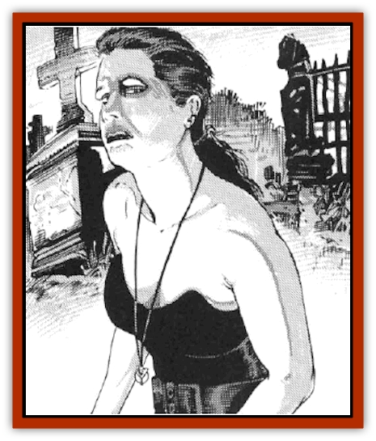

# Penanggalan

| Statistic | **Penanggalan** |
| --- | --- |
| **Activity Cycle:** | Night |
| **Alignment:** | Lawful evil |
| **Armor Class:** | 10; 8 with head detached |
| **Climate/Terrain:** | Any |
| **Damage/Attack:** | 1-6 or by weapon type/1-4 |
| **Diet:** | Blood |
| **Frequency:** | Rare |
| **Hit Dice:** | Body variable; head 4 |
| **Intelligence:** | Average (8-10) |
| **Magic Resistance:** | See below |
| **Morale:** | Steady (11) |
| **Movement:** | 12; head detached Fl 18 (B) |
| **No. Appearing:** | 1 |
| **No. of Attacks:** | 1 or 2 |
| **Organization:** | Solitary |
| **Size:** | M (5-6') |
| **Special Attacks:** | Blood drain |
| **Special Defenses:** | See below |
| **THAC0:** | 16 |
| **Treasure:** | Nil |
| **XP Value:** | 1,400 |

A female [[Vampire_General_Information|vampire]] variant of great power and horrifying appearance, the penanggalan appears during daylight as an attractive human female of any character class. This "person" will resemble the penanggalan before its death.

At night, the penanggalan assumes its true form. Its head detaches itself from its body, rising vertically and flying off in search of human prey, to feast upon blood. Attached to the base of the head is a 3' long, slimy black "tail" which tapers to a point at one end. A penanggalan's eyes glow red in near-total and total darkness conditions.

**Combat:** In human form, the creature will fight and act in the manner appropriate to her apparent class and level, with most abilities undiminished. Thus, if she was a wizard in life, she can cast spells; if a thief, she can pick pockets. If, however, the penanggalan was a paladin before death, she is considered a normal fighter of appropriate level. If the penanggalan was a cleric, she is limited to using only those spells which have a harmful effect, and she cannot turn undead. In this human form, the body of the penanggalan is also vulnerable to damage as she was before death, and her hit points remain the same as in life. The head, however, will withstand an extra 4 HD of damage.

A *know alignment* spell cast on the creature in human form will reveal the alignment the penanggalan pursued while alive; as undead, at night, the creature is lawful evil.

In her human form, the penanggalan is immune to holy/unholy symbols and undead turning. She also has, in either form, the normal immunity of undead creatures to spells which attempt to control the mind or body.

Before night falls, a penanggalan must return to one of her secret lairs. She may have as many as six such lairs, all within an area of 25 square miles. At her lair, a penanggalan's head separates from its body and flies off in search of blood. The head always has its full hit points when it detaches, regardless of damage to the body.

Anyone who witnesses this detaching of the head must make a saving throw vs. death magic or fall irretrievably unconscious for 24 hours, and then remain *feebleminded* for 3 days. If the victim makes the save, he/she is *feebleminded* until dawn.

The head and tail will fly in search of a victim. If a penanggalan cannot find a female to kill, a male victim will do as a last resort. If there is more than one eligible female to attack, the penanggalan always attacks the one with the highest Charisma. When a suitable victim is found, the penanggalan will attempt to *hypnotize* her prey, as per the 1st-level wizard spell. The victim must make a saving throw vs. spell with a -3 penalty, or fall under the control of the penangalan for as long as it takes to feed. If a victim saves against the penanggalan's hypnotism, the monster will not be able to exert any further influence over him/her and will flee in fear and confusion to one of her lairs for the rest of the night. Furthermore, the person who made the save will be immune to any further attacks by that specific penanggalan and will be able to recognize that particular one again, regardless of the form the monster takes.

The creature makes two small lacerations on the victim's throat and feasts on the blood throughout the night. For each night's feeding, the victim loses 1-6 hit points of damage and one point each of Strength and Constitution. If the victim's Strength or Constitution is reduced to zero, the victim dies.

The penanggalan will select the same victim each night, if possible, and will continue to visit and feed on successive nights until the victim is dead. The victim must still be successfully *hypnotized* each night of the penanggalan's visitation. However, the victim's saving throw is progressively more difficult; the penalty is -4 on the second occasion, -5 on the third, and so on. A break in the sequence of one or more nights will halt the progression; the saving throw penalty will start again at -3 if the penanggalan makes renewed contact alter a night's respite.

If the victim survives the night, he/she will remember none of these events, save for some disturbingly ominous dreams, generally of dark shadowy crypts, flowing red waters, and shrivelled corpses stacked like wood. If for some reason the victim avoids further attacks, even in the event of a belatedly successful save vs. *hypnosis*, he/she will still continue to lose hit points at the rate of one per night, until the victim is dead. *Dispel evil* cast upon the victim will end this loss.

Note that hit points drained by the penanggalan cannot be restored by magical means such as curative spells, even by powerful spells such as *restoration*, unless *dispel evil* has been cast upon the victim. In effect, the victim's maximum hit points are being drained, Similarly, the victim's lost Strength and Constitution points cannot be recovered until after the *dispel evil* is cast. Once the spell has been cast, hit points are restored at the rate of one point per day, and the Strength and Constitution points at the rate of one point of each per week.

The victim is "asleep" during the visitations and will never actually see the creature, even if the saving throw vs. hypnotism is made. The penanggalan will never by choice attack a victim who is awake, but will attack any who threaten her lair.

Anyone who sees the detached head of the penanggalan when it is flying, feeding, or fighting, must save vs. spell, or be overcome with fear. In this form, however, the penanggalan can be turned by a cleric; treat the monster as a wraith for turning purposes. If the head is turned, it will flee to its nearest lair for the rest of the night, and rejoin its body near dawn. If it is dispelled by the priest, the creature is destroyed, and the body decays.

If a penanggalan kills a male victim, he does not return as undead. If an attempt is made to *raise* him, his chances of resurrection survival are halved. A female victim will rise from the grave in three days as a penanggalan, as a free-willed undead. If an attempt is made to *raise* her within that three day period, the chances of resurrection survival are halved. Should an attempt to *raise* the victim succeed, the victim will be unable to do anything other than rest for a week, after which all damage done by the penanggalan is healed. Failure means that no further attempt can be made; the process by which the victim becomes a penanggalan is then inexorable.

The penanggalan takes normal damage from all weapons. If weaponless and in human form, a penanggalan can bite for 1-6 hit points of damage, but it will try to avoid this attack form for fear of giving away its true nature. Damage done by this bite while in human form will not drain hit points or abilities, nor will it cause undeath.

**Habitat/Society:** As a penanggalan's head flies about, it sometimes makes a hissing noise, and at other times it makes a gurgling speech that is barely recognizable as Common. If an Intelligence check is made, the listener understands the speech, which is usually a pronouncement of doom or whispered secrets about what it is like to experience undeath. Any who understand the speech will get a -2 penalty on the saves they make when they first witness the penanggalan's flight.

If sunlight strikes the penanggalan's head when it is separated from the body, the head will be paralyzed and fall helplessly to the ground until nightfall. If the head and body are not reunited within seven hours of initial exposure to daylight, both will start to decay rapidly and the evil life-force which animates the creature will return to the Nine Hells. Therefore, a penanggalan will always attempt to reunite her head with her body before the first rays of dawn.

The headless body of the penanggalan, if discovered by the living, appears to be merely a decapitated corpse that is very well-preserved on the outside, though if any have the nerve to examine the neck, they will see that the internal organs are visible, and dried up as if mummified. The head will "know" when intruders have reached its body, and this is the only occasion when the penanggalan will actively seek out and attempt to destroy an enemy who is awake.

The shiny black tail protruding from the base of the head is prehensile. It can be used as a whip to snag and choke victims for 1d4 points of damage per hit, and has a Strength of 19. A penanggalan frequently attacks by biting and grappling with her tail. Treat this as a wrestling attack: if the creature gains a hold, she inflicts normal subdual damage plus 7 points each round for the tail's 19 Strength. In total darkness, the tail glows with an eerie black luminescence. This, coupled with the red glow from the penanggalan's eyes, makes for a truly horrible sight. People who see this glowing apparition must make a saving throw vs. spell. A failed roll gives the victim an additional -2 penalty when he/she finally sees the penanggalan's full features and must make a saving throw.

Penanggalans are solitary creatures who make their lairs in mines, ruins, crypts, underground dungeons, or other abandoned buildings or structures. These places are usually protected by simple traps such as pits, deadfalls, or poisoned spears.

These undead creatures are particularly fond of the blood of women in their late teens to early forties, with a Charisma of 13 or greater. It has been speculated that penanggalans focus on that group out of insane jealousy, since the penanggalan can no longer give or receive love. If when in human form, a penanggalan witnesses a couple being affectionate or talking of their romance, the creature will be in such a state of homicidal fury that she will single out the woman for an attack at the earliest possible opportunity.

 Penanggalan are not good at seduction. Though they can flirt in some small way while in human form, they cannot express love, or engage in any displays of affection. This weakness is enough to repulse even male vampires. who, though they sometimes have beautiful vampiric women as their consorts, would never consider a penanggalan as a companion. Sometimes, vampires will indirectly give clues to a party of adventurers on the whereabouts of a penanggalan's lair, in the hope that they will destroy her.

When in human form, the penanggalan seeks parties of unwary travellers to befriend. The creature will attempt to join them, and may in fact prove extremely useful, since over her years of undeath, she has been able to pick up many skills and languages, as well as a store of information about the area she frequents. Naturally, the penanggalan will have plausible reasons for her impressive knowledge, and will sometimes even make deliberate errors, or feign ignorance in some areas. These measures are taken in order to deflect the suspicion of party members who may be wondering how their new companion manages to be omniscient.

A penanggalan who joins a party will never encamp with the party for the night, nor will she accompany them to the nocturnal safety of an inn. The creature will beg off, making excuses about other duties. She may even offer to keep guard while the others sleep. Many penanggalan attempt to pass themselves off as rangers, who are known for their vigilance.

**Ecology:** Othcr than the blood they drain from their victims, penanggalan do not eat or drink, though they often pretend to do so to hide their true nature from potential victims. The slimy tail of the penanggalan's head is useful in creating various types of p*otions of undead control*, as well as *amulets of turning*.

---
## Discovery & Documentation

**Source Publication:** MC14 Fiend Folio Appendix (1992)
**Campaign Setting:** Fiends Folio
**Author(s):** Don Bingle, John Terra, Wes Nicholson, Tim Beach, Steve Hardinger, Kris Hardinger, Rob Nicholls, Greg Swedberg, Al Boyce, Vince Garcia, Norm Ritchie

### Other Creatures Found in This Source Book
   * [[Aballin|Aballin]]
   * [[Achaierai|Achaierai]]
   * [[Adherer|Adherer]]
   * [[Algoid|Algoid]]
   * [[Al-Mi'raj|Al-Mi'raj]]
   * [[Apparition|Apparition]]
   * [[Caterwaul|Caterwaul]]
   * [[Coffer_Corpse|Coffer Corpse]]
   * [[Crabman|Crabman]]
   * [[Dark_Creeper|Dark Creeper]]
   * [[Dark_Stalker|Dark Stalker]]
   * [[Darter|Darter]]
   * [[Denzelian|Denzelian]]
   * [[Dune_Stalker|Dune Stalker]]
   * [[Dwarf_Urdunnir|Dwarf, Urdunnir]]
   * [[Falcon_Fire|Falcon, Fire]]
   * [[Faux_Faerie|Faux Faerie]]
   * [[Flawder|Flawder]]
   * [[Fyrefly|Fyrefly]]
   * [[Gambado|Gambado]]
   * [[Garbug|Garbug]]
   * [[Giant_Fhoimorien|Giant, Fhoimorien]]
   * [[Gibberling|Gibberling]]
   * [[Gorbel|Gorbel]]
   * [[Grimlock|Grimlock]]
   * [[Hellcat|Hellcat]]
   * [[Ice_Lizard|Ice Lizard]]
   * [[Iron_Cobra|Iron Cobra]]
   * [[Khargra|Khargra]]
   * [[Mantari|Mantari]]
   * [[Pernicon|Pernicon]]
   * [[Phantom_Stalker|Phantom Stalker]]
   * [[Retriever|Retriever]]
   * [[Ruve|Ruve]]
   * [[Scathe|Scathe]]
   * [[Sheet_Ghoul_Sheet_Phantom|Sheet Ghoul/Sheet Phantom]]
   * [[Shocker|Shocker]]
   * [[Spanner|Spanner]]
   * [[Stwinger|Stwinger]]
   * [[Sussurus|Sussurus]]
   * [[Symbiotic_Jelly|Symbiotic Jelly]]
   * [[Terithran|Terithran]]
   * [[Thunder_Children|Thunder Children]]
   * [[Troll_Ice|Troll, Ice]]
   * [[Tween|Tween]]
   * [[Umpleby|Umpleby]]
   * [[Volt|Volt]]
   * [[Xill|Xill]]
   * [[Xvart|Xvart]]
   * [[Zygraat|Zygraat]]
