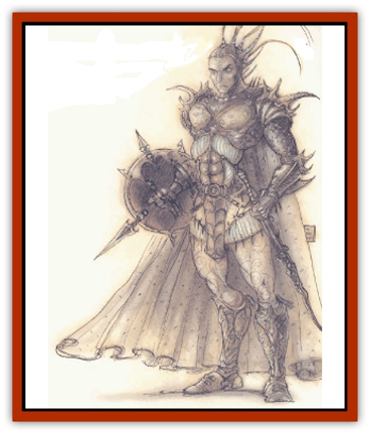

# Per

| Statistic | **Per** |
| --- | --- |
| **Activity Cycle:** | Any |
| **Alignment:** | Lawful neutral |
| **Armor Class:** | -1 |
| **Climate/Terrain:** | Upper Planes |
| **Damage/Attack:** | 2d10 (+3 or +6) |
| **Diet:** | None |
| **Frequency:** | Rare |
| **Hit Dice:** | 10 |
| **Intelligence:** | Very (11-12) |
| **Magic Resistance:** | 50% |
| **Morale:** | See below |
| **Movement:** | 12 |
| **No. Appearing:** | 1 |
| **No. of Attacks:** | 1 |
| **Organization:** | Solitary |
| **Size:** | M (6' tall) |
| **Special Attacks:** | Magical weapon |
| **Special Defenses:** | Never surprised, regeneration, never check morale, +1 or better weapon to hit |
| **THAC0:** | 11 |
| **Treasure:** | Nil |
| **XP Value:** | 12,000 |

Pers guard the portals of the Upper Planes. They are tireless warriors at those gates.

Pers look like muscular human fighters. They wear bronze or steel armor with elaborate decoration and huge helmets adorned with large plumes or other ornaments. They carry frost-covered swords of intelligence and magical power. Although these guardians are not evil, their appearance is grim and foreboding.

Pers speak the languages they knew in life and the common tongue.

**Combat:** Pers have truesight and are never surprised. They are continuously protected by an aura with the effect of a shield spell. Pers regenerate 3 hp per melee round. They are fanatical warriors and never leave their post. If challenged, pers battle to the death, never checking morale.

Pers carry great two-handed swords that they can wield for 2d10 damage. The swords are intelligent, magical weapons. Each is a *sword +3, frost brand, +6 vs. fire using/dwelling creatures* (*DMG*, page 185). These intelligent *frost brands* are imbued with the essence of a servitor of an upper power. Each is lawful neutral in alignment and has Intelligence 15 and ego of 18, as well as the following special abilities: *confusion* (special purpose power, 2d6 rounds), *detect evil/good* (10' radius), *detect invisible objects* (120' radius), and *detect magic* (10' radius). These weapons help guard the portals between the planes. They speak the common language. Pers are in total agreement with their weapons so there is no conflict with their egos. However, if another being tries to use the weapon, there is conflict.

Pers also have these spell-like powers that they can use at will, at 10th level of spell-use, once per round or as stated: *blade barrier*, *charm person or mammal* (7 times per day), *cure serious wounds* (3 times per day), *ESP*, *light*, *mirror image*, and *read magic*.

Although pers are powerful, they know their limitations. Pers can magically size up an opponent and know its fighting prowess. This ability does not, however, extend to spell use. Pers are intelligent, and one who outmatched by a group of adventurers may challenge the opposing leader or most powerful warrior to single combat.

Per are hit only by +1 or better weapons.

**Habitat/Society:** Most pers are absolutely dedicated to their cause. To this purpose they use both their ESP power and the detect evil/good power of their sword.

Pers have limited mental links with the powers of their plane. If a per is under duress or killed, those powers become aware of it. The powers always send reinforcements (usually additional pers) if intruders breach a portal.

One of the items in the collection of oddities at Castle Neutomas is a shield with the figure of a [[Mephit_General_Information|mephit]] (painted in green) within a red circle, through which a red bar passes. Mordeia the Great, author of Signs and Wonders: A Planar Tour, explains that should she ever visit the Upper Planes again, she intends to take the shield as a gift to a per named Zehulon. This is the story she tells:

"I had thought that the pers were an emotionless race, merely living to serve the upper powers by their constant guardianship of the portals. Indeed, I scarce spoke to the first two or three I met, treating them much like [[Golem_General_Information|golems]]. However, my irrepressible curiosity took hold when I met Zebulon. I asked him of his adventures, and he told me in a dispassionate fashion of creatures and men that he had to fight in the line of duty. Never did he raise his voice, nor seem upset in his retelling. I asked if there was anything he hated.

"�Oh yes,' he said, �Mephits, [[Sprite|pixies]], [[Sprite|sprites]], that sort of thing. I hate them.'

"His voice was bitter, so I asked him his reasons.

�"I can only use my great sword in lawful defense of my doorway. I cannot leave my post. These tiny pranksters often torment me. They make my hair grow, or change it pink or green. They tell me jokes like, �How many pers does it take to make popcorn? Five - one to hold the pan and four to shake the stove.' I can't stand them.'"

**Ecology:** Pers are the spirits of those humans who were dedicated to their cause in life. Fallen humans feel highly honored to become a per. Good powers create new pers either when their numbers run low or when new portals are created.

---
## Discovery & Documentation

**Source Publication:** MC8 Outer Planes Appendix (1990)
**Campaign Setting:** Planescape
**Author(s):** Timothy B. Brown, Jamie LaFountain

### Other Creatures Found in This Source Book
   * [[Aasimon_Agathinon|Aasimon, Agathinon]]
   * [[Aasimon_Deva|Aasimon, Deva]]
   * [[Aasimon_Light|Aasimon, Light]]
   * [[Aasimon_General_Information|Aasimon, General Information]]
   * [[Aasimon_Planetar|Aasimon, Planetar]]
   * [[Aasimon_Solar|Aasimon, Solar]]
   * [[Air_Sentinel|Air Sentinel]]
   * [[Animal_Lord|Animal Lord]]
   * [[Archon|Archon]]
   * [[Baatezu_Lesser_Abishai|Baatezu, Lesser, Abishai]]
   * [[Baatezu_Greater_Amnizu|Baatezu, Greater, Amnizu]]
   * [[Baatezu_Lesser_Barbazu|Baatezu, Lesser, Barbazu]]
   * [[Baatezu_Greater_Cornugon|Baatezu, Greater, Cornugon]]
   * [[Baatezu_Lesser_Erinyes|Baatezu, Lesser, Erinyes]]
   * [[Baatezu_General_Information|Baatezu, General Information]]
   * [[Baatezu_Greater_Gelugon|Baatezu, Greater, Gelugon]]
   * [[Baatezu_Lesser_Hamatula|Baatezu, Lesser, Hamatula]]
   * [[Baatezu_Lemure|Baatezu, Lemure]]
   * [[Baatezu_Least_Nupperibo|Baatezu, Least, Nupperibo]]
   * [[Baatezu_Lesser_Osyluth|Baatezu, Lesser, Osyluth]]
   * [[Baatezu_Greater_Pit_Fiend|Baatezu, Greater, Pit Fiend]]
   * [[Baatezu_Least_Spinagon|Baatezu, Least, Spinagon]]
   * [[Balaena|Balaena]]
   * [[Bariaur|Bariaur]]
   * [[Bebilith|Bebilith]]
   * [[Bodak|Bodak]]
   * [[Dog_Moon|Dog, Moon]]
   * [[Dragon_Adamantite|Dragon, Adamantite]]
   * [[Einheriar|Einheriar]]
   * [[Gehreleth|Gehreleth]]
   * [[Githyanki|Githyanki]]
   * [[Githzerai|Githzerai]]
   * [[Hordling|Hordling]]
   * [[Lammasu_Celestial|Lammasu, Celestial]]
   * [[Larva|Larva]]
   * [[Maelephant|Maelephant]]
   * [[Marut|Marut]]
   * [[Mediator|Mediator]]
   * [[Mortai|Mortai]]
   * [[Night_Hag|Night Hag]]
   * [[Nightmare|Nightmare]]
   * [[Noctral|Noctral]]
   * [[Phoenix|Phoenix]]
   * [[Slaad|Slaad]]
   * [[Tanar'ri_Greater_Babau|Tanar'ri, Greater, Babau]]
   * [[Tanar'ri_Greater_Chasme|Tanar'ri, Greater, Chasme]]
   * [[Tanar'ri_Greater_Nabassu|Tanar'ri, Greater, Nabassu]]
   * [[Tanar'ri_Least_Dretch|Tanar'ri, Least, Dretch]]
   * [[Tanar'ri_Least_Manes|Tanar'ri, Least, Manes]]
   * [[Tanar'ri_Least_Rutterkin|Tanar'ri, Least, Rutterkin]]
   * [[Tanar'ri_Lesser_Alu-Fiend|Tanar'ri, Lesser, Alu-Fiend]]
   * [[Tanar'ri_Lesser_Bar-Lgura|Tanar'ri, Lesser, Bar-Lgura]]
   * [[Tanar'ri_Lesser_Cambion|Tanar'ri, Lesser, Cambion]]
   * [[Tanar'ri_Lesser_Succubus|Tanar'ri, Lesser, Succubus]]
   * [[Tanar'ri_Guardian_Molydeus|Tanar'ri, Guardian, Molydeus]]
   * [[Tanar'ri_General_Information|Tanar'ri, General Information]]
   * [[Tanar'ri_True_Balor|Tanar'ri, True, Balor]]
   * [[Tanar'ri_True_Glabrezu|Tanar'ri, True, Glabrezu]]
   * [[Tanar'ri_True_Hezrou|Tanar'ri, True, Hezrou]]
   * [[Tanar'ri_True_Marilith|Tanar'ri, True, Marilith]]
   * [[Tanar'ri_True_Nalfeshnee|Tanar'ri, True, Nalfeshnee]]
   * [[Tanar'ri_True_Vrock|Tanar'ri, True, Vrock]]
   * [[Titan|Titan]]
   * [[Translator|Translator]]
   * [[T'uen-rin|T'uen-rin]]
   * [[Vaporighu|Vaporighu]]
   * [[Warden_Beast|Warden Beast]]
   * [[Yugoloth_Greater_Arcanaloth|Yugoloth, Greater, Arcanaloth]]
   * [[Yugoloth_Lesser_Dergoloth|Yugoloth, Lesser, Dergoloth]]
   * [[Yugoloth_Lesser_Hydroloth|Yugoloth, Lesser, Hydroloth]]
   * [[Yugoloth_General_Information|Yugoloth, General Information]]
   * [[Yugoloth_Lesser_Mezzoloth|Yugoloth, Lesser, Mezzoloth]]
   * [[Yugoloth_Greater_Nycaloth|Yugoloth, Greater, Nycaloth]]
   * [[Yugoloth_Lesser_Piscoloth|Yugoloth, Lesser, Piscoloth]]
   * [[Yugoloth_Greater_Ultroloth|Yugoloth, Greater, Ultroloth]]
   * [[Yugoloth_Lesser_Yagnoloth|Yugoloth, Lesser, Yagnoloth]]
   * [[Zoveri|Zoveri]]
