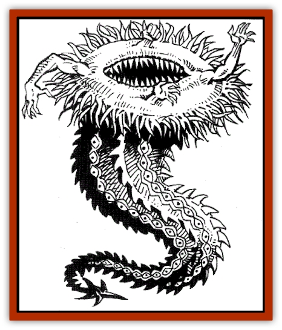

# Phaerimm

| Statistic | **Phaerimm** |
| --- | --- |
| **Activity Cycle:** | Any |
| **Alignment:** | All possible (G is most common in lair) |
| **Armor Class:** | 2 |
| **Climate/Terrain:** | Any (in Faer�n, confined to subterranean Anauroch) |
| **Damage/Attack:** | 1d4 (or by weapon) &times;4/3d4/2d4 |
| **Diet:** | Carnivore |
| **Frequency:** | Very rare |
| **Hit Dice:** | 9 |
| **Intelligence:** | Supra-genius (19-20) |
| **Magic Resistance:** | 44% |
| **Morale:** | Fanatic (17) |
| **Movement:** | Fl 9 (A) |
| **No. Appearing:** | 1-3 (usually 1) |
| **No. of Attacks:** | 6 |
| **Organization:** | Solitary |
| **Size:** | L (up to 12' long) |
| **Special Attacks:** | Tail sting, spell use |
| **Special Defenses:** | Absorb/reflect magic |
| **THAC0:** | 11 |
| **Treasure:** | Neutral evil |
| **XP Value:** | 10,000 |

Phaerimm are powerful magic-using beings that move by natural levitation. They resemble upright cones, the widest part uppermost, and the point ending in a barbed stinger-tail. They are intelligent, inimical, and highly dangerous.

**Combat:** Phaerimm have 160-foot infravision, and can see into the astral and ethereal planes for 90 feet. Their normal vision functions as a constant *detect magic*.

Phaerimm have natural magic resistance: 44% against all magic except petrification and polymorph attacks, to which they m 77% resistant. Any magical attack on them blocked by their resistance will be absorbed by phaerimm as healing or reflected back 100% at the source. This is a defensive reflex and does not take the place of a phaerimm's actions in the round it occurs. Absorption changes damage from the spell into replacement hit points; spells that do no damage yield 1 hit point per spell level (excess points can be carried for 12 rounds as healing energy, and used to offset later damage). Reflection means the source receives the magical effect, although a source subjected to multiple reflections of the same spell can be affected at most once (that is, a wizard catching two phaerimm in a *fireball* takes, at most, the damage of one *fireball* if both reflect). No upper limit to the number of magical attacks a given phaerimm can absorb or reflect in one round has been found.

Phaerimm command more magic than most human mages. For every 50 years of life, a phaerimm increases one level as a wizard - most of this long-lived race are the equivalents of 22nd- to 27th-level mages. Phaerimm experiment with, research, and memorize spells much as human wizards do; a spell of each level can become an innate spell-like ability. The spell, which cannot be changed once chosen, is retained in their brain structure and is regained every day without study.

Most phaerimm have devised some unique spells of their own. AU phaerimm spells are cast by silent act of will - most phaerimm magical study is time spent altering captured human spells into will-force magical energy manipulations.

In addition to a spell attack (and any reflected magics) in a round, a phaerimm can make up to six physical attacks, if targets are within reach. Its powerful jaws, located in the open top of its cone, bite for 3d4 damage. The rim of the cone contains four evenly-spaced, fully-retractable arms. These arms look startlingly human, but the hands have three central fingers and two outside, opposed thumbs. The arms can punch for 1d4 damage, wield weapons of up to polearm size for normal weapon damage, or grasp opponents to hold them for automatically-striking bites. Each round, roll 1d20 each for the phaerimm and the grasped victim. The higher total prevails: either the grasp holds for the round, or the victim breaks free.

A phaerimm also has a powerful tail that can smite for 2d4 points of damage; if a tail attack roll hits on a roll of 16 or more, its sting impales the victim: the victim takes the usual 2d4 damage, plus 1d6 more as the hollow bone stinger stabs deeply, injecting a milky fluid and an egg. The victim must save vs. poison three times: to see if the victim is paralyzed; to determine if the victim levitates (rising above any "floor" surface and hangin a few feet off the ground, powerless to move except by grasping or pushing against solid objects within reach for 2d4 turns); and to see if the phaerimm egg injected  into the victim is fertile. A nonfertile egg dissolves harmlessly.

A fertile egg begins to grow in 1d6 days, eating the victim internally for a loss of 1 hit point per day thereafter, until death occurs or a cure disease spell kills the phaerimm larva. During this time, the victim's attack, Armor Class, and ability scores are all penalized by 4 due to debilitating, gnawing pain. An egg or larva can be cut out of the victim, who must survive a system shock roll. This process inflcts 2d4 points of damage.

**Habitat/Society:** The phaerimm like to live near others of their own kind (for mutual protection and the social satisfaction of vying with each other in devious plans). However, they usually prefer usually prefer to operate alone or surround themselves with magically-controlled slave creatures to carry out their bidding.

**Ecology:** Phaerimm eat all reptiles and mammals, keeping them as slaves until their turn as dinner. They especially hate [[Tomb_Tapper|tomb tappers]], who seem immune to pbaerimm mind-controlling magics.

In Faer�n, the mightiest magic of the [[Sharn|sharn]] presently limits phaerimm to under Anauroch, but they work through agents to affect the world beyond the desert, using certain Bedine tribesmen and some Red Wizards who came to Anauroch long ago to try to establish a base or recover the fabled magic of the Lost Kingdoms. They have also subverted a few Zhentarim, but are being very careful not to reveal themselves to the Brotherhood - yet.

---
## Discovery & Documentation

**Source Publication:** Monstrous Compendium, 1996 Annual, Volume 3 (1995)
**Campaign Setting:** Advanced Dungeons & Dragons 2nd Edition
**Author(s):** Jon Pickens

### Other Creatures Found in This Source Book
   * [[Alaghi|Alaghi]]
   * [[Alhoon|Alhoon]]
   * [[Aranea_Savage_Coast|Aranea (Savage Coast)]]
   * [[Arcane_Head|Arcane Head]]
   * [[Banedead|Banedead]]
   * [[Banelich|Banelich]]
   * [[Bat_Bonebat|Bat, Bonebat]]
   * [[Beetle|Beetle]]
   * [[Belgoi|Belgoi]]
   * [[Bladeling|Bladeling]]
   * [[Braxat|Braxat]]
   * [[Bunyip|Bunyip]]
   * [[Burbur|Burbur]]
   * [[Bvanen|Bvanen]]
   * [[Cat_Great_Snow_Tiger|Cat, Great, Snow Tiger]]
   * [[Chosen_One|Chosen One]]
   * [[Chronovoid|Chronovoid]]
   * [[Cildabrin|Cildabrin]]
   * [[Coffer_Corpse|Coffer Corpse]]
   * [[Disenchanter|Disenchanter]]
   * [[Dog_Temporal|Dog, Temporal]]
   * [[Dragon_Cerilia|Dragon (Cerilia)]]
   * [[Dragon_Ghost|Dragon, Ghost]]
   * [[Dragon_Lesser_Undead|Dragon, Lesser Undead]]
   * [[Dragon_Neutral_Amber|Dragon, Neutral, Amber]]
   * [[Dread_Warrior|Dread Warrior]]
   * [[Dreamweaver|Dreamweaver]]
   * [[Dream_Spawn_Greater_Ennui|Dream Spawn, Greater, Ennui]]
   * [[Dream_Spawn_Lesser_Morph|Dream Spawn, Lesser, Morph]]
   * [[Dwarf_Arctic|Dwarf, Arctic]]
   * [[Dwarf_Urdunnir|Dwarf, Urdunnir]]
   * [[Eel_Giant_Moray|Eel, Giant Moray]]
   * [[Elemental_Fire_Kin_Tome_Guardian|Elemental, Fire Kin, Tome Guardian]]
   * [[Elf_Rockseer|Elf, Rockseer]]
   * [[Ethyk|Ethyk]]
   * [[Faerie_Faerie_Fiddler|Faerie, Faerie Fiddler]]
   * [[Faerie_Petty_Bramble|Faerie, Petty, Bramble]]
   * [[Faerie_Petty_Gorse|Faerie, Petty, Gorse]]
   * [[Faerie_Petty|Faerie, Petty]]
   * [[Firenewt|Firenewt]]
   * [[Formian|Formian]]
   * [[Gargoyle_II|Gargoyle II]]
   * [[Giant_Cerilia|Giant (Cerilia)]]
   * [[Goblin_Cerilia|Goblin (Cerilia)]]
   * [[Golem_Magic|Golem, Magic]]
   * [[Golem_Shaboath|Golem, Shaboath]]
   * [[Hag_Bheur|Hag, Bheur]]
   * [[Hamadryad|Hamadryad]]
   * [[Hound_of_Ill-Omen|Hound of Ill-Omen]]
   * [[Human_Cerilia|Human (Cerilia)]]
   * [[Hybsil|Hybsil]]
   * [[Ibrandlin|Ibrandlin]]
   * [[Imp_Chaos|Imp, Chaos]]
   * [[Ixitxachitl_Ixzan|Ixitxachitl, Ixzan]]
   * [[Jabberwock|Jabberwock]]
   * [[Kyton|Kyton]]
   * [[Kyuss_Son_of|Kyuss, Son of]]
   * [[Lillend|Lillend]]
   * [[Life-Shaped_Creation_Guardian|Life-Shaped Creation, Guardian]]
   * [[Life-Shaped_Creation_Transport|Life-Shaped Creation, Transport]]
   * [[Lycanthrope_Werecrocodile|Lycanthrope, Werecrocodile]]
   * [[Lycanthrope_Werespider|Lycanthrope, Werespider]]
   * [[Magedoom|Magedoom]]
   * [[Manotaur|Manotaur]]
   * [[Mastiff_Shadow|Mastiff, Shadow]]
   * [[Meazel|Meazel]]
   * [[Mist_Scarlet_Dancer|Mist, Scarlet Dancer]]
   * [[Needleman|Needleman]]
   * [[Orc_Neo-Orog|Orc, Neo-Orog]]
   * [[Orc_Ondonti|Orc, Ondonti]]
   * [[Owlbear_II|Owlbear II]]
   * [[Pegataur|Pegataur]]
   * [[Reggelid|Reggelid]]
   * [[Render|Render]]
   * [[Saurial|Saurial]]
   * [[Scalamagdrion|Scalamagdrion]]
   * [[Sharn|Sharn]]
   * [[Snake_Messenger|Snake, Messenger]]
   * [[Spirit_Forest_Uthraki|Spirit, Forest, Uthraki]]
   * [[Spirit_Forest_Wood_Man|Spirit, Forest, Wood Man]]
   * [[Spirit_Ice_Orglash|Spirit, Ice, Orglash]]
   * [[Spirit_Rock_Thomil|Spirit, Rock, Thomil]]
   * [[Strider_Giant|Strider, Giant]]
   * [[Tembo|Tembo]]
   * [[Temporal_Glider|Temporal Glider]]
   * [[Temporal_Stalker|Temporal Stalker]]
   * [[Tether_Beast|Tether Beast]]
   * [[Thessalmonster|Thessalmonster]]
   * [[Time_Dimensional|Time Dimensional]]
   * [[Tomb_Tapper|Tomb Tapper]]
   * [[Undead_Dragon_Slayer|Undead Dragon Slayer]]
   * [[Unicorn_Black_Toril|Unicorn, Black (Toril)]]
   * [[Vaath|Vaath]]
   * [[Vortex_Spider|Vortex Spider]]
   * [[Weredragon|Weredragon]]
   * [[Zhentarim_Spirit|Zhentarim Spirit]]
