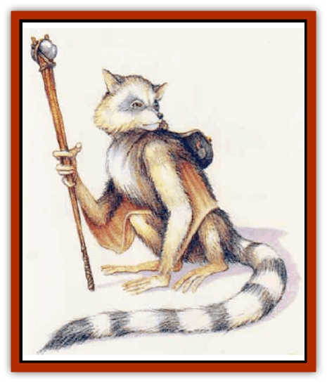

# Phanaton

| Statistic | **Phanaton** |
| --- | --- |
| **Activity Cycle:** | Any |
| **Alignment:** | Chaotic good |
| **Armor Class:** | 7 |
| **Climate/Terrain:** | Tropical or subtropical jungles and forests |
| **Damage/Attack:** | 1d4 (bite) or by weapon |
| **Diet:** | Omnivore |
| **Frequency:** | Rare |
| **Hit Dice:** | 1-1 |
| **Intelligence:** | Average (8-10) |
| **Magic Resistance:** | Nil |
| **Morale:** | Average (8) |
| **Movement:** | 9, Gl 15 |
| **No. Appearing:** | 3d6 |
| **No. of Attacks:** | 1 |
| **Organization:** | Clan |
| **Size:** | S (3' tall) |
| **Special Attacks:** | Surprise |
| **Special Defenses:** | +2 bonus on all saving throws |
| **THAC0:** | 20 |
| **Treasure:** | Nil |
| **XP Value:** | 35 / Warrior: 120 / Chief: 270 / King: 2,000 |

Phanatons are odd, seldom-seen, intelligent forest-dwellers that have very strong ties to nature.

A phanaton looks like a cross between a raccoon and a monkey, though its face has an almost human quality in terms of subtle expressions. A phanaton is roughly the size of a halfling, and has a 4-foot-long prehensile tail. In addition, a phanaton has membranes of skin stretching from arm to leg; these can be spread to glide from branch to branch.

A phanaton's coloration resembles a raccoon, with a dark mask over the eyes, gray-brown fur, and a ringed tail. The phanaton's hands are like a monkey's, including opposable thumbs. A phanaton's eyes are bright green, fiey red, or shiny yellow. In the dark, phanaton eyes can give travelers quite a scare.

Phanatons speak the languages of [[Elf|elves]] and [[Treant|treants]], as well as their own language that consists largely of hoots, chatters, and clicks.

**Combat:** Their gentle nature makes phanatons slow to attack strangers, though they fight fanatically to save the natural beauty around them from destruction. As a rule, phanatons will not opt for direct attacks on bigger or more numerous foes. Phanatons use the forest setting in order to launch harrying sneak attacks; they are naturally quiet, which gives opponents a -3 penalty to surprise rolls. When among trees, phanatons can move silently like thieves with a 75% chance of success.

Phanatons hate [[Spider-kin|aranea]] intensely and will attack them on sight, casting aside all tactics and stealth.

Phanatons use simple weapons such as clubs, staves, and nets. Most of their weapons are fabricated simply with materials at hand. Phanatons rarely use metal weapons.

When not using weapons, phanatons deliver a bite that causes 1d4 points of damage.

Phanatons have extremely acute senses and therefore have an empathy with their forest surroundings. This gives them a +2 bonus on all their saving throws.

When a group of 10 phanatons is encountered, the group will include a warrior (*n'chala*) with 2 Hit Dice and 10 hit points. In a group of 30 phanatons, there is a clan warchief with 3 Hit Dice, at least 15 hit points, and a +1 bonus to all damage rolls. The warchief has 2d6 n'chala as guards. If 300 adult phanatons are encountered, they are led by a tribal king with 8 Hit Dice, 50 hit points, and a +2 bonus to all damage rolls.

**Habitat/Society:** Each phanaton tribe is made up of clans. Phanaton clans have 3d10x10 adult members plus an additional 25% of that number in offspring. Clans live in villages built on platforms of wood and woven vines connected by a network of rope bridges.

Phanatons can live for 80 years. Their litters have 1d6 kits. The kits grow to maturity in six months.

Though phanatons do not have a written language, they love to pass down stories and legends from generation to generation. In fact, many phanaton names are followed by a list of the phanaton's ancestors' accomplishments.

Phanatons are the allies of treants and dryads, and are usually very friendly with elves - especially wood elves. The aranea are their traditional enemies.

Phanatons often run afoul of humans, humanoids, and demihumans who attempt to cut down forests. Phanatons try to halt timber efforts by secretly sabotaging equipment and playing annoying, nonlethal tricks on the woodcutters.

**Ecology:** A healthy woods or jungle is often a sign of phanaton influence. These creatures enjoy tending the woods around them, cultivahhg favorite plants, clearing away dead plant matter, and ensuring that the balance of nature in their area is maintained.

Phanatons are omnivorous. They prefer to eat fruits and vegetables, but they also eat meat; they find [[Spider|spiders]] to be especially delicious.

---
## Discovery & Documentation

**Source Publication:** Mystara Appendix (1994)
**Campaign Setting:** Mystara
**Author(s):** John Nephew, Teeuwynn Woodruff, John Terra, Skip Williams

### Other Creatures Found in This Source Book
   * [[Actaeon|Actaeon]]
   * [[Agarat|Agarat]]
   * [[Ash_Crawler|Ash Crawler]]
   * [[Baldandar|Baldandar]]
   * [[Bargda|Bargda]]
   * [[Bhut|Bhut]]
   * [[Bird_Mystara|Bird (Mystara)]]
   * [[Blackball|Blackball]]
   * [[Choker|Choker]]
   * [[Coltpixie|Coltpixie]]
   * [[Crone_of_Chaos|Crone of Chaos]]
   * [[Darkhood|Darkhood]]
   * [[Darkwing|Darkwing]]
   * [[Decapus|Decapus]]
   * [[Deep_Glaurant|Deep Glaurant]]
   * [[Diabolus|Diabolus]]
   * [[Dimensional_Warper|Dimensional Warper]]
   * [[Dragon_Mystara_Crystalline|Dragon (Mystara), Crystalline]]
   * [[Dragon_Mystara_Jade|Dragon (Mystara), Jade]]
   * [[Dragon_Mystara_Onyx|Dragon (Mystara), Onyx]]
   * [[Dragon_Mystara_Ruby|Dragon (Mystara), Ruby]]
   * [[Drake_Mystara|Drake (Mystara)]]
   * [[Dragonfly|Dragonfly]]
   * [[Dusanu|Dusanu]]
   * [[Elemental_of_Chaos_Air_Earth|Elemental of Chaos, Air/Earth]]
   * [[Elemental_of_Chaos_Fire_Water|Elemental of Chaos, Fire/Water]]
   * [[Elemental_of_Law_Air_Earth|Elemental of Law, Air/Earth]]
   * [[Elemental_of_Law_Fire_Water|Elemental of Law, Fire/Water]]
   * [[Familiar_Mystara|Familiar (Mystara)]]
   * [[Frost_Salamander|Frost Salamander]]
   * [[Fundamental_Air_Earth|Fundamental, Air/Earth]]
   * [[Fundamental_Fire_Water|Fundamental, Fire/Water]]
   * [[Gargantua_Mystara|Gargantua (Mystara)]]
   * [[Geonid|Geonid]]
   * [[Ghostly_Horde|Ghostly Horde]]
   * [[Giant_Athach|Giant, Athach]]
   * [[Giant_Hephaeston|Giant, Hephaeston]]
   * [[Golem_Drolem|Golem, Drolem]]
   * [[Golem_Mystara_I|Golem (Mystara) I]]
   * [[Golem_Mystara_II|Golem (Mystara) II]]
   * [[Golem_Mystara_III|Golem (Mystara) III]]
   * [[Gray_Philosopher|Gray Philosopher]]
   * [[Guardian_Warrior|Guardian Warrior]]
   * [[Gyerian|Gyerian]]
   * [[Herex|Herex]]
   * [[Hivebrood|Hivebrood]]
   * [[Horde|Horde]]
   * [[Hsiao|Hsiao]]
   * [[Huptzeen|Huptzeen]]
   * [[Hutaakan|Hutaakan]]
   * [[Imp_Mystara|Imp (Mystara)]]
   * [[Jellyfish_Giant_Mystara|Jellyfish, Giant (Mystara)]]
   * [[Kna|Kna]]
   * [[Kopru|Kopru]]
   * [[Lizard_Mystara|Lizard (Mystara)]]
   * [[Lizard-kin_Mystara|Lizard-kin (Mystara)]]
   * [[Lupin|Lupin]]
   * [[Lycanthrope_Werejaguar_Mystara|Lycanthrope, Werejaguar (Mystara)]]
   * [[Lycanthrope_Wereswine|Lycanthrope, Wereswine]]
   * [[Magen|Magen]]
   * [[Manikin|Manikin]]
   * [[Mek|Mek]]
   * [[Mujina|Mujina]]
   * [[Nagpa|Nagpa]]
   * [[Neh-thalggu|Neh-thalggu]]
   * [[Nightshade_Mystara|Nightshade (Mystara)]]
   * [[Nuckalavee|Nuckalavee]]
   * [[Pegataur|Pegataur]]
   * [[Plant_Dangerous_Mystara|Plant, Dangerous (Mystara)]]
   * [[Plasm|Plasm]]
   * [[Rakasta|Rakasta]]
   * [[Rock_Man|Rock Man]]
   * [[Sabreclaw|Sabreclaw]]
   * [[Sacrol|Sacrol]]
   * [[Scamille|Scamille]]
   * [[Shapeshifter|Shapeshifter]]
   * [[Shargugh|Shargugh]]
   * [[Shark-kin|Shark-kin]]
   * [[Sollux|Sollux]]
   * [[Spectral_Death|Spectral Death]]
   * [[Spectral_Hound|Spectral Hound]]
   * [[Spider-kin|Spider-kin]]
   * [[Spirit_Mystara|Spirit (Mystara)]]
   * [[Statue_Living|Statue, Living]]
   * [[Surtaki|Surtaki]]
   * [[Tabi|Tabi]]
   * [[Thoul|Thoul]]
   * [[Thunderhead|Thunderhead]]
   * [[Tiger_Ebon|Tiger, Ebon]]
   * [[Topi|Topi]]
   * [[Tortle|Tortle]]
   * [[Vampire_Velya|Vampire, Velya]]
   * [[White_Fang|White Fang]]
   * [[Worm_Mystara|Worm (Mystara)]]
   * [[Wyrd|Wyrd]]
   * [[Yowler|Yowler]]
   * [[Zombie_Lightning|Zombie, Lightning]]
