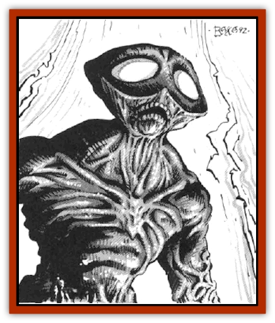

# Phantom Stalker

| Statistic | **Phantom Stalker** |
| --- | --- |
| **Activity Cycle:** | Any |
| **Alignment:** | Neutral |
| **Armor Class:** | 3 |
| **Climate/Terrain:** | Any |
| **Damage/Attack:** | 1-8/1-8 |
| **Diet:** | Fire |
| **Frequency:** | Very Rare |
| **Hit Dice:** | 6 |
| **Intelligence:** | Semi- (2-4) |
| **Magic Resistance:** | Nil |
| **Morale:** | Elite (16) |
| **Movement:** | 12, Fl 24 (D) |
| **No. Appearing:** | 1-2 |
| **No. of Attacks:** | 2 |
| **Organization:** | Group |
| **Size:** | L (7'+) |
| **Special Attacks:** | See below |
| **Special Defenses:** | Impervious to fire |
| **THAC0:** | 15 |
| **Treasure:** | Nil |
| **XP Value:** | 650 |

Phantom stalkers are creatures from the Elemental Plane of Fire, and are found on the Prime Material Plane only in the role of servants to high-level mages.

In its raw elemental form, the phantom stalker appears as a slim pillar of fire with vague outlines of arms, legs, and a head, resembling an emaciated [[Elemental_Fire_Water|fire elemental]]. When on the Prime Material Plane, the creature's most common form is that of a muscular, reddish humanoid, 7' or more tall. with fiery eyes. Their faces are elongated versions of a human face, with a pointed chin and high forehead. When angered, they lose their solid form, appearing much as a burning [[Ghost|ghost]]. However, phantom stalkers have the ability to *polymorph self*, and have been known to appear in various forms. Most of the forms they assume incorporate the colors red, yellow, and orange. Phantom stalkers can fly, and this ability is apparently unimpaired by the shape they assume.

Phantom stalkers are magically able to speak the Common tongue of any world of the Prime Material Plane, in addition to the language common to all denizens of the Elemental Plane of Fire.

**Combat:** Phantoms stalkers normally attack with their two sets of sharp claws, each of which can inflict 1-8 hit points of damage. If both sets hit, the stalker has a grip on the target and pulls the unfortunate victim to its fiery body, causing an additional 12 points of fire damage. The phantom stalker is able to cool its body to 70� Fahrenheit, so that it can lift or carry things without incinerating them. The creature has a Strength of 18/50.

Phantom stalkers are invulnerable to all sorts of fire attacks, and magical fire attacks (including fiery breath weapons) in fact heal the phantom stalkers one hit point for each Hit Die of fire attack. However, phantom stalkers save at -2 versus cold attacks, and such attacks add two points of extra damage per attack die.

If a phantom stalker is reduced to 10% or less of its original hit points, it can cast forth its dying life essence into a 6 HD fireball, after which it dematerializes and dies. The explosion is centered on the stalker itself. This is done only as a last resort, and is never done if it will harm the stalker's summoner - unless the summoner is directly and immediately responsible for the phantom stalker's demise. Those who would summon phantom stalkers would be wise not to give them hopelessly suicidal commands.

**Habitat/Society:** On the Elemental Plane of Fire, phantom stalkers have no true organization. In fact, they are often bullied around by fire elementals, [[Genie|efreet]], and [[Elemental_Fire_Kin|salamanders]].

When a stalker is summoned by a mage, it is generally grateful for its departure from the Plane of Fire, and wishes to serve the mage loyally. Paradoxically, it is also instinctively resentful about being summoned, a trait common among many denizens of the Elemental Planes.

Phantom stalkers are summoned by a variant of the *invisible stalker* spell. The spell summoning the phantom stalker requires a piece of coal carved in the shape of a flame; otherwise, the spells are identical. A mage must exercise great caution in giving a phantom stalker instructions, since the stalker will try to pervert those instructions by taking the mage's words literally and following them to the letter. This is a nasty habit that phantom stalkers picked up from efreet. Aside from this little quirk, the summoned creature serves well as a bodyguard.

There is one explicit instruction inherent in their summoning. If the summoner is killed, his/her phantom stalker(s) will vanish into the Ethereal Plane, where it will spend 1-4 hours tracking down the killers. The stalker will unerringly find the killers, unless the latter are continually hidden by spells or other non-detection devices or abilities. Phantom stalkers gain this tracking ability only upon the death of their masters. The ability disappears once the summoner's slayer has been tracked, though it will return one more time if the slayer has escaped, giving the phantom stalker one last chance to find the killer.

After tracking down the summoner's killers, the phantom stalker will reappear on the Prime Material Plane, intent on vengeance.

**Ecology:** Besides being the whipping boys of the Elemental Plane of Fire, phantom stalkers are prized for the liquid fire that flows through their bodies. If this essence can be captured, it can be used to create *Flame Tongue* swords.

---
## Discovery & Documentation

**Source Publication:** MC14 Fiend Folio Appendix (1992)
**Campaign Setting:** Fiends Folio
**Author(s):** Don Bingle, John Terra, Wes Nicholson, Tim Beach, Steve Hardinger, Kris Hardinger, Rob Nicholls, Greg Swedberg, Al Boyce, Vince Garcia, Norm Ritchie

### Other Creatures Found in This Source Book
   * [[Aballin|Aballin]]
   * [[Achaierai|Achaierai]]
   * [[Adherer|Adherer]]
   * [[Algoid|Algoid]]
   * [[Al-Mi'raj|Al-Mi'raj]]
   * [[Apparition|Apparition]]
   * [[Caterwaul|Caterwaul]]
   * [[Coffer_Corpse|Coffer Corpse]]
   * [[Crabman|Crabman]]
   * [[Dark_Creeper|Dark Creeper]]
   * [[Dark_Stalker|Dark Stalker]]
   * [[Darter|Darter]]
   * [[Denzelian|Denzelian]]
   * [[Dune_Stalker|Dune Stalker]]
   * [[Dwarf_Urdunnir|Dwarf, Urdunnir]]
   * [[Falcon_Fire|Falcon, Fire]]
   * [[Faux_Faerie|Faux Faerie]]
   * [[Flawder|Flawder]]
   * [[Fyrefly|Fyrefly]]
   * [[Gambado|Gambado]]
   * [[Garbug|Garbug]]
   * [[Giant_Fhoimorien|Giant, Fhoimorien]]
   * [[Gibberling|Gibberling]]
   * [[Gorbel|Gorbel]]
   * [[Grimlock|Grimlock]]
   * [[Hellcat|Hellcat]]
   * [[Ice_Lizard|Ice Lizard]]
   * [[Iron_Cobra|Iron Cobra]]
   * [[Khargra|Khargra]]
   * [[Mantari|Mantari]]
   * [[Penanggalan|Penanggalan]]
   * [[Pernicon|Pernicon]]
   * [[Retriever|Retriever]]
   * [[Ruve|Ruve]]
   * [[Scathe|Scathe]]
   * [[Sheet_Ghoul_Sheet_Phantom|Sheet Ghoul/Sheet Phantom]]
   * [[Shocker|Shocker]]
   * [[Spanner|Spanner]]
   * [[Stwinger|Stwinger]]
   * [[Sussurus|Sussurus]]
   * [[Symbiotic_Jelly|Symbiotic Jelly]]
   * [[Terithran|Terithran]]
   * [[Thunder_Children|Thunder Children]]
   * [[Troll_Ice|Troll, Ice]]
   * [[Tween|Tween]]
   * [[Umpleby|Umpleby]]
   * [[Volt|Volt]]
   * [[Xill|Xill]]
   * [[Xvart|Xvart]]
   * [[Zygraat|Zygraat]]
