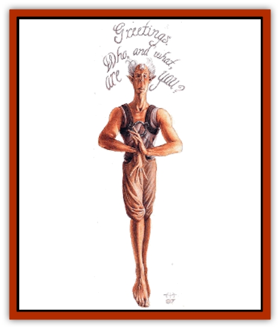

# Phirblas

| Statistic | **Phirblas** |
| --- | --- |
| **Activity Cycle:** | Any |
| **Alignment:** | Neutral good |
| **Armor Class:** | 8 (1 with plate mail) |
| **Climate/Terrain:** | Ethereal Plane |
| **Damage/Attack:** | 1d4+1 or by weapon |
| **Diet:** | Herbivorous |
| **Frequency:** | Rare |
| **Hit Dice:** | 5 |
| **Intelligence:** | High to genius (14-18) |
| **Magic Resistance:** | 20% |
| **Morale:** | Steady to elite (11-14) |
| **Movement:** | 9 |
| **No. Appearing:** | 1d4 |
| **No. of Attacks:** | 1 |
| **Organization:** | Family |
| **Size:** | M (6' tall) |
| **Special Attacks:** | <i>Hypnotic pattern</i>, <i>suggestion</i> |
| **Special Defenses:** | <i>ESP</i>, immunities |
| **THAC0:** | 15 |
| **Treasure:** | R,U |
| **XP Value:** | 1,400 |

"The chant says that there wasn't always a City of Doors or a Lady of Pain. Sometime in the past, she built the city as a&hellip; well, no one knows the dark of why. But here's what a body's got to tumble to: It all had to come from somewhere.

"Now, as any Cager knows, one of the permanent fixtures in the City of Doors is the presence of its caretakers, the [[Dabus|dabus]]. But before there was a Sigil, the dabus must have come from somewhere, right? *[Not necessarily; the Lady may have created them herself -ed.]*

"Well, here's the dark that only I have uncovered: The Lady of Pain took some of the firblings [sic] of the ethereal Plane to her new city of Sigil. There, she altered them for her purposes to create unfailing servants - the dabus."

- from Gorad Drummerhaven's
*Origin of Planar Species*

In any given situation, it's usually a safe bet that planar biologist Gorad Drummerhaven's more wrong than right, but in this case, he just may have something. Similarities do indeed exist between the phirblas and the dabus. Both are tall, gaunt humanoid races that seem to float a few inches above the ground rather than trod upon it. Both look somewhat alike, though the phirblas are lighter in color, don't seem quite as old as the dabus, and have no horns. Both races exhibit a strong devotion to purpose. And, of course, both employ a strange (yet different) means of visual communication.

Mildly telepathic, the phirblas project their words as written script in the language of the intended recipient. The words appear very quickly in the air above the phirblas, and only about 10 words are visible at a time, so anyone who wants to communicate with one of these humanoids must be able to read very fast. Illiterate barks can't understand them at all.

It's not entirely correct to say that the phirblas are from the Ethereal Plane. Rather, they hail from a demiplane they call Inphirblau, a city-realm filled with tall towers elegantly carved and shaped from living stone. Chant says that Inphirblau is one or the oldest of the demiplanes, though no one knows if the phirblas created it themselves or simply took up residence there.

**Combat:** The phirblas are not a combative or aggressive folk. If need be, a few of their number take up ornately decorated arms and armor. Most of the time, these warriors wield a two-handed sword (which causes 1d10 points of damage) or a long spear (which causes 1d6 points), and they wear plate mail (improving their AC from 8 to 1). Unarmed phirblas, if forced into a fight, bash opponents with their bare fists (causing 1d4+1 points of damage). Truth is, they pack a mighty punch, which often surprises barks caught on the receiving end - for some reason, many folks jump to the conclusion that the creatures aren't very tough.

Phirblas also possess a few innate spell-like powers. At will, they can use their telepathic ability to duplicate the effects of an *ESP* spell. Three times each day, they can create such a dizzying array of words with their "speech" that it acts as a *hypnotic pattern*. And, once per day, they can use those words to make a *suggestion*. (Note that the *hypnotic pattern* and *suggestion* powers work only on foes that can read and are never used on other phirblas.)

Heat- and cold-based attacks inflict only half the usual amount of damage on a phirblas, and disease and poison do them no harm. They're also immune to charms, suggestions, and any other type of control based on verbal commands. Some berks might think this is because the phirblas're deaf, but that's not the case. Despite their strange mode of communication, they can hear just fine.

**Habitat/Society:** Ancient even by planar standards, the phirblas boast a complicated and intricate society. They follow no clear-cut leader; instead, each individual has some degree of authority in one area or another. Even more confusing to outsiders, however, is the fact that the hierarchy of control isn't rigid, but extremely flexible and fluid. Apparently, only the phirblas themselves can truly tumble to who's supposed to do what for whom, and who can tell whom to do what in which situation.

The demiplane called Inphirblau is difficult to find. It's a huge city that seems to go on forever once a body's found his way in. Millions of phirblas live in the burg, yet somehow they all seem to know each other.

The communicative style of the phirblas' speech indicates emphasis, emotion, and intent. Formal, elegantly flowing script is used in important matters, while simple lettering indicates a casual attitude. Quick, messy, hard-to-read wording implies that the phirblas is in a hurry or has no real desire to communicate. Slow, shaky script probably means that the speaker is distraught.

**Ecology:** The herbivorous phirblas eat plants and roots prepared in complicated hot and cold dishes. Members of their society who're designated as cooks work many days in advance to prepare each intricate meal. The plants grow in small herbariums located throughout the city that fills their demiplane.

The phirblas don't age or get sick, they hardly ever fall victim to serious accidents, and they never use violence against each other. Hence, phirblas rarely die. Most have no fear of the deadbook, as it seems so distant and unreal to them (thus, many outsiders consider the phirblas quite naive). Existing without the distinctions of gender, they produce asexually in a manner that's not fully understood. Due to the low death rate, little reproduction ever occurs. But when it does, new phirblas are "born" fully grown, apparently with the memories and knowledge of the parent.

Despite how loudly some so-called scholars rattle their bone-boxes, no relationship between the phirblas and the dabus of Sigil has ever been proven. Among biologists development and racial experts (a disagreeable bunch of graybeards if there ever was one), this is a hotly contested issue.

---
## Discovery & Documentation

**Source Publication:** Planescape III (1996)
**Campaign Setting:** Planescape
**Author(s):** Monte Cook

### Other Creatures Found in This Source Book
   * [[Animental|Animental]]
   * [[Archomental_Evil|Archomental, Evil]]
   * [[Archomental_Good|Archomental, Good]]
   * [[Belker|Belker]]
   * [[Bzastra|Bzastra]]
   * [[Chososion|Chososion]]
   * [[Darklight|Darklight]]
   * [[Devete|Devete]]
   * [[Devourer_Planescape|Devourer (Planescape)]]
   * [[Dharum_Suhn|Dharum Suhn]]
   * [[Egarus|Egarus]]
   * [[Elemental_Athas_Lesser_Air_Earth|Elemental (Athas), Lesser, Air/Earth]]
   * [[Elemental_Athas_Lesser_Fire_Water|Elemental (Athas), Lesser, Fire/Water]]
   * [[Elemental_Fire_Kin_Salamander_II|Elemental, Fire Kin, Salamander II]]
   * [[Entrope|Entrope]]
   * [[Facet|Facet]]
   * [[Frost_Salamander|Frost Salamander]]
   * [[Fundamental_Air_Earth|Fundamental, Air/Earth]]
   * [[Fundamental_Fire_Water|Fundamental, Fire/Water]]
   * [[Fundamental_All_Elements|Fundamental, All Elements]]
   * [[Garmorm|Garmorm]]
   * [[Homunculus_Elemental|Homunculus, Elemental]]
   * [[Immoth|Immoth]]
   * [[Khargra|Khargra]]
   * [[Klyndes|Klyndes]]
   * [[Magran|Magran]]
   * [[Menglis|Menglis]]
   * [[Nathri|Nathri]]
   * [[Ooze_Sprite|Ooze Sprite]]
   * [[Paraelemental|Paraelemental]]
   * [[Psurlon|Psurlon]]
   * [[Quasielemental_Negative|Quasielemental, Negative]]
   * [[Quasielemental_Positive|Quasielemental, Positive]]
   * [[Rast|Rast]]
   * [[Ravid|Ravid]]
   * [[Ruvoka|Ruvoka]]
   * [[Scile|Scile]]
   * [[Shad|Shad]]
   * [[Shocker|Shocker]]
   * [[Sislan|Sislan]]
   * [[Suisseen|Suisseen]]
   * [[Terithran|Terithran]]
   * [[Thoqqua|Thoqqua]]
   * [[Trilloch|Trilloch]]
   * [[Tsnng|Tsnng]]
   * [[Ungulosin|Ungulosin]]
   * [[Vacuous|Vacuous]]
   * [[Wavefire|Wavefire]]
   * [[Xag-Ya_Xeg-Yi|Xag-Ya/Xeg-Yi]]
   * [[Xill|Xill]]
