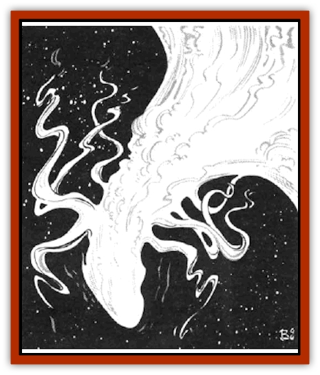

# Phlog-Crawler

| Statistic | **Phlog-Crawler** |
| --- | --- |
| **Activity Cycle:** | Any |
| **Alignment:** | Neutral |
| **Armor Class:** | 4 |
| **Climate/Terrain:** | Any space |
| **Damage/Attack:** | Special |
| **Diet:** | Life energy |
| **Frequency:** | Rare |
| **Hit Dice:** | 5 |
| **Intelligence:** | Non- (0) |
| **Magic Resistance:** | Nil |
| **Morale:** | Fearless (20) |
| **Movement:** | 6 |
| **No. Appearing:** | 1 |
| **No. of Attacks:** | 1 |
| **Organization:** | Solitary |
| **Size:** | M (5-7' long) |
| **Special Attacks:** | See below |
| **Special Defenses:** | Affected only by spells |
| **THAC0:** | Special |
| **Treasure:** | Nil |
| **XP Value:** | 1,400 |

The phlog-crawler is a form of phlogiston entity. It takes the form of a piece of the phlogiston and enjoys total access to wildspace. It travels in both the flow and wildspace alike, in search of prey for its voracious appetite. It moves about apparently propelled simply by its desire.

The crawler, from a distance, appears to be a small cloud with eight writhing appendages (giving it a [[Spider|spider]]-like appearance) floating in space. Up close, however, the swirling, rainbow colors of the phlogiston become apparent. Because the phlog-crawler has no defined shape and no known mass, it can move freely through even the smallest cracks and crevices. Inside the phlogiston, the crawler is virtually undetectable at distances greater than melee range.

**Combat:** The phlog-crawler has no motivation other than hunger. Because its appetite is seemingly endless, to see a phlog-crawler is to be attacked by a phlog-crawler. The creature attacks by coming in contact with its intended prey and draining Strength from it. No type of armor offers any protection from this attack. Each round that the victim is in contact with a phlog-crawler, he must roll a saving throw vs. breath weapon. If he fails the saving throw, the victim loses 1 point of Strength. Upon reaching 0 Strength he is dead. If the victim manages to escape from or kill the crawler, he regains lost Strength at a rate of 1 point per turn.

Attacking a phlog-crawler is, at best, a difficult undertaking. Because the crawler is little more than a mist, it is immune to nonmagical weapons. Even magical weapons inflict negligible damage - 1 point per bonus of the weapon (e.g., a *long sword +2* would inflict 2 points of damage on a successful hit).

The only other way to damage a phlog-crawler is to burn it or use spells. The former method is a dangerous prospect indeed. Any flame - magical or otherwise - coming in contact with a phlog-crawler can certainly destroy it, but it causes the creature to erupt in the equivalent of a 5-die *fireball*, causing damage to anyone in a radius equal to twice the length of the crawler.

Using spells to fight the phlog-crawler is a far less dangerous affair. However, anyone in contact with the crawler is also subject to any spells cast at the crawler. For example, if a 3rd-level wizard casts a *magic missile* spell at a phlog-crawler that is draining one of his companions, both the crawler and the companion would suffer the damage.

A phlog-crawler has the ability to sense open flames and will not approach them. If a flame is lit during combat, there is a 75% chance that the creature will flee at maximum speed away from the encounter. It is also unlikely to attack any large group of individuals unless it has not fed in a long while.

The phlog-crawler causes the air pocket of any object less than one ton in mass that it comes in contact with to foul and then become poisonous in half the usual amount of time.

**Habitat/Society:** Phlog-crawlers are found in both the phlogiston and wildspace alike. Because individuals and small groups - the primary prey of the crawlers - are unlikely to be encountered within the phlogiston, phlog-crawlers are encountered mostly in wildspace. Because of their vulnerability to ranged attacks and flames, they tend to hide among rocks and ship ruins and attack by surprise. Phlog-crawlers can survive for up to 24 hours within an atmosphere, but they rarely enter one.

**Ecology:** Phlog-crawlers have no diet other than the life energy of living creatures. They can sense the presence of life up to several miles away and attack any small groups of people automatically (unless they have an open flame, of course). If the creature is starved and has not fed for some time - usually after several weeks - it will attack anything without heed for its own safety.

Phlog-crawlers have no known natural enemies. Their life cycle is unknown, but some of the great sages of Toril speculate that they are virtually immortal. In some crystal spheres, captured phlog-crawlers (a very rare thing indeed) are used to make powerful *potions of longevity*.

---
## Discovery & Documentation

**Source Publication:** MC7 Spelljammer Appendix I (1990)
**Campaign Setting:** Advanced Dungeons & Dragons 2nd Edition
**Author(s):** various

### Other Creatures Found in This Source Book
   * [[Aartuk|Aartuk]]
   * [[Albari|Albari]]
   * [[Ancient_Mariner|Ancient Mariner]]
   * [[Argos|Argos]]
   * [[Beholder_Abomination_Astereater|Beholder (Abomination), Astereater]]
   * [[Blazozoid|Blazozoid]]
   * [[Chattur|Chattur]]
   * [[Chevall|Chevall]]
   * [[Clockwork_Horror|Clockwork Horror]]
   * [[Colossus|Colossus]]
   * [[Delphinid|Delphinid]]
   * [[Dizantar|Dizantar]]
   * [[Dog|Dog]]
   * [[Dog_Bog_Hound|Dog, Bog Hound]]
   * [[Esthetic|Esthetic]]
   * [[Focoid|Focoid]]
   * [[Fractine|Fractine]]
   * [[Giant_Spacesea|Giant, Spacesea]]
   * [[Golem_Furnace|Golem, Furnace]]
   * [[Golem_Radiant|Golem, Radiant]]
   * [[Gravislayer|Gravislayer]]
   * [[Grommam|Grommam]]
   * [[Hadozee|Hadozee]]
   * [[Hamster_Giant_Space|Hamster, Giant Space]]
   * [[Jammer_Leech|Jammer Leech]]
   * [[Lakshu|Lakshu]]
   * [[Lumineaux|Lumineaux]]
   * [[Lutum|Lutum]]
   * [[Mimic_Space|Mimic, Space]]
   * [[Misi|Misi]]
   * [[Moon_Rogue|Moon, Rogue]]
   * [[Mortiss|Mortiss]]
   * [[Murderoid|Murderoid]]
   * [[Nay-Churr|Nay-Churr]]
   * [[Plasman|Plasman]]
   * [[Plasmoid_DeGleash|Plasmoid, DeGleash]]
   * [[Plasmoid_DelNoric|Plasmoid, DelNoric]]
   * [[Plasmoid_General_Information|Plasmoid, General Information]]
   * [[Plasmoid_Ontalak|Plasmoid, Ontalak]]
   * [[Puffer|Puffer]]
   * [[Q'nidar|Q'nidar]]
   * [[Rastipede|Rastipede]]
   * [[Reigar|Reigar]]
   * [[Rock_Hopper|Rock Hopper]]
   * [[Slinker|Slinker]]
   * [[Spider_Asteroid|Spider, Asteroid]]
   * [[Spiritjam|Spiritjam]]
   * [[Survivor|Survivor]]
   * [[Syllix|Syllix]]
   * [[Symbiont_Power|Symbiont, Power]]
   * [[Vine_Infinity|Vine, Infinity]]
   * [[Wiggle|Wiggle]]
   * [[Wizshade|Wizshade]]
   * [[Wryback|Wryback]]
   * [[Zard|Zard]]
   * [[Zodar|Zodar]]
