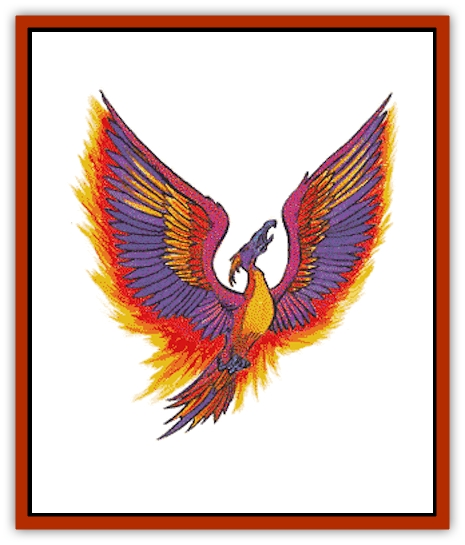

# Phoenix

| Statistic | **Phoenix** |
| --- | --- |
| **Activity Cycle:** | Any |
| **Alignment:** | Neutral good |
| **Armor Class:** | -3 |
| **Climate/Terrain:** | Elysium |
| **Damage/Attack:** | 2-12 or 1-8/1-8 |
| **Diet:** | Omnivore |
| **Frequency:** | Very rare |
| **Hit Dice:** | 20 |
| **Intelligence:** | Genius (17-18) |
| **Magic Resistance:** | 50% |
| **Morale:** | Champion (15-16) |
| **Movement:** | 6, Fl 39 (D) |
| **No. Appearing:** | 1-3 |
| **No. of Attacks:** | 1 or 2 |
| **Organization:** | Solitary |
| **Size:** | L (40'+ wing span) |
| **Special Attacks:** | Shriek |
| **Special Defenses:** | +3 or better weapons to hit, never surprised |
| **THAC0:** | 1 |
| **Treasure:** | O |
| **XP Value:** | 19,000 |

The phoenix is a great, extra-planar [[Bird|bird]] thought to represent the spirit of freedom and rebirth. It is a mortal creature that displays the ultimate in godlike detachment.

A phoenix appears as a large bird with a 40' wingspan and bright, multi-colored feathers. The plumage includes bright violet, scarlet, crimson and flaming orange. Its beak and claws are of blue-violet. A phoenix's eyes are a deep, glowing ruby color.

In addition to its own language, a phoenix can speak with all avians. It otherwise communicates with a limited telepathy or by empathy.

**Combat:** The phoenix is a free and benevolent spirit and does not derive pleasure from attacking others. But if the need for combat arises, a phoenix is a swift and powerful foe. It can attack in the air with two powerful claws inflicting 1-8 points of damage per strike. When on the ground it attacks with its great beak for 2-12 points of damage per hit. The phoenix is an intelligent and magical beast, however, so it usually opts for more effective measures of attack and defense.

A phoenix will always open up each round of combat with a piercing shriek that gives the creature an edge in the combat round. All opponents of 12 hit dice or less within 30 feet of a shrieking phoenix receive a +3 penalty on their initiative dice. The shriek does not affect the phoenix's combat roles in any way.

Every phoenix has the following spell-like powers, at 20th level of magic use, usable once per round, one at a time, at will:

<ul><li>*affect normal fires*</li><li>*audible glamer*</li><li>*blindness*</li><li>*blink*</li><li>*blur*</li><li>*call woodland beings*, 1 time per day</li><li>*color spray*, 3 times per day</li><li>*continual light*</li><li>*control temperature, 10' radius*</li><li>*dancing lights*</li><li>*detect charm*, always active</li><li>*detect evil*, always active</li><li>*detect magic*, always active</li><li>*duo-dimension*, 1 time per day</li><li>*find traps*</li><li>*find the path*, 1 time per day</li><li>*fire charm*</li><li>*fire seeds*, 1 time per day</li><li>*incendiary cloud*, 1 time per week</li><li>*invisibility*</li><li>*misdirection*</li><li>*neutralize poison*, 1 time per day</li><li>*polymorph self*, 3 times per day</li><li>*produce fire*</li><li>*protection from evil, 10' radius*, always active</li><li>*pyrotechnics*</li><li>*reincarnate*, 1 time per day</li><li>*remove fear*, within a 10-foot radius</li><li>*remove curse*</li><li>*snake charm*</li><li>*veil*, 1 time per day</li><li>*wall of fire*, 1 time per day</li></ul>Also, by spreading its wings and performing a ritual dance, the phoenix can perform the following spell-like abilities at 40th level of magic use:

<ul><li>*dismissal*</li><li>*dispel evil*</li><li>*dispel magic*</li></ul>Any of these three abilities can be used by a phoenix as many times as desired, but can only be done one at a time and each takes a full round to complete. No other activities - such as a shriek - can be done in conjunction with these three powers.

A touch of its wing is equal to a *cure light wounds* spell, with 2 touches possible per individual per day per phoenix. A touch of the comb gives an effect equal to *cure disease*, but only once per day per person.

When hard-pressed, the phoenix is able to cause spilled droplets of its own blood to act as *fire seeds* of the holly berry type, one being created for every five points of damage taken by the phoenix.

In extreme situations, the phoenix can create a 40th-level combination of *fire storm* (20' high x 5' wide x 8' deep) and *incendiary cloud*, even if it has already used these powers previously. This destroys the adult phoenix but leaves behind a young phoenix with all the powers and abilities of its predecessor.

The phoenix can travel astrally or ethereally at will. They are hit only by +3 or better magical weapons. The phoenix can never be surprised. It has infravision to 120 feet.

**Habitat/Society:** Phoenixes are strange and enigmatic creatures. They are held in very high regard in the legends of many tribes of barbarians and in other, primitive cultures. It is said that the phoenix is the embodiment of rebirth. This is symbolized in the classic imagery of the self-immolation of the phoenix from which a new bird is formed. This is seen as the ultimate sacrifice for the cause of good and thus the phoenix are considered noble creatures.

Legend states that the phoenix has an extremely long lifespan. Some reports claim they can live to be over 1,000 years old, while others suggest it to be as high as 12,000 years. When it is time for the phoenix to die, it goes far into the mountains away from civilization. At the very top of these peaks, the phoenix builds a great nest made of straw and various herbs. The phoenix will lie in the nest, taking its last look at the world it knows. Satisfied that its work in the world is at an end, it then immolates itself in a flash of great flame and light. When the flames die down, there in the nest, which remains untouched by flames, is a young phoenix arrayed in bright colors like its parent before it. Legend then suggests that the phoenix must fly away to the temple of the sun and there bury the mummified corpse of its parent.

In general, phoenixes are reclusive creatures, tending to make their lairs away from the worlds of humanoid beings. Though they have the ability to travel through the Astral and Ethereal planes (and thus to any inner and outer plane), they will generally tend to stay on Elysium or in a secluded place on the Prime Material plane.

There are as many legends of the phoenix as there are cultures, each with its own slightly differing viewpoint. Some believe the phoenix to be the benevolent symbol of death, only appearing when someone's time is up among the living. Other cultures - primarily evil - see the phoenix as the symbol of destruction and rage, bringing fiery devastation in its wake. Still other cultures record their phoenix to be a friend and benefactor of good beings.

Although a wealth of mystery surrounds the phoenix, still there are some things that are known for sure. It is obvious that the phoenix is a champion of good. Although is seems these creatures do not actively seek out evil to destroy, they will rarely pass up such an opportunity when it presents itself. Also, despite the vast differences in ideology, belief, and philosophy in the various cultures that revere the phoenix, one thing remains constant: the phoenix is the symbol of creation by destruction. Some cultures believe that fire is the one great purifier, cleansing all that it touches. Others believe that fires merely destroys. With the phoenix, both are true. In its own reproduction, fires destroys the old bird, taking with it many centuries of life and wisdom, yet it creates a new phoenix with a new mind, thus purifying the line.

**Ecology:** Of all magical or enchanted creatures, the phoenix is perhaps most sought after by alchemists and sages alike. There is almost no part of a phoenix that cannot be used in a magical potion or for research.

The feathers of the phoenix have a great many uses. They can be used to adorn a *staff of healing*, they can be used to make *potions of extra-healing*, and have many other healing, magic uses. The eyes, beak, and talons of a phoenix are very valuable in the open market, often commanding 5,000 gp and up. Of course it is not always easy to find a buyer on the open market, because many cultures consider it a bad omen or taboo violation to kill a phoenix.

The exact nature of the phoenix can only be guessed at by scholars. All phoenixes are male and the reproduction cycle consists entirely of the self-immolation. Whether this is a natural biological reproduction cycle or a magical birth is unclear.

---
## Discovery & Documentation

**Source Publication:** MC8 Outer Planes Appendix (1990)
**Campaign Setting:** Planescape
**Author(s):** Timothy B. Brown, Jamie LaFountain

### Other Creatures Found in This Source Book
   * [[Aasimon_Agathinon|Aasimon, Agathinon]]
   * [[Aasimon_Deva|Aasimon, Deva]]
   * [[Aasimon_Light|Aasimon, Light]]
   * [[Aasimon_General_Information|Aasimon, General Information]]
   * [[Aasimon_Planetar|Aasimon, Planetar]]
   * [[Aasimon_Solar|Aasimon, Solar]]
   * [[Air_Sentinel|Air Sentinel]]
   * [[Animal_Lord|Animal Lord]]
   * [[Archon|Archon]]
   * [[Baatezu_Lesser_Abishai|Baatezu, Lesser, Abishai]]
   * [[Baatezu_Greater_Amnizu|Baatezu, Greater, Amnizu]]
   * [[Baatezu_Lesser_Barbazu|Baatezu, Lesser, Barbazu]]
   * [[Baatezu_Greater_Cornugon|Baatezu, Greater, Cornugon]]
   * [[Baatezu_Lesser_Erinyes|Baatezu, Lesser, Erinyes]]
   * [[Baatezu_General_Information|Baatezu, General Information]]
   * [[Baatezu_Greater_Gelugon|Baatezu, Greater, Gelugon]]
   * [[Baatezu_Lesser_Hamatula|Baatezu, Lesser, Hamatula]]
   * [[Baatezu_Lemure|Baatezu, Lemure]]
   * [[Baatezu_Least_Nupperibo|Baatezu, Least, Nupperibo]]
   * [[Baatezu_Lesser_Osyluth|Baatezu, Lesser, Osyluth]]
   * [[Baatezu_Greater_Pit_Fiend|Baatezu, Greater, Pit Fiend]]
   * [[Baatezu_Least_Spinagon|Baatezu, Least, Spinagon]]
   * [[Balaena|Balaena]]
   * [[Bariaur|Bariaur]]
   * [[Bebilith|Bebilith]]
   * [[Bodak|Bodak]]
   * [[Dog_Moon|Dog, Moon]]
   * [[Dragon_Adamantite|Dragon, Adamantite]]
   * [[Einheriar|Einheriar]]
   * [[Gehreleth|Gehreleth]]
   * [[Githyanki|Githyanki]]
   * [[Githzerai|Githzerai]]
   * [[Hordling|Hordling]]
   * [[Lammasu_Celestial|Lammasu, Celestial]]
   * [[Larva|Larva]]
   * [[Maelephant|Maelephant]]
   * [[Marut|Marut]]
   * [[Mediator|Mediator]]
   * [[Mortai|Mortai]]
   * [[Night_Hag|Night Hag]]
   * [[Nightmare|Nightmare]]
   * [[Noctral|Noctral]]
   * [[Per|Per]]
   * [[Slaad|Slaad]]
   * [[Tanar'ri_Greater_Babau|Tanar'ri, Greater, Babau]]
   * [[Tanar'ri_Greater_Chasme|Tanar'ri, Greater, Chasme]]
   * [[Tanar'ri_Greater_Nabassu|Tanar'ri, Greater, Nabassu]]
   * [[Tanar'ri_Least_Dretch|Tanar'ri, Least, Dretch]]
   * [[Tanar'ri_Least_Manes|Tanar'ri, Least, Manes]]
   * [[Tanar'ri_Least_Rutterkin|Tanar'ri, Least, Rutterkin]]
   * [[Tanar'ri_Lesser_Alu-Fiend|Tanar'ri, Lesser, Alu-Fiend]]
   * [[Tanar'ri_Lesser_Bar-Lgura|Tanar'ri, Lesser, Bar-Lgura]]
   * [[Tanar'ri_Lesser_Cambion|Tanar'ri, Lesser, Cambion]]
   * [[Tanar'ri_Lesser_Succubus|Tanar'ri, Lesser, Succubus]]
   * [[Tanar'ri_Guardian_Molydeus|Tanar'ri, Guardian, Molydeus]]
   * [[Tanar'ri_General_Information|Tanar'ri, General Information]]
   * [[Tanar'ri_True_Balor|Tanar'ri, True, Balor]]
   * [[Tanar'ri_True_Glabrezu|Tanar'ri, True, Glabrezu]]
   * [[Tanar'ri_True_Hezrou|Tanar'ri, True, Hezrou]]
   * [[Tanar'ri_True_Marilith|Tanar'ri, True, Marilith]]
   * [[Tanar'ri_True_Nalfeshnee|Tanar'ri, True, Nalfeshnee]]
   * [[Tanar'ri_True_Vrock|Tanar'ri, True, Vrock]]
   * [[Titan|Titan]]
   * [[Translator|Translator]]
   * [[T'uen-rin|T'uen-rin]]
   * [[Vaporighu|Vaporighu]]
   * [[Warden_Beast|Warden Beast]]
   * [[Yugoloth_Greater_Arcanaloth|Yugoloth, Greater, Arcanaloth]]
   * [[Yugoloth_Lesser_Dergoloth|Yugoloth, Lesser, Dergoloth]]
   * [[Yugoloth_Lesser_Hydroloth|Yugoloth, Lesser, Hydroloth]]
   * [[Yugoloth_General_Information|Yugoloth, General Information]]
   * [[Yugoloth_Lesser_Mezzoloth|Yugoloth, Lesser, Mezzoloth]]
   * [[Yugoloth_Greater_Nycaloth|Yugoloth, Greater, Nycaloth]]
   * [[Yugoloth_Lesser_Piscoloth|Yugoloth, Lesser, Piscoloth]]
   * [[Yugoloth_Greater_Ultroloth|Yugoloth, Greater, Ultroloth]]
   * [[Yugoloth_Lesser_Yagnoloth|Yugoloth, Lesser, Yagnoloth]]
   * [[Zoveri|Zoveri]]
