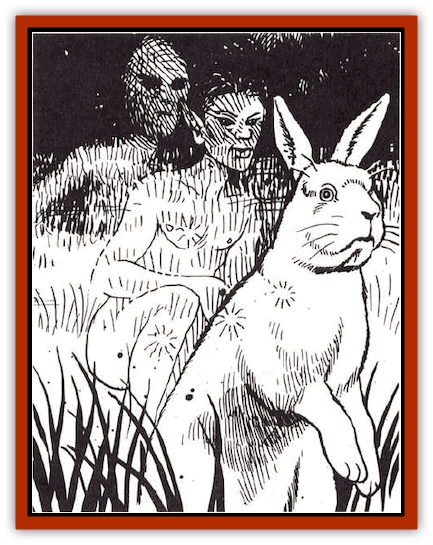

# Phouka

| Statistic | **Phouka** |
| --- | --- |
| **Activity Cycle:** | Any |
| **Alignment:** | Chaotic neutral |
| **Armor Class:** | Varies |
| **Climate/Terrain:** | Temperate |
| **Damage/Attack:** | Varies |
| **Diet:** | Omnivore |
| **Frequency:** | Very rare |
| **Hit Dice:** | Varies |
| **Intelligence:** | Average (8-10) |
| **Magic Resistance:** | Nil |
| **Morale:** | Unsteady (5-7) |
| **Movement:** | Varies |
| **No. Appearing:** | 1 |
| **No. of Attacks:** | Varies |
| **Organization:** | Solitary |
| **Size:** | Varies |
| **Special Attacks:** | See below |
| **Special Defenses:** | See below |
| **THAC0:** | Varies |
| **Treasure:** | Nil |
| **XP Value:** | Varies |

The phouka is a very strange creature. It seems to have no natural form of its own but can take any shape it pleases at will. It delights in playing tricks on humans, changing into appealing shapes like gold rings and waiting to be picked up. Once picked up, it may abruptly change into a huge rock, a mule, or anything else.

It is also fond of changing into a fine [[Horse|horse]] and waiting for someone to mount it. It then takes off at breakneck speed, carrying its unfortunate rider over precipitous mountain passes, through gorse and briar hedges, and into all sorts of perilous and frightening situations, before finally depositing the rider in a hedge, pool, or dungheap and cantering off, whinnying with laughter. The rider will suffer no injury except to his pride on these wild rides, as long as he can stay on his wild mount.

The phouka seems to be motivated by its sense of humor rather than any desire to do harm or cause trouble - it loves mischief but does not intentionally cause injury.

**Combat:** Phoukas avoid combat whenever they can, either by turning into something very fast and fleeing or by turning into something very small and hiding. If cornered, a phouka might turn into a huge and frightening monster like a dragon but will always try to flee at the first opportunity. A phouka has all the physical abilities of any creature it turns into but retains its own intelligence and does not have spellcasting abilities or magical protections in any form.

**Habitat/Society:** Phoukas mainly haunt wild areas but never stray too far from human settlements. They particularly like waiting for victims by the roadside. It is not known how (or whether) phoukas reproduce - various claims have been made but no one has been able to prove that they were observing phoukas and not some other species.

**Ecology:** Phoukas seem to be omnivores. They often turn into goats in order to eat, apparently because goats can eat almost anything. They scavenge and steal rather than hunt.

---
## Discovery & Documentation

**Source Publication:** HR3 Celts Campaign (1992)
**Campaign Setting:** Advanced Dungeons & Dragons 2nd Edition
**Author(s):** Graeme Davis

### Other Creatures Found in This Source Book
   * [[Boobrie|Boobrie]]
   * [[Horse_Water-|Horse, Water-]]
   * [[Water_Leaper|Water Leaper]]
