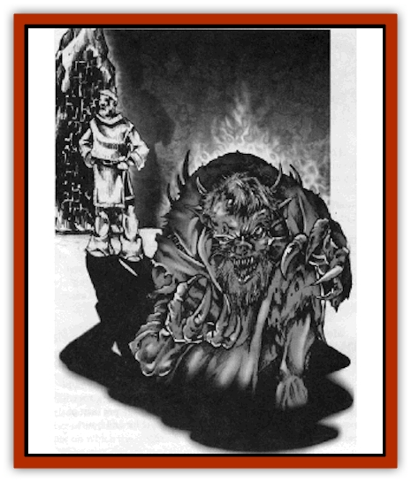
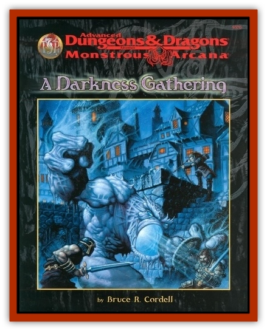

# Phthisic

| Statistic | **Phthisic** |
| --- | --- |
| **Activity Cycle:** | Any |
| **Alignment:** | Chaotic evil |
| **Armor Class:** | -3 |
| **Climate/Terrain:** | Special |
| **Damage/Attack:** | 2d6/2d6/1d4 |
| **Diet:** | Mental energy |
| **Frequency:** | Very rare |
| **Hit Dice:** | 13 |
| **Intelligence:** | Average (8-10) |
| **Magic Resistance:** | <i>Confusion</i> and <i>feeblemind</i> |
| **Morale:** | L (9' tall) |
| **Movement:** | 15 |
| **No. Appearing:** | 1 |
| **No. of Attacks:** | 3 (claw/claw/bite) |
| **Organization:** | Solitary |
| **Size:** | Nil |
| **Special Attacks:** | <i>Feeblemind</i> or drain intelligence, cold |
| **Special Defenses:** | +2 or better weapons to hit, reflects spells, regenerates |
| **THAC0:** | 7 |
| **Treasure:** | Nil |
| **XP Value:** | Elite (14) |

The phthisic begins as a repressed memory or a buried neurosis. A skilled [[Mind_Flayer|illithid]] can wrench this creature free from the subconscious mind and physically embody it in living, breathing flesh!

The phthisic appears as an enlarged, bloated and distorted reflection of the person from whom it emerged. In addition, features such as coarse hair, horns, tentacles, and other malefic additions appear on the phthisic.

**Combat:** The phthisic attacks simultanously with two talon swipes and a vicious bite. Its claws inflict 2d6 hit points each, while its bite inflicts 1d4 hit points. Anyone bitten by the phthisic in the midst of combat must roll a saving throw vs. spell or suffer the effects of a *feeblemind* spell for 1d4+3 rounds. If the phthisic feeds in peace upon a feebleminded victim, each bite permanently drains 1 point of Intelligence! The phthisic cannot drain intelligence in the midst of melee; it does so only after vanquishing all threats.

In addition to its physical defenses, the threatened phthisic can emanate a supernatural aura of cold for 1 turn every hour. Anyone within 10 feet of the phthisic suffers 1d6 points of cold damage. PCs who make successful saving throws vs. breath weapon each round take only half damage from the aura.

Even though the phthisic is a creature of flesh and bone, it has its origin in psychocreative arts. Thus, only weapons of +2 or greater enchantment can damage the phthisic. In addition, the creature regenerates 3 hit points per round. Even if brought below 0 hit points, the phthisic continues to regenerate while its energy source (see Ecology) remains viable.

The phthisic is a creature born of turmoil, self-deprecation, and doubt. Because of this, all spells have a 25% chance to reflect back upon their casters. This includes area-of-effect spells that specifically target the phthisic.

The phthisic gains one final benefit from its generative source: No matter the distance, the creature can see the interior of its lair and *teleport without error* back there at the first sign of intrusion. It can use this teleportation ability once every 24 hours.

Because the phthisic is a creature of the mind, *feeblemind* or *confusion* spells cause the monster 2d10 points of damage and nullify its ability to regenerate for 2d10 rounds.

**Habitat/Society:** Phthisics require the sustenance of a living mind for nourishment, but they cannot stray too far (or too long) away from their generative source (see Ecology). Thus, a phthisic stalks its victims at a distance from its lair but retuirns there to feed upon the consciousness of its catch. Its out-of-the-way lair (usually somewhere near a large city) contains the shrunken remains of past feasts; the shriveling is apparently a side effect of its mental meal.

**Ecology:** The phthisic is drawn from the troubled psyche of an individual only through elaborate psionic surgery. Only illithids have the knowledge to draw the creature out of a thrall and tie its existence to a generative source.

A phthisic's generative source takes the form of complex psionic circuitry (known as a psionic seal) embedded in some large, inanimate object. The generative source gives the creature life, but it curtails its existence to within 3 miles of the psionic seal. The destruction of a phthisic's psionic seal permanently destroys the creature. Killing the individual from whom the phthisic emerged has no effect upon the creature.

---
## Discovery & Documentation

**Source Publication:** A Darkness Gathering (1998)
**Campaign Setting:** Advanced Dungeons & Dragons 2nd Edition
**Author(s):** Bruce R Cordel
