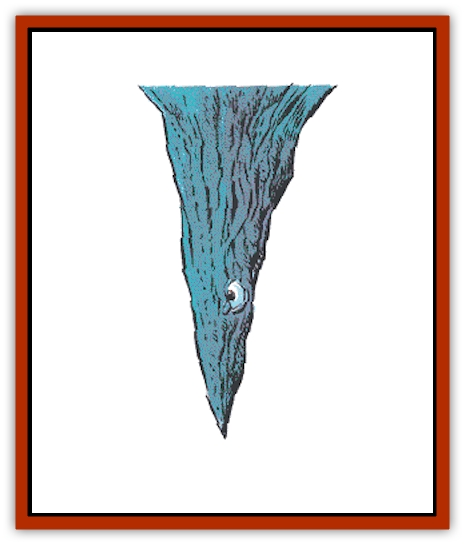

# Piercer

| Statistic | **Piercer** |
| --- | --- |
| **Activity Cycle:** | Any |
| **Alignment:** | Neutral |
| **Armor Class:** | 3 |
| **Climate/Terrain:** | Any subterranean |
| **Damage/Attack:** | 1 HD: 1-6 / 2 HD: 2-12 / 3 HD: 3-18 / 4 HD: 4-24 |
| **Diet:** | Carnivore |
| **Frequency:** | Uncommon |
| **Hit Dice:** | 1-4 |
| **Intelligence:** | Non- (0) |
| **Magic Resistance:** | Nil |
| **Morale:** | Average (8-10) |
| **Movement:** | 1 |
| **No. Appearing:** | 3-18 (3d6) |
| **No. of Attacks:** | 1 |
| **Organization:** | Colony |
| **Size:** | T-M (1-6' tall) |
| **Special Attacks:** | Surprise |
| **Special Defenses:** | Nil |
| **THAC0:** | 1-2 HD: 19 / 3-4 HD: 17 |
| **Treasure:** | Nil |
| **XP Value:** | 1 HD: 35 / 2 HD: 65 / 3 HD: 120 / 4 HD: 420 |

Piercers resemble stalactites found on cave roofs. They are actually a species of gastropods that, without their shells, resemble slugs with long tails. A piercer climbs onto the ceiling of a cavern and waits patiently; when it detects prey beneath it, it drops from the ceiling and impales the victim with the sharp end of its shell.

Piercers look like limestone growths on the ceiling of a cavern, just like ordinary stalactites. They come in the following sizes: one foot long (1 Hit Die), three feet long (2 Hit Dice), four and one-half feet long (3 Hit Dice), and six feet long (4 Hit Dice). Piercers can be identified on very close inspection by a pair of tiny eyestalks that curl along the side of the stalactite.

**Combat:** Piercers have only one chance to hit; if an attack fails to score a kill, the piercer cannot attack again until it slowly scales a wall to resume its position. Piercers can hear noises and detect heat sources in a 120-yard radius; these heat sources include humans. If the noise and light are stationary for many minutes at a time, piercers will slowly edge into attack position over the source of the stimulus. Piercers are virtually indistinguishable from natural phenomena. A group of characters has a -7 modifier on its surprise roll against a piercer (this guarantees that the group will be surprised unless it has some positive modifiers).

A piercer, after it has fallen, is slow and fairly easily slain. Its soft underbelly has one defense mechanism; when exposed to air it covers itself in a corrosive acid which inflicts 1 point of damage on contact with flesh. This is usually enough to dissuade natural predators from disturbing it.

**Habitat/Society:** While piercers are nonintelligent, the piercers in a colony are aware of each other. They often fall simultaneously, to feed on those killed by other piercers (which makes the area suddenly very dangerous).

Piercers dwell in caverns, where they live in groups of about 10 members. They prefer to hang over high traffic areas, so they will usually be found near cave entrances. Aside from mating, the piercers are not social creatures. There are rumored to be great caverns deep underground that contain colonies of hundreds of piercers. Piercers are not attracted to treasure, only to food.

**Ecology:** The piercer is a mollusk, hatched from a hen-sized egg which the parent lays in clutches of six to eight in isolated areas of the cavern. When they hatch, the young appear to be slugs feeding on fungi. After several months, they climb the cavern walls, secrete a chemical that hardens into the familiar stalactite shape, and then wait for prey to come.

A piercer has a lifespan of four years and grows one Hit Die per year. In any group of piercers, the number of creatures with one, two, three, and four Hit Dice will be nearly evenly divided (e.g., in a group of 12 piercers, there will be three one Hit Die piercers, three with two Hit Dice, three with three Hit Dice, and three with four Hit Dice).

A piercer can go without food for months. It stores food in a second stomach that can preserve food for long periods of time; some alchemists seek out piercers to extract a substance from this organ and refine it for human use, as it can keep foodstuffs and precious ingredients fresh for weeks. Piercers also store large supplies of water, extracted from their victims. Piercers can maintain this water supply for months.

The taste of a piercer is said to resemble that of a snail, but with a bitter aftertaste. Their eggs and offspring are not traded on the open market.

---
## Discovery & Documentation

**Source Publication:** MC1 Volume I (w/binder #1) (1991)
**Campaign Setting:** Advanced Dungeons & Dragons 2nd Edition
**Author(s):** Jay Batista, Scott Bennie, Grant Boucher, William W. Connors, Steve Gilbert, Heike Kubasch, James Lowder, David Edward Martin, Bruce Nesmith, Jean Rabe, Rick Swan, John J. Terra, Gary L. Thomas

### Other Creatures Found in This Source Book
   * [[Bat|Bat]]
   * [[Bear|Bear]]
   * [[Behir|Behir]]
   * [[Boar|Boar]]
   * [[Bookworm|Bookworm]]
   * [[Brownie|Brownie]]
   * [[Bugbear|Bugbear]]
   * [[Carrion_Crawler|Carrion Crawler]]
   * [[Cat_Great|Cat, Great]]
   * [[Catoblepas|Catoblepas]]
   * [[Dragon_General_Information|Dragon, General Information]]
   * [[Dragonfish|Dragonfish]]
   * [[Elemental_Air_Kin_Aerial_Servant|Elemental, Air Kin, Aerial Servant]]
   * [[Elemental_Earth_Kin_Sandling|Elemental, Earth Kin, Sandling]]
   * [[Elephant|Elephant]]
   * [[Gnoll|Gnoll]]
   * [[Hobgoblin|Hobgoblin]]
   * [[Homunculus|Homunculus]]
   * [[Hornet_Giant|Hornet, Giant]]
   * [[Horse|Horse]]
   * [[Hyena|Hyena]]
   * [[Jackal|Jackal]]
   * [[Jackalwere|Jackalwere]]
   * [[Korred|Korred]]
   * [[Lich|Lich]]
   * [[Lizard|Lizard]]
   * [[Lizard_Man|Lizard Man]]
   * [[Lycanthrope_General_Information|Lycanthrope, General Information]]
   * [[Lycanthrope_Seawolf|Lycanthrope, Seawolf]]
   * [[Lycanthrope_Werebear|Lycanthrope, Werebear]]
   * [[Lycanthrope_Weretiger|Lycanthrope, Weretiger]]
   * [[Lycanthrope_Werewolf|Lycanthrope, Werewolf]]
   * [[Manticore|Manticore]]
   * [[Medusa|Medusa]]
   * [[Mind_Flayer|Mind Flayer]]
   * [[Minotaur|Minotaur]]
   * [[Mudman|Mudman]]
   * [[Mummy|Mummy]]
   * [[Nixie|Nixie]]
   * [[Nymph|Nymph]]
   * [[Ogre|Ogre]]
   * [[Ooze_Slime_Jelly_I|Ooze/Slime/Jelly I]]
   * [[Ooze_Slime_Jelly_II|Ooze/Slime/Jelly II]]
   * [[Orc|Orc]]
   * [[Owl|Owl]]
   * [[Owlbear_I|Owlbear I]]
   * [[Pegasus|Pegasus]]
   * [[Pudding_Deadly|Pudding, Deadly]]
   * [[Rakshasa|Rakshasa]]
   * [[Rat|Rat]]
   * [[Ray|Ray]]
   * [[Remorhaz|Remorhaz]]
   * [[Satyr|Satyr]]
   * [[Scorpion|Scorpion]]
   * [[Selkie|Selkie]]
   * [[Shadow|Shadow]]
   * [[Skeleton|Skeleton]]
   * [[Skunk|Skunk]]
   * [[Snake|Snake]]
   * [[Spectre|Spectre]]
   * [[Spider|Spider]]
   * [[Sprite|Sprite]]
   * [[Toad_Giant|Toad, Giant]]
   * [[Treant|Treant]]
   * [[Troll|Troll]]
   * [[Umber_Hulk|Umber Hulk]]
   * [[Unicorn|Unicorn]]
   * [[Vampire|Vampire]]
   * [[Wight|Wight]]
   * [[Will_O'Wisp|Will O'Wisp]]
   * [[Wolf|Wolf]]
   * [[Wolfwere|Wolfwere]]
   * [[Wraith|Wraith]]
   * [[Wyvern|Wyvern]]
   * [[Yeti|Yeti]]
   * [[Yuan-ti|Yuan-ti]]
   * [[Zombie|Zombie]]
