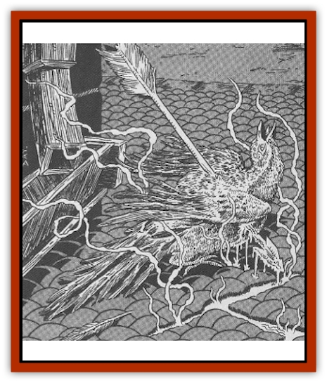

# Pigeon - Acid

| Statistic | **Pigeon, Acid** |
| --- | --- |
| **Activity Cycle:** | Day |
| **Alignment:** | 1, Fl 30 (B) |
| **Armor Class:** | 20 |
| **Climate/Terrain:** | Temperate urban |
| **Damage/Attack:** | Nil |
| **Diet:** | Omnivore |
| **Frequency:** | Uncommon |
| **Hit Dice:** | 1 |
| **Intelligence:** | Animal (1) |
| **Magic Resistance:** | 65% |
| **Morale:** |  |
| **Movement:** | 1 |
| **No. Appearing:** | 1-4 hp |
| **No. of Attacks:** | See below |
| **Organization:** | Flock, among normal pigeons |
| **Size:** |  |
| **Special Attacks:** | S (1-2' wingspan) |
| **Special Defenses:** | 2 |
| **THAC0:** | Caustic droppings |
| **Treasure:** | 1-4 (among 6-10 normal pigeons) |
| **XP Value:** |  |

Acid pigeons are virtually indistinguishable from normal pigeons. It's their extremely powerful acids that separate them from their cousins. As a result, acid pigeons can digest just about anything. While they actually derive nourishment only from normal bird food (bugs and worms, the occasional tossed bit of bread from a friendly bird watcher), the birds are stupid enough to mistake the odd pebble, twig, or bit of glass as food and swallow it. This causes them no discomfort, as their powerful gastric juices break down the items quickly and efficiently.

**Combat:** Acid pigeons flee from those who come too close (unless they have food in hand) and attack only in defense of their roosts - which are usually made along rooftops or ledges high up on buildings. An attacking acid pigeon pecks with its beak for 1 hp damage.

Just because the birds aren't violent doesn't mean that they rarely cause damage to others. The acid in their bodies is so powerful that the birds' droppings are highly corrosive. Anyone hit hy an acid pigeon's droppings feels a burning sensation; if not removed within one round, the caustic material causes 1d4 hp damage. Droppings can be easily scraped or washed off.

In addition, anyone cutting an acid pigeon with a piercing or slashing weapon causes the bird's acid to spray in all directions; everyone within a 5' radius of the bird must save vs. breath weapon or suffer 1d4 hp damage. A flying acid pigeon pierced by an arrow causes a spray of acid to fall down on those below it (10' radius). Acid pigeons themselves are immune to all forms of acid.

Contrary to many city-dwellers' beliefs, acid pigeons do not actively "aim" their droppings at anyone, as they lack the intelligence to do so.

**Habitat/Society:** Despite their magical nature, acid pigeons behave as if they were normal city pigeons and are almost always found among them. Because there are no distinctive markings on the birds, it is almost impossible to tell which pigeons are acidic in nature merely by observing them. Acid pigeons roost, flock, and even mate with normal pigeons. The offspring of acid pigeons and normal pigeons have about a 50% chance of inheriting the acid pigeon's caustic nature - the ratio of acid pigeons hasn't altered significantly in cities where the creatures are known to roost.

**Ecology:** Acid pigeons are more nuisance than threat to the inhabitants of the cities in which they live. Because their droppings take a minute or so to start eating into flesh, most people are able to get the stuff off of them before any real damage is done (not that this makes the victim feel any better about the pigeon's "gift"). However, the birds do have quite an effect on the architecture of the cities in which they dwell - many buildings have developed a "pockmarked" look as a result of heavy acid pigeon infestation, and several statues have had a few inches shaved off of their upper surfaces, courtesy of acid pigeon droppings.

To date, no really good use has been found for the acid pigeon. Their droppings dry up too fast to be stored and used later, and extracting the acid from the creature's stomach is a difficult process at best, considering killing the bird with a bludgeoning weapon in order to keep the acid intact. It is believed that the creature's abilities were bred into it (magical "assistance" is suspected), but what the hypothetical wizard was hoping to accomplish is anyone's guess. It's possible the acid pigeon might have been the result of an attempt at creating a renewable source of acid, but if such was the case, the results are generally believed not to have been worth it.

---
## Discovery & Documentation

**Source Publication:** Dragon Magazine Annual 3 - 1998 (1998)
**Campaign Setting:** Dragon Magazine
**Author(s):** Johnathan M. Richards, David Day

### Other Creatures Found in This Source Book
   * [[Ant_Piranha|Ant, Piranha]]
   * [[Rat_Burglar|Rat, Burglar]]
