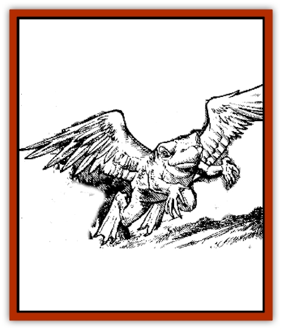

# Pigeontoad

| Statistic | **Pigeontoad** |
| --- | --- |
| **Activity Cycle:** | Day |
| **Alignment:** | Neutral |
| **Armor Class:** | 7 |
| **Climate/Terrain:** | Temperate/Wetlands, forests |
| **Damage/Attack:** | 1/1/1-4 |
| **Diet:** | Carnivore |
| **Frequency:** | Very rare |
| **Hit Dice:** | 1 |
| **Intelligence:** | Animal (1) |
| **Magic Resistance:** | Nil |
| **Morale:** | Steady (12), or Elite (14) in a group of 10+ |
| **Movement:** | 6, Fly 12 (D) |
| **No. Appearing:** | 2-12 |
| **No. of Attacks:** | 3 (claw/claw/bite) |
| **Organization:** | Flock |
| **Size:** | S (2' long, 15 lbs.) |
| **Special Attacks:** | Automatic damage with grasp, possibly poisonous bite |
| **Special Defenses:** | Nil |
| **THAC0:** | 19 |
| **Treasure:** | Nil (lizard men like their eggs, though) |
| **XP Value:** | 35 (175 if poisonous) |

These awkward, oviparous crossbreeds are usually found only in swampy conditions, although they sometimes dwell in dark forests near pools of water. They have also been found underground, but again only when they have easy access to water. They are more common in warm climes but are found in less temperate zones as well. Pigeontoads have toadlike bodies with leathery wings and birdlike talons.

**Combat:** A pigeontoad attacks a single opponent with two grasping claws and a sharp-beaked bite. If both claws hit in the same round, the opponent has been grasped and the claw damage is automatic until the creature has been killed. Beak attacks are at +2 to hit while an opponent is grasped.

About 15% of all pigeontoad flocks are poisonous; poisonous and nonpoisonous flocks never mix. The poison is administered by a successful bite and causes damage equal to that of the bite (so if the bite does 3 hp damage, the poison damage is likewise 3 hp). If the victim fails a save vs. poison, he becomes weak, gradually losing strength and constitution points as the poison takes effect at the rate of one point (each) per turn. Once both scores have reached 1, the victim is too weak to move and will die in 13-24 hours unless the poison is neutralized.

**Habitat/Society:** The female pigeontoad lays a clutch of 10-100 eggs in the water every spring. At least 75% of these eggs are consumed by natural predators. The young that hatch resemble tadpoles, with vestigial wings that serve as fins. Their size is about 3' at hatching, and growth is gradual at first; but by summer's end, the tiny pigeontoads can fly short distances. By the end of fall, they have reached normal size and either join the flock or, if enough have survived, form a new flock and search for a new nesting ground. The life span of these creatures is 3-5 years,

Pigeontoad flocks can be a menace to local communities, feeding indiscriminately on pets, herd animals, and humans. The flock attacks en masse and does not fear humans except in great numbers. Their normal diet consists of snakes, lizards, and other swamp creatures, but pigeontoads eat whatever they can kill, and a flock can kill quite a variety of things.

**Ecology:** These creatures have no treasures, at least not so far as humans are concerned. [[Lizard_Man|Lizard men]], however, eat the jellylike mass of eggs and have been known to domesticate small flocks of the creatures, using them as guards and to produce quantities of eggs for consumption. Adult pigeontoads do not seem to venture into the water except to mate; they lair in hollow trees, bushes, or stumps.

Olive-green is the predominant color of most pigeontoads, fading to a pale yellow underbelly. Their wings are gray with some greenish tint. The beak and feet are black. Pigeontoads make a croaking sound when alarmed, sounding not unlike normal toads.

*Created by: John Hamilton*

---
## Discovery & Documentation

**Source Publication:** Dragon156 (1990)
**Campaign Setting:** Dragon Magazine
**Author(s):** Mark Nelson, Bruce A. Heard

### Other Creatures Found in This Source Book
   * [[Death_Sheep|Death Sheep]]
   * [[Dragon_Pink|Dragon, Pink]]
   * [[Dragonet_Paper_Dragon|Dragonet, Paper Dragon]]
   * [[Gello_Monster|Gello Monster]]
   * [[Golem_Tin|Golem, Tin]]
   * [[Killer_Spruce|Killer Spruce]]
   * [[Man-Drake|Man-Drake]]
   * [[Tickler|Tickler]]
   * [[Wooly_Mammoth_Blink|Wooly Mammoth, Blink]]
