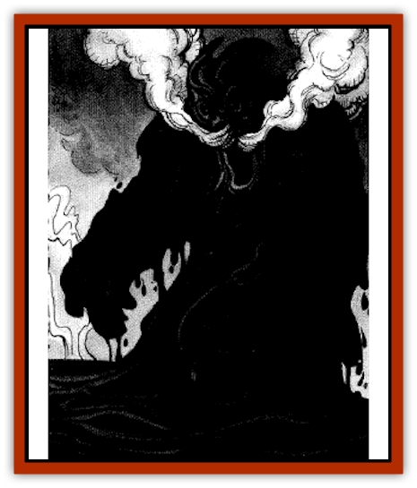

# Pit Snatcher

| Statistic | **Pit Snatcher** |
| --- | --- |
| **Activity Cycle:** | Any |
| **Alignment:** | Neutral evil |
| **Armor Class:** | 4 |
| **Climate/Terrain:** | Tar pits |
| **Damage/Attack:** | 1-8/1-8 |
| **Diet:** | Carnivore |
| **Frequency:** | Uncommon |
| **Hit Dice:** | 5 |
| **Intelligence:** | Low (5-7) |
| **Magic Resistance:** | Nil |
| **Morale:** | Steady (12) |
| **Movement:** | Special |
| **No. Appearing:** | 1-4 |
| **No. of Attacks:** | 2 |
| **Organization:** | Pack |
| **Size:** | M (7' tall) |
| **Special Attacks:** | Burning |
| **Special Defenses:** | See below |
| **THAC0:** | 15 |
| **Treasure:** | Z |
| **XP Value:** | 800 |

**Psionics Summary**

| Level | Dis/Sci/Dev | Attack/Defense | Score | PSPs |
| --- | --- | --- | --- | --- |
| 3 | 2/2/7 | II,EW/M,TS | 12 | 60 |

**Clairsentience -** *Science:* precognition; *Devotions:* feel sound, feel light, know direction, know location.

**Telepathy -** *Science:* mind link; *Devotions:* attraction, contact, life detection.

Pit snatchers are creatures that dwell in the tar pits of Athas. Some sages believe that the tar pits that give birth to the snatchers are not natural, but were formed by defiling magic so intense that the very earth erupted in noxious boils of smoking black goo. There may be some truth to this, for those areas inhabited by the snatchers are much hotter, smokier, and fouler than a few found elsewhere beneath the crimson sun. The pit snatchers may have once been [[Elemental_Air_Earth|earth elementals]] dwelling in the soil when the defiling magic drew out the very essence of the land. Now they are no more than tortured creatures desiring nothing more than to pull in unsuspecting victims to share their eternal misery.

A snatcher looks much like an earth elemental, except its flesh is made of smoking, dripping tar. There are three holes in its head that seem to form rough eyes and a wailing mouth through which noxious fumes are continually emitted. A snatcher's arms can reach well over six feet from the rim of a pit, and its hands leave black stains on flesh that never fade.

Though pit snatchers show cunning and intelligence, they do not seem capable of (or at least interested in) communicating with their prey. No pit snatcher has ever been encountered that used anything close to a recognizable language.

**Combat:** Pit snatchers like to lie in wait beneath the surface of the tar for unwary victims to pass by. When they sense a nearby presence, they erupt from the pit and grab hold of any creature within six feet of the rim. If either of the snatcher's attack hit, the victim is mired in the gooey, tar-formed limb and slowly dragged into the pit.

Each round after the attack, the character and the snatcher both roll 1d20, adding any Strength-based attack bonuses to the roll (the snatcher gets a +1 bonus). If the character wins by four or more, he breaks free and the snatcher has to try to grapple again next round. If the snatcher wins by four or more, it has dragged the victim into the tar pit. Victims dragged into the tar take 3d8 points of damage immediately, and 1d8 points every round thereafter. Ties or victories of less than four better than the opponent's roll indicate that neither side made any progress that round.

A character can opt to make an attack in the same round as the Strength test, though both rolls receive a -2 penalty in this case.

Due to their insubstantial nature, pit snatchers take only a single point of damage from slashing or impaling weapons. Magical or crushing weapons do full damage.

Additionally, a pit snatcher can ooze through the earth up to 20 yards away from its pool of tar, but only if it can emerge in another tar pit. If it is ever drawn out of a pit in some way, a snatcher will seep back into the earth and reappear in a nearby tar pool 1d10+2 rounds later. If kept from the tar for more than one hour, the snatcher dissolves into a puddle of gelatinous goo and dies.

If a pit snatcher's attack roil is a natural 13 or 20, the boiling tar of its skin burns into the victim's flesh, leaving a permanent black mark that will never fade. Some of the [[Elf_Athas|elf]] tribes superstitiously believe that such marks are signs of treachery, and aren't likely to trust someone with such a brand. The [[Gith|gith]] of the area simply consider someone with such a mark to be a fool for wandering too close to a pit snatcher's tar pool.

**Habitat/Society:** What the pit snatchers do beneath their black, bubbling den when not dragging some unfortunate to his doom is unknown. If the sages are correct and these creatures were once earth elementals, then they likely are trapped in the pits in eternal torture. It is said that on a quiet night, a traveler can sometimes hear tar bubbles bursting out of the mire. As the bubble breaks, a careful listener might hear a low, miserable moaning - the pleading call of the wracked creatures below.

When confronted by an earth cleric, a pit snatcher attempts to somehow contact the priest. As it has fews means for making its alien desires known, it will eventually become enraged and attack. It is said that an earth cleric can free a pit snatcher from its eternal torment, but all who have ever tried simply ended up being dragged into the tar as the snatcher lost patience.

**Ecology:** Pit snatchers can travel between pits within a given area. Explorers have occasionally made the mistake of marking a pit as inhabited by a snatcher while turning their backs on another pit close by. Frequently, the only signs of their folly are splashes of black tar around a pile of dropped equipment.

The equipment carried on the body of a pit snatcher's victim remains at the bottom of the snatcher's pool of tar. How someone can safely retrieve such valuables is the matter of much speculation and planning among the braver inhabitants of the Giustenal region. Thus far, no one who discovered a safe means of retrieval has spoken up, and such salvage remains merely lively tavern speculation.

---
## Discovery & Documentation

**Source Publication:** City by the Silt Sea (1994)
**Campaign Setting:** Dark Sun
**Author(s):** Shane Lacy Hensley

### Other Creatures Found in This Source Book
   * [[Beetle_Dragon|Beetle, Dragon]]
   * [[Caller_in_Darkness|Caller in Darkness]]
   * [[Dray|Dray]]
   * [[Dregoth|Dregoth]]
   * [[Dwarf_Cursed_Dead|Dwarf, Cursed Dead]]
   * [[Kalin|Kalin]]
   * [[Krag|Krag]]
   * [[Kragling|Kragling]]
   * [[Silt_Serpent|Silt Serpent]]
   * [[Silt_Spawn|Silt Spawn]]
   * [[Venger|Venger]]
   * [[Wall_Walker|Wall Walker]]
