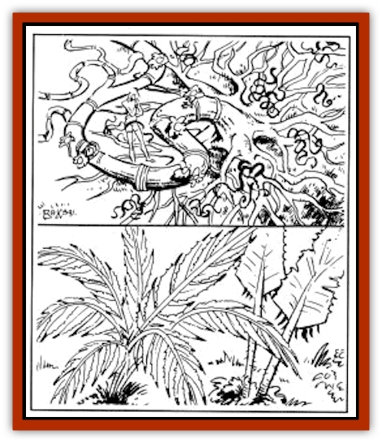
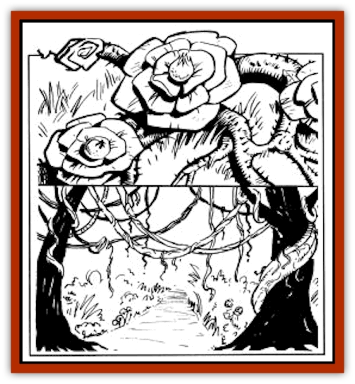

# Plant - Carnivorous - Athas

| Statistic | **Blossomkiller** | **Dew Frond** | **Poisonweed** | **Strangling Vine** |
| --- | --- | --- | --- | --- |
| **Activity Cycle:** | Day | Day | Day | Day |
| **Alignment:** | Neutral | Neutral | Neutral | Neutral |
| **Armor Class:** | 9 | See below | 8 | 5 |
| **Climate/Terrain:** | Forest/Jungles | Jungles | Forests | Jungles |
| **Damage/Attack:** | 1d6 | 1d6 | 1d6 | 1d10 |
| **Diet:** | Carnivore | Carnivore | Carnivore | Carnivore |
| **Frequency:** | Rare | Rare | Rare | Rare |
| **Hit Dice:** | 9 | 3 or more (see below) | 10 (see below) | 1-5 (see below) |
| **Intelligence:** | Non (0) | Non (0) | Non (0) | Non (0) |
| **Magic Resistance:** | Nil | Nil | Nil | Nil |
| **Morale:** | Nil | Nil | Nil | Nil |
| **Movement:** | Nil | Nil | Nil | Nil |
| **No. Appearing:** | 1 | 1 | 1 | 1 |
| **No. of Attacks:** | 1 | 1 | 1 | 1 |
| **Organization:** | Solitary | Solitary | Solitary | Solitary |
| **Size:** | H (45' area) | M-H (3-15') | S (2' area) | H (25' long) |
| **Special Attacks:** | Paralysis | Blood drain | Poison | Strangulation |
| **Special Defenses:** | See below | Nil | See below | See below |
| **THAC0:** | 11 | 15 or less | Nil (see below) | 19, 17, or 15 |
| **Treasure:** | Nil | Nil | Nil | Nil |
| **XP Value:** | 2,000 | 3-4 Hit Dice: 175 / 5-6 Hit Dice: 420 / 7-8 Hit Dice: 975 / 9-10 Hit Dice: 2,000 | 2,000 | 650 |

**Blossomkiller**

  Blossomkiller is a very unique plant found in all the vegetated areas of Athas. The plant has many different features, including its stalk, roots, tendrils, and flowers.

A single blossomkiller plant occupies an area with a radius of up to 45 feet. The roots and vines of this plant stretch across the area, between, in, and around any other nearby plants. The stalk of a blossomkiller is the size of a large tree trunk, but as it grows it lays flat down on the ground, where it spreads out in all directions.

The roots of the plant, which criss-cross the entire 45-footradius area, and are similar in nature to trip wires. The tendrils branch out from the roots and await an unsuspecting victim. The tendrils are two to three inches thick, from five to ten feet in length, and green in color. Every five to ten feet, there is a group of four tendrils which sprout out from one of the blossomkiller's roots. The flowers of the blossomkiller are large and bright yellow, with dark green stems and leaves. Within the area of the blossomkiller, there are any number of flowers, most often six to nine, spread out evenly throughout the area. The stamen of a blossomkiller flower looks like a pin cushion, and for good reason; it is from the stamen that this plant shoots quills that damage its targets.

When a victim steps on any of the plant's roots, the flowers shoot a spray of quills in all directions, entirely covering the area occupied by the plant. The quills carry on them a natural paralysis poison, and any creature or being hit by them must make a saving throw vs. paralysis. Those who succeed take 1d6 points of damage, but are otherwise unaffected. Those who fail take 1d6 points of damage and are paralyzed for 2 turns (20 minutes). When a victim is paralyzed, the blossomkiller's tendrils move out and begin to wrap themselves around it.

A blossomkiller has 1 hit die for each ten feet of area to a maximum of 9 Hit Dice. Each flower has only three hit points, while the roots have eight hit points each. The roots, tendrils, and flowers of a blossomkiller are not very sturdy, and are easy to cut (AC 9).

**Dew Fronds**

  Dew fronds are found in the jungle areas of Athas, where they easily blend in with the tropical surroundings and foliage. When newly grown, each frond is three to five feet in length and is a yellowish-tan color. The fronds of this plant are usually encountered in groups of four, all growing out of a single stalk. A young plant has a radius of approximately 4 feet and is three to four feet tall. As it feeds, a dew frond plant grows at an alarming rate.

A dew frond lives off of the blood of its victims. As it feeds on more blood, the plant grows, soon reaching a height of fifteen feet and having a radius of 20 feet. The dew frond feeds through use of its sharp, barbed fronds. As a creature passes by one of these plants, it will lash out with its fronds, cutting the creature. To the victim, it will seem like the frond simply shifted, as though moved by the wind, etc. When a dew frond attacks, it does 1d6 points of damage. When it cuts the creature, the barbs dig into its skin, causing the fronds to stick in the wound. The fronds then begin to draw blood from the victim at a rate of 1 hit point per two rounds, until the victim is either drained or breaks free. Breaking free requires three rounds. This can be done more quickly, but doing so results in the victim taking 1d6 points of damage.

A young dew frond plant has 1 hit die and an AC of 10. For each ten hit points of damage a dew frond inflicts on a target, it gains 1 hit die, and its AC is reduced by 1 (to a minimum of AC 0). Also, a dew frond plant grows one foot in height for each hit die it gains. Thus, after inflicting ten points of damage, a dew frond would have 2 Hit Dice, an AC of 9, and be four to five feet tall. After inflicting 30 points, it would have 4 hit dice and an AC of 7. Note that the additional damage inflicted by quickly removing a frond from a wound does *not* count towards the plant's growth.

**

Poisonweed**

  Poisonweed is found within the forest areas of Athas. Along the roots of this weed grow large, beautiful flowers, bearing bright orange-colored petals and light green-tinted leaves. The flowers of a poisonweed plant are from four to six inches in diameter and are very hard to miss. A single poisonweed plant will bear up to 30 flowers, which are spread over a 20 foot radius.

These flowers tend to extend out towards foot trails and paths which are commonly used by animals and man-sized travelers in the forest. At the center of a flower is a poison sac, filled with poisonous dust. As a victim touches or brushes against one of these flowers, a large cloud of poison is released into the air affecting all within 15 feet of the plant. Every being inside the affected area must save vs. poison or fall fast asleep, taking 1d6 points of damage as they do so. Those who successfully save remain conscious, but still take the damage. Once asleep, the victim is covered with the dust, which, as the victim breathes it, continues to keep him unconscious. Once the victim is asleep, the poisonweed roots quickly grow around and on its body, until it is completely entangled by them. It takes 3 turns for a poisonweed plant to completely entangle a victim. The poisonweed roots then secrete a corrosive enzyme that slowly eats away at the victim's flesh, eventually killing it. These corrosive enzymes do 1d10 points of damage per round.

Poisonweed plants are difficult to kill, since each time they are hit, they disperse another cloud of poison dust. Each flower on a given plant can generate two clouds of dust before its poison sac is emptied. This means an average plant can create up to 60 poison clouds before being depleted. For each new cloud created, any creatures within the area of effect must again save vs. poison or be rendered unconscious.

Each poisonweed flower has only 2 hit points, but the whole plant has a total of 10 Hit Dice. Poisonweed is immune to cold attacks, but takes double damage from fire-based ones. When a poisonweed plant is killed, it will automatically disperse as many poison clouds as possible before it dies. The only known method of safely killing a poisonweed plant is through the use of defiler magic. When the life source of the plant is drained, it is unable to disperse its dust clouds, and, like all plant life within range of defiler magic, is instantly killed.

**Strangling Vines**

  Strangling vines are roughly 25 feet in length, usually stretched between three or four trees, most often crossing over footpaths and trails in the forest. The vines have approximately ten leaves per five-foot section; these leaves conceal sharp thorns. The stalk of a strangling vine is brownish-green in color, while the leaves are a shiny, moss-like, deep green.

A strangling vine usually lies drooping between trees, waiting for a victim to pass by. As a suitable prey passes beneath the vine, it will drop suddenly and wrap itself around the prey's neck, strangling it. It will then attempt to pull the victim off the ground, hanging it until it dies.

Because a strangling vine looks natural in its surroundings, creatures attacked by it suffer a -1 penalty on their surprise rolls.

When a strangling vine attacks, its first strike causes 1d10 points of damage, due to the plant's long thorns. Each round after that, when the vine is attempting to strangle its victim, the vine's prey takes 1d6 points of damage. Breaking free of a strangling vine is difficult, requiring a Strength check be made with a -5 penalty. This may only be attempted one time by the victim.

---
## Discovery & Documentation

**Source Publication:** MC12 Dark Sun Appendix I - Terrors of the Desert (1991)
**Campaign Setting:** Dark Sun
**Author(s):** Tom Prusa, Louis J. Prosperi, Walter M. Baas

### Other Creatures Found in This Source Book
   * [[Animal_Herd_Athas|Animal, Herd (Athas)]]
   * [[Animal_Household_Athas|Animal, Household (Athas)]]
   * [[Antloid_Desert|Antloid, Desert]]
   * [[Banshee_Dwarf|Banshee, Dwarf]]
   * [[Beetle_Agony|Beetle, Agony]]
   * [[Bog_Wader|Bog Wader]]
   * [[Brambleweed|Brambleweed]]
   * [[B'rohg|B'rohg]]
   * [[Burnflower|Burnflower]]
   * [[Cat_Psionic|Cat, Psionic]]
   * [[Cha'thrang|Cha'thrang]]
   * [[Cistern_Fiend|Cistern Fiend]]
   * [[Clam_Giant|Clam, Giant]]
   * [[Cloud_Ray|Cloud Ray]]
   * [[Drake_Athas_Air|Drake (Athas), Air]]
   * [[Drake_Athas_Earth|Drake (Athas), Earth]]
   * [[Drake_Athas_Fire|Drake (Athas), Fire]]
   * [[Drake_Athas_Water|Drake (Athas), Water]]
   * [[Dune_Runner|Dune Runner]]
   * [[Dune_Trapper|Dune Trapper]]
   * [[Elemental_Athas_Greater_Air|Elemental (Athas), Greater, Air]]
   * [[Elemental_Athas_Greater_Earth|Elemental (Athas), Greater, Earth]]
   * [[Elemental_Athas_Greater_Fire|Elemental (Athas), Greater, Fire]]
   * [[Elemental_Athas_Greater_Water|Elemental (Athas), Greater, Water]]
   * [[Elemental_Athas_Lesser_Air_Earth|Elemental (Athas), Lesser, Air/Earth]]
   * [[Elemental_Athas_Lesser_Fire_Water|Elemental (Athas), Lesser, Fire/Water]]
   * [[Elemental_Athas_General_Information|Elemental (Athas), General Information]]
   * [[Erdland|Erdland]]
   * [[Esperweed|Esperweed]]
   * [[Flailer|Flailer]]
   * [[Floater|Floater]]
   * [[Giant_Athas|Giant (Athas)]]
   * [[Golem_Athas_I|Golem (Athas) I]]
   * [[Golem_Athas_II|Golem (Athas) II]]
   * [[Golem_Athas_III|Golem (Athas) III]]
   * [[Golem_Athas_General_Information|Golem (Athas), General Information]]
   * [[Halfling_Renegade|Halfling, Renegade]]
   * [[Hej-kin|Hej-kin]]
   * [[Id_Fiend|Id Fiend]]
   * [[Insect_Swarm_Athas|Insect Swarm (Athas)]]
   * [[Kank_Wild|Kank, Wild]]
   * [[Kirre|Kirre]]
   * [[Megapede|Megapede]]
   * [[Mul_Wild|Mul, Wild]]
   * [[Nightmare_Beast|Nightmare Beast]]
   * [[Pterran|Pterran]]
   * [[Pterrax|Pterrax]]
   * [[Pulp_Bee|Pulp Bee]]
   * [[Pyreen|Pyreen]]
   * [[Rasclinn|Rasclinn]]
   * [[Razorwing|Razorwing]]
   * [[Roc_Athas|Roc (Athas)]]
   * [[Sand_Bride|Sand Bride]]
   * [[Sand_Cactus|Sand Cactus]]
   * [[Sand_Vortex|Sand Vortex]]
   * [[Scrab|Scrab]]
   * [[Silt_Horror|Silt Horror]]
   * [[Silt_Runner|Silt Runner]]
   * [[Sink_Worm|Sink Worm]]
   * [[Sloth_Athas|Sloth (Athas)]]
   * [[So-ut|So-ut]]
   * [[Spider_Cactus|Spider Cactus]]
   * [[Spider_Crystal|Spider, Crystal]]
   * [[Spirit_of_the_Land|Spirit of the Land]]
   * [[T'Chowb|T'Chowb]]
   * [[Thrax|Thrax]]
   * [[Tohr-kreen_I|Tohr-kreen I]]
   * [[Villichi|Villichi]]
   * [[Zhackal|Zhackal]]
   * [[Zombie_Plant|Zombie Plant]]
