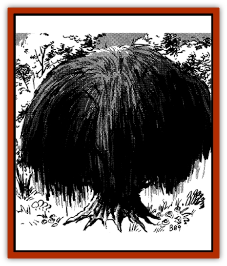

# Plant - Carnivorous - Black Willow

| Statistic | **Plant, Carnivorous, Black Willow** |
| --- | --- |
| **Activity Cycle:** | Any |
| **Alignment:** | Neutral evil |
| **Armor Class:** | 2 |
| **Climate/Terrain:** | Any/Any |
| **Damage/Attack:** | 1-4 |
| **Diet:** | Carnivore |
| **Frequency:** | Very rare |
| **Hit Dice:** | 12-19 |
| **Intelligence:** | Low to Very (5-12) |
| **Magic Resistance:** | Nil |
| **Morale:** | Fearless (19-20) |
| **Movement:** | � |
| **No. Appearing:** | 1 |
| **No. of Attacks:** | 7-12 |
| **Organization:** | Solitary |
| **Size:** | L (6-9' diam. trunk) |
| **Special Attacks:** | Drowsiness aura |
| **Special Defenses:** | Regeneration |
| **THAC0:** | 12 HD: 9 / 13-14 HD: 7 / 15-19 HD: 5 |
| **Treasure:** | Incidental |
| **XP Value:** | Varies |

The black willow is a mobile, sentient tree of evil disposition. It is 90% unlikely that a creature will recognize a black willow as such, for they can alter their trunks and limbs to appear as normal trees of the various willow sorts. Sometimes they will have smooth trunks and broad, inviting limbs. Other times they will show safe-looking trunk cavities at their base or high on their upper trunk. Of course, [[Treant|treants]] can spot black willows instantly, but even druids cannot do so without magical aid (such as *locate plants*, for example).

**Combat:** A black willow's normal attack is with lashing, whiplike branches that cause 1d4 points of damage each, but it has two special attack forms, one of which is generally employed earlier. If a creature has climbed out on a safe-looking limb, the black willow generates an aura of drowsiness within a 20-foot radius, making tired creatures fall into natural sleep. No saving throw is granted for creatures that are already going to sleep (like travelers resting or adventurers camping for the night), but active creatures (like foraging animals and adventurers just passing through) get a saving throw vs. spell to avoid falling asleep. Note that no spell is actually cast, and no offensive action is taken by the black willow during this drowsiness attempt, so characters who save feel slightly tired and then press on. Creatures who fail the saving throw, or who are already tired, do not drop to the ground, but rather feel compelled to stop and rest for a while.

A hole then opens underneath such victims, and one or more of them are taken into a hollow limb. The limb then tilts to slide them into the trunk cavity. The trunk's safe-looking openings are also used to close and trap the victims in the digestive cavity of the trunk.

The stomach is coated with sticky, nonflammable sap. Digestive sap then oozes up from the roots, filling the cavity at a rate of one foot per ten rounds until the entire eight-foot cavity is filled. The juice is acidic and inflicts 1d4 points of damage per round until death occurs. Complete digestion is indicated when the victim reaches -20 or more hit points; any attempt at *resurrection* is thereafter impossible.

Creatures trapped inside the stomach can employ only short, sharp weapons because of the confined space. It's impossible to cast spells from within a black widow, unless the caster is small sized or smaller. Maximum normal damage is only 1 point per round, but magical and Strength bonuses add to this. Therefore, rescue, if any, must usually come from outside.

A black willow regenerates at the rate of 1 point per turn and is immune to electrical attacks only if its roots are grounded firmly.

**Habitat/Society:** Although it usually inhabits areas where normal willows grow, the black willow can be found anywhere a tree is believable, including underground lakes, abandoned ruins, and so forth. A few black willows have been discovered by accident in the sacred groves of druids, but only if the druid has been lax in his duties or has remained away from his sanctum for a very long time (possibly adventuring).

**Ecology:** The black willow gets only a portion of its nourishment from sun, air, water, and earth. The monster is aggressively carnivorous, relishing [[Elf|elves]], [[Gnome|gnomes]], and humans particularly. Treasure of any sort is sometimes found buried beneath this tree monster, along with bones and other immediately indigestible matter. Of course, this assumes victims have treasure that weak acid (+4 bonus to saving throws) could not digest. It also assumes the black willow has stayed in a locale for a period of weeks (very likely unless pickings have been poor recently). It is quite possible that the black willow is either a little-understood offshoot of the treants, or an evil perversion of the [[Quickwood|quickwood]]. Even druids are not sure one way or the other, and they spend many long hours debating such things whenever another black willow is sighted or suspected.

---
## Discovery & Documentation

**Source Publication:** MC11 Forgotten Realms Appendix II (1991)
**Campaign Setting:** Advanced Dungeons & Dragons 2nd Edition
**Author(s):** Tim Beach, Tim Brown, William W. Connors, Dale Donovan, Ed Greenwood, Jeff Grubb, Bruce Heard, Slade Henson, Rob King, Colin McComb, Roger E. Moore, Bruce Nesmith, Jon Pickens, Jean Rabe, Dori Watry, Skip Williams

### Other Creatures Found in This Source Book
   * [[Alaghi|Alaghi]]
   * [[Alguduir|Alguduir]]
   * [[Beguiler|Beguiler]]
   * [[Bird_Toril|Bird (Toril)]]
   * [[Cantobele|Cantobele]]
   * [[Carapace|Carapace]]
   * [[Cat_Toril|Cat (Toril)]]
   * [[Chitine|Chitine]]
   * [[Cildabrin|Cildabrin]]
   * [[Dimensional_Warper|Dimensional Warper]]
   * [[Dragon_Deep|Dragon, Deep]]
   * [[Fachan_Toril|Fachan (Toril)]]
   * [[Fael|Fael]]
   * [[Feyr|Feyr]]
   * [[Firetail|Firetail]]
   * [[Frost|Frost]]
   * [[Gaund|Gaund]]
   * [[Gloomwing|Gloomwing]]
   * [[Golden_Ammonite|Golden Ammonite]]
   * [[Golem_Lightning|Golem, Lightning]]
   * [[Hamadryad|Hamadryad]]
   * [[Harrier|Harrier]]
   * [[Harrla|Harrla]]
   * [[Haun|Haun]]
   * [[Haundar|Haundar]]
   * [[Hendar|Hendar]]
   * [[Inquisitor|Inquisitor]]
   * [[Lhiannan_Shee|Lhiannan Shee]]
   * [[Loxo|Loxo]]
   * [[Manni|Manni]]
   * [[Manscorpion|Manscorpion]]
   * [[Mara|Mara]]
   * [[Morin|Morin]]
   * [[Naga_Dark|Naga, Dark]]
   * [[Orpsu|Orpsu]]
   * [[Plant_Carnivorous_Toril|Plant, Carnivorous (Toril)]]
   * [[Plant_Dangerous_I|Plant, Dangerous I]]
   * [[Ring-Worm|Ring-Worm]]
   * [[Rohch|Rohch]]
   * [[Sand_Cat|Sand Cat]]
   * [[Saurial|Saurial]]
   * [[Sha'az|Sha'az]]
   * [[Silver_Dog|Silver Dog]]
   * [[Simpathetic|Simpathetic]]
   * [[Skuz|Skuz]]
   * [[Spider_Monkey|Spider, Monkey]]
   * [[Tren|Tren]]
