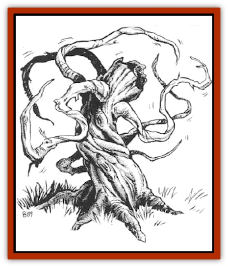

# Plant - Carnivorous - Oerth

| Statistic | **Kampfult** | **Polyp, Giant** |
| --- | --- | --- |
| **Activity Cycle:** | Any | Any |
| **Alignment:** | Neutral (evil) | Neutral (evil) |
| **Armor Class:** | 4 | 6 |
| **Climate/Terrain:** | Any/Subterranean | Any/Subterranean Water |
| **Damage/Attack:** | 1 | 1-2 per tentacle |
| **Diet:** | Carnivore | Carnivore |
| **Frequency:** | Very rare | Very rare |
| **Hit Dice:** | 2 | 7 |
| **Intelligence:** | Low (5-7) | Low (5-7) |
| **Magic Resistance:** | Nil | Nil |
| **Morale:** | Steady (11-12) | Champion (15-16) |
| **Movement:** | 3 | 0 |
| **No. Appearing:** | 1 | 1 |
| **No. of Attacks:** | 6 | 24 |
| **Organization:** | Solitary | Solitary |
| **Size:** | S (stump-like) | L (10' tall) |
| **Special Attacks:** | -3 penaly to opponents surprise | Paralyzation |
| **Special Defenses:** | Nil | Sharp spines |
| **THAC0:** | 19 | 13 |
| **Treasure:** | Incidental | Incidental |
| **XP Value:** | 175 | 2,000 |

These two species of deadly plants are considered to be corrupted offshoots of [[Treant|treants]]. As such, these creatures tend to resemble withered, decrepit old trees of various species common to the local area.

**Kampfult**

  The kampfult, also known as the sinewy mugger, has a rope-like body with a central core that resembles the decayed stump of a cut-down tree.

A kampfult has six attack appendages of about six feet in length and six movement appendages of one foot in length. These are spaced along the four-foot-long, stump-like body segment. Several creatures can be attacked at the same time. Once hit by an appendage, the victim is wrapped up until either the kampfult is slain or the victim frees himself (those with a Strength of 16 of more can free themselves automatically in one round; others must roll a successful Strength check). Only the central section of the creature need be attacked to kill the beast, but severing its tentacles can succeed in rendering a kampfult harmless. Each tentacle requires 2 points of cutting damage to sever and causes 1 point per round of constriction damage. All portions of a kampfult are considered AC 4.

The monster can hold out or pull in its appendages in order to disguise itself, and when doing so it imposes a -3 penalty to its opponents' surprise rolls. The kampfult originally inhabited thick woodlands where it disguised its rope-like body among vines and creepers.

Unsuspecting prey would then be trapped as the kampfult looped its coils of vinelike appendages around the victim, crushing and strangling it to death. Actively hunted down by humans, the few remaining monsters of this kind are now typically found in ruins or dungeons. There, appearing to be ropes or nets, the monsters surprise the unwary.

Kampfults are carnivorous but relatively weak. They prefer to attack small, solitary mammals, as these are usually the most vulnerable and require the least amount of work to secure. A kampfult spends much of its day capturing mice and squirrels for food; it rarely snags anything larger.

The underside of a kampfult's central core is soft and very porous. This portion of the monster is placed directly on top of any killed prey, and the kampfult accelerates the absorption process by spraying a decay catalyst on its food. This catalyst affects nothing but organic tissue, so any incidental treasure left over from deceased victims is always found beneath the stump area of a kampfult.

**Giant Polyp**

  This large, tree-like creature is a semi-sentient, gigantic variety of polyp, similar to a [[Anemone_Giant_Sea|sea anemone]].

Much like the kampfult and other deadly plants, the giant polyp attacks with tentacles attached to a strong central core. Every giant polyp has 24 tentacles with which to attack, but their even placement around the central core makes it impossible for more than three tentacles to attack any man-sized target. Each 15-foot-long tentacle causes 1-2 points of damage when it hits; a saving throw vs. poison must be rolled with a +2 bonus. If the save is failed, the victim is paralyzed for one turn, during which time the monster drags the helpless victim into its huge mouth (located at the very bottom of the trunk, usually concealed). It takes two rounds for the victim to reach the mouth, and five rounds later the victim is completely digested by the immensely powerful digestive agents within.

Each tentacle can receive 4 points of cutting damage before being severed; severed tentacles regenerate fully in 2d6 days. The only way to permanently kill a giant polyp is to attack the trunk, which is protected by hundreds of razorsharp spikes. Any character who engages in melee with the trunk is struck by 1d4 of these spikes, and each spikes causes 1d4 points of damage.

By all accounts, the best way to deal with a giant polyp is by spellcasting, most notably fire spells. All fire-based attacks add 2 to each die of damage rolled. Tentacles suffer damage as well, should a *fireball* or like spell encompass the entire creature.

Giant polyps grow in dark, subterranean chambers filled with pools of dark, stagnant water. Otherwise they conform rather closely to the habits of their distant cousin, the kampfults.

---
## Discovery & Documentation

**Source Publication:** MC5 Greyhawk Appendix (1989)
**Campaign Setting:** Advanced Dungeons & Dragons 2nd Edition
**Author(s):** Grant Boucher, William W. Connors, Steve Gilbert, Bruce Nesmith, Chris Mortika, Skip Williams

### Other Creatures Found in This Source Book
   * [[Aspis|Aspis]]
   * [[Beastman|Beastman]]
   * [[Bonesnapper|Bonesnapper]]
   * [[Booka|Booka]]
   * [[Brownie_Buckawn|Brownie, Buckawn]]
   * [[Brownie_Quickling|Brownie, Quickling]]
   * [[Crystalmist|Crystalmist]]
   * [[Dragon_Cloud|Dragon, Cloud]]
   * [[Dragon_Oerth_Greyhawk|Dragon (Oerth), Greyhawk]]
   * [[Dragonfly_Giant|Dragonfly, Giant]]
   * [[Dragonnel|Dragonnel]]
   * [[Elf_Grugach|Elf, Grugach]]
   * [[Elf_Valley|Elf, Valley]]
   * [[Golem_Necrophidius|Golem, Necrophidius]]
   * [[Grell_Wild|Grell, Wild]]
   * [[Grung|Grung]]
   * [[Hobgoblin_Norker|Hobgoblin, Norker]]
   * [[Hook_Horror|Hook Horror]]
   * [[Horgar|Horgar]]
   * [[Hound_Yeth|Hound, Yeth]]
   * [[Iguana_Giant|Iguana, Giant]]
   * [[Ingundi|Ingundi]]
   * [[Kech|Kech]]
   * [[Kyuss_Son_of|Kyuss, Son of]]
   * [[Mite|Mite]]
   * [[Needleman|Needleman]]
   * [[Plant_Carnivorous_Vampire_Cactus|Plant, Carnivorous, Vampire Cactus]]
   * [[Plasmoid_General_Information|Plasmoid, General Information]]
   * [[Rat_Oerth|Rat (Oerth)]]
   * [[Raven_Crow|Raven/Crow]]
   * [[Scarecrow|Scarecrow]]
   * [[Shadow_Slow|Shadow, Slow]]
   * [[Skulk|Skulk]]
   * [[Snail|Snail]]
   * [[Sprite|Sprite]]
   * [[Taer|Taer]]
   * [[Tentamort|Tentamort]]
   * [[Turtle_Giant|Turtle, Giant]]
   * [[Tyrg|Tyrg]]
   * [[Wolf_Mist|Wolf, Mist]]
   * [[Wraith_Oerth|Wraith (Oerth)]]
   * [[Zygom|Zygom]]
