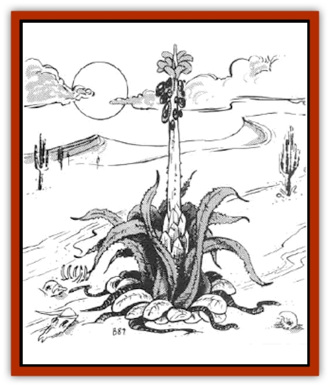

# Plant - Carnivorous - Vampire Cactus

| Statistic | **Plant, Carnivorous, Vampire Cactus** |
| --- | --- |
| **Activity Cycle:** | Any |
| **Alignment:** | Neutral |
| **Armor Class:** | 6 (core), 7 (leaf), 8 (thread) |
| **Climate/Terrain:** | Any/Deserts |
| **Damage/Attack:** | 1-2 &times;12 |
| **Diet:** | Special |
| **Frequency:** | Very rare |
| **Hit Dice:** | 3 (core), 1+1 (leaf), 4 hp (thread) |
| **Intelligence:** | Non- (0) |
| **Magic Resistance:** | Nil |
| **Morale:** | Fanatic (17-18) |
| **Movement:** | 0 |
| **No. Appearing:** | 1-3 |
| **No. of Attacks:** | 12 |
| **Organization:** | Solitary |
| **Size:** | Medium (5-6' tall) |
| **Special Attacks:** | Blood drain |
| **Special Defenses:** | Nil |
| **THAC0:** | 17 |
| **Treasure:** | Incidental |
| **XP Value:** | 650 |

Vampire cacti are plants of the deep desert that supplement their water supply by draining liquids from animals that come within range.

Vampire cacti resemble century plants, with 12 fleshy leaves, each tipped with a sharp needle about one inch long. Sprouting from the plant's central core is a single spike rising to a height of five to six feet. The leaves are about five feet long, but droop toward the ground so the main body of the plant stands about three feet high. The leaves are dusty green with a narrow band of yellow around their margins. The needles on their tips are white. The central spike is golden yellow. Once every midsummer a single small flower blooms at the top of the central spike. This flower is blood-red in color. After this flower has been pollinated, a small blood-red fruit forms. The fruit is moist and sweet-tasting, almost irresistible to most [[Bird|birds]].

The plant itself is rooted to one spot, but it can move its leaves rapidly. Vampire cacti are usually surrounded by the skeletons and drained corpses of warm-blooded denizens of the desert (kangaroo rats, etc.)

**Combat:** The vampire cactus attacks by shooting the needles at the tips of its leaves into its victim. These needles have a range of three yards. They remain attached to the leaves by a thick, rubbery thread that unreels from within the leaf. This thread is the vessel through which the plant drains its victim's bodily fluids.

The needles inflict 1-2 points of damage when they strike. Each subsequent round, the plant drains 1d3 points of liquid (i.e., blood) through each needle that remains in its victim's flesh. The victim can tear free or pull the needles loose, but they are viciously barbed and pulling them out of flesh causes 1d3 points of damage each. The plant can fire all 12 needles simultaneously, but no more than six can be directed at a single target. Any needle that fails to penetrate its target is reeled in and is ready to be fired again by the beginning of the next melee round. Once a target is dead, the plant reels in the needles from that target and readies them to fire at any other victim that presents itself. The plant becomes satiated after draining 50 hit points. When it reaches satiation, it reels in all its needles and does not attack anything again for 48 hours.

The threads connecting the needles to the leaves are AC 8 and can suffer 4 points of damage before being severed. The leaves are AC 7, and each has 1+1 Hit Dice. Damage to threads or leaves does no permanent harm to the plant, since it can regrow a damaged leaf in 1d4+1 days (although destroying a leaf or severing a thread decreases the plant's number of attacks, of course). The only way to kill the plant is to destroy its core. The core is AC 6 and has 3 Hit Dice. Damage done to the leaves doesn't count against this total. Because the core is surrounded by leaves that move, any attack directed at the core has a 75% chance of hitting a leaf instead (providing, of course, that all of the leaves have not already been dealt with).

Vampire cacti are immune to lightning and electrical attacks (they ground the electricity into the desert through their roots). They're very vulnerable to fire, however, and fire-based attacks inflict double damage. Since they have no minds, *sleep*, *charm*, *illusion*, and other mind-affecting spells have no effect.

**Habitat/Society:** Creatures of the Bright Desert, vampire cacti evolved their blood-draining ability to help meet their water needs. Other adaptations to life in the deep desert include the dusty-looking surface of their leaves (to help slow down evaporation), the single small bloom (to minimize water loss), and a conductive root system (vampire cacti are often the tallest objects around, and hence frequently struck by desert lightning). Migrating birds seem to have carried the seeds of vampire cacti to the margins of the Dry Steppes, and even to the forbidden Sea of Dust, because some of these deadly plants are found there.

The only treasures to be found near a vampire cactus are the possessions of any unlucky victims.

**Ecology:** Nothing eats the vampire cactus; its tissue is too tough and bitter (in contrast to its fruit). Anything warm-blooded is a potential victim for the cactus.

---
## Discovery & Documentation

**Source Publication:** MC5 Greyhawk Appendix (1989)
**Campaign Setting:** Advanced Dungeons & Dragons 2nd Edition
**Author(s):** Grant Boucher, William W. Connors, Steve Gilbert, Bruce Nesmith, Chris Mortika, Skip Williams

### Other Creatures Found in This Source Book
   * [[Aspis|Aspis]]
   * [[Beastman|Beastman]]
   * [[Bonesnapper|Bonesnapper]]
   * [[Booka|Booka]]
   * [[Brownie_Buckawn|Brownie, Buckawn]]
   * [[Brownie_Quickling|Brownie, Quickling]]
   * [[Crystalmist|Crystalmist]]
   * [[Dragon_Cloud|Dragon, Cloud]]
   * [[Dragon_Oerth_Greyhawk|Dragon (Oerth), Greyhawk]]
   * [[Dragonfly_Giant|Dragonfly, Giant]]
   * [[Dragonnel|Dragonnel]]
   * [[Elf_Grugach|Elf, Grugach]]
   * [[Elf_Valley|Elf, Valley]]
   * [[Golem_Necrophidius|Golem, Necrophidius]]
   * [[Grell_Wild|Grell, Wild]]
   * [[Grung|Grung]]
   * [[Hobgoblin_Norker|Hobgoblin, Norker]]
   * [[Hook_Horror|Hook Horror]]
   * [[Horgar|Horgar]]
   * [[Hound_Yeth|Hound, Yeth]]
   * [[Iguana_Giant|Iguana, Giant]]
   * [[Ingundi|Ingundi]]
   * [[Kech|Kech]]
   * [[Kyuss_Son_of|Kyuss, Son of]]
   * [[Mite|Mite]]
   * [[Needleman|Needleman]]
   * [[Plant_Carnivorous_Oerth|Plant, Carnivorous (Oerth)]]
   * [[Plasmoid_General_Information|Plasmoid, General Information]]
   * [[Rat_Oerth|Rat (Oerth)]]
   * [[Raven_Crow|Raven/Crow]]
   * [[Scarecrow|Scarecrow]]
   * [[Shadow_Slow|Shadow, Slow]]
   * [[Skulk|Skulk]]
   * [[Snail|Snail]]
   * [[Sprite|Sprite]]
   * [[Taer|Taer]]
   * [[Tentamort|Tentamort]]
   * [[Turtle_Giant|Turtle, Giant]]
   * [[Tyrg|Tyrg]]
   * [[Wolf_Mist|Wolf, Mist]]
   * [[Wraith_Oerth|Wraith (Oerth)]]
   * [[Zygom|Zygom]]
