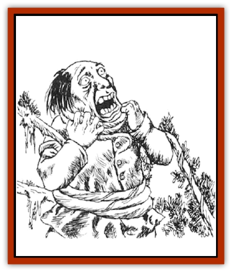

# Plant - Dangerous I

| Statistic | **Choke Creeper** | **Mantrap** | **Retch Plant** | **Snappersaw** | **Thornslinger** | **Tri-flower Frond** | **Yellow Musk Creeper** | **Yellow Musk Zombie** |
| --- | --- | --- | --- | --- | --- | --- | --- | --- |
| **Activity Cycle:** | Day | Day | Any | Any | Any | Day | Any | Any |
| **Alignment:** | Neutral | Neutral | Neutral | Neutral | Neutral | Neutral | Neutral | Neutral |
| **Armor Class:** | 6/5 | 6 | 8 | 4/7/9 | 8 | 9 | 7 | 10 or better |
| **Climate/Terrain:** | Temperate forest | Tropical hills or forest | Any warm land | Any land | Any land | Tropical forest | Temperate forest or subterranean | Temperate forest or subterranean |
| **Damage/Attack:** | 1-4 | Nil | Nil | 2-5 | 2-8 | Nil | Nil | 1-8 or by weapon |
| **Diet:** | Carnivore | Carnivore | Sun, soil | Carnivore | Carnivore | Carnivore | Carnivore | Nil |
| **Frequency:** | Rare | Very rare | Rare | Very rare | Rare | Very rare | Rare | Rare |
| **Hit Dice:** | 25 | 4-9 | 5-8 | 5 | 4 | 2+8 | 3 | 2 (special) |
| **Intelligence:** | Non- (0) | Non- (0) | Non- (0) | Non- (0) | Non- (0) | Non- (0) | Non- (0) | Animal (1) |
| **Magic Resistance:** | Nil | Nil | Nil | Nil | Nil | Nil | Nil | Nil |
| **Morale:** | Elite (14) | Steady (12) | Average <nobr>(8-10)</nobr> | Steady <nobr>(11-12)</nobr> | Average <nobr>(8-10)</nobr> | Average (10) | Fearless (20) | Fearless (20) |
| **Movement:** | ½ | 0 | 0 | 0 | 0 | 0 | 0 | 6 |
| **No. Appearing:** | 1 | 1-2 | 2-20 | 1-2 | 3-12 | 1-10 | 1 | 1 per 2 flowers |
| **No. of Attacks:** | 8 or more | 0 | 1 or 1d4+1 | 1d4+2 | 1 volley | 1 | 2-12 | 1 |
| **Organization:** | Solitary | Pair | Cluster | Solitary | Cluster | Stand | Solitary | Squad |
| **Size:** | G (20-160' long) | L-G (4' per Hit Die) | H (20' tall) | H (15' radius) | M (4' radius) | M (5-8' tall) | L (20' square) | M (4-7' tall) |
| **Special Attacks:** | Strangling | See below | See below | Trapping | Dew | See below | Pollen | Nil |
| **Special Defenses:** | See below | Nil | See below | Nil | Nil | Nil | Immunities | Immunities |
| **THAC0:** | 7 | Nil | 5-6 HD: 15 / 7-8 HD: 13 | 15 | Nil | 17 | 17 | 19 |
| **Treasure:** | Nil | J-N &times;5,Q | Nil | Nil | Nil | Nil | B | Nil |
| **XP Value:** | 18,000 | 4 HD: 650 / 5 HD: 975 / 6 HD: 1,400 / 7 HD: 2,000 / 8 HD: 3,000 / 9 HD: 4,000 | 5 HD: 270 / 6 HD: 420 / 7 HD: 650 / 8 HD: 975 | 3 saws: 270 / 4-5 saws: 420 / 6 saws: 975 | 270 | 420 | 650 | 120 |

Of the many hazards in the wilds, these plants are among the most frightening. They feed on animals, perhaps as nature's revenge on animals for their habit of feeding on plants.

**

Choke Creeper**

  The choke creeper, or strangler vine, is a long, thick vine with many branch vines, each capable of attacking. The vine is olive green in color, and the main vine is almost 1-2 feet thick. Branch vines have flexible tendrils, allowing them to creep at 5 yards per round. They are attracted to light and heat.

For each 20 feet of main vine, it has the 1 hp per HD; branch vines have 2 hp per 20 feet of the main vine (branch vine hit points are in addition to those of the main vine, not part of the total). In each 10-foot section of the main vine, there are four branch vines. The smallest choke creeper is 20 feet long, has 1 hp/HD (25 hp total), and has eight branch vines, each with 2 hp. The largest choke creeper is 160 feet long, has 8 hp/HD (200 hp total), and has 64 branch vines, each with 16 hp. The main vine is AC 6, the branches AC 5.

A maximum of four branch vines can attack a single target. They appear to be normal vegetation and can usually grab unsuspecting victims. Victims can break free with a successful bend bars/lift gates roll; if the roll fails, they are held fast until the vine that holds them is severed. Seized victims suffer 1d4 points of damage per round, with a 10% chance per round (non-cumulative) that the choke creeper achieves a strangling grip. The victim dies after one round of strangulation.

A choke creeper is immune to torch fire, but takes normal damage from hotter fires such as those caused by burning oil; hot fires make the vine move away. The creeper takes only 1 hp damage per die of cold damage, but cold stuns the all plant sections struck for 1d4+1 rounds. Electrical attacks do no damage; instead, they double the creeper's movement rate for 1d4+1 rounds.

**Mantrap**

  This insidious relative of the much smaller Venus flytrap attracts prey by scent, entrapping and dissolving its victims in acidic secretions. It is a gigantic bush with towering stalks of purple blossoms, and huge green leaves at ground level.

During daylight hours the mantrap releases pollen continuously; all creatures who approach to within 60 feet must make a successful saving throw vs. poison or become attracted to the odor. Those attracted proceed to the body and voluntarily climb into one of the 1d4+1 leaf traps on the plant. Once entered, a leaf trap closes, firmly entrapping the victim (no chance of escape). The victim cannot be pulled free until the plant is destroyed. Its acidic secretions destroy the victim quickly, inflicting damage per round equal to the victim's AC (discounting Dexterity bonuses). Regardless of the adjusted AC, the victim takes at least 1 point of damage per round. Items exposed to the acid must roll a saving throw once per round against the effects; all metal items receive a +2 bonus.

The fascination with the mantrap is so strong that, once a being is enthralled, it takes 24 hours for the effect to wear off. The fumes from burning the plant counteract the effect. Because of its powerful attractive ability, the nectar of mantrap flowers is an ingredient in a *philter of love*.

**Retch Plant**

  The retch plant, or globe palm, appears to be a typical palm tree, except that each always has 1d4+4 globe-like, coconut-sized fruit growing at its top. Each globe is membranous, taut, and blue, violet, or lilac in color.

Walking under a retch plant makes it 20% likely that one of the globes will fall. If there is solid contact against the tree trunk (banging against it, running into it, or climbing it) 1d4+1 of the noisome fruits plop down. Randomly choose the target attacked; they are AC 10 against this attack. When the globes strike, they burst, and a nauseating fluid is splashed over a 5-foot radius. Those 5-9 feet from the impact have a 25% chance of being splashed. The sticky, foul fluid causes creatures to vomit and retch for the next three rounds. In addition to being nauseated, victims are at half normal Strength for one hour. No saving throw is allowed against either effect of the fluid.

Creatures splashed must be washed in alcohol (including drinkable types) or they are more likely to attract carnivores in the area, doubling the frequency and chance for success of encounter checks. The odor is discernible within a 50-foot radius, and it persists for 1d4 hours unless removed as above.

**Snapper-Saw**

  This plant, also called foresters' bane, has a central bush with several greenish-white berries that are plump, smell delicious, edible, nutritious, and rich in protein. Several broad, dark green, ribbed leaves radiate out 5-7 feet from the bushy center, which hides 1d4+2 tough, purple, saw-like stalks with thorny projections. A healthy plant has six saw-stalks, while damaged specimens have less.

Creatures stepping into the radius of the low-growing ribbed leaves risk attack. The leaves snap up one or two victims; armor is ignored for this attack, though dexterity and magical bonuses to AC are counted. A victim must make a successful Strength check to pull free.

A creature caught by the snapper leaves is attacked by the saw-stalks, even if the victim breaks free in the same round in which it was caught. Each saw-stalk attacks once per round for 1d4+1 points of damage, shredding the victim so its flesh and blood feed the snapper-saw. Clutched prey does not receive Dexterity adjustments to AC, though armor and magical protection apply normally.

Saw-stalks are AC 4 and require 1d8+16 points of damage a piece to sever. Each snapper leaf is AC 7 and takes 1d8+8 points of damage to sever. These hit points do not count toward the total of the central bush's Hit Dice. The central bush is AC 9, but it is completely protected from outside attack when the snapper leaves are up. A victim held by the snapper leaves can attack the saw-stalks or the central bush, but only with small piercing weapons. Lost leaves and stalks grow back in 2d4 weeks unless the central plant is slain.

**Thornslinger**

  Thornslingers are carnivorous, spidery, white plants with dew-covered, pale yellow blossoms. They average about 8 feet in diameter and lie very close to the ground.

Thornslingers attack living creatures by firing thorns. Each thorn has a range of 30 feet and causes 1 point of damage. Since a large number of thorns are shot in a spread pattern at intended targets, being hit by one or more thorns is automatic. Damage from the thorns is 2d4 to any creature within 30 feet, once per round. They have virtually inexhaustible supplies of thorns, and are found in close clusters. Since the shower of thorns is their only defense, thornslingers are often found in out-of-the-way places, such as pits or inaccessible caves, or growing on brick and stone walls.

The leaves and central stem of a thornslinger are covered with a strong adhesive sap. Those who touch it are held fast if they have Strength 13 or less, until they are freed or digested. Characters with Strength 13 or greater can break free in 1d4 rounds. Once a victim is caught by the dew, the thornslinger secretes digestive acids, causing 1-3 hp damage per round.

Thornslingers are not very flammable, but flame causes normal damage. Open flame is extinguished after one round and oil burns for only two rounds.

**Tri-flower Frond**

  The deep green stalks of this plant are topped by trumpet-shaped flowers of vivid orange, bright yellows, and intense red; other color combinations are possible, but rare.

Each flower has its own function. The orange one shoots 2d4 pollen-covered tendrils, each 3 feet long; any creature struck must make a successful saving throw vs. poison or fall into a coma for 1d4 hours. The plant's sensitive rootlets tell the yellow blossom where to find the slumbering victim; the yellow bloom bends over and shakes down a shower of sticky enzyme that causes 2d4 points of damage per round until washed off (damage is reduced by 1 point per flask of water; complete immersion in water removes the sap in one round). The red blossom extends tendrils into the victim, draining body fluids at a rate of 1d6 points of damage per round.

**Yellow Musk Creeper and Zombie**

  The yellow musk creeper is a plant that attacks humanoids, draining Intelligence and turning them into yellow musk zombies. Both creeper and zombie are immune to charm, hold, illusion, sleep, and other mind-affecting attacks.

The creeper is a large, light green climbing plant with leaves like ivy, 1d4 dark green buds, and 2d6 bright yellow flowers with splashes of purple. It can cover an area up to 20 feet square from its single bulbous root. Damage done to the plant is disregarded unless the root is attacked, for the vine eventually grows back from the main root. The creeper has a sweet, entrancing odor while dormant.

Creepers are dormant until a creature approaches within 10 feet; then the nearest flowers turn toward the prey and puff musky pollen. A victim hit by the pollen must make a successful saving throw vs. spell or be entranced and walk toward the plant, resisting all those who try to prevent it. When the victim reaches the creeper, a green bulb extends its roots into the victim's head, and reach the brain in two rounds. The victim loses 1d4 points of Intelligence per round after that.

A victim reduced to 0 Intelligence or less dies instantly; a victim reduced to Intelligence 1 or 2 becomes a yellow musk [[Zombie|zombie]] under the creeper's control. If the plant dies before reducing its prey to zombie status, 1 point of Intelligence is regained per day, or a heal spell will restore lost Intelligence instantly. If the mother plant is destroyed first, a zombie can be cured by a neutralize poison followed by a heal spell and four weeks of complete rest.

Only man-sized humanoids become yellow musk zombies; the creeper can control one zombie for every two flowers. A zombie acquires yellow skin and a glazed look, but otherwise looks as it did before, wearing the same clothes and armor and wielding any weapon it had held at the time of its conversion. It has the same hit points as before, but attacks as a 2 HD monster. It can cast no spells, nor receive bonuses for high ability scores. The zombie can move up to 100 feet from the creeper. Yellow musk zombies are not true undead and cannot be turned. A zombie serves the creeper for about two months before moving off at least 200 feet and dying; the seedling that has been growing in its head quickly sprouts, flowers, and becomes a new creeper.

---
## Discovery & Documentation

**Source Publication:** MC2 Volume II (1993)
**Campaign Setting:** Advanced Dungeons & Dragons 2nd Edition
**Author(s):** Jay Batista, Scott Bennie, Grant Boucher, William W. Connors, Steve Gilbert, Heike Kubasch, James Lowder, David Edward Martin, Bruce Nesmith, Jean Rabe, Rick Swan, John J. Terra, Gary L. Thomas

### Other Creatures Found in This Source Book
   * [[Ant|Ant]]
   * [[Ant_Lion_Giant|Ant Lion, Giant]]
   * [[Ape_Carnivorous|Ape, Carnivorous]]
   * [[Baboon|Baboon]]
   * [[Badger|Badger]]
   * [[Barracuda|Barracuda]]
   * [[Beetle_Giant|Beetle, Giant]]
   * [[Bulette|Bulette]]
   * [[Bullywug|Bullywug]]
   * [[Dwarf_Duergar|Dwarf, Duergar]]
   * [[Dwarf_Gully|Dwarf, Gully]]
   * [[Eagle|Eagle]]
   * [[Eel|Eel]]
   * [[Elemental_Air_Kin|Elemental, Air Kin]]
   * [[Elemental_Water_Kin|Elemental, Water Kin]]
   * [[Elemental_Water_Kin_Water_Weird|Elemental, Water Kin, Water Weird]]
   * [[Firestar|Firestar]]
   * [[Firetail|Firetail]]
   * [[Fish_Giant|Fish, Giant]]
   * [[Frog|Frog]]
   * [[Gorgon|Gorgon]]
   * [[Hawk|Hawk]]
   * [[Heucuva|Heucuva]]
   * [[Hippocampus|Hippocampus]]
   * [[Hippogriff|Hippogriff]]
   * [[Kelpie|Kelpie]]
   * [[Kenku|Kenku]]
   * [[Killmoulis|Killmoulis]]
   * [[Kuo-Toa|Kuo-Toa]]
   * [[Lamia|Lamia]]
   * [[Lammasu|Lammasu]]
   * [[Lamprey|Lamprey]]
   * [[Leech|Leech]]
   * [[Leprechaun|Leprechaun]]
   * [[Leucrotta|Leucrotta]]
   * [[Locathah|Locathah]]
   * [[Lycanthrope_Wereboar|Lycanthrope, Wereboar]]
   * [[Lycanthrope_Werefox|Lycanthrope, Werefox]]
   * [[Mammal_Minimal|Mammal, Minimal]]
   * [[Mammal_Small|Mammal, Small]]
   * [[Mimic|Mimic]]
   * [[Morkoth|Morkoth]]
   * [[Muckdweller|Muckdweller]]
   * [[Myconid|Myconid]]
   * [[Naga|Naga]]
   * [[Obliviax|Obliviax]]
   * [[Octopus_Giant|Octopus, Giant]]
   * [[Otyugh|Otyugh]]
   * [[Piranha|Piranha]]
   * [[Plant_Intelligent|Plant, Intelligent]]
   * [[Poltergeist|Poltergeist]]
   * [[Porcupine|Porcupine]]
   * [[Rat_Osquip|Rat, Osquip]]
   * [[Roc|Roc]]
   * [[Roper|Roper]]
   * [[Rot_Grub|Rot Grub]]
   * [[Rust_Monster|Rust Monster]]
   * [[Sahuagin|Sahuagin]]
   * [[Sea_Lion|Sea Lion]]
   * [[Sea_Horse_Giant|Sea Horse, Giant]]
   * [[Shambling_Mound|Shambling Mound]]
   * [[Shark|Shark]]
   * [[Sphinx|Sphinx]]
   * [[Squid_Giant|Squid, Giant]]
   * [[Stirge|Stirge]]
   * [[Swanmay|Swanmay]]
   * [[Tarrasque|Tarrasque]]
   * [[Tasloi|Tasloi]]
   * [[Triton|Triton]]
   * [[Troglodyte|Troglodyte]]
   * [[Urchin|Urchin]]
   * [[Urd|Urd]]
   * [[Weasel|Weasel]]
   * [[Wolverine|Wolverine]]
   * [[Yellow_Musk_Creeper|Yellow Musk Creeper]]
