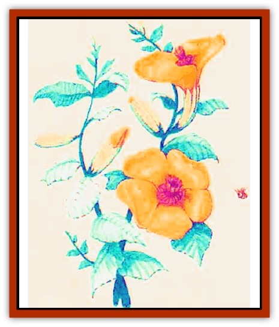
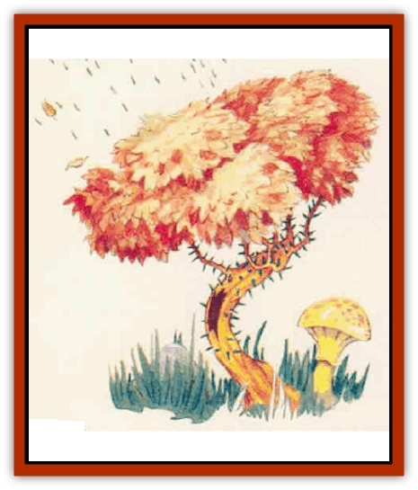
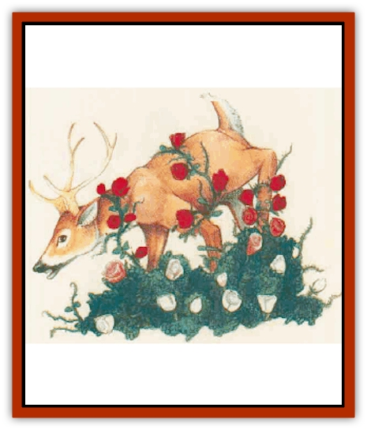

# Plant - Dangerous - Mystara

| Statistic | **Amber Lotus** | **Archer bush** | **Grab Grass** | **Vampire Rose** |
| --- | --- | --- | --- | --- |
| **Activity Cycle:** | Day | Day | Day | Any |
| **Alignment:** | Neutral | Neutral | Neutral | Neutral |
| **Armor Class:** | 9 | 7 | 9 | 7 |
| **Climate/Terrain:** | Temperate to tropical forests, jungles, and swamps | Temperate plains or forests | Nonarctic plains and hills | Temperate or subtropical swamps, plains, and ruins |
| **Damage/Attack:** | Nil | 1d4 (thorn spray) | Special | 1d8 (thorn lash) |
| **Diet:** | Soil, water | Carnivore | Carnivore | Carnivore |
| **Frequency:** | Rare | Rare | Common | Rare |
| **Hit Dice:** | 1-4 hit points | 2 | 1 per 5' square | 4 |
| **Intelligence:** | Non- (0) | Non- (0) | Non- (0) | Non- (0) |
| **Magic Resistance:** | Nil | Nil | Nil | Nil |
| **Morale:** | Steady (12) | Steady (12) | Steady (12) | Steady (12) |
| **Movement:** | Nil | 3 | 3 | 3 |
| **No. Appearing:** | 3d6 | 1d20 | 1 patch | 1d8 |
| **No. of Attacks:** | 0 | 1 | 0 | 1 |
| **Organization:** | Solitary | Solitary | Solitary | Solitary |
| **Size:** | T (6&rdquo; diameter) | S (3' tall) | S-M(3-5' tall) | S (3-4' tall) |
| **Special Attacks:** | Sleep pollen | Nil | Grab | Blood drain |
| **Special Defenses:** | Nil | Nil | Nil | Nil |
| **THAC0:** | Nil | 19 | Nil | 17 |
| **Treasure:** | Nil | V | Nil | Nil |
| **XP Value:** | 15 | 35 | 85 | 175 |

Mystara is home to a number of hostile plants. Most are innocent in appearance, and the majority of characters will not be able to identify them. Characters who encounter a hostile plant gain the ability to identify that species in the future.

If desired, a DM may allow druids to identify dangerous plants before stumbling into them. This should involve an ability check or other die roll; the identification process should not be error free. As a guideline, most druids should be able to identify such plants with a Wisdom check made at 50%. In addition, PCs with the Herbalism proficiency may be able to identify such plants with a proficiency check made at 50%.

**Amber Lotus**

  These flowers look like golden water lilies as large as sunflowers growing in calm ponds or swamps; some varieties grow on vines that creep up tree trunks. Their attractive appearance and serene setting is deceptive to the viewer, giving no clue as to the flower's true nature.

The amher lotus flower responds to ground vibrations. When a creature approaches within 10 feet of the plant, its blossoms open, each spraying a cloud of pollen 40 feet in diameter. Any individual within the flower's pollen cloud must make a successful saving throw vs. poison or fall fast asleep for 4d4 turns. Nothing can wake the victim sooner.

The flowers can spray a fresh burst of pollen every 3d4 rounds. Creatures that are resistant to sleep and charm spells (such as [[Elf|elves]], [[Elf_Half-|half-elves]], and [[Pegataur|pegataurs]]) are equally resistant to the pollen of the amber lotus flower.

Amber lotus flowers get their nutrition in the same way as normal plants; no unusual conditions are required for its health. The pollen spray is a defense mechanism to protect the flower from potential threats. Amber lotus flowers are often found groing with other deadly plants such as vampire roses, archer bushes, or killer trees. The amber lotus flower enjoy a symbiotic relationship with these, and other floral predators. The amber lotus flower incapacitates a victim, the other plants than kill it, and all benefit from fertilization resulting from the victim's remains.

Some humans and other intelligent creatures may cultivate this flower for protection around homes, forbidden places, temples, and so forth. Druids and elves sometimes use the amber lotus flower to guard sacred worship sites, and are rumored to somehow train the plants to spray pollen only on strangers who trespass.

The sleep pollen is prized by alchemists for sleep powders and even poisonous sleep salve that can be smeared on a weapon. A dozen amber lotus flowers are required to make enough sleep poison to fill one vial; such a vial contains enough salve to coat one short sword or the equivalent.

**

Archer Bush**

  Archer bushes have sickly green and brown leaves, stunted trunks, and thorny brown branches. They resemble common wild bramble bushes. Archer bushes are commonly found in woodlands, scrub areas, and occasionally in mountains.

Archer bushes are carnivorous. They attack by shooting a spray of small thorns at a victim, inflicting 1d4 hit points of damage per spray. The range of the spray is 20 feet. Each bush can fire up to three such sprays per day. The archer bush can uproot itself and move toward stricken prey. The trunk of an archer bush appears to be buried within a 3-foot-high pile of leaves and twigs. This debris actually conceals a huge mouth filled with hard thorns that are used to devour disabled prey. The mouth is never used in combat.

Archer bushes sense targets by ground vibrations; thus, they can fire at invisible or otherwise camouflaged victims. Only creatures who approach in flight are spared an attack.

Clumps of archer bushes commonly fire in concert, as if cooperating in a primitive way, but this cooperation is based mostly on instinct. Encountering a single archer bush is rarely a great threat; a group of archer bushes, however, can be deadly. Druids sometimes cultivate and train archer bushes to guard their holy sites.

**Grab Grass**

  Ranging 3 to 5 feet in height, grab grass looks like ordinary tall grass. Grab grass is able to move, and often gives the impression of swaying in a breeze.

The grass attacks by wrapping long tendrils around unsuspecting victims and strangling them. The strangling process drains one point of Constitution from a victim each round. A victim who reaches 0 Constitution dies. The decomposing body then feeds the plant. Victims who escape the grass regain one point of Constitution per turn of rest.

A victim can break free from grab grass with a successful bend bars roll.

A grab grass patch has 1 Hit Die for every 5-foot square of area, and each Hit Die is worth a full 8 hit points. A 5-foot by 5-foot square of grass is mutilated into death for every 8 points of damage done to the grass.

Since the grass sways of its own volition, PCs looking in the direction of the grass may notice its swaying in absence of a breeze. The DM may allow an ability check against Intelligence or Wisdom (whichever is higher) in order for the character to notice that somedung is not quite right.

**

Vampire Rose**

  Vampire roses appear as bushes of white roses of extraordinary beauty. A single rose bush has 4 Hit Dice. An average of 2d12 roses are on each bush, although the number of blooms does not affect the bush's abilities.

Despite their innocuous appearance, vampire roses can uproot themselves and move about slowly in search of prey.

The thorny stalks of the vampire rose are whipped at victims to inflict 1d8 points of damage. The thorns are hollow, and once the stalk has struck successfully, the vampire rose automatically drains blood in subsequent rounds, causing 1d8 points of damage each round.

While the thorns perform this gruesome task, the rose blossoms emit a hypnotic fragrance. Victims must make a successful saving throw vs. spell or lose all will to fight, allowing the plant to drain blood until the victim dies.

A clear-headed victim can break the vampire rose's grip with a successful open doors roll. Freeing oneself causes an additional 1d8 hit points of damage as the victim's flesh is ripped by the thorns.

If any portion of a vampire rose is successfully severed while it drains a victim's blood, the flower lets out a horrifymg shriek and blood sprays out of the cut stalk. Any character of less than 5th level who witnesses this for the first time must make a saving throw vs. poison or be struck with fear as per the spell. Subsequent attacks on the flower have the same effect, but a viewer who has succeeded a saving throw need not roll again.

After a victim is completely drained of blood, the vampire rose's petals turn from pure white to blood red.

Vampire roses are often found in old graveyards. Not surprisingly, some of the flowers can be found near the crypts of [[Vampire_General_Information|vampires]].

---
## Discovery & Documentation

**Source Publication:** Mystara Appendix (1994)
**Campaign Setting:** Mystara
**Author(s):** John Nephew, Teeuwynn Woodruff, John Terra, Skip Williams

### Other Creatures Found in This Source Book
   * [[Actaeon|Actaeon]]
   * [[Agarat|Agarat]]
   * [[Ash_Crawler|Ash Crawler]]
   * [[Baldandar|Baldandar]]
   * [[Bargda|Bargda]]
   * [[Bhut|Bhut]]
   * [[Bird_Mystara|Bird (Mystara)]]
   * [[Blackball|Blackball]]
   * [[Choker|Choker]]
   * [[Coltpixie|Coltpixie]]
   * [[Crone_of_Chaos|Crone of Chaos]]
   * [[Darkhood|Darkhood]]
   * [[Darkwing|Darkwing]]
   * [[Decapus|Decapus]]
   * [[Deep_Glaurant|Deep Glaurant]]
   * [[Diabolus|Diabolus]]
   * [[Dimensional_Warper|Dimensional Warper]]
   * [[Dragon_Mystara_Crystalline|Dragon (Mystara), Crystalline]]
   * [[Dragon_Mystara_Jade|Dragon (Mystara), Jade]]
   * [[Dragon_Mystara_Onyx|Dragon (Mystara), Onyx]]
   * [[Dragon_Mystara_Ruby|Dragon (Mystara), Ruby]]
   * [[Drake_Mystara|Drake (Mystara)]]
   * [[Dragonfly|Dragonfly]]
   * [[Dusanu|Dusanu]]
   * [[Elemental_of_Chaos_Air_Earth|Elemental of Chaos, Air/Earth]]
   * [[Elemental_of_Chaos_Fire_Water|Elemental of Chaos, Fire/Water]]
   * [[Elemental_of_Law_Air_Earth|Elemental of Law, Air/Earth]]
   * [[Elemental_of_Law_Fire_Water|Elemental of Law, Fire/Water]]
   * [[Familiar_Mystara|Familiar (Mystara)]]
   * [[Frost_Salamander|Frost Salamander]]
   * [[Fundamental_Air_Earth|Fundamental, Air/Earth]]
   * [[Fundamental_Fire_Water|Fundamental, Fire/Water]]
   * [[Gargantua_Mystara|Gargantua (Mystara)]]
   * [[Geonid|Geonid]]
   * [[Ghostly_Horde|Ghostly Horde]]
   * [[Giant_Athach|Giant, Athach]]
   * [[Giant_Hephaeston|Giant, Hephaeston]]
   * [[Golem_Drolem|Golem, Drolem]]
   * [[Golem_Mystara_I|Golem (Mystara) I]]
   * [[Golem_Mystara_II|Golem (Mystara) II]]
   * [[Golem_Mystara_III|Golem (Mystara) III]]
   * [[Gray_Philosopher|Gray Philosopher]]
   * [[Guardian_Warrior|Guardian Warrior]]
   * [[Gyerian|Gyerian]]
   * [[Herex|Herex]]
   * [[Hivebrood|Hivebrood]]
   * [[Horde|Horde]]
   * [[Hsiao|Hsiao]]
   * [[Huptzeen|Huptzeen]]
   * [[Hutaakan|Hutaakan]]
   * [[Imp_Mystara|Imp (Mystara)]]
   * [[Jellyfish_Giant_Mystara|Jellyfish, Giant (Mystara)]]
   * [[Kna|Kna]]
   * [[Kopru|Kopru]]
   * [[Lizard_Mystara|Lizard (Mystara)]]
   * [[Lizard-kin_Mystara|Lizard-kin (Mystara)]]
   * [[Lupin|Lupin]]
   * [[Lycanthrope_Werejaguar_Mystara|Lycanthrope, Werejaguar (Mystara)]]
   * [[Lycanthrope_Wereswine|Lycanthrope, Wereswine]]
   * [[Magen|Magen]]
   * [[Manikin|Manikin]]
   * [[Mek|Mek]]
   * [[Mujina|Mujina]]
   * [[Nagpa|Nagpa]]
   * [[Neh-thalggu|Neh-thalggu]]
   * [[Nightshade_Mystara|Nightshade (Mystara)]]
   * [[Nuckalavee|Nuckalavee]]
   * [[Pegataur|Pegataur]]
   * [[Phanaton|Phanaton]]
   * [[Plasm|Plasm]]
   * [[Rakasta|Rakasta]]
   * [[Rock_Man|Rock Man]]
   * [[Sabreclaw|Sabreclaw]]
   * [[Sacrol|Sacrol]]
   * [[Scamille|Scamille]]
   * [[Shapeshifter|Shapeshifter]]
   * [[Shargugh|Shargugh]]
   * [[Shark-kin|Shark-kin]]
   * [[Sollux|Sollux]]
   * [[Spectral_Death|Spectral Death]]
   * [[Spectral_Hound|Spectral Hound]]
   * [[Spider-kin|Spider-kin]]
   * [[Spirit_Mystara|Spirit (Mystara)]]
   * [[Statue_Living|Statue, Living]]
   * [[Surtaki|Surtaki]]
   * [[Tabi|Tabi]]
   * [[Thoul|Thoul]]
   * [[Thunderhead|Thunderhead]]
   * [[Tiger_Ebon|Tiger, Ebon]]
   * [[Topi|Topi]]
   * [[Tortle|Tortle]]
   * [[Vampire_Velya|Vampire, Velya]]
   * [[White_Fang|White Fang]]
   * [[Worm_Mystara|Worm (Mystara)]]
   * [[Wyrd|Wyrd]]
   * [[Yowler|Yowler]]
   * [[Zombie_Lightning|Zombie, Lightning]]
