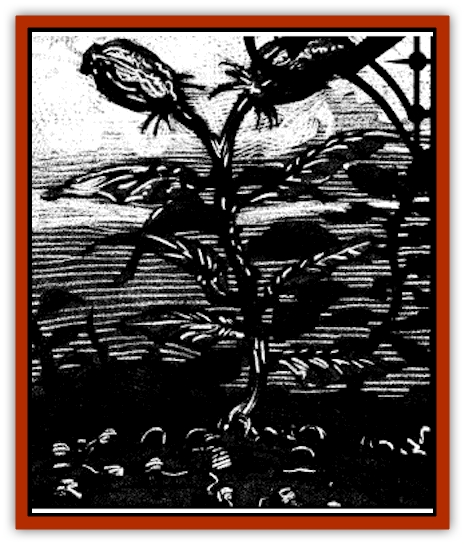

# Plant - Fearweed

| Statistic | **Plant, Fearweed** |
| --- | --- |
| **Activity Cycle:** | Any |
| **Alignment:** | Neutral |
| **Armor Class:** | 10 |
| **Climate/Terrain:** | Ravenloft core domains |
| **Damage/Attack:** | Nil |
| **Diet:** | Carrion |
| **Frequency:** | Uncommon |
| **Hit Dice:** | 1 |
| **Intelligence:** | Nil |
| **Magic Resistance:** | Nil |
| **Morale:** | Nil |
| **Movement:** | 0 |
| **No. Appearing:** | 2-20 (2d10) |
| **No. of Attacks:** | Nil |
| **Organization:** | Patch |
| **Size:** | S (2' tall) |
| **Special Attacks:** | Cause fear |
| **Special Defenses:** | Nil |
| **THAC0:** | 20 |
| **Treasure:** | R |
| **XP Value:** | 120 |

Fearweeds are terrible plants that use mind-numbing terror and confusion to defend themselves. Anyone exposed to their pollen risks confrontation with nightmares worse than any they have ever imagined.

These strange horrors look like a milkweed plant and are indistinguishable from them by anyone but druids and rangers. In both cases, white flowers and broad green leaves top a short, thick stem. The only real difference is in the weed's root structure. Fearweed has a much broader system composed of spongy fibers designed to soak up the blood and decayed nutrients of those who fall prey to its manipulations.

Like nearly all plants, fearweed has no ability to communicate.

**Combat:** The extensive root system of the fearweed plant serves to alert it to the proximity of living creatures. Whenever an animal (including humans and the like) comes within 20 feet of it, the fearweed releases a cloud of invisible and odorless gas. These vapors quickly form a cloud that surrounds the plant at a distance of roughly 20 feet. Any creature within this cloud must make a saving throw vs. poison with a -2 penalty. Those who fail this roll are overcome with paranoid fear. Friends become evil [[Doppelganger_Ravenloft|doppelgangers]], trees become twisted and evil terrors, and every dark shadow contains threatening horrors. Few things make sense to the victim any more, but it is clear that anything moving is a threat.

*Dispel magic* will not cure the effects of the gas, but *remove curse* or *neutralize poison* will. Also, whenever a character falls unconscious or dies, all companions may attempt a second saving throw to realize just what has occurred. Characters who succeed in this secondary attempt become shaken and act as if hit by the *confusion* spell.

**Habitat/Society:** Fearweed originated in harsh climes where the soil was nutrient-poor. Instead of developing mobility and other carnivorous traits, fearweed instead sought to cause creatures to die and decay in its vicinity. In this way, their nutrients seep into the soil where the hungry plant can collect it.

Over time, fearweeds were transplanted throughout the realm, but retained their deadly method of enriching the environment.

[[Lich|Liches]], powerful undead, or other creatures immune to biological phenomenons often cultivate patches of fearweed around their lair to keep out intruders.

**Ecology:** Fearweeds multiply by producing pollen from their flowers. Strangely, milkweeds have occasionally been known to turn into fearweeds, possibly after being fertilized by insects carrying fearweed pollen. Most realms in Ravenloft have milkweeds, so there is a 5% chance that any patch of overgrown area will develop fearweeds as well. This usually happens in places that receive little gardening attention, such as fallow fields, cemeteries, or even certain areas around castle walls and gardens.

---
## Discovery & Documentation

**Source Publication:** Ravenloft Appendix III (1991)
**Campaign Setting:** Ravenloft
**Author(s):** Kirk Botulla

### Other Creatures Found in This Source Book
   * [[Akikage|Akikage]]
   * [[Animator_Common|Animator, Common]]
   * [[Animator_Greater|Animator, Greater]]
   * [[Animator_Minor|Animator, Minor]]
   * [[Animator_General_Information|Animator, General Information]]
   * [[Bakhna_Rakhna|Bakhna Rakhna]]
   * [[Baobhan_Sith|Baobhan Sith]]
   * [[Beetle_Scarab|Beetle, Scarab]]
   * [[Boneless|Boneless]]
   * [[Boowray|Boowray]]
   * [[Bruja|Bruja]]
   * [[Carrionette|Carrionette]]
   * [[Carrion_Stalker|Carrion Stalker]]
   * [[Cat_Midnight|Cat, Midnight]]
   * [[Cat_Skeletal|Cat, Skeletal]]
   * [[Cloaker_Resplendent|Cloaker, Resplendent]]
   * [[Cloaker_Shadow|Cloaker, Shadow]]
   * [[Cloaker_Undead|Cloaker, Undead]]
   * [[Corpse_Candle|Corpse Candle]]
   * [[Death's_Head_Tree|Death's Head Tree]]
   * [[Doppelganger_Ravenloft|Doppelganger (Ravenloft)]]
   * [[Familiar_Pseudo-|Familiar, Pseudo-]]
   * [[Familiar_Undead|Familiar, Undead]]
   * [[Feathered_Serpent|Feathered Serpent]]
   * [[Fenhound|Fenhound]]
   * [[Figurine_Ceramic|Figurine, Ceramic]]
   * [[Figurine_Crystal|Figurine, Crystal]]
   * [[Figurine_Ivory|Figurine, Ivory]]
   * [[Figurine_Obsidian|Figurine, Obsidian]]
   * [[Figurine_Porcelain|Figurine, Porcelain]]
   * [[Figurine_General_Information|Figurine, General Information]]
   * [[Fleas_of_Madness|Fleas of Madness]]
   * [[Furies|Furies]]
   * [[Geist|Geist]]
   * [[Ghost_Animal|Ghost, Animal]]
   * [[Golem_Flesh_Ravenloft|Golem, Flesh (Ravenloft)]]
   * [[Golem_Mist_Ravenloft|Golem, Mist (Ravenloft)]]
   * [[Golem_Wax_Ravenloft|Golem, Wax (Ravenloft)]]
   * [[Gremishka|Gremishka]]
   * [[Hag_Spectral|Hag, Spectral]]
   * [[Head_Hunter|Head Hunter]]
   * [[Hearth_Fiend|Hearth Fiend]]
   * [[Hebi-No-Onna|Hebi-No-Onna]]
   * [[Hound_Phantom|Hound, Phantom]]
   * [[Hound_Skeletal|Hound, Skeletal]]
   * [[Imp_Wishing|Imp, Wishing]]
   * [[Ivy_Crawling|Ivy, Crawling]]
   * [[Jack_Frost|Jack Frost]]
   * [[Jolly_Roger|Jolly Roger]]
   * [[Kizoku|Kizoku]]
   * [[Lashweed|Lashweed]]
   * [[Leech_Magical|Leech, Magical]]
   * [[Leech_Psionic|Leech, Psionic]]
   * [[Lich_Defiler|Lich, Defiler]]
   * [[Lich_Drow|Lich, Drow]]
   * [[Lich_Elemental|Lich, Elemental]]
   * [[Lich_Psionic|Lich, Psionic]]
   * [[Living_Tattoo|Living Tattoo]]
   * [[Lycanthrope_Loup-garou|Lycanthrope, Loup-garou]]
   * [[Lycanthrope_Werejackal|Lycanthrope, Werejackal]]
   * [[Lycanthrope_Werejaguar_Ravenloft|Lycanthrope, Werejaguar (Ravenloft)]]
   * [[Lycanthrope_Wereleopard|Lycanthrope, Wereleopard]]
   * [[Lycanthrope_Wereray|Lycanthrope, Wereray]]
   * [[Mist_Ferryman|Mist Ferryman]]
   * [[Moor_Man|Moor Man]]
   * [[Obedient|Obedient]]
   * [[Odem|Odem]]
   * [[Paka|Paka]]
   * [[Plant_Blood_Rose|Plant, Blood Rose]]
   * [[Radiant_Spirit|Radiant Spirit]]
   * [[Recluse|Recluse]]
   * [[Remnant_Aquatic|Remnant, Aquatic]]
   * [[Rushlight|Rushlight]]
   * [[Sea_Spawn_Master|Sea Spawn, Master]]
   * [[Sea_Spawn_Minion|Sea Spawn, Minion]]
   * [[Shadow_Asp|Shadow Asp]]
   * [[Shattered_Brethren|Shattered Brethren]]
   * [[Skeleton_Archer|Skeleton, Archer]]
   * [[Skeleton_Insectoid|Skeleton, Insectoid]]
   * [[Skin_Thief|Skin Thief]]
   * [[Spirit_Psionic|Spirit, Psionic]]
   * [[Strahd_Skeleton|Strahd Skeleton]]
   * [[Strahd_Zombie|Strahd Zombie]]
   * [[Unicorn_Shadow|Unicorn, Shadow]]
   * [[Vampire_Drow|Vampire, Drow]]
   * [[Vampire_Nosferatu|Vampire, Nosferatu]]
   * [[Vampire_Oriental|Vampire, Oriental]]
   * [[Virus_General_Information|Virus, General Information]]
   * [[Virus_I|Virus I]]
   * [[Virus_II|Virus II]]
   * [[Virus_III|Virus III]]
   * [[Vorlog|Vorlog]]
   * [[Will_O'Dawn|Will O'Dawn]]
   * [[Will_O'Deep|Will O'Deep]]
   * [[Will_O'Mist|Will O'Mist]]
   * [[Will_O'Sea|Will O'Sea]]
   * [[Zombie_Cannibal|Zombie, Cannibal]]
   * [[Zombie_Desert|Zombie, Desert]]
   * [[Zombie_Wolf|Zombie Wolf]]
   * [[Zombie_Fog|Zombie Fog]]
