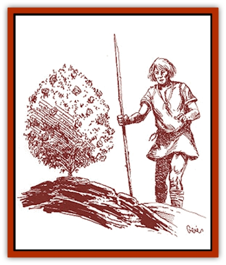

# Plant - Savage Coast

| Statistic | **Amber Lotus** | **Eyeweed** | **Gargoan Rose** | **Scarlet Pimpernel** | **Vermeil Fungus** |
| --- | --- | --- | --- | --- | --- |
| **Activity Cycle:** | Any | Any | Day | Day | Any |
| **Alignment:** | Neutral | Neutral | Chaotic good | Neutral | Neutral |
| **Armor Class:** | 10 | 7 | 10 | 10 | 7 |
| **Climate/Terrain:** | River | Aquatic | Forest | Any | Any |
| **Damage/Attack:** | Nil | 1d3 | Nil | Nil | Nil |
| **Diet:** | Nil | Carnivore | Nil | Special | Scavenger |
| **Frequency:** | Common | Rare | Rare | Rare | Rare |
| **Hit Dice:** | 1 hp | 8 | 2 | 1 | 3 |
| **Intelligence:** | Non- (0) | Animal (1) | Low (5-7) | Semi- (2-4) | Non- (0) |
| **Magic Resistance:** | Nil | Nil | Nil | Nil | Nil |
| **Morale:** | Average <nobr>(8-10)</nobr> | Steady (11-12) | Steady (11-12) | Steady (11-12) | Steady (11-12) |
| **Movement:** | Nil | 1 | Nil | Nil | 1 |
| **No. Appearing:** | 1 | 1 | 1 | 2d4 | 2d4 |
| **No. of Attacks:** | 0 | 2d4 (feelers) | 0 | 0 | 0 |
| **Organization:** | Bed | Solitary | Solitary | Bed | Multicellular |
| **Size:** | S (1' diameter) | L <nobr>(10' diameter)</nobr> | T (2-3' tall) | T (2-3' tall) | M (4-7' tall) |
| **Special Attacks:** | Sleep | Nil | Legacies | Legacies | Detonating cloud |
| **Special Defenses:** | Nil | Nil | Singing | Legacies | Nil |
| **THAC0:** | 20 | 13 | 19 | 19 | 17 |
| **Treasure:** | Nil | Nil | Nil | Nil | Nil |
| **XP Value:** | 35/1,400 | 975 | 35 | 65 | 175 |

**Amber Lotus**

  The amber lotus is a variety of aquatic plant thriving in the Dream River marking the eastern border of Renardy. The amber lotus has wide, circular leaves, much like those found on a water lily. Depending on the winds, amber lotus pollen can travel for miles, sticking to everything it touches (grass, trees, creatures, etc.). Amber lotus pollen acts as a powerful sleeping poison. Anyone who comes in contact with the pollen must make a successful saving throw vs. poison with a -2 penalty or fall asleep for a minimum 1d4+1 days. If the wind does not shift, the victim will never wake up. The victims of the sleeping pollen often die from attacks by other creatures while asleep. Their bodies then decay and provide nourishment for the plants.

The powerful sleeping effect of the amber lotus has so far prevented both Eusdrian and Renardois expansion to the north. [[Batracine|Batracines]] are immune to amber lotus and can often be found hiding underneath or sitting on the lotus pads.

A bed of amber lotus contains 3d100+100 plants. Anyone approaching closer to the bed than 1 yard per plant is affected by the sleeping spores.

A victim who survives an encounter with the amber lotus receives 35 experience points. Actually wiping out a bed of these plants earns characters an additional award of 1,400 experience points.

**Eyeweed**

  Eyeweed is a hideous semi-aquatic plant that grows on the on the seashores and in the rivers of the Savage Coast, usually near otherwise safe harbors. Eyeweed appears as either seaweed or a large collection of algae.

Eyeweed, when hunting prey, sends out long feelers (up to 100 feet in length) along the coastline to look for food. The feelers resemble long vines or stalks - except that the ends appear to be bulbous, unblinking eyes. In actuality, the eyeweed hunts by touch and smell; the unblinking "eyes" are actually closed mouths that attack by biting and then sucking meat, blood, and even bone into the eyeweed's body.

Once it locates potential prey, the eyeweed attacks with 2d4 feelers. Each feeler does 1d3 points of damage per attack. Each feeler can sustain 6 hit points of damage before being severed. The eyeweed will regrow lost feelers within a week. Damage to the feelers does no damage to the eyeweed itself; only damage to the central body will kill the eyeweed.

Eyeweeds will feed on wounded or exhausted [[Echyan|echyans]] if given the opportunity.

**Vermeil Fungus**

  Vermeil fungi are relatives of the [[Fungus|gas spores]]. When attacked or disturbed, these large, crimson mushrooms release a thick red cloud that resembles *vermeil*. This cloud has the same effect on *cinnabryl* as detonating smokepowder (see the section on "Depletion of *Cinnabryl*" in *The Savage Coast Campaign Book*). All vulnerable creatures within a 30-foot radius are affected. Vermeil fungus feeds on deposits of *steel seed* or the decaying bodies of Legacy-using creatures. It is often found along with [[Parasite_Savage_Coast|vermilia]].

**Scarlet Pimpernel**

  This elegant-looking orchid grows on *cinnabryl* deposits and the graves of dead, Legacy-using creatures, often along with vermilia. When eaten, scarlet pimpernel temporarily boosts the effects of Legacies. The effect lasts one turn, during which time all Legacy effects (duration, range, damage, etc.) are boosted by 10%. The dried form is three times stronger (lasts three turns, boosts Legacy effects by 30%) than the fresh form, but it also causes delirium. Anyone who eats dried scarlet pimpernel must make a successful saving throw vs. poison with a -3 penalty or suffer a hallucination. This hallucination lasts for 1d6 turns, during which time the victim is unable to respond to events in the real world, even those that are potentially deadly.

The crimson delight, on the other hand, is an identical-looking plant often found mixed in with scarlet pimpernels. The crimson delight is deadly in its fresh form; anyone who eats fresh crimson delight must make a successful saving throw vs. poison or die. In its dried form, it prevents the use of Legacies for 24 hours. [[Voat|Voats]] can also be found near scarlet pimpernels.

Each bed of these plants has a Legacy appropriate to the region where it is found; they can be offensive or defensive. These plants use their dim intelligence to control the Legacy. If its Legacy is used more than three times in one day, the pimpernel acquires a different Legacy (selected randomly from the list), which it can use it up to three times, and so on. A bed of scarlet pimpernels can continue to use its Legacy-of-the-moment as long as at least one plant is left.

A bed of plants depletes *cinnabryl* at the normal speed (one ounce per week). Without *cinnabryl*, the plants quickly dry up. If this happens, they release spores that ride the wind in search of new deposits.

**Gargoan Rose**

  This white rose has the ability to temporarily freeze the effects of the Red Curse. When plucked from its bush, the rose acts as one ounce of *cinnabryl*, wilting as it depletes. At the end of the seventh day, the last petal drops and its protection ceases. Anyone currently protected by a Gargoan rose cannot use his Legacies.

The Gargoan rose bush is a sentient being, with senses based on smell and empathy. The Immortal Valerias originally created its species as a gesture of compassion toward the poor and the Afflicted.

The bush allows only one rose to be plucked each week. If more than one rose is removed or if someone attempts to dig it out of the ground, the bush activates its own Legacy defenses: Acid Touch, Entangle, Poison, and Weaken. In addition, the Gargoan rose bush has the ability to Sing. Its melody can *charm monsters* within a one mile radius, which it then uses to defend itself against foes.

The bushes grow in Shazak and Herathian forests, in the hallowed forests of Robrenn, as well as in Gargoa near places where the Afflicted have died. Gargoans consider these bushes sacred gifts from the Immortals; tampering with one (attempting to uproot the bush or take more than one rose) is a capital crime in Gargoa.

A person who encounters a Gargoan rose bush or uses one of the special roses should receive a one-time award of 35 experience points. No experience points are awarded for destroying one of these bushes.

---
## Discovery & Documentation

**Source Publication:** Monstrous Compendium Savage Coast Appendix (Online Exclusive) (1995)
**Campaign Setting:** Mystara
**Author(s):** Loren L Coleman, Ted James, Thomas Zuvich, Cindi M. Rice

### Other Creatures Found in This Source Book
   * [[Aranea_Savage_Coast|Aranea (Savage Coast)]]
   * [[Arashaeem|Arashaeem]]
   * [[Batracine|Batracine]]
   * [[Cat_Marine|Cat, Marine]]
   * [[Cinnavixen|Cinnavixen]]
   * [[Clockwork_Swordsman|Clockwork Swordsman]]
   * [[Critter_Temple|Critter, Temple]]
   * [[Cursed_One|Cursed One]]
   * [[Deathmare|Deathmare]]
   * [[Dragon_Savage_Coast_Crimson|Dragon (Savage Coast), Crimson]]
   * [[Dragon_Savage_Coast_Red_Hawk|Dragon (Savage Coast), Red Hawk]]
   * [[Echyan|Echyan]]
   * [[Ee'aar|Ee'aar]]
   * [[Enduk|Enduk]]
   * [[Fachan_Savage_Coast|Fachan (Savage Coast)]]
   * [[Feliquine|Feliquine]]
   * [[Fiend_Narvaezan|Fiend, Narvaezan]]
   * [[Frelôn|Frelôn]]
   * [[Ghriest|Ghriest]]
   * [[Glutton_Sea|Glutton, Sea]]
   * [[Goatman|Goatman]]
   * [[Golem_Naâruk|Golem, Naâruk]]
   * [[Golem_Savage_Coast|Golem (Savage Coast)]]
   * [[Grudgling|Grudgling]]
   * [[Heraldic_Servant_I|Heraldic Servant I]]
   * [[Heraldic_Servant_II|Heraldic Servant II]]
   * [[Heraldic_Servant_III|Heraldic Servant III]]
   * [[Heraldic_Servant_IV|Heraldic Servant IV]]
   * [[Heraldic_Servant_V|Heraldic Servant V]]
   * [[Heraldic_Servant_General_Information|Heraldic Servant, General Information]]
   * [[Hermit_Sea|Hermit, Sea]]
   * [[Jorri|Jorri]]
   * [[Juhrion|Juhrion]]
   * [[Kla'a-tah|Kla'a-tah]]
   * [[Leech_Legacy|Leech, Legacy]]
   * [[Lich_Inheritor|Lich, Inheritor]]
   * [[Lizard_Kin_Savage_Coast|Lizard Kin (Savage Coast)]]
   * [[Lupasus|Lupasus]]
   * [[Lupin|Lupin]]
   * [[Lyra_Bird_Saragón|Lyra Bird, Saragón]]
   * [[Malfera|Malfera]]
   * [[Manscorpion_Nimmurian|Manscorpion, Nimmurian]]
   * [[Mythuínn_Folk|Mythuínn Folk]]
   * [[Neshezu|Neshezu]]
   * [[Nikt'oo|Nikt'oo]]
   * [[Nosferatu|Nosferatu]]
   * [[Omm-wa|Omm-wa]]
   * [[Omshirim|Omshirim]]
   * [[Parasite_Savage_Coast|Parasite (Savage Coast)]]
   * [[Phanaton|Phanaton]]
   * [[Pudding_Vermilion|Pudding, Vermilion]]
   * [[Rakasta|Rakasta]]
   * [[Ray_Forest|Ray, Forest]]
   * [[Shedu_Greater_Savage_Coast|Shedu, Greater (Savage Coast)]]
   * [[Shimmerfish|Shimmerfish]]
   * [[Skinwing|Skinwing]]
   * [[Spawn_of_Nimmur|Spawn of Nimmur]]
   * [[Spider-spy|Spider-spy]]
   * [[Spirit_Heroic|Spirit, Heroic]]
   * [[Spirit_Walleran|Spirit, Walleran]]
   * [[Succulus|Succulus]]
   * [[Swampmare|Swampmare]]
   * [[Symbiont_Shadow|Symbiont, Shadow]]
   * [[Tortle|Tortle]]
   * [[Troll_Legacy|Troll, Legacy]]
   * [[Trosip|Trosip]]
   * [[Tyminid|Tyminid]]
   * [[Utukku|Utukku]]
   * [[Voat|Voat]]
   * [[Voat_Herathian|Voat, Herathian]]
   * [[Vulturehound|Vulturehound]]
   * [[Wallara|Wallara]]
   * [[Wurmling|Wurmling]]
   * [[Wynzet|Wynzet]]
   * [[Yeshom|Yeshom]]
   * [[Zombie_Red|Zombie, Red]]
