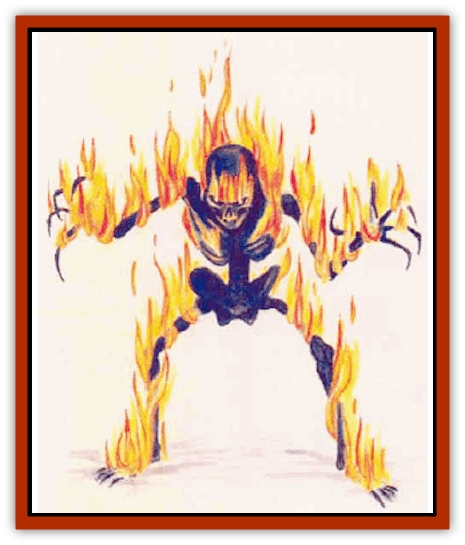

# Plasm

| Statistic | **Giant** | **Normal** |
| --- | --- | --- |
| **Activity Cycle:** | Any | Any |
| **Alignment:** | Chaotic evil | Chaotic evil |
| **Armor Class:** | -4 | 0 |
| **Climate/Terrain:** | Ethereal Plane | Ethereal Plane |
| **Damage/Attack:** | 3d6 (claw)/3d6 (claw) | 2d6 (claw)/2d6 (claw) |
| **Diet:** | Elemental matter | Elemental matter |
| **Frequency:** | Very rare | Very rare |
| **Hit Dice:** | 12 | 6 |
| **Intelligence:** | Average (8) | Average (8) |
| **Magic Resistance:** | Nil | Nil |
| **Morale:** | Champion (15) | Elite (13) |
| **Movement:** | 12 | 12 |
| **No. Appearing:** | 1d4 | 1d10 |
| **No. of Attacks:** | 2 | 2 |
| **Organization:** | Solitary | Solitary |
| **Size:** | L (12' tall) | M (6' tall) |
| **Special Attacks:** | Elemental cloud | Elemental Cloud |
| **Special Defenses:** | See below | See below |
| **THAC0:** | 9 | 15 |
| **Treasure:** | Nil | Nil |
| **XP Value:** | 9,000 | 3,000 |

Plasms are hideous [[Skeleton|skeletons]] composed of solid ether and raw elemental matter; they are usually encountered on the Ethereal Plane or their respective Elemental Planes, but can be brought to the Prime Marerial Plane through planar gates. Four types of plasms exist: earth, air, fire, and water. Plasms are either human-sized or giant.

Fire plasms appear as charred skeletons with flames constantly playing across the surface of the bones. The bones of a water plasm appear to he solid water, though the bones seem to bend and waver as the thing moves. Air plasms are transparent skeletons whose forms are discernable only when they move. Earth plasms appear most like normal skeletons except for the unsightly clumps of gooey black dirt that hang from the bleached bones.

All plasms have glowing yellow eyes with a sinister glare. Plasms are able to communicate with any intelligent creature, and each type has its own distinctive voice. Earth plasms talk with a deep rumble; air plasms pracucally whistle their words; fire plasms hiss and crackle; water plasms talk in gurgles.

**Combat:** Plasms attack opponents on sight using their two clawed hands. A successful attack by a human-sized plasm inflicts 2d6 points of damage; a successful attack by a giant-sized plasm causes 3d6 points of damage.

Plasms are immune to poison and nonmagical weapons. Magical weapons have limited effectiveness on the creaturer Each blow from a magical weapon causes only its magical damage, ignoring the normal weapon damage and any Strength bonuses. For example, a *+5 holy avenger* would inflict only 5 points of damage on a plasm.

On any plane except the Ethereal and the crearure's own home plane, a plasm loses one Hit Die per round from energy drain, vanishing into nothingness when dead. However, a plasm can feed on its own element, and regenerates damage at the rate of 1 hit point per round when feeding on that element. A feeding plasm can do nothing else that round.

Any magical attack based on the plasm's element (such as casting a *fireball* at a fire plasm) causes a plasm to gain Hit Dice, along with the appropriate changes to THAC0, hit points, and saving throws. The plasm gains a number of Hit Dice equal to the caster's level, or the level of spellcasting of a magical item. This bonus lasts 3d6 rounds. Example: a *fireball* cast by a 5th level mage gives a fire plasm a bonus of 5 Hit Die; the same spell cast from a *wand of fireballs* would add 6 Hit Dice.

Once per turn, a plasm can "spend" 10 of its hit points to create an elemental cloud. This cloud is 30 feet in diameter and is centered on the plasm. Except for the plasm, any creature within the cloud suffers 20 points of damage per round; a successful saving throw vs. breath weapon halves the cloud's damage. The cloud lasts 1d6 rounds. Normally, a plasm uses this attack form when fleeing, though if it has gained extra Hit Dice as a result of opponents' foolish element-based attacks, it may choose to "spend" its hit points with very little provocation.

**Habitat/Society:** Plasms exist as renegades on the Elemental Planes, refusing to subordinate themselves to any of the Elemental Lords. Normal [[Elemental_General_Information|elementals]] hate plasms and attack them on sight.

Plasms have no society and no order. They come and go as they wish, cooperating with or betraying others as desired.

A new plasm is "born" when an ethereal storm gets too close to the border of an elemental plane. The storm extracts some of the material and fuses it with ether into a plasm.

**Ecology:** Plasms, being extraplanar creatures, have no place in the environments of the Prime Material Plane, but can serve as destructive forces. Plasms derive sustenance from bits of their respective elemental matter.

---
## Discovery & Documentation

**Source Publication:** Mystara Appendix (1994)
**Campaign Setting:** Mystara
**Author(s):** John Nephew, Teeuwynn Woodruff, John Terra, Skip Williams

### Other Creatures Found in This Source Book
   * [[Actaeon|Actaeon]]
   * [[Agarat|Agarat]]
   * [[Ash_Crawler|Ash Crawler]]
   * [[Baldandar|Baldandar]]
   * [[Bargda|Bargda]]
   * [[Bhut|Bhut]]
   * [[Bird_Mystara|Bird (Mystara)]]
   * [[Blackball|Blackball]]
   * [[Choker|Choker]]
   * [[Coltpixie|Coltpixie]]
   * [[Crone_of_Chaos|Crone of Chaos]]
   * [[Darkhood|Darkhood]]
   * [[Darkwing|Darkwing]]
   * [[Decapus|Decapus]]
   * [[Deep_Glaurant|Deep Glaurant]]
   * [[Diabolus|Diabolus]]
   * [[Dimensional_Warper|Dimensional Warper]]
   * [[Dragon_Mystara_Crystalline|Dragon (Mystara), Crystalline]]
   * [[Dragon_Mystara_Jade|Dragon (Mystara), Jade]]
   * [[Dragon_Mystara_Onyx|Dragon (Mystara), Onyx]]
   * [[Dragon_Mystara_Ruby|Dragon (Mystara), Ruby]]
   * [[Drake_Mystara|Drake (Mystara)]]
   * [[Dragonfly|Dragonfly]]
   * [[Dusanu|Dusanu]]
   * [[Elemental_of_Chaos_Air_Earth|Elemental of Chaos, Air/Earth]]
   * [[Elemental_of_Chaos_Fire_Water|Elemental of Chaos, Fire/Water]]
   * [[Elemental_of_Law_Air_Earth|Elemental of Law, Air/Earth]]
   * [[Elemental_of_Law_Fire_Water|Elemental of Law, Fire/Water]]
   * [[Familiar_Mystara|Familiar (Mystara)]]
   * [[Frost_Salamander|Frost Salamander]]
   * [[Fundamental_Air_Earth|Fundamental, Air/Earth]]
   * [[Fundamental_Fire_Water|Fundamental, Fire/Water]]
   * [[Gargantua_Mystara|Gargantua (Mystara)]]
   * [[Geonid|Geonid]]
   * [[Ghostly_Horde|Ghostly Horde]]
   * [[Giant_Athach|Giant, Athach]]
   * [[Giant_Hephaeston|Giant, Hephaeston]]
   * [[Golem_Drolem|Golem, Drolem]]
   * [[Golem_Mystara_I|Golem (Mystara) I]]
   * [[Golem_Mystara_II|Golem (Mystara) II]]
   * [[Golem_Mystara_III|Golem (Mystara) III]]
   * [[Gray_Philosopher|Gray Philosopher]]
   * [[Guardian_Warrior|Guardian Warrior]]
   * [[Gyerian|Gyerian]]
   * [[Herex|Herex]]
   * [[Hivebrood|Hivebrood]]
   * [[Horde|Horde]]
   * [[Hsiao|Hsiao]]
   * [[Huptzeen|Huptzeen]]
   * [[Hutaakan|Hutaakan]]
   * [[Imp_Mystara|Imp (Mystara)]]
   * [[Jellyfish_Giant_Mystara|Jellyfish, Giant (Mystara)]]
   * [[Kna|Kna]]
   * [[Kopru|Kopru]]
   * [[Lizard_Mystara|Lizard (Mystara)]]
   * [[Lizard-kin_Mystara|Lizard-kin (Mystara)]]
   * [[Lupin|Lupin]]
   * [[Lycanthrope_Werejaguar_Mystara|Lycanthrope, Werejaguar (Mystara)]]
   * [[Lycanthrope_Wereswine|Lycanthrope, Wereswine]]
   * [[Magen|Magen]]
   * [[Manikin|Manikin]]
   * [[Mek|Mek]]
   * [[Mujina|Mujina]]
   * [[Nagpa|Nagpa]]
   * [[Neh-thalggu|Neh-thalggu]]
   * [[Nightshade_Mystara|Nightshade (Mystara)]]
   * [[Nuckalavee|Nuckalavee]]
   * [[Pegataur|Pegataur]]
   * [[Phanaton|Phanaton]]
   * [[Plant_Dangerous_Mystara|Plant, Dangerous (Mystara)]]
   * [[Rakasta|Rakasta]]
   * [[Rock_Man|Rock Man]]
   * [[Sabreclaw|Sabreclaw]]
   * [[Sacrol|Sacrol]]
   * [[Scamille|Scamille]]
   * [[Shapeshifter|Shapeshifter]]
   * [[Shargugh|Shargugh]]
   * [[Shark-kin|Shark-kin]]
   * [[Sollux|Sollux]]
   * [[Spectral_Death|Spectral Death]]
   * [[Spectral_Hound|Spectral Hound]]
   * [[Spider-kin|Spider-kin]]
   * [[Spirit_Mystara|Spirit (Mystara)]]
   * [[Statue_Living|Statue, Living]]
   * [[Surtaki|Surtaki]]
   * [[Tabi|Tabi]]
   * [[Thoul|Thoul]]
   * [[Thunderhead|Thunderhead]]
   * [[Tiger_Ebon|Tiger, Ebon]]
   * [[Topi|Topi]]
   * [[Tortle|Tortle]]
   * [[Vampire_Velya|Vampire, Velya]]
   * [[White_Fang|White Fang]]
   * [[Worm_Mystara|Worm (Mystara)]]
   * [[Wyrd|Wyrd]]
   * [[Yowler|Yowler]]
   * [[Zombie_Lightning|Zombie, Lightning]]
