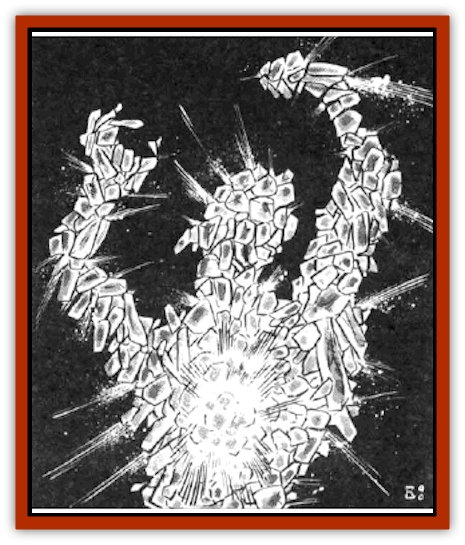

# Plasman

| Statistic | **Plasman** |
| --- | --- |
| **Activity Cycle:** | Any |
| **Alignment:** | Chaotic evil |
| **Armor Class:** | 2 |
| **Climate/Terrain:** | Any land, fire-based worlds, cool stars |
| **Damage/Attack:** | 2-16 or 3-18 |
| **Diet:** | Special |
| **Frequency:** | Very rare |
| **Hit Dice:** | 12 |
| **Intelligence:** | Low (5-7) |
| **Magic Resistance:** | Nil |
| **Morale:** | Champion (15-16) |
| **Movement:** | 9, Fl 12 (C) |
| **No. Appearing:** | 1 |
| **No. of Attacks:** | 1 |
| **Organization:** | Solitary |
| **Size:** | H (12' tall) |
| **Special Attacks:** | Heat blast |
| **Special Defenses:** | See below |
| **THAC0:** | 9 |
| **Treasure:** | Nil |
| **XP Value:** | 8,000 |

Plasmen are the peculiar constructs of deranged wizards, conjured simultaneously from the elemental planes of Fire and Earth. Bizarre and completely unnatural (even from a magical standpoint), plasmen are intemally at war with themselves. They take out their inner turmoil in a horrible frenzy of destruction that is usually as dangerous for their creators as for anyone elss. In their rage they quickly break down into their material components of fire and earth, though some who make their way to fire-based worlds or stars can attain immortality in these places where the elemental planes of Fire and Earth are in harmony in the Prime Material plane.

A plasman is a horrifying creature, roughly man-shaped but much taller. Its exterior is a broken collection of what appear to be white-hot coals or stones, stacked unnaturally into the shape of a man. From within it burns with the fire of a kiln, the intense light and flame licking out from between the stones, dancing across its surface in a constant swirl of deadly, searing heat. Plasmen have no facial features, not even a mouth - sustenance is gained by simply merging with rock or metal, melting it and smearing it onto its body, or by absorbing flame or combustible materials (wood, oil, cloth, etc.) to feed its inner fire.

**Combat:** A plasman is at war with itself and with all creatures that cross its path. It shows no mercy, attacking without regard to situation, alignment, or even its own estimation of victory. A plasman's only attack is to punch with its flaming fist. If a hit is scored, the target suffers 2d8 points of crushing damage from the rock-hard fist, plus 2d6 points of flame damage. The flame damage is also incurred even by casual contact with a plasman.

Plasmen also have a special attack they can use once per turn. If the plasman spends an entire round not attacking, on the next round it can concentrate its internal fires into a blast of intense heat. This blast attack scorches victims within five feet for 3d6 points of damage, those within ten feet for 2d6 points of damage, and those within 20 feet for 1d6 points of damage (all victims get to roll saving throws vs. spell for half damage).

In combat, a plasman cannot be harmed by weapons of less than +2 enchantment. Of these weapons, edged ones cause only half damage to the flowing, molten stones of a plasman's outer shell. Fire-based spells have no effect on plasmen. No common means of extinguishing fire on the Prime Material plane is capable of harming a plasman. Spells of magical cold and water inflict normal damage. Spells that alter stone work normally. An entire gallon of water poured onto a plasman causes 1d6 points of damage.

**Habitat/Society:** Once conjured, plasmen have no loyalty to their creators, attacking them as readily as anyone else. They survive for 1d6 days after their creators stop concentrating on them. After that, they collapse back into the hot coals of a wood fire, the very stuff from which they were created.

If a plasman can reach a fire-based world or a star before it burns out, it can survive there indefinitely. Still troubled and violent, it takes to the space around those places, hovering, waiting for passersby on which to vent its burning anger.

**Ecology:** Plasmen have little purpose in any ecosystem. They contribute only death and destruction. There are no known uses for any part of plasmen.

---
## Discovery & Documentation

**Source Publication:** MC7 Spelljammer Appendix I (1990)
**Campaign Setting:** Advanced Dungeons & Dragons 2nd Edition
**Author(s):** various

### Other Creatures Found in This Source Book
   * [[Aartuk|Aartuk]]
   * [[Albari|Albari]]
   * [[Ancient_Mariner|Ancient Mariner]]
   * [[Argos|Argos]]
   * [[Beholder_Abomination_Astereater|Beholder (Abomination), Astereater]]
   * [[Blazozoid|Blazozoid]]
   * [[Chattur|Chattur]]
   * [[Chevall|Chevall]]
   * [[Clockwork_Horror|Clockwork Horror]]
   * [[Colossus|Colossus]]
   * [[Delphinid|Delphinid]]
   * [[Dizantar|Dizantar]]
   * [[Dog|Dog]]
   * [[Dog_Bog_Hound|Dog, Bog Hound]]
   * [[Esthetic|Esthetic]]
   * [[Focoid|Focoid]]
   * [[Fractine|Fractine]]
   * [[Giant_Spacesea|Giant, Spacesea]]
   * [[Golem_Furnace|Golem, Furnace]]
   * [[Golem_Radiant|Golem, Radiant]]
   * [[Gravislayer|Gravislayer]]
   * [[Grommam|Grommam]]
   * [[Hadozee|Hadozee]]
   * [[Hamster_Giant_Space|Hamster, Giant Space]]
   * [[Jammer_Leech|Jammer Leech]]
   * [[Lakshu|Lakshu]]
   * [[Lumineaux|Lumineaux]]
   * [[Lutum|Lutum]]
   * [[Mimic_Space|Mimic, Space]]
   * [[Misi|Misi]]
   * [[Moon_Rogue|Moon, Rogue]]
   * [[Mortiss|Mortiss]]
   * [[Murderoid|Murderoid]]
   * [[Nay-Churr|Nay-Churr]]
   * [[Phlog-Crawler|Phlog-Crawler]]
   * [[Plasmoid_DeGleash|Plasmoid, DeGleash]]
   * [[Plasmoid_DelNoric|Plasmoid, DelNoric]]
   * [[Plasmoid_General_Information|Plasmoid, General Information]]
   * [[Plasmoid_Ontalak|Plasmoid, Ontalak]]
   * [[Puffer|Puffer]]
   * [[Q'nidar|Q'nidar]]
   * [[Rastipede|Rastipede]]
   * [[Reigar|Reigar]]
   * [[Rock_Hopper|Rock Hopper]]
   * [[Slinker|Slinker]]
   * [[Spider_Asteroid|Spider, Asteroid]]
   * [[Spiritjam|Spiritjam]]
   * [[Survivor|Survivor]]
   * [[Syllix|Syllix]]
   * [[Symbiont_Power|Symbiont, Power]]
   * [[Vine_Infinity|Vine, Infinity]]
   * [[Wiggle|Wiggle]]
   * [[Wizshade|Wizshade]]
   * [[Wryback|Wryback]]
   * [[Zard|Zard]]
   * [[Zodar|Zodar]]
