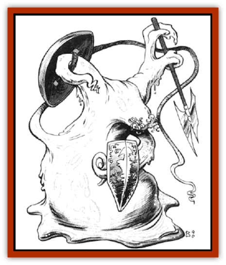

# Plasmoid - DeGleash

| Statistic | **Plasmoid, DeGleash** |
| --- | --- |
| **Activity Cycle:** | Any |
| **Alignment:** | Any (seldom evil) |
| **Armor Class:** | 2 |
| **Climate/Terrain:** | Non-arid/Any |
| **Damage/Attack:** | 1-8 or weapon +3 |
| **Diet:** | Scavenger |
| **Frequency:** | Rare |
| **Hit Dice:** | 8 |
| **Intelligence:** | Average (8-10) |
| **Magic Resistance:** | Nil |
| **Morale:** | Average (10) |
| **Movement:** | 9 |
| **No. Appearing:** | 1-6 |
| **No. of Attacks:** | 1-4+ |
| **Organization:** | Family |
| **Size:** | M-H (varies) |
| **Special Attacks:** | Boom, absorb |
| **Special Defenses:** | See below |
| **THAC0:** | 13 |
| **Treasure:** | K,L,M (D) |
| **XP Value:** | 10,000 |

See "[[Plasmoid_General_Information|Plasmoid, General Information]]" for base information on this race.

DeGleash are large, wet blobs that favor a form resembling a bowling pin (a fat base with a narrowing upper body). They are white to cream colored and constantly sway and bob about. They prefer to use no legs, propelling themselves forward by having their bases flow over the surface. They can do this at a rate of 9. They also prefer to form only enough arms for the task at hand (thus they have no arms when not trying to manipulate something). These arms tend to be short and stalk-like. They employ two ganglia masses for eyes, which they usually place high on their bodies. Their auditory nerves are usually scattered about their body. Waste constantly excretes via osmosis through their thin outer membrane. They rarely form a mouth orifice.

DeGleash can produce four arms of 18/01-18/50 strength. If all of their fibers are put into one slow muscle (not for attack) they can lift as much as 10,000 lbs. for short durations (1d4 rounds).

They can form appendages as fine as a 1/16 inch in diameter. They can absorb or produce limbs as fast as a human can move his arm. DeGleash have such incredible control over their bodies that a net cast over a deGleash would slowly pass through its body if it desired (it just disconnects nerves and fibers where the net's strands are passing, then reconnects them afterward).

The least malleable part of a deGleash is its brain, but even that can be quickly squashed into a five-inch diameter tube that is one fool long. If a deGleash spends several hours, it can slowly string its brain out to fit through a hole only one inch in diameter (the smallest hole a deGleash can pass through).

A man-sized deGleash can stretch thin enough to reach something 50 feet in the air (large-sized ones can reach 75 feet, huge ones can stretch 100 feet). To stretch this thin requires one round. Likewise a deGleash could move through a one-foot-diameter hole in a round. Smaller holes take a lot more time, up to several hours to fit through a one-inch hole.

DeGleash can secrete a calcium-based substance that quickly hardens and forms a shell around them. This is too fragile to add to their AC, but it is useful to keep them from flowing all over while they sleep. When they wake, they reabsorb the shell.

They can carry up to 1,200 lbs. of items within their bodies if the items' overall volume is a cubic yard or less. DeGleash themselves weigh 2,000, 4,000, and 8,000 lbs. (for size M, L, and H, respectively). They are incapable of jumping, but they can climb wails with 90% success.

**Combat:** DeGleash can use 1d4 arms in combat with no penalties. Additional arms inflict a -2 attack roll penalty for all arms. They prefer to attack with two pseudopod fists and wield two shields (AC 0). They can strike an opponent up to 8' away with full strength (greater distances reduce the damage by 2 points per foot).

DeGleash get very excited before and during combat. It is a habit of this species to begin booming at this time. Opponents who hear this terrible sound must roll successful saving throws vs. petrification or be struck with dread (penalties of +2 and -2 on combat rolls). If a deGleash concentrates for one round, it can release a tremendous boom that requires all within 20 feet to make saving throws vs. paralyzation or become deaf for 1d20 rounds (+2 penalty to AC). Finally, deGleash can envelop enemies who are at least one size smaller than they. This requires a THAC0 roll, adjusted only by the victim's Dexterity. Once enveloped, a victim suffers 1d8 points of digestive damage per round. Furthermore, if the deGleash concentrates, it can bring its muscle fibers to bear upon the hapless foe, holding him with an effective Strength of 20, causing 8 additional points of damage a round. If the victim is not held, a successful bend bars roll enables him to move; if held, three consecutive successful bend bars rolls must be made. Of course, suffocation is a problem for those enveloped as well.

DeGleash suffer no damage from piercing weapons, ½ damage from slashing weapons, and full damage from bludgeoning weapons. Fire causes double damage. Cold-based attacks slow them by 1 per 10 dice of damage.

As with all plasmoids, deGleash are immune to disease and poison of all types. Only acid damage in excess of 30 points per round can harm them.

A deGleash's AC is due to its ability to shape its body away from an attacking blow. It can even open into a ring.

**Habitat/Society:** See the comments under "[[Plasmoid_General_Information|Plasmoid, General Information]]".

---
## Discovery & Documentation

**Source Publication:** MC7 Spelljammer Appendix I (1990)
**Campaign Setting:** Advanced Dungeons & Dragons 2nd Edition
**Author(s):** various

### Other Creatures Found in This Source Book
   * [[Aartuk|Aartuk]]
   * [[Albari|Albari]]
   * [[Ancient_Mariner|Ancient Mariner]]
   * [[Argos|Argos]]
   * [[Beholder_Abomination_Astereater|Beholder (Abomination), Astereater]]
   * [[Blazozoid|Blazozoid]]
   * [[Chattur|Chattur]]
   * [[Chevall|Chevall]]
   * [[Clockwork_Horror|Clockwork Horror]]
   * [[Colossus|Colossus]]
   * [[Delphinid|Delphinid]]
   * [[Dizantar|Dizantar]]
   * [[Dog|Dog]]
   * [[Dog_Bog_Hound|Dog, Bog Hound]]
   * [[Esthetic|Esthetic]]
   * [[Focoid|Focoid]]
   * [[Fractine|Fractine]]
   * [[Giant_Spacesea|Giant, Spacesea]]
   * [[Golem_Furnace|Golem, Furnace]]
   * [[Golem_Radiant|Golem, Radiant]]
   * [[Gravislayer|Gravislayer]]
   * [[Grommam|Grommam]]
   * [[Hadozee|Hadozee]]
   * [[Hamster_Giant_Space|Hamster, Giant Space]]
   * [[Jammer_Leech|Jammer Leech]]
   * [[Lakshu|Lakshu]]
   * [[Lumineaux|Lumineaux]]
   * [[Lutum|Lutum]]
   * [[Mimic_Space|Mimic, Space]]
   * [[Misi|Misi]]
   * [[Moon_Rogue|Moon, Rogue]]
   * [[Mortiss|Mortiss]]
   * [[Murderoid|Murderoid]]
   * [[Nay-Churr|Nay-Churr]]
   * [[Phlog-Crawler|Phlog-Crawler]]
   * [[Plasman|Plasman]]
   * [[Plasmoid_DelNoric|Plasmoid, DelNoric]]
   * [[Plasmoid_General_Information|Plasmoid, General Information]]
   * [[Plasmoid_Ontalak|Plasmoid, Ontalak]]
   * [[Puffer|Puffer]]
   * [[Q'nidar|Q'nidar]]
   * [[Rastipede|Rastipede]]
   * [[Reigar|Reigar]]
   * [[Rock_Hopper|Rock Hopper]]
   * [[Slinker|Slinker]]
   * [[Spider_Asteroid|Spider, Asteroid]]
   * [[Spiritjam|Spiritjam]]
   * [[Survivor|Survivor]]
   * [[Syllix|Syllix]]
   * [[Symbiont_Power|Symbiont, Power]]
   * [[Vine_Infinity|Vine, Infinity]]
   * [[Wiggle|Wiggle]]
   * [[Wizshade|Wizshade]]
   * [[Wryback|Wryback]]
   * [[Zard|Zard]]
   * [[Zodar|Zodar]]
