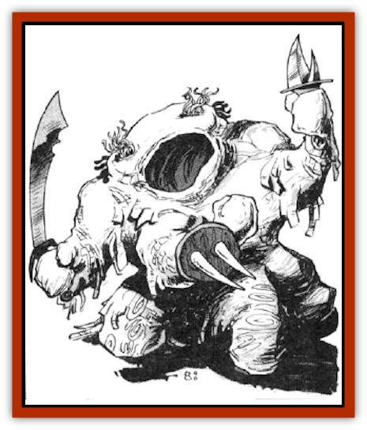

# Plasmoid - DelNoric

| Statistic | **Plasmoid, DelNoric** |
| --- | --- |
| **Activity Cycle:** | Any |
| **Alignment:** | Any (seldom good) |
| **Armor Class:** | 3 (8) |
| **Climate/Terrain:** | Any |
| **Damage/Attack:** | 1d6 or weapon +2 |
| **Diet:** | Scavenger |
| **Frequency:** | Rare |
| **Hit Dice:** | 5 |
| **Intelligence:** | Very (11-12) |
| **Magic Resistance:** | 5% |
| **Morale:** | Steady (12) |
| **Movement:** | 6 |
| **No. Appearing:** | 2-8 |
| **No. of Attacks:** | 1-3+ |
| **Organization:** | Family |
| **Size:** | S-L (varies) |
| **Special Attacks:** | Squeal, acid |
| **Special Defenses:** | See below |
| **THAC0:** | 15 |
| **Treasure:** | K,L,M (D) |
| **XP Value:** | 4,000 |

See "[[Plasmoid_General_Information|Plasmoid - General Information]]" for base information on this race.

DelNorics prefer a short, stocky bi- or multipedal form. Their arms and legs are usually identical. They prefer mitten-like hands, round, stump-like feet, and a neckless head. They have two auditory and two visual ganglia, which they place upon their heads in the locations common to most bipeds. They also form a mouth orifice and even occasionally produce slight nose-like appendages (even though they can't smell).

What distinguishes delNorics from the other plasmoids is their covering. They can form a half-inch-thick, stiff leathery hide. This hide is simply a mesh of their body fibers that they allow to dry out. As it grows thicker, it often cracks where the delNoric bends. DelNorics usually look like they have wide strips of leather hanging off their bodies. This coating is grey to brown in coloration.

DelNorics have a lot less plasma than most plasmoids. For this reason, it takes them much longer to transform. A typical appendage requires a full turn of concentration. They cannot flow with their covering in place and thus they form legs for locomotion. With their covering, delNorics cannot form an appendage smaller than five inches in diameter. Without the covering, a one-inch-diameter appendage can be formed. If they must form fingers, they tear holes in their covering and extend unprotected appendages. A delNoric's brain cannot be squashed any smaller that a five-inch-diameter area.

DelNorics can support 12,000 lbs. for several hours when contained within their covering.

They commonly have several lip-like areas on their bodies. These open into leather coated pouches in which they keep their possessions. DelNorics are capable of carrying 1,000 lbs. of items. However, since these must be very dense in order to be of small enough volume, this amount is rarely carried.

Small-sized delNorics can stretch their bodies upward to a height of ten feet (15 feet if man-sized, 20 feet if large).

A delNoric's covering protects it from drying out, thus it can adventure even in desert climates. It also enables it to sleep while only marginally losing its form.

**Combat:** DelNorics can employ 1d3 appendages for attack and defense with no penalty. Each additional appendage inflicts the -2 cumulative attack roll penalty common to all plasmoids.

If they concentrate (no actions for a round), delNorics can "inhale" a large volume of air and then force it out of a small hole (often their pseudo-mouth)  for the next 1d4 rounds. This causes a loud squealing sound that requires a saving throw vs. paralyzation or it inflicts 1d4 points of damage to all who can hear it within 20 feet (even other delNoric).

Furthermore, delNorics keep their supply of entire digestive acid in one internal container. They usually form a tube that exits their body in some convenient area for expelling this acid onto an opponent. This requires their full concentration. The expelled acid can be shot in a stream up to 20 feet to strike one opponent, or it can be sprayed in a mist upon all those within a cone ten feet long and five feet in diameter (at the far end). The stream causes 2d10 points of damage, while the cone causes 3d4 points of damage to each victim. The stream requires a normal attack roll for the delNoric, while the cone's victims roll saving throws vs. breath weapon for half damage. This acid spewing attack can be used only once every hour.

DelNorics are slow to react; their AC is due mainly to their tough, thick hide. Without this covering their AC is 8.

DelNorics suffer half damage from piercing and slashing weapons, but full damage from bludgeoning weapons. Furthermore. their thick hide allows firc-bascd attacks to cause only half their normal damage (though double damage without the hide). Every 20 points of cold damage slows them by 1 (every 10 points if no hide). Acid in any quantity inflicts no damage.

**Habitat/Society:** DelNorics have a particular enmity toward [[Plasmoid_DeGleash|deGleash]], whom they call "The Soft Ones". They have taken a liking to [[Dwarf|dwarves]] as well as to the dwarven lust for gold.

**Ecology:** DelNorics eat anything, though for some unknown reason (not due to taste or smell), they have taken a particular liking to meat. DelNoric hides are sought after to make leather shields and breast plates. Such armor has half the weight of metal armor, but the same durability.

---
## Discovery & Documentation

**Source Publication:** MC7 Spelljammer Appendix I (1990)
**Campaign Setting:** Advanced Dungeons & Dragons 2nd Edition
**Author(s):** various

### Other Creatures Found in This Source Book
   * [[Aartuk|Aartuk]]
   * [[Albari|Albari]]
   * [[Ancient_Mariner|Ancient Mariner]]
   * [[Argos|Argos]]
   * [[Beholder_Abomination_Astereater|Beholder (Abomination), Astereater]]
   * [[Blazozoid|Blazozoid]]
   * [[Chattur|Chattur]]
   * [[Chevall|Chevall]]
   * [[Clockwork_Horror|Clockwork Horror]]
   * [[Colossus|Colossus]]
   * [[Delphinid|Delphinid]]
   * [[Dizantar|Dizantar]]
   * [[Dog|Dog]]
   * [[Dog_Bog_Hound|Dog, Bog Hound]]
   * [[Esthetic|Esthetic]]
   * [[Focoid|Focoid]]
   * [[Fractine|Fractine]]
   * [[Giant_Spacesea|Giant, Spacesea]]
   * [[Golem_Furnace|Golem, Furnace]]
   * [[Golem_Radiant|Golem, Radiant]]
   * [[Gravislayer|Gravislayer]]
   * [[Grommam|Grommam]]
   * [[Hadozee|Hadozee]]
   * [[Hamster_Giant_Space|Hamster, Giant Space]]
   * [[Jammer_Leech|Jammer Leech]]
   * [[Lakshu|Lakshu]]
   * [[Lumineaux|Lumineaux]]
   * [[Lutum|Lutum]]
   * [[Mimic_Space|Mimic, Space]]
   * [[Misi|Misi]]
   * [[Moon_Rogue|Moon, Rogue]]
   * [[Mortiss|Mortiss]]
   * [[Murderoid|Murderoid]]
   * [[Nay-Churr|Nay-Churr]]
   * [[Phlog-Crawler|Phlog-Crawler]]
   * [[Plasman|Plasman]]
   * [[Plasmoid_DeGleash|Plasmoid, DeGleash]]
   * [[Plasmoid_General_Information|Plasmoid, General Information]]
   * [[Plasmoid_Ontalak|Plasmoid, Ontalak]]
   * [[Puffer|Puffer]]
   * [[Q'nidar|Q'nidar]]
   * [[Rastipede|Rastipede]]
   * [[Reigar|Reigar]]
   * [[Rock_Hopper|Rock Hopper]]
   * [[Slinker|Slinker]]
   * [[Spider_Asteroid|Spider, Asteroid]]
   * [[Spiritjam|Spiritjam]]
   * [[Survivor|Survivor]]
   * [[Syllix|Syllix]]
   * [[Symbiont_Power|Symbiont, Power]]
   * [[Vine_Infinity|Vine, Infinity]]
   * [[Wiggle|Wiggle]]
   * [[Wizshade|Wizshade]]
   * [[Wryback|Wryback]]
   * [[Zard|Zard]]
   * [[Zodar|Zodar]]
