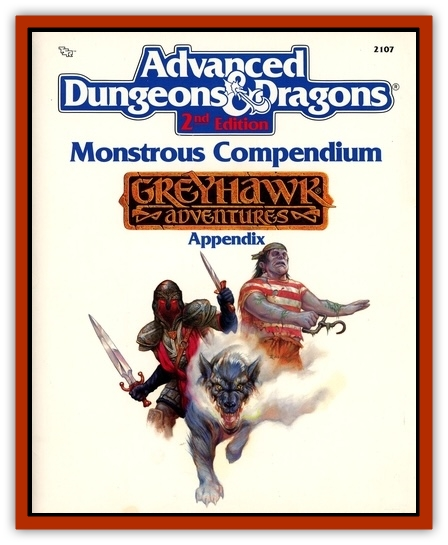

# Plasmoid - General Information

Plasmoids are a group of beings that have no set shape. Space sages theorize that the simple amoeba magically developed into the various oozes, slimes, and jellies, and these in turn developed into the species of plasmoids. All plasmoids can alter their shape at will.

**Plasmoid Biology: **Plasmoids are extremely dextrous, able to manipulate every fiber of their being. When plasmoids sleep or lose consciousness, they lose their rigidity and ooze to conform to the area they are in. This can be a very dangerous thing for plasmoids, thus they select their sleeping chambers with great care.

Plasmoids can alter the fibers of their bodies to form interior pouches for carrying items, limbs to use as legs, arms, tails, heads, etc., and air pockets that can be squeezed to produce sound.

Their nerves are massed into groups called ganglia. These can be sensitized to detect light, heat, texture, sound, pain, and vibrations. They can partially expose their ganglia in order to adjust the sensitivity of their various perceptions. Thus, they could hear a butterfly up to 100 yards away, or totally cover these nerves to become effectively deaf. However, if they are listening to a butterfly and someone makes a noise as loud as common speech, it is very likely that this will damage their ganglia, as they do not have the built-in protective responses which normal ears have. Thus they typically keep their senses at a normal (human) level and only alter them in extreme situations.

Plasmoids do not have internal organs as we know them. Their bodies are composed of tiers, generic cells, plasma-like ooze, excretion sacs, and nerves. They can manipulate their fibers to function as muscle tissue. Generic cells can form lining, covering, and cavities. The cavities are filled with carried items, acid for digestion and attack, food, drink, liquid for rigidity, and air for bodily functioning (breathing) and speech. They speak by forcing air out of tubular cavities that constrict to produce sound. The plasma is used for transportation of bodily fluids, energy to fibers, etc. Finally their tiny excretion sacs convert digested food into chemicals - acid, energy compounds, etc.

The only constant organ of a plasmoid is its brain, which is simply a giant mass of nerves like a huge ganglia.

Plasmoids breathe by absorbing oxygen through exposed plasma. Thus they must have an oozy area exposed to the air. They eat by surrounding food like an amoeba. Thus, they need no real mouths. Yet, it is not uncommon for them to form a mouth-like cavity simply to appease other races and to protect their plasma. Since they can store air within their bodies, they can "hold their breath" for up to an hour. Furthermore, their immunity to poison and other toxins enables them to treat each category of air quality as one better.

Most plasmoids have the ability to form some type of bodily coating. This coating and its use varies from one species to the next.

Plasmoids excrete by oozing their bodily waste products from pores. They tend to do this constantly, which produces a slime trail wherever they go. Since they don't detect odor, they have a hard time understanding other races' revulsion to this act.

All plasmoids reproduce by joining with another of their species, exchanging DNA material, and then at any latter time desired (from instantly to years in the future), they simply divide in hall. One of the plasmoid is the original; the other is a near duplicate except it starts with only a base knowledge (whatever the parent could spare).

Plasmoids can alter their mass and weight as well as their form. This is done by absorbing a lot of food and drink and growing just as a water balloon does. They can manufacture more fibers, nerves, and cells to accommodate this larger size. Of course this takes time, just as it takes time for a human to gain weight. Shrinking is a nearly instantaneous process; the plasmoid simply divides, leaving a blob of unwanted body material behind.

A large plasmoid can last for several months without eating, but it must absorb Iiquids at least once a day or it will dry out (1d8 points of damage per day).

Because plasmoids can alter their fiber composition, they can also alter their strength. If they put all of their fibers into one large body muscle, they can lift massive weights.

Plasmoids are all very heavy because of their liquid content.

**Conmbat: **All known plasmoids are immune to disease and poisons of all types. Acid does not harm them unless massive quantities (a barrel or more) is used. Cold-based attacks only slow them down unless the temperature is extreme. Heat causes great damage to a prismoid, as it dries them out. Unless a plasmoid is in a protective covering, exposure to dry environments (such as a desert) causes 1d8 points of damage every day.

Piercing weapons tend to cause little to no damage to a plasmoid, because of their plasma composition. Slashing weapons are a little more effective, while bludgeoning attacks cause full damage.

Plasmoids are capable of attacking with multiple limbs. These can wield weapons, if the plasmoid desires. Because they have tremendous control over their bodies, there is no penalty for the number of attacks listed above. However, each additional attacking limb above the indicated number causes a -2 cumulative penalty to all limbs' attack rolls. Shield-wielding limbs count as attacking limbs. Legs and other nonattacking limbs, no matter how many, don't count. Each shield lowers a plasmoid's AC by 1.

Plasmoids are usually most proficient with bludgeoning weapons, as these are most effective upon enemy plasmoids. Piercing weapons are shunned. They also prefer not to wear armor as it hampers their ability to transform. However, shields are widely used.

**Habitat/Society: **Most plasmoidal societies are of the clan type. There is a hierarchy among the clan, but it is rarely enforced or attended to. Plasmoids have very strong ties to others of their species. It is very rare for plasmoids of enemy camps to directly combat one another. Space sages theorize that this is because all plasmoids came from a single original plasmoid of its species and thus they are all pseudo-clones of one another.

Plasmoids love treasure and power. Thus adventuring has attracted their attention, particularly space with its endless possibilities. Plasmoids enjoy philosophical debates, storytelling, and they are commonly employed in the political arena because of their near-tireless ability to speak about nothing at great length.

Plasmoids are easily entertained and nearly as easily fascinated. They have a child-like curiosity that frequently lands them in undesirable situations. A final bad habit of plasmoids is their tendency to eat (absorb) things at random, occasionally things of importance to other beings.

Plasmoid loyalty is a thing of legend. Thus the saying, "If you want a friend to stick with you into the void, choose a plasmoid." However, this doesn't mean that they are beyond deceit.

**Ecology: **Plasmoids have a near scavenger-like appetite. Since they cannot taste or smell and are immune to disease, poison, and most acid, they eat virtually anything. Nondigestible matter is simply expelled at a later time. Their body acids are strong enough to eat through anything but metal, stone, and glass. In fact, the first plasmoid venture into space failed simply because they used a wooden vessel, which they absentmindedly snacked upon when bored. Plasmoids have been banished from the orgamic [[Elf|elven]] ships.

The only natural enemy of plasmoids is the greatly feared [[Burbur|burbur]]. Of course, they generally dislike most fire-breathing creatures as well.

---
## Discovery & Documentation

**Source Publication:** MC5 Greyhawk Appendix (1989)
**Campaign Setting:** Advanced Dungeons & Dragons 2nd Edition
**Author(s):** Grant Boucher, William W. Connors, Steve Gilbert, Bruce Nesmith, Chris Mortika, Skip Williams

### Other Creatures Found in This Source Book
   * [[Aspis|Aspis]]
   * [[Beastman|Beastman]]
   * [[Bonesnapper|Bonesnapper]]
   * [[Booka|Booka]]
   * [[Brownie_Buckawn|Brownie, Buckawn]]
   * [[Brownie_Quickling|Brownie, Quickling]]
   * [[Crystalmist|Crystalmist]]
   * [[Dragon_Cloud|Dragon, Cloud]]
   * [[Dragon_Oerth_Greyhawk|Dragon (Oerth), Greyhawk]]
   * [[Dragonfly_Giant|Dragonfly, Giant]]
   * [[Dragonnel|Dragonnel]]
   * [[Elf_Grugach|Elf, Grugach]]
   * [[Elf_Valley|Elf, Valley]]
   * [[Golem_Necrophidius|Golem, Necrophidius]]
   * [[Grell_Wild|Grell, Wild]]
   * [[Grung|Grung]]
   * [[Hobgoblin_Norker|Hobgoblin, Norker]]
   * [[Hook_Horror|Hook Horror]]
   * [[Horgar|Horgar]]
   * [[Hound_Yeth|Hound, Yeth]]
   * [[Iguana_Giant|Iguana, Giant]]
   * [[Ingundi|Ingundi]]
   * [[Kech|Kech]]
   * [[Kyuss_Son_of|Kyuss, Son of]]
   * [[Mite|Mite]]
   * [[Needleman|Needleman]]
   * [[Plant_Carnivorous_Oerth|Plant, Carnivorous (Oerth)]]
   * [[Plant_Carnivorous_Vampire_Cactus|Plant, Carnivorous, Vampire Cactus]]
   * [[Rat_Oerth|Rat (Oerth)]]
   * [[Raven_Crow|Raven/Crow]]
   * [[Scarecrow|Scarecrow]]
   * [[Shadow_Slow|Shadow, Slow]]
   * [[Skulk|Skulk]]
   * [[Snail|Snail]]
   * [[Sprite|Sprite]]
   * [[Taer|Taer]]
   * [[Tentamort|Tentamort]]
   * [[Turtle_Giant|Turtle, Giant]]
   * [[Tyrg|Tyrg]]
   * [[Wolf_Mist|Wolf, Mist]]
   * [[Wraith_Oerth|Wraith (Oerth)]]
   * [[Zygom|Zygom]]
