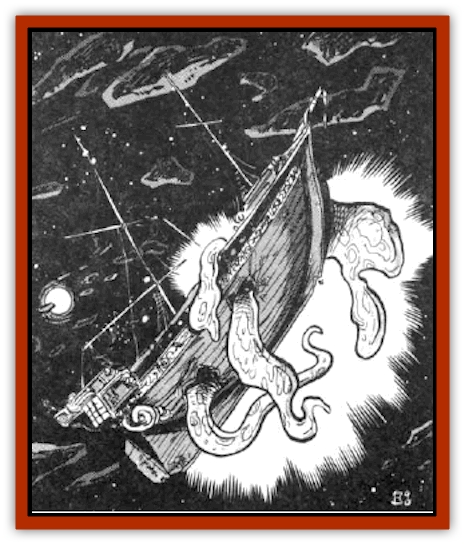

# Plasmoid - Ontalak

| Statistic | **Plasmoid, Ontalak** |
| --- | --- |
| **Activity Cycle:** | When approached |
| **Alignment:** | Neutral |
| **Armor Class:** | 8 |
| **Climate/Terrain:** | Any remote |
| **Damage/Attack:** | 1-8 hull points or 2-20 |
| **Diet:** | Scavenger |
| **Frequency:** | Very rare |
| **Hit Dice:** | 16+ |
| **Intelligence:** | Low (5-7) |
| **Magic Resistance:** | 10% |
| **Morale:** | Champion (15) |
| **Movement:** | 3 |
| **No. Appearing:** | 1 |
| **No. of Attacks:** | 1 or multiple |
| **Organization:** | Solitary |
| **Size:** | G (as per ship) |
| **Special Attacks:** | Acid |
| **Special Defenses:** | See below |
| **THAC0:** | 10 |
| **Treasure:** | A |
| **XP Value:** | 17,000 |

Ontalaks can produce a covering made of fibrous material that has the density of any material from brass to cloth. They have learned to make coverings of interest to those they feed upon.

A common ontalak tactic in wildspace is to form the covering to resemble a wrecked ship. When spacefaring adventurers come along, they will often stop at the wrecked ship to investigate and plunder her. When the ontalak becomes aware of the presence of others, it waits until the ship gets close enough to attack or the crew boards it. It then attacks for the sole purpose of gaining food.

Ontalaks enter a dormant state when not in combat. In this state an ontalak can last for years between feedings.

Ontalaks can stretch their pseudopods to the limit of their air bubble. The smallest ontalak ever found had 16 Hit Dice and was the size of a wasp spelljammer; most specimens are larger.

Ontalaks create a large ball that is kept in their interiors; when a heavy concentration of ontalak acid is poured onto it, it functions as a maior spelljamming helm. Ontalaks can move overland like [[Plasmoid_DeGleash|deGleash]], but this is a relatively slow process due to the ontalaks great size (movement of 3).

**Combat:** Ontalaks attack with giant pseudopods that come up out of the hatch, cracks in the deck, and other areas of the "ship" they form. These cause 2d10 points of damage each. The number of such pseudopods any given ontalak can create equals the average crew complement of the ship it is masquerading as. At best an ontalak can attack a single, man-sized opponent with only two of its pseudopods. These attacks are with a THAC0 of 10 because it sees its opponents via many tiny nerve endings scattered over its pseudopods like hair, resulting in a rather blurry picture.

Any attack roll of a natural 20 by an ontalak means that it has grasped its opponent. In this case, roll 1d4 to determine what it will do with the victim:

<ol><li>Retract the pseudopod and absorb the victim for digestion</li><li>Toss into space</li><li>Extend to edge of air envelope and drop victim (falling dmg)</li><li>Smash victim into deck and opponents (2d10 dmg)</li></ol>An absorbed victim suffers 2d20 points of acid damage per round and escape is virtually impossible. Someone trapped within can attack with a dagger or smaller weapon if it is in hand.

Ontalaks can also pump their digestive acid up through a special pseudopod that they always have ready. This pseudopod looks like a plunger and can fasten itself onto the hull of an enemy vessel. Once attached, it can cause 1d6 points of hull damage per round if it concentrates fully on the attack. Ontalaks often grab the ship with their other pseudopods and pull it closer.

Most ontalak pseudopods are from one to three feet in diameter, thus they can be cut off only by a *vorpal blade* or a *sword of sharpness*. To stop any one pseudopod from functioning, the entire being must be killed. Ontalaks suffer no damage from piercing weapons, half damage form slashing weapons, and full damage from bludgeoning weapons. Fire-based attacks cause double damage. Cold-based attacks have no effect. As with all [[Plasmoid_General_Information|plasmoids]], they are immune to poison and disease. They are also completely immune to acid.

An ontalak's ship-like covering has the same statistics as a real ship of that type (hull points, SR = 2, NR = D, and saves as soft metal). Once the hull is destroyed, the ontalak retracts all pseudopods and covers itself in a thick excretion of tar-like acid (1d12 points of damage per round of contact). It also tries to spelljam away if possible. Note that all damage upon the fake hull is calculated normally, and this damage also affects the ontalak. However, such damage is adjusted as per the ontalak's plasmoidal properties (ballistae do nothing to it, for example).

**Habitat/Society:** Ontalaks rarely encounter each other except for breeding purposes. Reports say that a huge armada of ghost ships gathers in deep wildspace once a year.

Ontalaks can be found masquerading as other things, such as a wooden house in a forest, a ghost ship on the high seas, and occasionally a haunted house. Ontalaks sometimes re-absorb their covering and live in a real abandoned ship or dwelling.

**Ecology:** As with all plasmoids, ontalaks eat nearly anything they can digest. If an ontalak is killed, it releases an acid that causes damage to its covering equal to half its hull points.

---
## Discovery & Documentation

**Source Publication:** MC7 Spelljammer Appendix I (1990)
**Campaign Setting:** Advanced Dungeons & Dragons 2nd Edition
**Author(s):** various

### Other Creatures Found in This Source Book
   * [[Aartuk|Aartuk]]
   * [[Albari|Albari]]
   * [[Ancient_Mariner|Ancient Mariner]]
   * [[Argos|Argos]]
   * [[Beholder_Abomination_Astereater|Beholder (Abomination), Astereater]]
   * [[Blazozoid|Blazozoid]]
   * [[Chattur|Chattur]]
   * [[Chevall|Chevall]]
   * [[Clockwork_Horror|Clockwork Horror]]
   * [[Colossus|Colossus]]
   * [[Delphinid|Delphinid]]
   * [[Dizantar|Dizantar]]
   * [[Dog|Dog]]
   * [[Dog_Bog_Hound|Dog, Bog Hound]]
   * [[Esthetic|Esthetic]]
   * [[Focoid|Focoid]]
   * [[Fractine|Fractine]]
   * [[Giant_Spacesea|Giant, Spacesea]]
   * [[Golem_Furnace|Golem, Furnace]]
   * [[Golem_Radiant|Golem, Radiant]]
   * [[Gravislayer|Gravislayer]]
   * [[Grommam|Grommam]]
   * [[Hadozee|Hadozee]]
   * [[Hamster_Giant_Space|Hamster, Giant Space]]
   * [[Jammer_Leech|Jammer Leech]]
   * [[Lakshu|Lakshu]]
   * [[Lumineaux|Lumineaux]]
   * [[Lutum|Lutum]]
   * [[Mimic_Space|Mimic, Space]]
   * [[Misi|Misi]]
   * [[Moon_Rogue|Moon, Rogue]]
   * [[Mortiss|Mortiss]]
   * [[Murderoid|Murderoid]]
   * [[Nay-Churr|Nay-Churr]]
   * [[Phlog-Crawler|Phlog-Crawler]]
   * [[Plasman|Plasman]]
   * [[Plasmoid_DeGleash|Plasmoid, DeGleash]]
   * [[Plasmoid_DelNoric|Plasmoid, DelNoric]]
   * [[Plasmoid_General_Information|Plasmoid, General Information]]
   * [[Puffer|Puffer]]
   * [[Q'nidar|Q'nidar]]
   * [[Rastipede|Rastipede]]
   * [[Reigar|Reigar]]
   * [[Rock_Hopper|Rock Hopper]]
   * [[Slinker|Slinker]]
   * [[Spider_Asteroid|Spider, Asteroid]]
   * [[Spiritjam|Spiritjam]]
   * [[Survivor|Survivor]]
   * [[Syllix|Syllix]]
   * [[Symbiont_Power|Symbiont, Power]]
   * [[Vine_Infinity|Vine, Infinity]]
   * [[Wiggle|Wiggle]]
   * [[Wizshade|Wizshade]]
   * [[Wryback|Wryback]]
   * [[Zard|Zard]]
   * [[Zodar|Zodar]]
