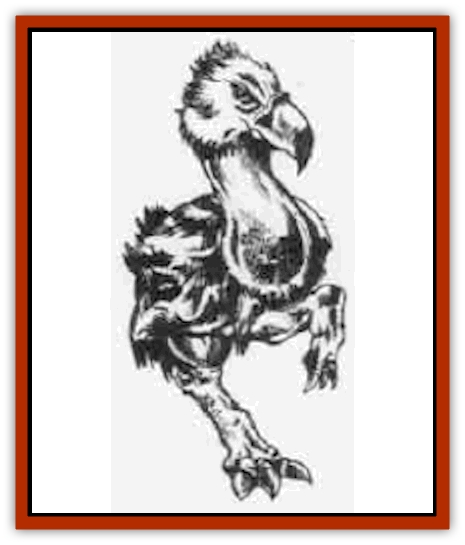
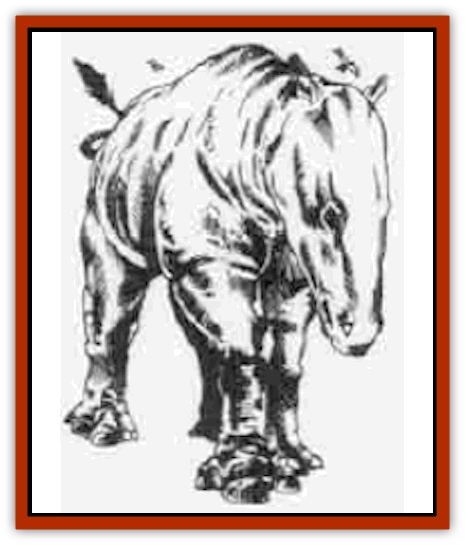
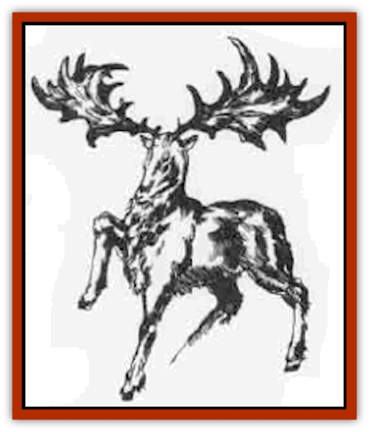
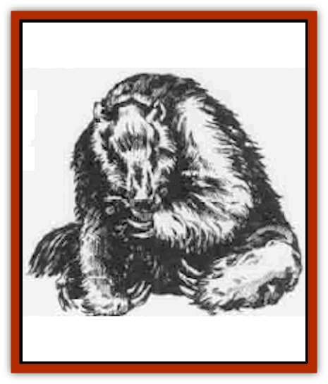
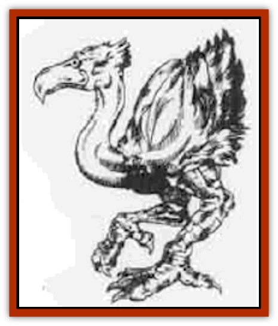
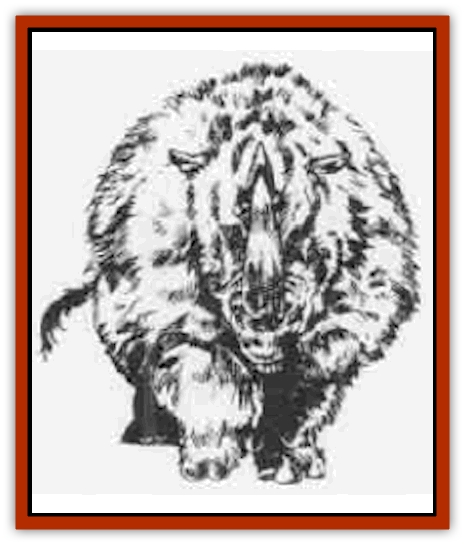
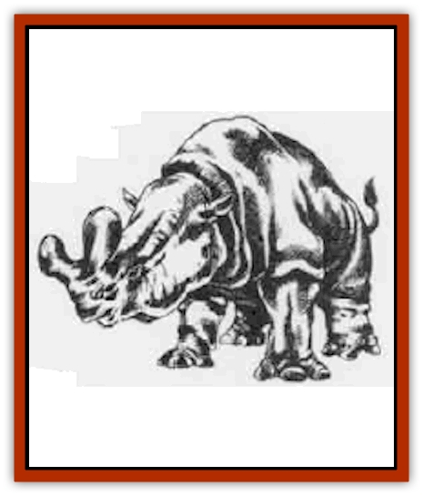

# Pleistocene Animal

| Statistic | **Axebeak** | **Balucitherium** | **Irish Deer** | **Megatherium** | **Phororhacos** | **Titanothere** | **Wooly Rhinoceros** |
| --- | --- | --- | --- | --- | --- | --- | --- |
| **Activity Cycle:** | Carnivore | Day | Day | Any | Day | Day | Day |
| **Alignment:** | Neutral | Neutral | Neutral | Neutral | Neutral | Neutral | Neutral |
| **Armor Class:** | 6 | 5 | 7 | 6 | 6 | 6 | 5 |
| **Climate/Terrain:** | Plains | Plains | Forest | Forest | Plains | Plains | Plains |
| **Damage/Attack:** | 1d3/1d3/2d4 | 5d4/5d4 | 2d6 (2d6) | 2d6/2d6 | 1d4/1d4/2d6 | 2d8 | 2d6 |
| **Diet:** | Day | Herbivore | Herbivore | Herbivore | Carnivore | Herbivore | Herbivore |
| **Frequency:** | Uncommon | Rare | Rare | Uncommon | Uncommon | Uncommon | Common |
| **Hit Dice:** | 3 | 14 | 4 | 10 | 7+7 | 12 | 10 |
| **Intelligence:** | Animal (1) | Semi- (2-4) | Animal (1) | Animal (1) | Animal (1) | Animal (1) | Animal (1) |
| **Magic Resistance:** | Nil | Nil | Nil | Nil | Nil | Nil | Nil |
| **Morale:** | Unsteady (5-7) | Average (8-10) | Average (8-10) | Average (8-10) | Average (8-10) | Average (8-10) | Average (8-10) |
| **Movement:** | 18 | 12 | 18 | 6 | 15 (+1 jump) | 12 | 12 |
| **No. Appearing:** | 1-6 | 1-3 | 1-8 | 1-6 | 2-12 | 1-12 | 1-4 |
| **No. of Attacks:** | 3 | 2 | 1 (2) | 2 | 3 | 1 | 1 |
| **Organization:** | Flock | Solitary | Herd | Solitary | Flock | Herd | Herd |
| **Size:** | L (7' tall) | H (25') | L (7') | H (20') | L (10') | H (16') | L (15') |
| **Special Attacks:** | Nil | Nil | Nil | Nil | Jump | Trample | Charge |
| **Special Defenses:** | Nil | Nil | Nil | Nil | Nil | Nil | Nil |
| **THAC0:** | 17 | 7 | 17 | 11 | 13 | 9 | 11 |
| **Treasure:** | Nil | Nil | Nil | Nil | Nil | Nil | Nil |
| **XP Value:** | 65 | 8,000 | 120 | 1,400 | 650 | 2,000 | 1,400 |

**

Axebeak**

  Axebeaks are flightless, carnivorous [[Bird|birds]] that stand four feet tall at the shoulder. Axebeak markings resemble those of an [[Bird_Toril|ostrich]]. The immense head and long neck are covered in short white feathers. The body is covered in dense black feathers with a white underbelly and tail. The legs are covered in yellow scales.

The axebeak has a loud, honking voice that can be heard for a half mile. During mating time, the males make a thrumming sound like a bass violin. In combat, the bird hisses when not biting.

They are fast runners and aggressive hunters that pursue prey until fed or killed. They attack by kicking (1d3 points of damage per claw) and biting (2d4 points).

Axebeaks make crude nests of stones atop rocky outcroppings. During warm weather, there is a 25% chance that eggs or chicks are nearby. The chicks are 10%-80% grown with a proportionate number of Hit Dice. Immature axebeaks do not initiate combat, although they can defend themselves by biting for 1d4 points of damage.

Axebeak eggs and hatchlings are worth 50 to 80 gp. They can be raised as guards, hunters, and mounts. The long plume feathers of the wings and tail are worth 2 gp each.

**

Balucitherium**

  The balucitherium is a prehistoric, hornless ancestor of the [[Mammal_Herd_II|rhinoceros]]. It is a herbivore with a thick, grey-brown hide. The adult stands 15 to 18 feet at the shoulder and may measure up to 28 feet from nose to rump. The four-foot-long head swings on a thick, six-foot-long neck. The adult may weight up to 15 tons. It has poor eyesight but keen senses of hearing and smell.

The animal is very defensive. It tends to attack any animal it detects nearby. The beast attacks by trampling a foe with its front feet. Either hoof does 5d4 points of crushing damage.

Balucitheria are normally solitary creatures. If two are encountered, they are a mated pair. A third balucitherium is their calf. Roll a percentile die and multiply the result by 14 HD and 15 feet to determine the calf�s hit points and size.

If magically controlled or raised from a calf, a balucitherium can be trained to serve as a beast of burden. Its immense size and strength enable the beast to carry up to 8,000 pounds.

The hide is well-suited for making leather armor. An adult hide can be worth 50 to 100 gp.

**

Irish Deer**

  This moose-sized creature dwells in temperate climes. Its antlers spread to a width of 10 feet, and it can actually gore two opponents within this span if they are directly before the creature. Irish deer are not generally aggressive, but are very dangerous during rutting season.

**

Megatherium**

  The megatherium is a giant, ground-dwelling sloth about the size of a grizzly bear. An adult may stand 20 feet tall and weigh 6,000 pounds. It is covered in long, russet hair. The beast is slow moving but more powerful than most animals that might otherwise prey on it. Because of its slow nature, the megatherium always strikes last in the round.

Despite its awesome appearance, the megatherium is primarily a peaceful herbivore grazing the wooded plains.

Each forepaw has three foot-long claws. These are primarily used to tear apart trees and shrubs for food, but they can also be used as weapons. The megatherium rears on its hind legs, then attacks with swipes that cause 2d6 points of damage from each paw.

The female megatherium gives birth to 1 or 2 cubs every other year. Cubs grow to maturity in four years and are found in 33% of all encounters.

**

Phororhacos**

  The phororhacos is a nonflying bird with a huge head and powerful beak. It stands ten feet tall (six feet at the shoulder). It is covered with dark gray and brown feathers. An adult male will have a red crest and a tuft of brilliant orange feathers on the back of its head. The legs are light gray with black claws.

The phororhacos has a deep, braying voice. The bird will emit a fierce battle cry when fighting or challenging another male over territory.

Phororhacos gather in hunting and breeding packs. There is a 10% chance for either eggs or chicks in an encounter. The chicks have 10-80% of full growth with a proportionate numbr of Hit Dice. Chicks do not attack an active foe, but they do tear into a helpless vicitm in imitation of the adults.

It is a fearless killer and attacks even if it is outnumbered. It initiates an attack by jumping on its victim. When it is jumping to attack, its claws inflict double damage (2d4/2d4). Each round thereafter, the phororhacos kicks and claws for 1d4 points of damage per blow. It also snaps with its beak for 2d6 points of damage. If the phororacos successfully bites a target smaller than man-sized, it picks up the victim and shakes it around before throwing it back to the ground (1d6 points of falling damage. Such victims are unable to take any action the following round.

Phororhacos eggs and hatchlings are worth 70 to 100 gp. They can be raised as guards, hunters, and mounts.

**

Wooly Rhinoceros**

  The wooly rhinoceros is similar to the modern rhino except that it is covered by a shaggy, russet coat and roams cold, temperate, and subarctic regions. It is an aggressive, belligerent herbivore that is very defensive about its territory.

The wooly rhino has poor eyesight but keen senses of hearing and smell, When one detects an intruder, the wooly rhino charges. The horn inflicts 2d6 points of damage, double if it strikes while charging. Man-sized or smaller targets are also tossed 10 to 20 feet by the force of the blow. The wooly rhino can trample man-sized or smaller victims, each foreleg causing 2d4 points of damage.

A wooly rhino will charge wagons or other vehicles, thinking them animals. Such charges deliver a crushing blow to the vehicle. An enraged wooly rhino can smash a wagon apart with little effort.

If two or three wooly rhinos are encountered, one is female. If four are encountered, the last one is a calf (30% to 60% of adult size). Adults gain +1 bonuses to their attack rolls if the calf is threatened. Wooly rhinos rarely abandon a captured or injured mate or offspring.

An adult hide is worth 20 to 30 gp; the thick skin is well suited for making armor. The horn is worth 10 to 20 gp to alchemists who use it in counterfeit healing potions.

**

Titanothere**

  The titanothere, also known as the *brontotherium*, is a rhino-like animal. The adult measure eight feet at the shoulder and 16 from nose to rump and weighs up to 8,000 pounds.

It is a huge and fearless herbivore armed with a yoke-shaped horn on its nose. The horn can be used to ram an opponent for 2d8 points of damage. Opponents of man-sized or smaller are also tossed up to 20 feet int the air by the force of the blow, It can trample man-sized or smaller victims with its forelegs, inflicting 2d4 points of damage with each foot.

If any creature threatens the herd, the bulls charge. If the charge strikes home, horn and trample damage is doubled.

If more than six titanotheres are encountered, there are 1d4 calves. The calves are 10 to 80% grown. They do not attack. If threatened, they head for their mothers and try to hide underneath or behind them.

The titanothere's hide is worth 20 to 70 gp. It is extremely thick and well-suited for making leather armor, especially for larger humanoids or other armor-wearing beings.

**Other Pleistocene Animals**

  Creatures from this time period detailed elsewhere include the [[Bear|cave bear]], [[Boar|giant boar]], [[Cat_Great|spotted lion/smilodon]], [[Elephant|mammoth/mastodon]], [[Human|aborigine/cavemen]], and [[Wolf|dire wolf]].

---
## Discovery & Documentation

**Source Publication:** Monstrous Compendium, 1995 Annual, Volume 2 (1995)
**Campaign Setting:** Advanced Dungeons & Dragons 2nd Edition
**Author(s):** Jon Pickens

### Other Creatures Found in This Source Book
   * [[Aboleth_Savant|Aboleth, Savant]]
   * [[Addazahr|Addazahr]]
   * [[Amiq_Rasol|Amiq Rasol]]
   * [[Arch-Shadow|Arch-Shadow]]
   * [[Automaton_Scaladar|Automaton, Scaladar]]
   * [[Automaton_Trobriand's|Automaton, Trobriand's]]
   * [[Bat_Sporebat|Bat, Sporebat]]
   * [[Beetle_Dragon|Beetle, Dragon]]
   * [[Bi-nou|Bi-nou]]
   * [[Boggle|Boggle]]
   * [[Brownie_Dobie|Brownie, Dobie]]
   * [[Brownie_Quickling|Brownie, Quickling]]
   * [[Cat_Crypt|Cat, Crypt]]
   * [[Cat_Great_Cath_Shee|Cat, Great, Cath Shee]]
   * [[Centaur-kin_Dorvesh|Centaur-kin, Dorvesh]]
   * [[Centaur-kin_Gnoat|Centaur-kin, Gnoat]]
   * [[Centaur-kin_Ha'pony|Centaur-kin, Ha'pony]]
   * [[Centaur-kin_Zebranaur|Centaur-kin, Zebranaur]]
   * [[Chronolily|Chronolily]]
   * [[Curst|Curst]]
   * [[Darktentacles|Darktentacles]]
   * [[Dinosaur_Aquatic|Dinosaur, Aquatic]]
   * [[Dinosaur_II|Dinosaur II]]
   * [[Dinosaur_III|Dinosaur III]]
   * [[Doppelganger_Greater|Doppelganger, Greater]]
   * [[Dragon_Brine|Dragon, Brine]]
   * [[Dragon_Half-|Dragon, Half-]]
   * [[Dragon-kin_Sea_Wyrm|Dragon-kin, Sea Wyrm]]
   * [[Dwarf_Wild|Dwarf, Wild]]
   * [[Ekimmu|Ekimmu]]
   * [[Elemental_Nature|Elemental, Nature]]
   * [[Elf_Winged|Elf, Winged]]
   * [[Fish_Great_Glacier|Fish (Great Glacier)]]
   * [[Fish_Subterranean|Fish, Subterranean]]
   * [[Fish_Toril|Fish (Toril)]]
   * [[Flareater|Flareater]]
   * [[Flumph|Flumph]]
   * [[Froghemoth|Froghemoth]]
   * [[Ghost_Casurua|Ghost, Casurua]]
   * [[Ghost_Ker|Ghost, Ker]]
   * [[Ghul|Ghul]]
   * [[Ghul-Kin|Ghul-Kin]]
   * [[Giant_Half-giant|Giant, Half-giant]]
   * [[Golem_Burning_Man|Golem, Burning Man]]
   * [[Golem_Phantom_Flyer|Golem, Phantom Flyer]]
   * [[Gulguthhydra|Gulguthhydra]]
   * [[Hakeashar|Hakeashar]]
   * [[Horse_Moon-|Horse, Moon-]]
   * [[Human_Dragonslayer|Human, Dragonslayer]]
   * [[Human_Vistana|Human, Vistana]]
   * [[Jellyfish_Giant|Jellyfish, Giant]]
   * [[Kalin|Kalin]]
   * [[Kholiathra|Kholiathra]]
   * [[Laerti|Laerti]]
   * [[Leucrotta_Greater|Leucrotta, Greater]]
   * [[Lich_Suel|Lich, Suel]]
   * [[Lurker_Shadow|Lurker, Shadow]]
   * [[Lycanthrope_Werepanther|Lycanthrope, Werepanther]]
   * [[Lycanthrope_Wereshark|Lycanthrope, Wereshark]]
   * [[Mammal_Herd_II|Mammal, Herd II]]
   * [[Marl|Marl]]
   * [[Meenlock|Meenlock]]
   * [[Mimic_Greater|Mimic, Greater]]
   * [[Mold_II|Mold II]]
   * [[Mummy_Creature|Mummy, Creature]]
   * [[Nyth|Nyth]]
   * [[Ooze_Slime_Jelly_Ghaunadan|Ooze/Slime/Jelly, Ghaunadan]]
   * [[Palimpsest|Palimpsest]]
   * [[Peltast|Peltast]]
   * [[Plant_Dangerous_II|Plant, Dangerous II]]
   * [[Pudding_Subterranean|Pudding, Subterranean]]
   * [[Raggamoffyn|Raggamoffyn]]
   * [[Snake_Serpent|Snake, Serpent]]
   * [[Snake_Serpent_Vine|Snake, Serpent Vine]]
   * [[Sphinx_Draco-|Sphinx, Draco-]]
   * [[Sprite_Seelie_Faerie|Sprite, Seelie Faerie]]
   * [[Sprite_Unseelie_Faerie|Sprite, Unseelie Faerie]]
   * [[Squealer|Squealer]]
   * [[Turtle_Giant|Turtle, Giant]]
   * [[Umpleby|Umpleby]]
   * [[Vizier's_Turban|Vizier's Turban]]
   * [[Wall_Walker|Wall Walker]]
   * [[Webbird|Webbird]]
   * [[Yak-Man|Yak-Man]]
   * [[Zorbo|Zorbo]]
