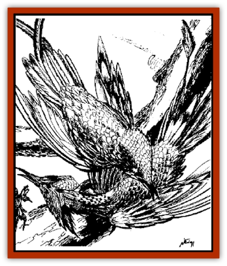

# Plumazotl

| Statistic | **Greater** | **Lesser** |
| --- | --- | --- |
| **Activity Cycle:** | Any | Any |
| **Alignment:** | Any good | Any good |
| **Armor Class:** | 3 | 3 |
| **Climate/Terrain:** | Any | Any |
| **Damage/Attack:** | 1-6/1-6/1-6 | 1-4/1-4/1-4 |
| **Diet:** | Special | Special |
| **Frequency:** | Very rare | Very rare |
| **Hit Dice:** | 6 to 10 | 1 to 5 |
| **Intelligence:** | High (13-14) | Very (11-12) |
| **Magic Resistance:** | 5% per Hit Die | 5% per Hit Die |
| **Morale:** | Champion (16) | Elite (13) |
| **Movement:** | 9, Fl 48 | 3, Fl 12 |
| **No. Appearing:** | 1 (1-2) | 1 |
| **No. of Attacks:** | 3 | 3 |
| **Organization:** | Solitary | Solitary |
| **Size:** | M (5') to L (10') | T (3&rdquo;) to S (4') |
| **Special Attacks:** | Spell use | Spell use |
| **Special Defenses:** | Hit only by magical weapons | Hit only by magical weapons |
| **THAC0:** | 6 HD: 15 / 7 to 8 HD: 13 / 9 to 10 HD: 11 | 1 to 2 HD: 19 / 3 to 4 HD: 17 / 5 HD: 15 |
| **Treasure:** | Special | Special |
| **XP Value:** | 6 HD: 3,000 / 7 HD: 4,000 / 8 HD: 5,000 / 9 HD: 6,000 / 10 HD: 7,000 | 1 HD: 270 / 2 HD: 420 / 3 HD: 650 / 4 HD: 975 / 5 HD: 2,000 |

Payit legends tell of a time long ago when a powerful plumaweaver, Itzamna Manik, set out to create life with his magic. After many years of labor, using spells that have long been forgotten, he created a plumazotl, a living creature of pluma. The gods destroyed Itzamna Manik for his audacity, but some of his creations managed to escape and reproduce. Their descendants still inhabit lonely spots in Maztica. These rare creatures are composed completely of brightly colored feathers. They commonly take the forms of [[Bird|birds]], although some have a humanoid shape. Their sizes range from that of a hummingbird to that of a [[Eagle|giant eagle]]. Plumazotl have very musical voices, and generally speak an ancient form of Payit as well as the language of intelligent species that dwell near them.

**Combat:** Plumazotl are peaceful creatures, and they generally avoid combat if possible. If forced into combat, an individual defends itself with bites and clawing attacks. A plumazotl may use pluma magic. Lesser plumazotl cast spells as if they were plumaweavers of levels equivalent to their Hit Dice. Greater plumazotl have better spellcasting powers; those with 6 HD cast as 7th level plumaweavers, 7 HD as 8th level, 8 HD as 10th level, 9 HD as 12th level, and those with 10 HD cast as 14th level plumaweavers.

Plumazotl are especially vulnerable to fire and take double damage from all fire-based attacks.

**Habitat/Society:** The first of these creatures were given life hundreds of years ago. Granted intelligence and a will to survive, they became a true race and learned to feed and reproduce.

Plumazotl tend to live far from any civilization. They use their spellcasting abilities to create wonders in their homes, which eventually become safe, peaceful places filled with color and music. Though they prefer to live alone, they are unafraid of humans, and sometimes appreach them to gain news of what is happening in the outside world. They offer tidbits of information in exchange for a brief conversation, but if given a bit of pluma magic, they become quite friendly and relate any desired information to the best of their ability. These visits are rare and brief, because it takes only a short time to satisfy a plumazotl's curiosity about the outside.

Though generally solitary, a pair of greater plumazotl sometimes comes together to mate. In a dazzling ritual, they pluck feathers from one another's bodies, form them into small images of birds or humans, then infuse them with a bit of their magic. These small creatures are lesser plumazotl with 1 Hit Die. A pair of greater plumazotl produces one or two offspring in this way before parting ways.

Most plumazotl grow very slowly, finding bright feathers to add to their own bodies. If one finds or is given a pluma *talisman*, however, it may incorporate the magic of the item, growing by one or more Hit Dice, depending on the power of the *talisman*.

When lesser plumazotl reach the height of their growth, they begin searching for more and more material to incorporate into their forms. After they acquire enough, or one pluma *talisman*, they metamorphose into greater plumazotl.

**Ecology:** Plumazotl feed on feathers and pluma magic, adding items directly into their bodies. *Talismans* are broken into their component parts before being absorbed.

Plumazotl have no natural enemies, though sometimes men hunt them for their inherent magic. If killed, a plumazotl produces a quantity of feathers suitable for featherweaving and pluma magic. A greater plumazotl may yield enough feathers for a *blanket of featherweaving*.

---
## Discovery & Documentation

**Source Publication:** Maztica (boxed set) (1998)
**Campaign Setting:** Maztica (Forgotten Realms)
**Author(s):** Douglas Niles

### Other Creatures Found in This Source Book
   * [[Chac|Chac]]
   * [[Jagre|Jagre]]
   * [[Kamatlan|Kamatlan]]
