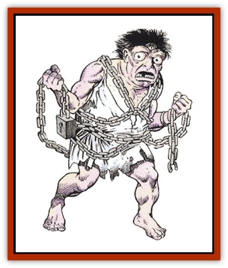

# Poltergeist

| Statistic | **Poltergeist** |
| --- | --- |
| **Activity Cycle:** | Night |
| **Alignment:** | Lawful evil |
| **Armor Class:** | 10 |
| **Climate/Terrain:** | Subterranean |
| **Damage/Attack:** | Nil |
| **Diet:** | None |
| **Frequency:** | Rare |
| **Hit Dice:** | ½ |
| **Intelligence:** | Low (5-7) |
| **Magic Resistance:** | Nil |
| **Morale:** | Average (10) |
| **Movement:** | 6 |
| **No. Appearing:** | 1-8 |
| **No. of Attacks:** | 1 |
| **Organization:** | Group |
| **Size:** | M (6' tall) |
| **Special Attacks:** | Fear |
| **Special Defenses:** | Invisibility, silver or magical weapon to hit |
| **THAC0:** | 15 |
| **Treasure:** | Nil |
| **XP Value:** | 65 |

Poltergeists are the spirits of restless dead. They are similar to [[Haunt|haunts]] but are more malevolent. They hate living things and torment them constantly, by breaking furniture, throwing heavy objects, and making haunting noises. They are often, but not always, attached to a particular area.

Poltergeists are always invisible. Those who can see invisible objects describe them as humans whose features have been twisted at the sight of horrors. They wear rags and are covered with chains and other heavy objects that represent a multitude of evil deeds that these creatures have committed against themselves as well as others.

**Combat:** A poltergeist attacks by throwing a heavy object - any nearby object that a strong human can throw will suffice. It has the same chance to hit as a 5-HD monster (hence its adjusted THAC0 in the statistics given above). If the victim is struck he suffers no damage (treat the use of deadly weapons such as knives and swords as terrifying near misses), but he must roll a successful saving throw vs. spell or flee in terror in a random direction (choose available exits away from the poltergeist and determine randomly) for 2d12 rounds before recovering. There is a 50% chance that the victim drops whatever he was holding (he drops it at the start of his flight). Once a person rolls a successful saving throw, he is immune to further fear attempts by the poltergeist in that area.

Those who try to hit a poltergeist but cannot detect invisible objects suffer a -4 penalty to their attack roll. A poltergeist is harmed only by silver or magical weapons. Sprinkled holy water or a strongly presented holy symbol drives back a poltergeist but cannot harm it. Poltergeists that are bonded to the area of their death are hard to dispel; these are treated as if they were ghouls on the Turning Undead table. Wandering poltergeists may be turned or destroyed by a priest as if they were skeletons.

**Habitat/Society:** Some say that poltergeists are the spirits of those who committed heinous crimes that went unpunished in life. Whatever their origins, poltergeists are malevolent spirits whose activities can be anything from annoying to deadly. Their purpose in existence is to haunt and disrupt the lives of those who still live.

Poltergeists often haunt families and partnerships. In the latter case, they haunt their place of business, striking almost as much terror in death as they did in life.

A poltergeist is often strongly bonded to a particular place, the place where its corporeal existence ended. Bonded poltergeists almost never wander more than 100 feet from this place. A few are wandering spirits, doomed never to find their way home. Bonded spirits are stronger than wandering spirits (wanderers never have more than 3 hit points).

Places where poltergeists are particularly strong have been known to have *phantom shifts*. These extremely rare and terrifying illusions take the character encountering the poltergeist back in time, to the time when the poltergeist was still alive. They often reveal why the being was transformed into a poltergeist. Characters in a *phantom shift* may interact freely with the illusion, but any attempt to harm the illusion shatters it and returns the characters to the present time; likewise, any attempt on the part of the illusion to attack the characters also shatters the illusion without any harm being done. The illusion may continue at different times, or may repeat itself endlessly. No one can predict exactly when a place will experience a phantom shift, but they seem to occur on the anniversary of the poltergeist's death.

**Ecology:** These spirits, which are terrifying and pitiable at the same time, do not consume food and do not collect treasure. Poltergeists dissolve when slain or laid to rest.

---
## Discovery & Documentation

**Source Publication:** MC2 Volume II (1993)
**Campaign Setting:** Advanced Dungeons & Dragons 2nd Edition
**Author(s):** Jay Batista, Scott Bennie, Grant Boucher, William W. Connors, Steve Gilbert, Heike Kubasch, James Lowder, David Edward Martin, Bruce Nesmith, Jean Rabe, Rick Swan, John J. Terra, Gary L. Thomas

### Other Creatures Found in This Source Book
   * [[Ant|Ant]]
   * [[Ant_Lion_Giant|Ant Lion, Giant]]
   * [[Ape_Carnivorous|Ape, Carnivorous]]
   * [[Baboon|Baboon]]
   * [[Badger|Badger]]
   * [[Barracuda|Barracuda]]
   * [[Beetle_Giant|Beetle, Giant]]
   * [[Bulette|Bulette]]
   * [[Bullywug|Bullywug]]
   * [[Dwarf_Duergar|Dwarf, Duergar]]
   * [[Dwarf_Gully|Dwarf, Gully]]
   * [[Eagle|Eagle]]
   * [[Eel|Eel]]
   * [[Elemental_Air_Kin|Elemental, Air Kin]]
   * [[Elemental_Water_Kin|Elemental, Water Kin]]
   * [[Elemental_Water_Kin_Water_Weird|Elemental, Water Kin, Water Weird]]
   * [[Firestar|Firestar]]
   * [[Firetail|Firetail]]
   * [[Fish_Giant|Fish, Giant]]
   * [[Frog|Frog]]
   * [[Gorgon|Gorgon]]
   * [[Hawk|Hawk]]
   * [[Heucuva|Heucuva]]
   * [[Hippocampus|Hippocampus]]
   * [[Hippogriff|Hippogriff]]
   * [[Kelpie|Kelpie]]
   * [[Kenku|Kenku]]
   * [[Killmoulis|Killmoulis]]
   * [[Kuo-Toa|Kuo-Toa]]
   * [[Lamia|Lamia]]
   * [[Lammasu|Lammasu]]
   * [[Lamprey|Lamprey]]
   * [[Leech|Leech]]
   * [[Leprechaun|Leprechaun]]
   * [[Leucrotta|Leucrotta]]
   * [[Locathah|Locathah]]
   * [[Lycanthrope_Wereboar|Lycanthrope, Wereboar]]
   * [[Lycanthrope_Werefox|Lycanthrope, Werefox]]
   * [[Mammal_Minimal|Mammal, Minimal]]
   * [[Mammal_Small|Mammal, Small]]
   * [[Mimic|Mimic]]
   * [[Morkoth|Morkoth]]
   * [[Muckdweller|Muckdweller]]
   * [[Myconid|Myconid]]
   * [[Naga|Naga]]
   * [[Obliviax|Obliviax]]
   * [[Octopus_Giant|Octopus, Giant]]
   * [[Otyugh|Otyugh]]
   * [[Piranha|Piranha]]
   * [[Plant_Dangerous_I|Plant, Dangerous I]]
   * [[Plant_Intelligent|Plant, Intelligent]]
   * [[Porcupine|Porcupine]]
   * [[Rat_Osquip|Rat, Osquip]]
   * [[Roc|Roc]]
   * [[Roper|Roper]]
   * [[Rot_Grub|Rot Grub]]
   * [[Rust_Monster|Rust Monster]]
   * [[Sahuagin|Sahuagin]]
   * [[Sea_Lion|Sea Lion]]
   * [[Sea_Horse_Giant|Sea Horse, Giant]]
   * [[Shambling_Mound|Shambling Mound]]
   * [[Shark|Shark]]
   * [[Sphinx|Sphinx]]
   * [[Squid_Giant|Squid, Giant]]
   * [[Stirge|Stirge]]
   * [[Swanmay|Swanmay]]
   * [[Tarrasque|Tarrasque]]
   * [[Tasloi|Tasloi]]
   * [[Triton|Triton]]
   * [[Troglodyte|Troglodyte]]
   * [[Urchin|Urchin]]
   * [[Urd|Urd]]
   * [[Weasel|Weasel]]
   * [[Wolverine|Wolverine]]
   * [[Yellow_Musk_Creeper|Yellow Musk Creeper]]
