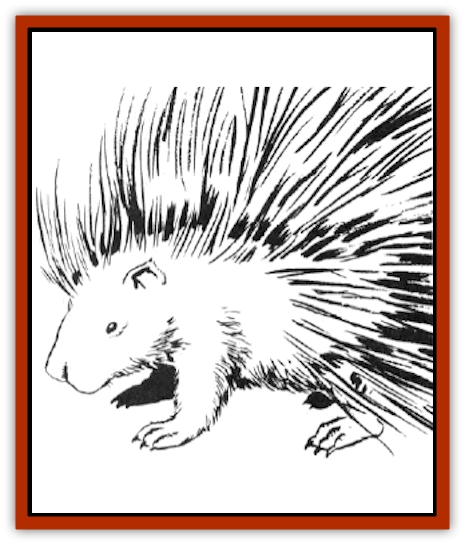

# Porcupine

| Statistic | **Black** | **Brown** | **Giant** |
| --- | --- | --- | --- |
| **Activity Cycle:** | Night | Night | Night |
| **Alignment:** | Nil | Nil | Nil |
| **Armor Class:** | 6 | 6 | 5 |
| **Climate/Terrain:** | Temperate/Forest | Temperate/Forest | Temperate/Forest |
| **Damage/Attack:** | 1-3 | 1-4 | 2-8 |
| **Diet:** | Herbivore | Herbivore | Herbivore |
| **Frequency:** | Common | Common | Uncommon |
| **Hit Dice:** | ½ | ½ | 6 |
| **Intelligence:** | Animal (1) | Animal (1) | Animal (1) |
| **Magic Resistance:** | Nil | Nil | Nil |
| **Morale:** | Unreliable (2) | Unreliable (2) | Unsteady (7) |
| **Movement:** | 9, Cl 2 | 9, Cl 2 | 6 |
| **No. Appearing:** | 1-2 | 1-2 | 1-2 |
| **No. of Attacks:** | 1 | 1 | 1 |
| **Organization:** | Family | Family | Family |
| **Size:** | S (2½-3' long) | S (2' long) | L (7' long) |
| **Special Attacks:** | Nil | Nil | Shoot quills |
| **Special Defenses:** | Quills | Quills | Quills |
| **THAC0:** | 20 | 20 | 13 |
| **Treasure:** | Nil | Nil | Nil |
| **XP Value:** | 15 | 15 | 650 |

Porcupines are large rodents native to temperate forested areas. There are many species of porcupines that differ only in minor details. Porcupines are timid, panic-prone creatures with one very nasty defense mechanism - stiff, sharp hairs known as quills.

There are two distinct families of porcupine: black and brown. Brown porcupines are the smaller of the two, about two feet long, but with quills that grow up to one foot long. The black porcupine is between 2½ and three feet long with a thick muscular tail, but has shorter quills (three inches long). Porcupines weigh between 35 and 50 pounds.

**Combat:** Contrary to some popular legends, a common (black or brown) porcupine doesn't throw its quills, but it can readily detach them when they strike an enemy. These herbivores do not attack unless they feel threatened, and even then only when they cannot safely run away. Porcupines smash an attacker with their tails, dislodging quills. Black porcupines inflict 1-3 points of damage with their barbed quills, while the longer quills of the brown porcupines cause 1d4 points of damage. Creatures that try to touch a porcupine automatically suffer damage from their quills. Because of their overlapping barbs, porcupine quills are extremely difficult to remove, and cause painful swelling.

**Habitat/Society:** Porcupines live in heavily wooded areas. They are excellent tree climbers. They are not anti-social creatures, but seem to prefer a mate and young for their only company.

**Ecology:** Porcupines feed on the bark and leaves of trees; their appetite has sometimes killed the trees on which they feed. They also feed on fruits and are especially fond of salt. Few creatures attack the porcupine. There are no known potions or spells that use porcupine components.

**Giant Porcupine**

  Giant porcupines are larger versions of the common woodland porcupines. They are identical in appearance to their smaller cousins, the brown porcupines, except that the white streaks of their quills are more obvious. They inhabit wooded areas. They are stupid and nonaggressive, but can defend themselves.

A giant porcupine can bite for 2d4 points of damage, but uses this attack in only the most desperate defense (if it is brought down to less than half its hit points). Its main defense is its ability to shoot 1d8 quills from its tail, each of which inflicts 1d4 points of damage. This attack has a range of 30 feet. As its quills are up to three feet long, any attacker that comes within six feet of the giant porcupine receives 1d4 quills from the porcupine's defensive movements. There are over 80 quills in its tail and over 300 in its body.

The giant porcupine views any approach within 30 feet as a threat. If a creature approaches it at that distance, it croucches in a defensive posture and issues a warning hiss, giving the creature one round to leave before it attacks. As with normal porcupines, there are no known uses for giant porcupine components.

---
## Discovery & Documentation

**Source Publication:** MC2 Volume II (1993)
**Campaign Setting:** Advanced Dungeons & Dragons 2nd Edition
**Author(s):** Jay Batista, Scott Bennie, Grant Boucher, William W. Connors, Steve Gilbert, Heike Kubasch, James Lowder, David Edward Martin, Bruce Nesmith, Jean Rabe, Rick Swan, John J. Terra, Gary L. Thomas

### Other Creatures Found in This Source Book
   * [[Ant|Ant]]
   * [[Ant_Lion_Giant|Ant Lion, Giant]]
   * [[Ape_Carnivorous|Ape, Carnivorous]]
   * [[Baboon|Baboon]]
   * [[Badger|Badger]]
   * [[Barracuda|Barracuda]]
   * [[Beetle_Giant|Beetle, Giant]]
   * [[Bulette|Bulette]]
   * [[Bullywug|Bullywug]]
   * [[Dwarf_Duergar|Dwarf, Duergar]]
   * [[Dwarf_Gully|Dwarf, Gully]]
   * [[Eagle|Eagle]]
   * [[Eel|Eel]]
   * [[Elemental_Air_Kin|Elemental, Air Kin]]
   * [[Elemental_Water_Kin|Elemental, Water Kin]]
   * [[Elemental_Water_Kin_Water_Weird|Elemental, Water Kin, Water Weird]]
   * [[Firestar|Firestar]]
   * [[Firetail|Firetail]]
   * [[Fish_Giant|Fish, Giant]]
   * [[Frog|Frog]]
   * [[Gorgon|Gorgon]]
   * [[Hawk|Hawk]]
   * [[Heucuva|Heucuva]]
   * [[Hippocampus|Hippocampus]]
   * [[Hippogriff|Hippogriff]]
   * [[Kelpie|Kelpie]]
   * [[Kenku|Kenku]]
   * [[Killmoulis|Killmoulis]]
   * [[Kuo-Toa|Kuo-Toa]]
   * [[Lamia|Lamia]]
   * [[Lammasu|Lammasu]]
   * [[Lamprey|Lamprey]]
   * [[Leech|Leech]]
   * [[Leprechaun|Leprechaun]]
   * [[Leucrotta|Leucrotta]]
   * [[Locathah|Locathah]]
   * [[Lycanthrope_Wereboar|Lycanthrope, Wereboar]]
   * [[Lycanthrope_Werefox|Lycanthrope, Werefox]]
   * [[Mammal_Minimal|Mammal, Minimal]]
   * [[Mammal_Small|Mammal, Small]]
   * [[Mimic|Mimic]]
   * [[Morkoth|Morkoth]]
   * [[Muckdweller|Muckdweller]]
   * [[Myconid|Myconid]]
   * [[Naga|Naga]]
   * [[Obliviax|Obliviax]]
   * [[Octopus_Giant|Octopus, Giant]]
   * [[Otyugh|Otyugh]]
   * [[Piranha|Piranha]]
   * [[Plant_Dangerous_I|Plant, Dangerous I]]
   * [[Plant_Intelligent|Plant, Intelligent]]
   * [[Poltergeist|Poltergeist]]
   * [[Rat_Osquip|Rat, Osquip]]
   * [[Roc|Roc]]
   * [[Roper|Roper]]
   * [[Rot_Grub|Rot Grub]]
   * [[Rust_Monster|Rust Monster]]
   * [[Sahuagin|Sahuagin]]
   * [[Sea_Lion|Sea Lion]]
   * [[Sea_Horse_Giant|Sea Horse, Giant]]
   * [[Shambling_Mound|Shambling Mound]]
   * [[Shark|Shark]]
   * [[Sphinx|Sphinx]]
   * [[Squid_Giant|Squid, Giant]]
   * [[Stirge|Stirge]]
   * [[Swanmay|Swanmay]]
   * [[Tarrasque|Tarrasque]]
   * [[Tasloi|Tasloi]]
   * [[Triton|Triton]]
   * [[Troglodyte|Troglodyte]]
   * [[Urchin|Urchin]]
   * [[Urd|Urd]]
   * [[Weasel|Weasel]]
   * [[Wolverine|Wolverine]]
   * [[Yellow_Musk_Creeper|Yellow Musk Creeper]]
