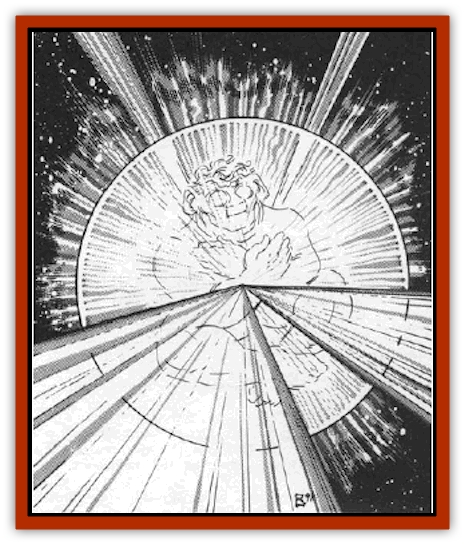

# Pristatic

| Statistic | **Pristatic** |
| --- | --- |
| **Activity Cycle:** | Any |
| **Alignment:** | Chaotic good |
| **Armor Class:** | 10 (without sphere) |
| **Climate/Terrain:** | Phlogiston |
| **Damage/Attack:** | Nil |
| **Diet:** | See below |
| **Frequency:** | Very rare |
| **Hit Dice:** | 8+1 |
| **Intelligence:** | Exceptional (16) |
| **Magic Resistance:** | 50% |
| **Morale:** | Steady (12); Elite (16) with sphere |
| **Movement:** | 18 |
| **No. Appearing:** | 1 |
| **No. of Attacks:** | Nil |
| **Organization:** | Solitary |
| **Size:** | S (3½'); M (5') with sphere |
| **Special Attacks:** | See below |
| **Special Defenses:** | See below |
| **THAC0:** | 13 |
| **Treasure:** | Nil |
| **XP Value:** | 10,000 |

Pristatics resemble a sphere of swirling colors, much like the *prismatic sphere* spell. Within the sphere is the actual pristatic, a small gnome-like humanoid. While bereft of its sphere, the pristatic floats in the phlogiston with legs and arms crossed, a look of intense concentration on its face.

A long-standing legend maintains that pristatics were created when a wizard attempted to alter the *prismatic sphere* spell by combining it with a *teleport* spell (in order to drop a sphere into the middle of a group). Unfortunately his assistant, a young [[Gnome|gnome]], tripped and bolluxed the experiment, disappearing in the process. A more reasonable conjecture is that the pristatic is native to the phlogiston; it may be a key to unknown secrets of magic.

**Combat:** Pristatics avoid combat. Though adult pristatics innately have all the abilities of the 9th-level wizard spell *prismatic sphere*, they can use it only once per day, for a total of two hours at most. Therefore, pristatics are willing to endure some damage before resorting to this, their only means of defense.

The pristatic's colorful sphere is still visible even when not in use. There is no way to detect whether the *prismatic sphere* effects are currently active. *Detect magic* always registers the area as magical, since it is composed of the ambient magical forces of the phlogiston.

In contrast to the *prismatic sphere* spell, an adult prismatic can activate some or all of its sphere's layers. For example, the pristatic can invoke the orange, indigo and violet effects, leaving out the other colors. The pristatic selects these effects to inflict the least harm to its opponent. Only when near death does it erect all layers against attackers.

If characters converse with a pristatic, it answers any questions it can. Pristatics are good observers and can remember the type and bearing of all ships that have passed within about the last month. However, the pristatic has no way to measure the passage of time, making its recollections less helpful.

Pristatics cannot spelljam. They bob in the phlogiston, going where the rainbow stream takes them.

**Habitat/Society:** Pristatics have no social structure, for they are solitary beings. They prefer the vastness of the phlogiston over the company of others.

**Ecology:** Innate magic in the phlosiston is food for the prismatic. If brought into a crystal sphere, a pristatic's life force rapidly fades, and it dies within a day after leaving the phlogiston. Curative magic doesn't help the pristatic, although placing it inside a wizard's *prismatic sphere* prolongs its life for 24 hours. Similarly, if a dying pristatic returns to the phlogiston before the 24 hours are up, it returns to health in the same amount of time that it was away from the phlogiston.

---
## Discovery & Documentation

**Source Publication:** MC9 Spelljammer Appendix II (1991)
**Campaign Setting:** Planescape
**Author(s):** Scott Davis, Newton Ewell, John Terra

### Other Creatures Found in This Source Book
   * [[Alchemy_Plant|Alchemy Plant]]
   * [[Allura|Allura]]
   * [[Aperusa|Aperusa]]
   * [[Autognome|Autognome]]
   * [[Bionoid|Bionoid]]
   * [[Bloodsac|Bloodsac]]
   * [[Buzzjewel|Buzzjewel]]
   * [[Constellate|Constellate]]
   * [[Contemplator|Contemplator]]
   * [[Dohwar|Dohwar]]
   * [[Dragon_Moon|Dragon, Moon]]
   * [[Dragon_Stellar|Dragon, Stellar]]
   * [[Dragon_Sun|Dragon, Sun]]
   * [[Dreamslayer|Dreamslayer]]
   * [[Dweomerborn|Dweomerborn]]
   * [[Fal|Fal]]
   * [[Feesu|Feesu]]
   * [[Fire_Bat|Fire Bat]]
   * [[Firebird|Firebird]]
   * [[Firelich|Firelich]]
   * [[Flowfiend|Flowfiend]]
   * [[Gadabout|Gadabout]]
   * [[Gammaroid|Gammaroid]]
   * [[Gonn|Gonn]]
   * [[Gossamer|Gossamer]]
   * [[Grav|Grav]]
   * [[Great_Dreamer|Great Dreamer]]
   * [[Greatswan|Greatswan]]
   * [[Grell_Colonial|Grell, Colonial]]
   * [[Gullion|Gullion]]
   * [[Insectare|Insectare]]
   * [[Lhee|Lhee]]
   * [[Mercurial_Slime|Mercurial Slime]]
   * [[Meteorspawn|Meteorspawn]]
   * [[Monitor|Monitor]]
   * [[Owl_Space|Owl, Space]]
   * [[Scro|Scro]]
   * [[Selkie_Star|Selkie, Star]]
   * [[Silatic|Silatic]]
   * [[Skullbird|Skullbird]]
   * [[Sleek|Sleek]]
   * [[Sluk|Sluk]]
   * [[Space_Swine|Space Swine]]
   * [[Sphinx_Astro-|Sphinx, Astro-]]
   * [[Spirit_Warrior|Spirit Warrior]]
   * [[Starfly_Plant|Starfly Plant]]
   * [[Stargazer|Stargazer]]
   * [[Undead_Stellar|Undead, Stellar]]
   * [[Witchlight_Marauder|Witchlight Marauder]]
   * [[Xixchil|Xixchil]]
   * [[Yitsan|Yitsan]]
   * [[Zurchin|Zurchin]]
