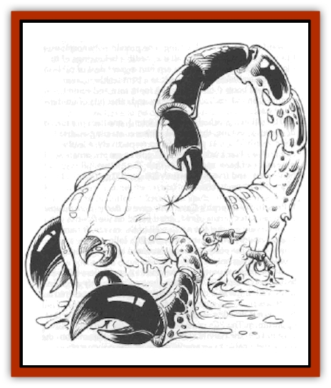
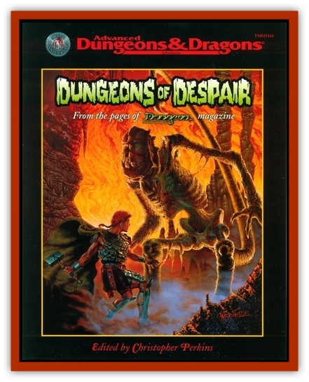

# Protein Polymorph

| Statistic | **Protein Polymorph** |
| --- | --- |
| **Activity Cycle:** | Any |
| **Alignment:** | Chaotic neutral |
| **Armor Class:** | 2 |
| **Climate/Terrain:** | Temperate to sub-tropical/Land |
| **Damage/Attack:** | 6-36 |
| **Diet:** | Carnivore |
| **Frequency:** | Rare |
| **Hit Dice:** | 6-8 |
| **Intelligence:** | Average (8-10) |
| **Magic Resistance:** | Nil |
| **Morale:** | Elite (13-14) |
| **Movement:** | 9 |
| **No. Appearing:** | 1 |
| **No. of Attacks:** | 1 |
| **Organization:** | Solitary |
| **Size:** | L (12' tall or wide) |
| **Special Attacks:** | Imitation (see below) |
| **Special Defenses:** | Nil |
| **THAC0:** | 6 HD: 15 / 7-8 HD: 13 |
| **Treasure:** | D |
| **XP Value:** | 6 HD: 1,400 / 7 HD: 2,000 / 8 HD: 3,000 |

Protein polymorphs are intelligent cellular colonies with the ability to assume almost any form they choose. In their natural state, they appear as large amorphous blobs or columns of glistening, protoplasmic gray matter.

Protein polymorphs have no spoken language and do not converse or interact with other species. They consider most other creatures their prey.

**Combat:** A protein polymorph can assume the form of any inanimate object or animate creature with hit dice equal to or fewer than its own (depending on the size of the protein polymorph - 6, 7 or 8 Hit Dice). The form assumed may actually be that of several forms connected by a near-invisible (10% chance of detection) cord or film of protoplasm. The cells of the protein polymorph may specialize or despecialize at will, taking on different textures and colors, changing completely in one round. Protein polymorph retain their own hit dice, hit points, and THAC0 while adapting the imitated creatures' armor class, number of attacks, and damage per attack. They possess the normal strengths of imitated creatures, but not those creatures' special abilities. Thus, a polymorph assuming the form of a giant [[Bird|bird]] cannot fly, and one assuming the form of a giant [[Spider|spider]] cannot inject poison or spin webs.

The polymorph is extremely versatile. It can imitate anything from a pile of treasure to a small-sized room, to a party of half a dozen humans or a dozen [[Kobold|kobolds]]. The polymorph will, in general, assume a form likely to draw prey; it feeds on humans and animals with little regard for type and size. A polymorph might even mix inanimate orbjects within its structure to add authenticity - a room or a corridor may, for instance, be part-stone and part protein polymorph. Imitated creatures may wear real clothing and wield real weapons (often acquired from previous victims).

The normal attack of a protein polymorph in its natural state is to bludgeon its prey and then enfold and crush it, inflicting 6-36 hp damage per round. When assuming the form of weapon-wielding creatures, multiple or single, it inflicts damage by weapon type, as appropriate.

**Habitat/Society:** Protein polymorphs are solitary, asexual hermaphrodites. They procreate by fission, dividing into two smaller polymorphs, each with half the parent's hit dice and hit points. These juvenile polymorphs gain 1 HD of growth every month until they are as large as the original parent. Protein polymorphs are territorial hunters, claiming an area of wilderness for themselves and destroying competing predators in that area. The only exception is when two or more protein polymorph encounter each other; under these rare circumstances. two protein polymorphs might share the same territory, dividing the spoils evenly. More typically, however, one of the polymorphs leaves in search of another hunting ground. Protein polymorphs recognize their own kind regardless of guise and never attack one another.

There are limits to the protein polymorph's degree of cellular control. It cannot accurately copy facial expressions, nor can it effectively duplicate the sound of speech. These limitations may lead to the exposure of the imposture as animate creatures. Similarly, if a protein polymorph disguises itself as an inanimate object, there is a 10% base chance of detecting the imposture from a distance of 10 feet away, but upon touch the animate nature of the cells is instantly revealed.

**Ecology:** Protein polymorphs are voracious hunters and must devour food regularly to provide the necessary nutrients. If a polymorph cannot find food within 24 hours, it must forage elsewhere. Its ichor can be used to create potions of *polymorph self* that have double the usual duration (8+2d4 turns).

---
## Discovery & Documentation

**Source Publication:** Dungeons of Despair (1999)
**Campaign Setting:** Advanced Dungeons & Dragons 2nd Edition
**Author(s):** Christopher Perkins
