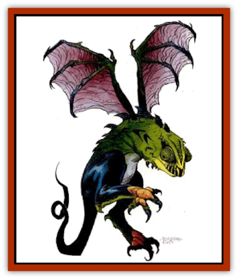

# Psionocus

| Statistic | **Psionocus** |
| --- | --- |
| **Activity Cycle:** | Any |
| **Alignment:** | See below |
| **Armor Class:** | 6 |
| **Climate/Terrain:** | Any |
| **Damage/Attack:** | 1d6 or 1d4 |
| **Diet:** | See below |
| **Frequency:** | Very rare |
| **Hit Dice:** | 3 |
| **Intelligence:** | See below |
| **Magic Resistance:** | Nil |
| **Morale:** | Elite (15-16) |
| **Movement:** | 6, Fl 18 (A) |
| **No. Appearing:** | 1 |
| **No. of Attacks:** | 1 |
| **Organization:** | Solitary |
| **Size:** | T (18&rdquo; tall) |
| **Special Attacks:** | Poison bite |
| **Special Defenses:** | Psionic absorption |
| **THAC0:** | 17 |
| **Treasure:** | Nil |
| **XP Value:** | 270 |

A psionocus is a creature created by powerful psionicists for use as a familiar and a scout.

Psionoci resemble small, winged lizards. Their wings are batlike, with a thin membrane stretched between a skeletal frame. Although they lack front legs, their small feet sport razor sharp claws that can be deadly in combat. Psionoci also have pointed teeth they use to inject their poison.

**Combat:** Psionoci prefer to avoid combat with more than one creature at a time. If psionoci must fight, they can either use their bite and inject their poison or, while flying, they can make diving attacks with their claws.

If possible, a psionocus descends upon its intended victim and attacks with its bite. A powerful venom is injected into the foe that causes a deep and fitful sleep lasting 5-50 (5d10) minutes (successful save vs. poison to negate). During this sleep, two psionic strength points bleed away each round. A psionocus within 30 feet of the sleeping victim absorbs these points as its diet. These points can be transferred to the psionocus' creator, as if using the harness subconscious proficiency.

The creature's saving throws are the same as that of its creator. Spells that affect one don't usually affect the other. However, mind affecting spells and psionic mind attacks affect the creator when focused on the psionocus. Any attack that destroys the psionocus causes its creator to lose 5-50 (5d10) PSPs and the creator must make a successful system shock roll or lose two experience levels.

**Habitat/Society:** Psionoci are psychic constructs. Only psionicists of at least 8th level with the Empower science and Cell Adjustment devotion can make one. A gem worth at least 2,000 gp becomes the brain of the psionocus while one pint of the creator's blood forms its body. It takes six weeks of uninterrupted effort to make a psionocus. If more than one psionocus is linked to the same creator, they will attack each other until only one remains.

After it is complete, the psionocus is mentally linked to its creator. Its creator sees and hears everything the psionocus experiences. Its creator can control the psionocus, with minimal concentration, as long as he is within 400 yards of the creature. If the psionic link is severed, the psionocus enters a comatose state and may easily be destroyed. The psionocus is a reflection of its master's temperament and personality. The psionocus has the same intelligence as it creator and reflects his mannerisms and quirks. It is, however, a separate entity from its creator. It cannot be taken over by another psionicist.

**Ecology:** As psychic constructs, psionicist have no links to the natural order of Athas. They are not affected by the defiling magics of [[Dragon_Athas|dragons]] as are other natural beings.

---
## Discovery & Documentation

**Source Publication:** Dark Sun Appendix II - Terrors Beyond Tyr (1991)
**Campaign Setting:** Dark Sun
**Author(s):** Jim Atkiss, Steve Brown, Timothy B. Brown, Andrew P. Morris, Bruce Nesmith, Wes Nicholson, Bill Slavicsek

### Other Creatures Found in This Source Book
   * [[Aarakocra_Athas|Aarakocra (Athas)]]
   * [[Animal_Domestic_Athas_II|Animal, Domestic (Athas) II]]
   * [[Aviarag|Aviarag]]
   * [[Baazrag|Baazrag]]
   * [[Baazrag_Boneclaw|Baazrag, Boneclaw]]
   * [[Bloodgrass|Bloodgrass]]
   * [[Cactus_Hunting|Cactus, Hunting]]
   * [[Cactus_Rock|Cactus, Rock]]
   * [[Cilops|Cilops]]
   * [[Crodlu|Crodlu]]
   * [[Dagorran|Dagorran]]
   * [[Dhaot|Dhaot]]
   * [[Drake_Lesser_Athas_General_Information|Drake, Lesser (Athas), General Information]]
   * [[Drake_Lesser_Athas_Magma|Drake, Lesser (Athas), Magma]]
   * [[Drake_Lesser_Athas_Rain|Drake, Lesser (Athas), Rain]]
   * [[Drake_Lesser_Athas_Silt|Drake, Lesser (Athas), Silt]]
   * [[Drake_Lesser_Athas_Sun|Drake, Lesser (Athas), Sun]]
   * [[Dray|Dray]]
   * [[Drik|Drik]]
   * [[Dune_Reaper|Dune Reaper]]
   * [[Dwarf_Athas|Dwarf (Athas)]]
   * [[Elemental_Beast_Athas_Air|Elemental Beast (Athas), Air]]
   * [[Elemental_Beast_Athas_Earth|Elemental Beast (Athas), Earth]]
   * [[Elemental_Beast_Athas_Fire|Elemental Beast (Athas), Fire]]
   * [[Elemental_Beast_Athas_Water|Elemental Beast (Athas), Water]]
   * [[Elf_Athas|Elf (Athas)]]
   * [[Fael|Fael]]
   * [[Feylaar|Feylaar]]
   * [[Fordorran|Fordorran]]
   * [[Giant_Half-giant|Giant, Half-giant]]
   * [[Giant_Shadow|Giant, Shadow]]
   * [[Golem_Athas_Magma|Golem (Athas), Magma]]
   * [[Golem_Athas_Salt|Golem (Athas), Salt]]
   * [[Golem_Athas_General_Information|Golem (Athas), General Information]]
   * [[Gorak|Gorak]]
   * [[Halfling_Athas|Halfling (Athas)]]
   * [[Human_Athas|Human (Athas)]]
   * [[Jhakar|Jhakar]]
   * [[Kaisharga|Kaisharga]]
   * [[Kes'trekel|Kes'trekel]]
   * [[Klar|Klar]]
   * [[Krag|Krag]]
   * [[Kragling|Kragling]]
   * [[Lirr|Lirr]]
   * [[Mastyrial|Mastyrial]]
   * [[Meorty|Meorty]]
   * [[Mul|Mul]]
   * [[Nikaal|Nikaal]]
   * [[Paraelemental_Beast_General_Information|Paraelemental Beast, General Information]]
   * [[Paraelemental_Beast_Magma|Paraelemental Beast, Magma]]
   * [[Paraelemental_Beast_Rain|Paraelemental Beast, Rain]]
   * [[Paraelemental_Beast_Silt|Paraelemental Beast, Silt]]
   * [[Paraelemental_Beast_Sun|Paraelemental Beast, Sun]]
   * [[Pakubrazi|Pakubrazi]]
   * [[Psurlon|Psurlon]]
   * [[Raaig|Raaig]]
   * [[Retriever_Obsidian|Retriever, Obsidian]]
   * [[Ruktoi|Ruktoi]]
   * [[Ruvoka_Athas|Ruvoka (Athas)]]
   * [[Sand_Howler|Sand Howler]]
   * [[Scorpion_Athas|Scorpion (Athas)]]
   * [[Seed_Brain|Seed, Brain]]
   * [[Silt_Horror_Black|Silt Horror, Black]]
   * [[Silt_Horror_Magma|Silt Horror, Magma]]
   * [[Silt_Horror_Red|Silt Horror, Red]]
   * [[Silt_Spawn|Silt Spawn]]
   * [[Slig|Slig]]
   * [[Spider_Athas|Spider (Athas)]]
   * [[Spinewyrm|Spinewyrm]]
   * [[Ssurran|Ssurran]]
   * [[Stalking_Horror|Stalking Horror]]
   * [[Tarek|Tarek]]
   * [[Tari|Tari]]
   * [[Thri-kreen|Thri-kreen]]
   * [[T'liz|T'liz]]
   * [[Tohr-kreen_II|Tohr-kreen II]]
   * [[Tohr-kreen_III|Tohr-kreen III]]
   * [[Trin|Trin]]
   * [[Tul'k|Tul'k]]
   * [[Undead_Athas_General_Information|Undead (Athas), General Information]]
   * [[Wraith_Athas|Wraith (Athas)]]
   * [[Xerichou|Xerichou]]
   * [[Zombie_Thinking|Zombie, Thinking]]
