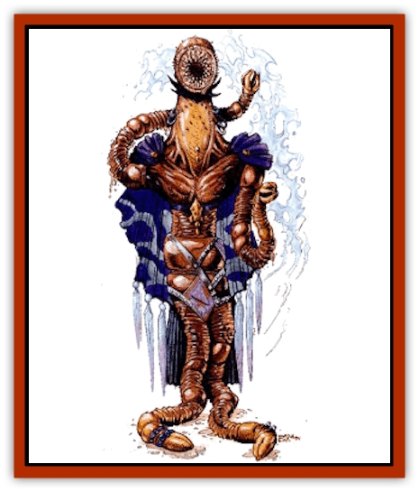
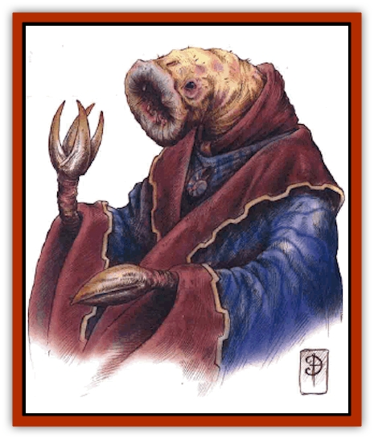

# Psurlon

| Statistic | **Giant Psurlon** | **Psurlon** | **Psurlon Adept** |
| --- | --- | --- | --- |
| **Activity Cycle:** | Any | Any | Any |
| **Alignment:** | Neutral evil | Lawful evil | Lawful evil |
| **Armor Class:** | 5 | 4 | 3 |
| **Climate/Terrain:** | Astral Plane | Astral Plane | Astral Plane |
| **Damage/Attack:** | 3d8/3d8/3d10 | 3d4/3d4/2d8 | 3d6/3d6/3d8 |
| **Diet:** | Carnivore | Carnivore | Carnivore |
| **Frequency:** | Very rare | Very rare | Very rare |
| **Hit Dice:** | 15 | 7 | 12 |
| **Intelligence:** | Genius (17-18) | Genius (17-18) | Supragenius (19-20) |
| **Magic Resistance:** | 60% | 40% | 50% |
| **Morale:** | Fearless (19) | Elite (15-16) | Fanatic (17-18) |
| **Movement:** | 2 | 9 | 9 |
| **No. Appearing:** | 1 | 1 (1 d4 on the Astral Plane) | 1 |
| **No. of Attacks:** | 3 | 3 | 3 |
| **Organization:** | Solitary | Community | Solitary |
| **Size:** | H (14' tall, 20' long) | M (5' tall, 7' long) | M (6' tall, 10' long) |
| **Special Attacks:** | Psionics | Psionics | Psionics |
| **Special Defenses:** | See below | See below | See below |
| **THAC0:** | 18 | 13 | 9 |
| **Treasure:** | C,G,V | V | R,V |
| **XP Value:** | 15,000 | 4,000 | 9,000 |

**Psionics Summary**

| Level | Dis/Sci/Dev | Attack/Defense | Score | PSPs |
| --- | --- | --- | --- | --- |
| 7 | 3/4/12 | EW,II,MT,PsC/IF,MB,MBk,TS | 13 | 50 |

**Telepathy -** *Sciences:* mass domination, mind link; *Devotions:* id insinuation, contact, psionic crush, mind thrust, ego whip.

**Psychoportation -** *Science:* banishment; *Devotions:* astral projection, time/space anchor.

**Psychometabolism -** *Science:* life draining; *Devotions:* control body, mind over body, enhanced strength, flesh armor, prolong.

Psurlons are extremely intelligent wormlike humanoids. The psurlons are an advanced race living on the Astral Plane, and are sometimes summoned by evil psionicists who have the power to summon planar creatures.

Psurlons have earthwormlike bodies, legs that end in toothed maws, and arms that end in claws with black talons. Their heads are similar to those of earthworms, with large, gaping maws ringed with teethlike projections. They have no eyes and use other senses to "see". They wear richly colored robes and never wear armor or carry weapons.

Psurlons communicate with one another telepathically and through grunts and squeals.

**Combat:** When psurlons engage in physical combat they use both their claws, causing 3-12 (3d4) points of damage each, and their bite, for 2-16 (2d8) points of damage. They seldom engage in physical combat, preferring to fight psionictally.

Psurlons have a natural AC 4 and can only be hit by a +1 or better magical weapon or by creatures of 6 HD or better and those with natural magical abilities. Wounds of other types cause very little damage and heal instantly. Their enhanced protection is because of their magical and psionic experimentation on their own flesh. Psurlons are immune to all *sleep*, *charm*, and *hold* spells and have 40% magic resistance.

**Habitat/Society:** Many thousands of years ago the psurlons lived on another world. The psurlons were a highly evolved race with vast knowledge and psionic power. In their quest for knowledge and power, the psurlons developed a means to psychically link all members of their race. However, disaster struck. A psychic backlash occurred, creating a massive rift into the Astral Plane, and their home world was destroyed. All surviving psurlons were sucked into the rift and became permanent residents of the Astral Plane.

With their world destroyed, the psurlons built cities within the Astral Plane, and have no desire to return to the Prime Material Plane. In the Astral Plane they can pursue research that is impossible elsewhere. They have noted Athas because it is a world that could survive the massive amounts of psionic force they used to destroy their own world. As a race they have no particular plans for Athas, although individual Psurlons might have some. The psurlons, who are far smaller in number than they were on their home world, are trying to boost their psionic powers and hone their abilities in order to attempt the mind meld again, despite their diminished population.

Psurlons are only encountered on Athas when summoned. Their knowledge is sought by many, especially psionicists and wizards who travel the Astral Plane. They hate being forced to serve, and seek vengeance upon those who summon them.

**Ecology:** Psurlons normally feed on the flesh of living creatures, especially that of other sentient races. They particularly lake human and [[Halfling_Athas|halfling]] flesh.

The typical lifespan of a psurlon is 1,500 years. They are at the top of the food chain and are seldom preyed upon. [[Roc_Athas|Athasian rocs]] consider psurlons a delicacy, but fortunately for the psurlons there are no [[Roc|rocs]] on the Astral Plane.

Some evil psionicists summon psurlons in hopes of gaining their knowledge. The price is very high and often leads to the death of the summoner. Summoners who gain knowledge from psurlons and then attempt to slay them or send them back are tracked down and forced to pay what is due either by the psurlons they summoned or by others of their race.

**Psurlon Adepts**

  **Psionics Summary**

| Level | Dis/Sci/Dev | Attack/Defense | Score | PSPs |
| --- | --- | --- | --- | --- |
| 12 | 4/6/17 | All/All | 15 | 75 |

**Telepathy -** *Sciences:* mass domination, mind link, psionic blast; *Devotions:* id insinuation, contact, psionic crush, mind thrust, ego whip, psionic drain.

**Psychoportation -** *Science:* banishment; *Devotions:* astral projection, time/space anchor.

**Psychometabolism -** *Science:* life draining; *Devotions:* control body, mind over body, enhanced strength, flesh armor, prolong.

**Clairsentience -** *Science:* clairvoyance; *Devotions:* combat mind, danger sense, know location, spirit sense.

  
Psurlon adepts serve as leaders of the small psurlon communities. They are specially gifted psurlons whose psionic potential extend beyond that of most within their race. They are trained from an early age to serve as both a protector and a leader among the psurlons.

Some psurlons have become astral explorers, traveling across the Astral Plane, seeking new knowledge and power, hunting food and suitable creatures that might be subjugated and used as slave labor. Small exploration parties usually consist of 2-8 (2d4) psurlon adepts.

**Giant Psurlons**

  **Psionics Summary**

| Level | Dis/Sci/Dev | Attack/Defense | Score | PSPs |
| --- | --- | --- | --- | --- |
| 18 | 5/8/20 | All/All | 17 | 100 |

**Telepathy -** *Sciences:* mass domination, mind link, psionic blast; *Devotions:* id insinuation, contact, psionic crush, mind thrust, ego whip, psionic drain.

**Psychoportation -** *Science:* banishment; *Devotions:* astral projection, time/space anchor.

**Psychometabolism -** *Science:* life draining; *Devotions:* control body, mind over body, enhanced strength, flesh armor, prolong, double pain.

**Clairsentience -** *Science:* clairvoyance; *Devotions:* combat mind, danger sense, know location, spirit sense.

**Psychokinesis -** *Sciences:* disintegrate, telekinesis; *Devotions:* levitation, inertial barrier.

  
Giant psurlons are mutated psurlons who existed when their kind destroyed their world. They absorbed so much psionic energy when their world was destroyed that they became nearly immortal and they grew in size and psionic ability.

Only a handful of these creatures are left. These creatures make their own solitary dens upon the Astral Plane and have little contact with others, including those of their own kind, since other psurlons consider them cursed monsters.

There are a few, however, who have taken control of small psurlon communities, ruling them as harshly as any sorcerer king ever ruled.

Giant psurlons can attack with their claws and bite that cause far greater damage than those of both typical psurlons and psurlon adepts, but they seldom need to do so.

---
## Discovery & Documentation

**Source Publication:** Dark Sun Appendix II - Terrors Beyond Tyr (1991)
**Campaign Setting:** Dark Sun
**Author(s):** Jim Atkiss, Steve Brown, Timothy B. Brown, Andrew P. Morris, Bruce Nesmith, Wes Nicholson, Bill Slavicsek

### Other Creatures Found in This Source Book
   * [[Aarakocra_Athas|Aarakocra (Athas)]]
   * [[Animal_Domestic_Athas_II|Animal, Domestic (Athas) II]]
   * [[Aviarag|Aviarag]]
   * [[Baazrag|Baazrag]]
   * [[Baazrag_Boneclaw|Baazrag, Boneclaw]]
   * [[Bloodgrass|Bloodgrass]]
   * [[Cactus_Hunting|Cactus, Hunting]]
   * [[Cactus_Rock|Cactus, Rock]]
   * [[Cilops|Cilops]]
   * [[Crodlu|Crodlu]]
   * [[Dagorran|Dagorran]]
   * [[Dhaot|Dhaot]]
   * [[Drake_Lesser_Athas_General_Information|Drake, Lesser (Athas), General Information]]
   * [[Drake_Lesser_Athas_Magma|Drake, Lesser (Athas), Magma]]
   * [[Drake_Lesser_Athas_Rain|Drake, Lesser (Athas), Rain]]
   * [[Drake_Lesser_Athas_Silt|Drake, Lesser (Athas), Silt]]
   * [[Drake_Lesser_Athas_Sun|Drake, Lesser (Athas), Sun]]
   * [[Dray|Dray]]
   * [[Drik|Drik]]
   * [[Dune_Reaper|Dune Reaper]]
   * [[Dwarf_Athas|Dwarf (Athas)]]
   * [[Elemental_Beast_Athas_Air|Elemental Beast (Athas), Air]]
   * [[Elemental_Beast_Athas_Earth|Elemental Beast (Athas), Earth]]
   * [[Elemental_Beast_Athas_Fire|Elemental Beast (Athas), Fire]]
   * [[Elemental_Beast_Athas_Water|Elemental Beast (Athas), Water]]
   * [[Elf_Athas|Elf (Athas)]]
   * [[Fael|Fael]]
   * [[Feylaar|Feylaar]]
   * [[Fordorran|Fordorran]]
   * [[Giant_Half-giant|Giant, Half-giant]]
   * [[Giant_Shadow|Giant, Shadow]]
   * [[Golem_Athas_Magma|Golem (Athas), Magma]]
   * [[Golem_Athas_Salt|Golem (Athas), Salt]]
   * [[Golem_Athas_General_Information|Golem (Athas), General Information]]
   * [[Gorak|Gorak]]
   * [[Halfling_Athas|Halfling (Athas)]]
   * [[Human_Athas|Human (Athas)]]
   * [[Jhakar|Jhakar]]
   * [[Kaisharga|Kaisharga]]
   * [[Kes'trekel|Kes'trekel]]
   * [[Klar|Klar]]
   * [[Krag|Krag]]
   * [[Kragling|Kragling]]
   * [[Lirr|Lirr]]
   * [[Mastyrial|Mastyrial]]
   * [[Meorty|Meorty]]
   * [[Mul|Mul]]
   * [[Nikaal|Nikaal]]
   * [[Paraelemental_Beast_General_Information|Paraelemental Beast, General Information]]
   * [[Paraelemental_Beast_Magma|Paraelemental Beast, Magma]]
   * [[Paraelemental_Beast_Rain|Paraelemental Beast, Rain]]
   * [[Paraelemental_Beast_Silt|Paraelemental Beast, Silt]]
   * [[Paraelemental_Beast_Sun|Paraelemental Beast, Sun]]
   * [[Pakubrazi|Pakubrazi]]
   * [[Psionocus|Psionocus]]
   * [[Raaig|Raaig]]
   * [[Retriever_Obsidian|Retriever, Obsidian]]
   * [[Ruktoi|Ruktoi]]
   * [[Ruvoka_Athas|Ruvoka (Athas)]]
   * [[Sand_Howler|Sand Howler]]
   * [[Scorpion_Athas|Scorpion (Athas)]]
   * [[Seed_Brain|Seed, Brain]]
   * [[Silt_Horror_Black|Silt Horror, Black]]
   * [[Silt_Horror_Magma|Silt Horror, Magma]]
   * [[Silt_Horror_Red|Silt Horror, Red]]
   * [[Silt_Spawn|Silt Spawn]]
   * [[Slig|Slig]]
   * [[Spider_Athas|Spider (Athas)]]
   * [[Spinewyrm|Spinewyrm]]
   * [[Ssurran|Ssurran]]
   * [[Stalking_Horror|Stalking Horror]]
   * [[Tarek|Tarek]]
   * [[Tari|Tari]]
   * [[Thri-kreen|Thri-kreen]]
   * [[T'liz|T'liz]]
   * [[Tohr-kreen_II|Tohr-kreen II]]
   * [[Tohr-kreen_III|Tohr-kreen III]]
   * [[Trin|Trin]]
   * [[Tul'k|Tul'k]]
   * [[Undead_Athas_General_Information|Undead (Athas), General Information]]
   * [[Wraith_Athas|Wraith (Athas)]]
   * [[Xerichou|Xerichou]]
   * [[Zombie_Thinking|Zombie, Thinking]]
