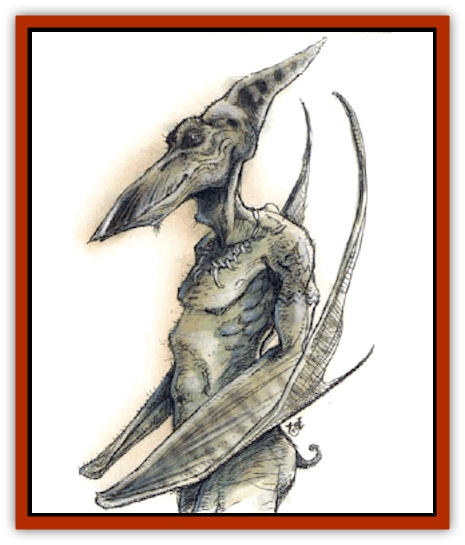

# Pteraman

| Statistic | **Pteraman** |
| --- | --- |
| **Activity Cycle:** | Day |
| **Alignment:** | Neutral evil |
| **Armor Class:** | 4 |
| **Climate/Terrain:** | Jungle |
| **Damage/Attack:** | 1d4 (&times;2)/1d6+1 or by weapon |
| **Diet:** | Omnivore |
| **Frequency:** | Uncommon |
| **Hit Dice:** | 4 |
| **Intelligence:** | Average (8-10) |
| **Magic Resistance:** | Nil |
| **Morale:** | Fanatic (17-18) |
| **Movement:** | 12, Fl 12 (C) with wings, Fl 21 (B) as pteranodon |
| **No. Appearing:** | 1d10 (&times;10) |
| **No. of Attacks:** | 3 |
| **Organization:** | Tribe |
| **Size:** | L (10' tall) |
| **Special Attacks:** | Swoop |
| **Special Defenses:** | Nil |
| **THAC0:** | 17 |
| **Treasure:** | P (E) |
| **XP Value:** | 270 |

From a distance, pteramen are often mistaken for [[Lizard_Man|lizard men]], but they are larger and leaner. The scales that cover their torso and most of their arms and legs are small and smooth like the skin of a [[Snake|snake]]. Pteramen range in color from olive green to forest green to shades of tan. Their hands are long and end in sharp nails used for rending opponents. Their feet are clawed also, which aids in climbing. Their most startling feature is their leathery webbed wings, which don't appear until the creatures plummet in flight. Pteramen can will their wing to appear and disappear, often in a manner to throw opponents off guard.

In effect, pteramen have three forms: that of a lizard man with no tail, a lizard man with webbed wings, and a miniature [[Dinosaur_I|pteranodon]] with a 15-foot wing span. This third form is achieved by a natural *polymorph* ability. No matter the form, a pteraman's attacks and damage remain the same.

Scholars speculate that pteramen are precursors of lizard men, and that a group of them did not evolve. Adventurers who have encountered the creatures disagree, believing they are enchanted relatives of pterodactyls. In either case, adventurers and scholars agree that pteramen are more vicious and mean-tempered than lizard men, and they seem bent on cruelty. Indeed, the pteramen are vicious and self-centered, thinking only of themselves and their tribe.

**Combat:** Pteramen care little for elaborate strategy, although they have been known to plan raids on small villages. The reptilians prefer to fight by their natural instincts, swooping down upon opponents to quickly gain the upper hand. When encountered in smaller groups, pteramen are prone to fight with their claws and bite. While in larger and more organized bands, they employ weapons such as great barbed spears.

Often pteramen circle opponents, coming at them from all directions to keep them from forming a defensive position. They almost always attempt to employ a swoop attack: A pteraman attains an altitude of 100 or more feet and then dives on an opponent, ramming the target with claws or a weapon. Any successful hit inflicts double damage, and the victim must make a successful dexterity check or fall to the ground.

Pteramen's favorite opponents are [[Goblin|goblins]], whom they consider competition for jungle land.

**Habitat/Society:** Pteramen found in groups of 10 to 30 do not recognize a ruler, but are a chaotic group governed by the loudest, most powerful individuals. Such groups are avoided by other bands of pteramen, who do not want to get involved in petty squabbles over property, valuables, and food. Larger groups of pteramen are more structured, usually patterning their society after the nearest humanoid tribe.

No matter the size of the group, all pteramen communities tend to look the same: a collection of huts high in thick-trunked trees. From the ground it is often difficult to see these homes, as thick vegetation obscures the pteramen's handiwork. Each hut houses from one to four pteramen. If more than one is found in a hut, it will be a mated pair and its offspring. Pteramen mate for life and care for the children until they are old enough to go off on their own. These children leave the tribe and search for a new group to join, as parents don't want their offspring around to compete for food and valuables.

**Ecology:** Although omnivorous, most pteramen prefer freshly killed meat. Pteramen consider the meats of [[Pleistocene_Animal|titanotheres]], [[Pleistocene_Animal|balucitheria]], and [[Pleistocene_Animal|axebeaks]] to be delicacies. They often fly vast distances (in pteradon form, the most efficient for long-distance flight) when their scouts locate any of the above creatures

They also consume the fruit of jungle trees and certain roots, barks, and flowers. Ironically, Chult's true [[Dinosaur_I|pteradons]] and pterodactyls often prey on small groups of pteramen

---
## Discovery & Documentation

**Source Publication:** Monstrous Compendium, 1994 Annual, Volume 1 (1995)
**Campaign Setting:** Advanced Dungeons & Dragons 2nd Edition
**Author(s):** David Wise

### Other Creatures Found in This Source Book
   * [[Abyss_Ant|Abyss Ant]]
   * [[Achaierai|Achaierai]]
   * [[Afanc|Afanc]]
   * [[Al-Jahar|Al-Jahar]]
   * [[Baelnorn|Baelnorn]]
   * [[Baneguard|Baneguard]]
   * [[Banelar|Banelar]]
   * [[Bird_Talking|Bird, Talking]]
   * [[Blazing_Bones|Blazing Bones]]
   * [[Campestri|Campestri]]
   * [[Caniquine|Caniquine]]
   * [[Cat_Winged|Cat, Winged]]
   * [[Crypt_Servant|Crypt Servant]]
   * [[Death's_Head_Tree|Death's Head Tree]]
   * [[Dog_Saluqi|Dog, Saluqi]]
   * [[Dragon_Electrum|Dragon, Electrum]]
   * [[Dragon_Fang|Dragon, Fang]]
   * [[Dragon_Linnorm_Corpse_Tearer|Dragon, Linnorm, Corpse Tearer]]
   * [[Dragon_Linnorm_Dread|Dragon, Linnorm, Dread]]
   * [[Dragon_Linnorm_Flame|Dragon, Linnorm, Flame]]
   * [[Dragon_Linnorm_Forest|Dragon, Linnorm, Forest]]
   * [[Dragon_Linnorm_Frost|Dragon, Linnorm, Frost]]
   * [[Dragon_Linnorm_Gray|Dragon, Linnorm, Gray]]
   * [[Dragon_Linnorm_Land|Dragon, Linnorm, Land]]
   * [[Dragon_Linnorm_Midgard|Dragon, Linnorm, Midgard]]
   * [[Dragon_Linnorm_Rain|Dragon, Linnorm, Rain]]
   * [[Dragon_Linnorm_Sea|Dragon, Linnorm, Sea]]
   * [[Dragon_Neutral_Jacinth|Dragon, Neutral, Jacinth]]
   * [[Dragon_Neutral_Jade|Dragon, Neutral, Jade]]
   * [[Dragon_Neutral_Pearl|Dragon, Neutral, Pearl]]
   * [[Dread|Dread]]
   * [[Dragon-kin|Dragon-kin]]
   * [[Elemental_Earth_Kin_Chrysmal|Elemental, Earth Kin, Chrysmal]]
   * [[Elemental_Earth_Kin_Earth_Weird|Elemental, Earth Kin, Earth Weird]]
   * [[Elemental_Fire_Kin_Azer|Elemental, Fire Kin, Azer]]
   * [[Elemental_Sandman|Elemental, Sandman]]
   * [[Elemental_Wind_Walker|Elemental, Wind Walker]]
   * [[Elemental_Vermin|Elemental Vermin]]
   * [[Feystag|Feystag]]
   * [[Flame_Skull|Flame Skull]]
   * [[Foulwing|Foulwing]]
   * [[Gambado|Gambado]]
   * [[Garbug|Garbug]]
   * [[Genie_Tasked_Administrator|Genie, Tasked, Administrator]]
   * [[Genie_Tasked_Deceiver|Genie, Tasked, Deceiver]]
   * [[Genie_Tasked_Harim_Servant|Genie, Tasked, Harim Servant]]
   * [[Genie_Tasked_Messenger|Genie, Tasked, Messenger]]
   * [[Genie_Tasked_Miner|Genie, Tasked, Miner]]
   * [[Genie_Tasked_Oathbinder|Genie, Tasked, Oathbinder]]
   * [[Gibbering_Mouther|Gibbering Mouther]]
   * [[Gnasher|Gnasher]]
   * [[Gnasher_Winged|Gnasher, Winged]]
   * [[Golem_Brain|Golem, Brain]]
   * [[Golem_Hammer|Golem, Hammer]]
   * [[Golem_Metagolem|Golem, Metagolem]]
   * [[Golem_Spiderstone|Golem, Spiderstone]]
   * [[Gorynych|Gorynych]]
   * [[Greelox|Greelox]]
   * [[Helmed_Horror|Helmed Horror]]
   * [[Jarbo|Jarbo]]
   * [[Laraken|Laraken]]
   * [[Lich_Psionic|Lich, Psionic]]
   * [[Living_Steel|Living Steel]]
   * [[Lock_Lurker|Lock Lurker]]
   * [[Loxo|Loxo]]
   * [[Lycanthrope_Loup_de_Noir|Lycanthrope, Loup de Noir]]
   * [[Lycanthrope_Werebadger|Lycanthrope, Werebadger]]
   * [[Lycanthrope_Werejaguar|Lycanthrope, Werejaguar]]
   * [[Lythlyx|Lythlyx]]
   * [[Magebane|Magebane]]
   * [[Marrashi|Marrashi]]
   * [[Metalmaster|Metalmaster]]
   * [[Mimic_House_Hunter|Mimic, House Hunter]]
   * [[Naga_Bone|Naga, Bone]]
   * [[Nautilus_Giant|Nautilus, Giant]]
   * [[Nightshade_Toril|Nightshade (Toril)]]
   * [[Nishruu|Nishruu]]
   * [[Noran|Noran]]
   * [[Opinicus|Opinicus]]
   * [[Ormyrr|Ormyrr]]
   * [[Parasite|Parasite]]
   * [[Pasari-Niml|Pasari-Niml]]
   * [[Plant_Vampire_Moss|Plant, Vampire Moss]]
   * [[Rautym|Rautym]]
   * [[Shadeling|Shadeling]]
   * [[Skum|Skum]]
   * [[Snake_Giant_Cobra|Snake, Giant Cobra]]
   * [[Snake_Stone|Snake, Stone]]
   * [[Spectral_Wizard|Spectral Wizard]]
   * [[Spell_Weaver|Spell Weaver]]
   * [[Spider_Brain|Spider, Brain]]
   * [[Suwyze|Suwyze]]
   * [[Tatalla|Tatalla]]
   * [[Tick_Heart|Tick, Heart]]
   * [[Tree_Dark|Tree, Dark]]
   * [[Tree_Singing|Tree, Singing]]
   * [[Tressym|Tressym]]
   * [[Troll_Snow|Troll, Snow]]
   * [[Tuyewera|Tuyewera]]
   * [[Ulitharid|Ulitharid]]
   * [[Undead_Dwarf|Undead Dwarf]]
   * [[Undead_Lake_Monster|Undead Lake Monster]]
   * [[Whipsting|Whipsting]]
   * [[Windghost|Windghost]]
   * [[Wolf_Dread|Wolf, Dread]]
   * [[Wolf_Stone|Wolf, Stone]]
   * [[Wolf_Vampiric|Wolf, Vampiric]]
   * [[Wraith_Shimmering|Wraith, Shimmering]]
   * [[Xantravar|Xantravar]]
   * [[Xaver|Xaver]]
