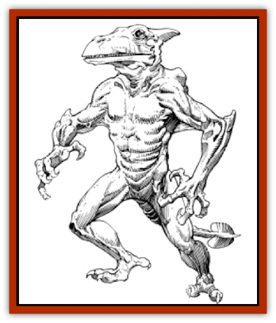

# Pterran

| Statistic | **Pterran** |
| --- | --- |
| **Activity Cycle:** | Any |
| **Alignment:** | Neutral |
| **Armor Class:** | 8 |
| **Climate/Terrain:** | Forest |
| **Damage/Attack:** | 1-4/1-4/1-6 or (by weapon) |
| **Diet:** | Omnivore |
| **Frequency:** | Common |
| **Hit Dice:** | 4 |
| **Intelligence:** | Very (11-12) |
| **Magic Resistance:** | Nil |
| **Morale:** | Steady (11-12) |
| **Movement:** | 12 |
| **No. Appearing:** | 1-10 |
| **No. of Attacks:** | 3 or 1 |
| **Organization:** | Clan |
| **Size:** | M (6' tall) |
| **Special Attacks:** | Psionics |
| **Special Defenses:** | Nil |
| **THAC0:** | 17 |
| **Treasure:** | J (C) |
| **XP Value:** | 175 / Druid: 420 / Psionicist: 270 |

**Psionics Summary**

| Level | Dis/Sci/Dev | Attack/Defense | Score | PSPs |
| --- | --- | --- | --- | --- |
| 3 | 2/2/7 | EW,II/M-,TS | 12 | 70 |

**Clairsentience -** *Science:* aura sight; *Devotions:* danger sense, know direction.

**Telepathy -** *Science:* mind link; *Devotions:* ego whip, id insinuation, mind blank, thought shield, ESP, life detection, contact.

Pterrans are a race of [[Lizard_Man_Athas|lizard men]] who inhabit the Hinterlands near the Ringing Mountains. While most never make it past the mountains, some small clans have made their homes on the desert side, living in the forests and jungles near the Forest Ridge, near the rocky barrens which border the deserts of Athas.

Pterrans look more like [[Pteraman|humanoid]] [[Dinosaur_I|pteranodons]] than they do lizards, indicating that they may be related in some way to the [[Pterrax|pterrax]], a race of flying creatures found on the rocky barrens of Athas. Standing roughly six feet tall, pterrans have light brown scales for skin. Along with their two arms and legs, pterrans also have a short, tail-like appendage and two rounded stubs on their backs, which further hint at their relationship to pterodactyls. The head of a pterran features large, almost bulbous eyes and a long snout, which is also the creature's mouth. The mouth of a pterran has many teeth, which are used for ripping its food apart. The arms of pterrans end with clawed hands, usable in both hunting and fighting. There are no obvious characteristics which distinguish males from females under normal circumstances.

The language of pterrans is a collection of vocal sounds that are combined with clicks and taps made with their claws. The vocal sounds of the pterrans are largely hisses and pops, with occasional snarls or growls. It is almost impossible for humans and demi-humans to speak the pterran language because human voices are unable to create the necessary sounds. It is accordingly difficult for humans or demihumans to interpret this language, resulting in a -5 to any language proficiency checks made when attempting to understand the pterran language.

**Combat:** Pterrans are naturally suspicious of men, particularly of humans and [[Halfling_Athas|halflings]]. Thus, most confrontations between these races end in combat situations, a contingency that pterrans are more than capable of handling. The coloration of a pterran's scales provides good camouflage in the forest areas that they inhabit. When pterrans attempt to surprise their opponents in this environment, their intended victims suffer a -1 penalty to their surprise rolls.

Their scales provide pterrans with a tough, armored exterior. All pterrans can attack up to three times per round, using their two claws and bite. Each claw attack does 1d4 points of damage, while a bite does 1d6 points. Many clan warriors carry weapons of pterran design, which they often use in combat encounters. There are two weapons of tribal design employed by pterrans. The first type is, in essence, a wooden long sword, carved from young hardwood trees and treated with a mixture of tree sap and id fiend blood. This treatment renders the blade of the weapon extremely strong, giving it nearly the strength of steel. These weapons, called *slodaks*, do 1d8 points of damage. The other type of weapon is called a *thanak* and resembles a saw blade. It is made of two strips of hardwood bound together. Between the strips is a row of teeth taken from the pterrax. The *thanak* is wielded in a manner similar to that of an axe in that it is swung at the target. When it strikes, its toothed edge rips into the target's flesh. A successful attack from a *thanak* does 2d6 points of damage to all size creatures. The teeth of the weapon are often coated with a powerful, debilitating poison. Those struck by a poison-coated *thanak* must save vs. poison (at -2) or suffer a 1 point reduction in both their Strength and Constitution ability scores. Each day thereafter, the victim's Strength and Constitution are further reduced by 1 point, until they reach zero, at which time the victim dies. The effects of this poison can be countered by either a *neutralize poison* or *heal* spell. There are no other known remedies for this poison.

Pterrans will often engage in combat from the air, mounted on pterrax, a flying creature which resembles a pteranodon. Mounted pterrans will use both melee and missile weapons, but tend to use ranged attacks from the air. Most mounted pterrans are armed with spears that do 1d6 points of damage when they strike. Pterrans often coat the tips of their spears with the same type of poison they employ on *thanaks*.

Some members of a pterran clan are psionicists. While all pterrans are at least wild talents, some have all the powers of a psionicist PC. Like many of the creatures of Athas, pterrans have developed natural psionic defense modes which are considered to be always "on". Regardless of its actions, a pterran subjected to attack in psionic combat may use its defense modes, as long as it has enough PSPs to power the mode used.

**Habitat/Society:** Pterrans gather in tribes, ranging in size from 10 or 12 members, in small tribes, to over a hundred members in larger ones. A pterran tribe will settle in villages usually located deep within the jungle are as near the Forest Ridge. A pterran village is comprised of many smaller family dwellings, all situated near or around the center of the village, where the ceremonial area is located. Pterran society is based largely on ceremony and celebrations. Each tribe usually has several celebrations during a given year, each a celebration of thanks for their world. Pterrans believe that their race originated from the very earth itself and that Athas is their Earth Mother. With each celebration, the pterran tribes reinforce their beliefs and faith. As would be expected, the priests of pterran society are druids.

A pterran tribe will usually have many different families within it. Each of these families usually has its own dwelling, marked with family symbols and colors identifying the family. On rare occasions more than one family will share a dwelling, usually when members of the two families have been joined in marriage. A typical family dwelling has several small chambers, each only large enough for two pterrans to sleep in. The dwelling also has a central room connecting all other rooms. Thus, just as the dwellings of a village are centered around the ceremonial area, the rooms of a dwelling are centered around a central family area. Families of pterrans will usually have four to eight members, two parents and four to six young. Pterrans always bear their young in pairs, and most families have an even number of members.

A pterran tribe is led by its Triumvirate, which is comprised of the eldest tribal member from each Life Path. The Triumvirate is responsible for most of the tribe's decisions, though the entire tribe is consulted before actions of any kind are taken. Typical decisions of the Triumvirate include when to move the village to a new location, when and where to send out scouting groups, whether the tribe should involve themselves with other Athasian races, etc.

**Ecology:** Pterrans are omnivorous, eating both meat and vegetation. Living mostly in the forests and jungles, their diet consists largely of game animals. Pterran hunting parties spend many hours a day in search of food for the tribe. The meat from a [[Kirre|kirre]] is a favorite food of pterrans, as is that from an [[Id_Fiend|id fiend]]. When the hunting parties venture out towards the rocky barrens, they will, on occasion, catch a [[Flailer|flailer]], also a preferred food.

**The Life Paths of Pterrans**

  When pterran young reach the age of 15 years, they each must choose what is called a "Life Path". Life Paths are essentially careers which the pterran will pursue throughout its life. There are three Life Paths in the pterran society: the warrior, the druid, and the psionicist.

**Warriors**

  Most pterrans (65%) choose the Path of the Warrior. Pterrans that choose the warrior path become the fighters and protectors of the tribe. The warriors are also responsible for preparing the new village sight when the tribe moves from one place to the another. Pterran warriors are taught many methods of combat, including use of their natural weapons, tribal weapons, and the weapons used by their enemies. Warriors are also the weaponmakers of the tribe, crafting both *slodaks* and *thanaks*, and are responsible for the creation of the unique poison that is used on these weapons.

When a pterran chooses the warrior Life Path, but before he is named as a warrior of the tribe, he must undergo a test of his abilities. This test requires that he or she catch and train a pterrax. Catching a pterrax is a difficult task, accomplished only after many months (sometimes years) of training and studying.

A pterran warrior candidate attempting to catch a pterrax must first locate a pterrax nest. He/she must then observe the nest to determine which, if any, of the pterrax in the nest are capable of becoming mounts. When a pterrax is chosen as the warrior's mount, the pterran must climb to the nest and physically catch the creature. Most pterrax take flight the moment they are caught, resulting in the first true test of the pterran warrior - whether he can control the pterrax and force it to land. Once a pterrax is caught and grounded by the warrior candidate, it must be trained. This process usually takes from 3 to 6 weeks, after which the pterran must prove his mastery of his mount before his peers and the tribe's Triumvirate (see below).

**Druids**

  A small number of pterrans (25%) follow the Path of the Druid. These become the priests of the tribe, responsible for furthering the faith of the tribe and for providing healing services for warriors wounded in battle. Pterran druids have all the normal powers of the druid class, including spell casting. Like all Athasian druids, pterran druids have major access to spells from the Sphere of the Cosmos and one other Sphere (relating to his "guarded area"). The guarded area of a pterran druid will most often be the forest area surrounding that druids village.

Like warriors, druids of pterran society must pass a test before being named Druid of the tribe. This test requires that the druid candidate spend six months in the forest alone, with no tools save those he makes during those six months. The druid is sent out and must not come in contact with any other member of the tribe for the entire six-month period. At the end of this time, the druid returns to the tribe and is questioned about his experiences by the elder druids and the tribe's Triumvirate.

**Psionicists**

  Very few members of a pterran tribe (10%) follow the Path of the Psionicist. Because of the unusual nature of psionic powers, many psionicists within the tribe are regarded with suspicion and doubt by the majority of the tribe. Nonetheless, psionicists are an important part of the tribe, most often used in negotiating with the other races of Athas that come into contact with the pterrans.

Like warriors and druids, psionicist candidates must pass a test before they are named Psionicist of the tribe. This test requires that the psionicist read the thoughts of the elder psionicists and share them telepathically with the tribe's Triumvirate. This means that all pterran psionicists will have the Telepathy discipline among their psionic powers.

---
## Discovery & Documentation

**Source Publication:** MC12 Dark Sun Appendix I - Terrors of the Desert (1991)
**Campaign Setting:** Dark Sun
**Author(s):** Tom Prusa, Louis J. Prosperi, Walter M. Baas

### Other Creatures Found in This Source Book
   * [[Animal_Herd_Athas|Animal, Herd (Athas)]]
   * [[Animal_Household_Athas|Animal, Household (Athas)]]
   * [[Antloid_Desert|Antloid, Desert]]
   * [[Banshee_Dwarf|Banshee, Dwarf]]
   * [[Beetle_Agony|Beetle, Agony]]
   * [[Bog_Wader|Bog Wader]]
   * [[Brambleweed|Brambleweed]]
   * [[B'rohg|B'rohg]]
   * [[Burnflower|Burnflower]]
   * [[Cat_Psionic|Cat, Psionic]]
   * [[Cha'thrang|Cha'thrang]]
   * [[Cistern_Fiend|Cistern Fiend]]
   * [[Clam_Giant|Clam, Giant]]
   * [[Cloud_Ray|Cloud Ray]]
   * [[Drake_Athas_Air|Drake (Athas), Air]]
   * [[Drake_Athas_Earth|Drake (Athas), Earth]]
   * [[Drake_Athas_Fire|Drake (Athas), Fire]]
   * [[Drake_Athas_Water|Drake (Athas), Water]]
   * [[Dune_Runner|Dune Runner]]
   * [[Dune_Trapper|Dune Trapper]]
   * [[Elemental_Athas_Greater_Air|Elemental (Athas), Greater, Air]]
   * [[Elemental_Athas_Greater_Earth|Elemental (Athas), Greater, Earth]]
   * [[Elemental_Athas_Greater_Fire|Elemental (Athas), Greater, Fire]]
   * [[Elemental_Athas_Greater_Water|Elemental (Athas), Greater, Water]]
   * [[Elemental_Athas_Lesser_Air_Earth|Elemental (Athas), Lesser, Air/Earth]]
   * [[Elemental_Athas_Lesser_Fire_Water|Elemental (Athas), Lesser, Fire/Water]]
   * [[Elemental_Athas_General_Information|Elemental (Athas), General Information]]
   * [[Erdland|Erdland]]
   * [[Esperweed|Esperweed]]
   * [[Flailer|Flailer]]
   * [[Floater|Floater]]
   * [[Giant_Athas|Giant (Athas)]]
   * [[Golem_Athas_I|Golem (Athas) I]]
   * [[Golem_Athas_II|Golem (Athas) II]]
   * [[Golem_Athas_III|Golem (Athas) III]]
   * [[Golem_Athas_General_Information|Golem (Athas), General Information]]
   * [[Halfling_Renegade|Halfling, Renegade]]
   * [[Hej-kin|Hej-kin]]
   * [[Id_Fiend|Id Fiend]]
   * [[Insect_Swarm_Athas|Insect Swarm (Athas)]]
   * [[Kank_Wild|Kank, Wild]]
   * [[Kirre|Kirre]]
   * [[Megapede|Megapede]]
   * [[Mul_Wild|Mul, Wild]]
   * [[Nightmare_Beast|Nightmare Beast]]
   * [[Plant_Carnivorous_Athas|Plant, Carnivorous (Athas)]]
   * [[Pterrax|Pterrax]]
   * [[Pulp_Bee|Pulp Bee]]
   * [[Pyreen|Pyreen]]
   * [[Rasclinn|Rasclinn]]
   * [[Razorwing|Razorwing]]
   * [[Roc_Athas|Roc (Athas)]]
   * [[Sand_Bride|Sand Bride]]
   * [[Sand_Cactus|Sand Cactus]]
   * [[Sand_Vortex|Sand Vortex]]
   * [[Scrab|Scrab]]
   * [[Silt_Horror|Silt Horror]]
   * [[Silt_Runner|Silt Runner]]
   * [[Sink_Worm|Sink Worm]]
   * [[Sloth_Athas|Sloth (Athas)]]
   * [[So-ut|So-ut]]
   * [[Spider_Cactus|Spider Cactus]]
   * [[Spider_Crystal|Spider, Crystal]]
   * [[Spirit_of_the_Land|Spirit of the Land]]
   * [[T'Chowb|T'Chowb]]
   * [[Thrax|Thrax]]
   * [[Tohr-kreen_I|Tohr-kreen I]]
   * [[Villichi|Villichi]]
   * [[Zhackal|Zhackal]]
   * [[Zombie_Plant|Zombie Plant]]
