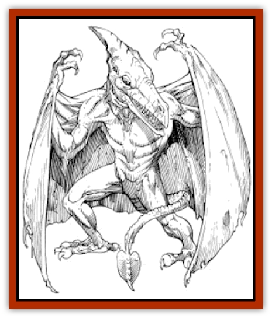

# Pterrax

| Statistic | **Pterrax** |
| --- | --- |
| **Activity Cycle:** | Any |
| **Alignment:** | Neutral |
| **Armor Class:** | 7 |
| **Climate/Terrain:** | Rocky badlands |
| **Damage/Attack:** | 1-8/1-8/2-12 |
| **Diet:** | Omnivore |
| **Frequency:** | Common |
| **Hit Dice:** | 5 |
| **Intelligence:** | Animal (1) |
| **Magic Resistance:** | Nil |
| **Morale:** | Average (8-10) |
| **Movement:** | Fl 12 (B) |
| **No. Appearing:** | 1-6 |
| **No. of Attacks:** | 3 |
| **Organization:** | Flock |
| **Size:** | L (10' long) |
| **Special Attacks:** | Psionics |
| **Special Defenses:** | Nil |
| **THAC0:** | 15 |
| **Treasure:** | Nil |
| **XP Value:** | 420 |

**Psionics Summary**

| Level | Dis/Sci/Dev | Attack/Defense | Score | PSPs |
| --- | --- | --- | --- | --- |
| 5 | 2/3/8 | PsC,II/IF,TW,MB | 13 | 100 |

**Psychometabolism -** *Sciences:* complete healing, animal affinity; *Devotions:* biofeedback, flesh armor, lend health.

**Telepathy -** *Sciences:* mind link, tower of iron will; *Devotions:* psionic crush, intellect fortress, mental barrier, id insinuation, conceal thoughts, empathy, life detection.

Pterrax are large [[Dinosaur_I|pteranodon]]-like creatures which are capable of flight. They occupy the plains and rocky barrens of Athas. Pterrax are sometimes encountered near the edges of the Forest Ridge near the Ringing Mountains, where they are commonly used by [[Pterran|pterrans]] as flying mounts.

Pterrax are generally six feet long, with a reptilian appearance. Their bodies are slender and sport a pair of large wings; these provide the creature with fast flight capabilities and excellent maneuverability. Pterrax have two pairs of limbs, legs and arms, all of which have sharp claws at their ends. The head of a pterrax is similar in shape to that of pterran, suggesting that the two species are somehow related. Pterrax have long, sharp teeth, which are used by pterrans in the creation of the *thanak*, a weapon employed by many of the pterran clans which have migrated from the Hinterlands to the rocky barrens of Athas.

**Combat:** Pterrax commonly engage in fighting, either when being used as pterran mounts, when scavenging for food, or when protecting themselves and their flock. When they do engage in fighting, pterrax are quite capable combatants. They are able to strike up to three times per round, using a claw/claw/bite attack. Each claw does 1d8 points of damage, while the bite of a pterrax does 2d6 points. When fighting against land-based opponents, they often swoop down towards the ground, make their attacks, and then return to the air, where they are protected from melee attacks. Note: if the DM is using the optional "Individual Initiative" rules, an opponent can make melee attacks against a swooping pterrax if its initiative is within 2 (higher or lower) of the creature's.

Like many of the creatures of Athas, pterrax commonly possess psionic powers. Instead of using their natural attack form, a pterrax can use any one of its psionic powers in a round. Also, pterrax possess natural psionic defense modes, again like many other Athasian creatures; these are considered to be always "on". So long as the pterrax has enough PSPs to power its defense modes, the creature can employ them, whether it is attacking with its claws and bite or with its psionic powers.

**Habitat/Society:** Pterrax are most commonly found in the rocky barrens of the Athasian Tablelands. They make nests in the cracks and crevices in the rocky terrain that is characteristic of the plains of this desert world. Most are solitary, but occasionally they gather in groups of up to six members. Their nests are made from dead branches and sticks found in the nearby forests and oasis that lie scattered across the deserts. A pair of pterrax will mate in the fall season, and the female will usually produce three to four eggs. The eggs are incubated by the mother for a period of three months. Young pterrax are cared for by the mother for another two months before they are cast out on their own. While their eggs are incubating, pterrax are very protective of their nest and will attack any who threaten it or their eggs.

As stated above, pterrax are often used by pterrans as flying mounts. By the time a pterrax is two years old, it is strong enough to be used as a mount. The capture and training of a pterrax mount is a part of one of the significant Life Path rituals among the pterrans.

**Ecology:** The eggs of pterrax are a very valuable source of food, and each one, along with water, can sustain a man for a period of two days without difficulty. The teeth of pterrax are used by pterrans in the creation the *thanak*, a weapon used by many of that species' warriors. Also, pterrax skin is sometimes used in making ceremonial drums employed by pterrans in many rituals and yearly celebrations.

---
## Discovery & Documentation

**Source Publication:** MC12 Dark Sun Appendix I - Terrors of the Desert (1991)
**Campaign Setting:** Dark Sun
**Author(s):** Tom Prusa, Louis J. Prosperi, Walter M. Baas

### Other Creatures Found in This Source Book
   * [[Animal_Herd_Athas|Animal, Herd (Athas)]]
   * [[Animal_Household_Athas|Animal, Household (Athas)]]
   * [[Antloid_Desert|Antloid, Desert]]
   * [[Banshee_Dwarf|Banshee, Dwarf]]
   * [[Beetle_Agony|Beetle, Agony]]
   * [[Bog_Wader|Bog Wader]]
   * [[Brambleweed|Brambleweed]]
   * [[B'rohg|B'rohg]]
   * [[Burnflower|Burnflower]]
   * [[Cat_Psionic|Cat, Psionic]]
   * [[Cha'thrang|Cha'thrang]]
   * [[Cistern_Fiend|Cistern Fiend]]
   * [[Clam_Giant|Clam, Giant]]
   * [[Cloud_Ray|Cloud Ray]]
   * [[Drake_Athas_Air|Drake (Athas), Air]]
   * [[Drake_Athas_Earth|Drake (Athas), Earth]]
   * [[Drake_Athas_Fire|Drake (Athas), Fire]]
   * [[Drake_Athas_Water|Drake (Athas), Water]]
   * [[Dune_Runner|Dune Runner]]
   * [[Dune_Trapper|Dune Trapper]]
   * [[Elemental_Athas_Greater_Air|Elemental (Athas), Greater, Air]]
   * [[Elemental_Athas_Greater_Earth|Elemental (Athas), Greater, Earth]]
   * [[Elemental_Athas_Greater_Fire|Elemental (Athas), Greater, Fire]]
   * [[Elemental_Athas_Greater_Water|Elemental (Athas), Greater, Water]]
   * [[Elemental_Athas_Lesser_Air_Earth|Elemental (Athas), Lesser, Air/Earth]]
   * [[Elemental_Athas_Lesser_Fire_Water|Elemental (Athas), Lesser, Fire/Water]]
   * [[Elemental_Athas_General_Information|Elemental (Athas), General Information]]
   * [[Erdland|Erdland]]
   * [[Esperweed|Esperweed]]
   * [[Flailer|Flailer]]
   * [[Floater|Floater]]
   * [[Giant_Athas|Giant (Athas)]]
   * [[Golem_Athas_I|Golem (Athas) I]]
   * [[Golem_Athas_II|Golem (Athas) II]]
   * [[Golem_Athas_III|Golem (Athas) III]]
   * [[Golem_Athas_General_Information|Golem (Athas), General Information]]
   * [[Halfling_Renegade|Halfling, Renegade]]
   * [[Hej-kin|Hej-kin]]
   * [[Id_Fiend|Id Fiend]]
   * [[Insect_Swarm_Athas|Insect Swarm (Athas)]]
   * [[Kank_Wild|Kank, Wild]]
   * [[Kirre|Kirre]]
   * [[Megapede|Megapede]]
   * [[Mul_Wild|Mul, Wild]]
   * [[Nightmare_Beast|Nightmare Beast]]
   * [[Plant_Carnivorous_Athas|Plant, Carnivorous (Athas)]]
   * [[Pterran|Pterran]]
   * [[Pulp_Bee|Pulp Bee]]
   * [[Pyreen|Pyreen]]
   * [[Rasclinn|Rasclinn]]
   * [[Razorwing|Razorwing]]
   * [[Roc_Athas|Roc (Athas)]]
   * [[Sand_Bride|Sand Bride]]
   * [[Sand_Cactus|Sand Cactus]]
   * [[Sand_Vortex|Sand Vortex]]
   * [[Scrab|Scrab]]
   * [[Silt_Horror|Silt Horror]]
   * [[Silt_Runner|Silt Runner]]
   * [[Sink_Worm|Sink Worm]]
   * [[Sloth_Athas|Sloth (Athas)]]
   * [[So-ut|So-ut]]
   * [[Spider_Cactus|Spider Cactus]]
   * [[Spider_Crystal|Spider, Crystal]]
   * [[Spirit_of_the_Land|Spirit of the Land]]
   * [[T'Chowb|T'Chowb]]
   * [[Thrax|Thrax]]
   * [[Tohr-kreen_I|Tohr-kreen I]]
   * [[Villichi|Villichi]]
   * [[Zhackal|Zhackal]]
   * [[Zombie_Plant|Zombie Plant]]
