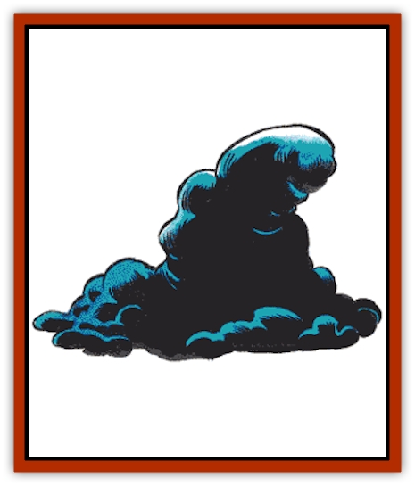

# Pudding - Deadly

| Statistic | **Black** | **Brown** | **Dun** | **White** |
| --- | --- | --- | --- | --- |
| **Activity Cycle:** | Any | Any | Any | Any |
| **Alignment:** | Neutral | Neutral | Neutral | Neutral |
| **Armor Class:** | 6 | 5 | 7 | 8 |
| **Climate/Terrain:** | Any underground | Any marsh | Arid desert | Arctic plain |
| **Damage/Attack:** | 3-24 | 5-20 | 4-24 | 7-28 |
| **Diet:** | Any | Any | Any | Any |
| **Frequency:** | Uncommon | Uncommon | Rare | Rare |
| **Hit Dice:** | 10 | 11 | 8+1 | 9 |
| **Intelligence:** | Non- (0) | Non- (0) | Non- (0) | Non- (0) |
| **Magic Resistance:** | Nil | Nil | Nil | Nil |
| **Morale:** | Special | Special | Special | Special |
| **Movement:** | 6 | 6 | 12 | 9 |
| **No. Appearing:** | 1 (1-4) | 1 (1-4) | 1 (1-4) | 1 (1-4) |
| **No. of Attacks:** | 1 | 1 | 1 | 1 |
| **Organization:** | Solitary | Solitary | Solitary | Solitary |
| **Size:** | S-L (3-8') | S-L (3-8') | S-L (3-8') | S-L (3-8') |
| **Special Attacks:** | See below | See below | See below | See below |
| **Special Defenses:** | See below | See below | See below | See below |
| **THAC0:** | 11 | 9 | 13 | 11 |
| **Treasure:** | Nil | Nil | Nil | Nil |
| **XP Value:** | 2,000 | 2,000 | 1,400 | 1,400 |

Puddings are voracious, puddinglike monsters composed of groups of cell colonies that scavenge and hunt for food. They typically inhabit ruins and dungeons. They have the ability to sense heat and analyze material structure from a distance of up to 90 feet to determine if something is edible. Deadly puddings attack any animals (including humans) or vegetable matter on sight.

All deadly puddings are immune to acid, cold, and poison. *Lightning bolts* and blows from weapons divide them into smaller puddings, each able to attack exactly as the original pudding. Fire causes normal damage, as do magic missiles. Puddings can ooze through cracks that are at least 1 inch wide and can travel on ceilings and walls (falling on victims as a nasty surprise) at the same speed as on a level surface.

Puddings reproduce by fission. They are adapted to live in a wide variety of climates.

Puddings starting with 11-30% of maximum possible hit points are 3 feet to 4 feet in diameter; with 31-50% of full hit points, 5 feet wide; with 51-70% of full hit points, 6 feet wide; with 71-90% of full hit points, 7 feet wide; and with 91-100% of full hit points, 8 feet wide. If a pudding is split up so it becomes less than 3 feet wide, it becomes thinner but retains its 3-foot diameter. Because puddings do not use all of their mouth openings (which cover their exposed surfaces), the smallest pudding does the same damage as the largest.

**Black Pudding**

  Black pudding acid is highly corrosive, inflicting 3-24 points of damage per round to organic matter and dissolving a 2-inch thickness of wood equal to its diameter in one round. Black puddings also dissolve metal. Chain mail dissolves in one round, plate mail in two; each magical "plus" increases the time it takes to dissolve the metal by one round (thus plate mail +3 takes two rounds to dissolve for being plate mail, plus three rounds for having a +3 magical bonus, for a total of five rounds).

**White Pudding**

  These cold-loving creatures are 50% likely to be mistaken for ice and snow (guaranteeing surprise) even under the best of conditions. White puddings haunt polar regions or icy places in order to find prey, although they can live by devouring any animal or vegetable matter; even ice provides them with enough nutrition to exist. White puddings cannot affect metals but dissolve animal and vegetable materials in a single round, inflicting damage to flesh at an astonishing rate.

**Dun Pudding**

  Adapted to dwell in arid regions, these monsters scavenge barrens and deserts and feed on silicates (sand) if animal and vegetable matter is unavailable. They dissolve leather in a single round, regardless of magical pluses. Metals are eaten at a rate half that of black puddings; chain takes two rounds to dissolve, plate four rounds, with an additional two rounds per magical plus.

**Brown Pudding**

  This type dwells principally in marsh areas. It has a tough skin but its attack is less dangerous than other types of puddings. Brown puddings cannot affect metals but dissolve leather and wood in a single round, regardless of magical pluses.

****

  Other pudding types are possible, at the DM's option.

---
## Discovery & Documentation

**Source Publication:** MC1 Volume I (w/binder #1) (1991)
**Campaign Setting:** Advanced Dungeons & Dragons 2nd Edition
**Author(s):** Jay Batista, Scott Bennie, Grant Boucher, William W. Connors, Steve Gilbert, Heike Kubasch, James Lowder, David Edward Martin, Bruce Nesmith, Jean Rabe, Rick Swan, John J. Terra, Gary L. Thomas

### Other Creatures Found in This Source Book
   * [[Bat|Bat]]
   * [[Bear|Bear]]
   * [[Behir|Behir]]
   * [[Boar|Boar]]
   * [[Bookworm|Bookworm]]
   * [[Brownie|Brownie]]
   * [[Bugbear|Bugbear]]
   * [[Carrion_Crawler|Carrion Crawler]]
   * [[Cat_Great|Cat, Great]]
   * [[Catoblepas|Catoblepas]]
   * [[Dragon_General_Information|Dragon, General Information]]
   * [[Dragonfish|Dragonfish]]
   * [[Elemental_Air_Kin_Aerial_Servant|Elemental, Air Kin, Aerial Servant]]
   * [[Elemental_Earth_Kin_Sandling|Elemental, Earth Kin, Sandling]]
   * [[Elephant|Elephant]]
   * [[Gnoll|Gnoll]]
   * [[Hobgoblin|Hobgoblin]]
   * [[Homunculus|Homunculus]]
   * [[Hornet_Giant|Hornet, Giant]]
   * [[Horse|Horse]]
   * [[Hyena|Hyena]]
   * [[Jackal|Jackal]]
   * [[Jackalwere|Jackalwere]]
   * [[Korred|Korred]]
   * [[Lich|Lich]]
   * [[Lizard|Lizard]]
   * [[Lizard_Man|Lizard Man]]
   * [[Lycanthrope_General_Information|Lycanthrope, General Information]]
   * [[Lycanthrope_Seawolf|Lycanthrope, Seawolf]]
   * [[Lycanthrope_Werebear|Lycanthrope, Werebear]]
   * [[Lycanthrope_Weretiger|Lycanthrope, Weretiger]]
   * [[Lycanthrope_Werewolf|Lycanthrope, Werewolf]]
   * [[Manticore|Manticore]]
   * [[Medusa|Medusa]]
   * [[Mind_Flayer|Mind Flayer]]
   * [[Minotaur|Minotaur]]
   * [[Mudman|Mudman]]
   * [[Mummy|Mummy]]
   * [[Nixie|Nixie]]
   * [[Nymph|Nymph]]
   * [[Ogre|Ogre]]
   * [[Ooze_Slime_Jelly_I|Ooze/Slime/Jelly I]]
   * [[Ooze_Slime_Jelly_II|Ooze/Slime/Jelly II]]
   * [[Orc|Orc]]
   * [[Owl|Owl]]
   * [[Owlbear_I|Owlbear I]]
   * [[Pegasus|Pegasus]]
   * [[Piercer|Piercer]]
   * [[Rakshasa|Rakshasa]]
   * [[Rat|Rat]]
   * [[Ray|Ray]]
   * [[Remorhaz|Remorhaz]]
   * [[Satyr|Satyr]]
   * [[Scorpion|Scorpion]]
   * [[Selkie|Selkie]]
   * [[Shadow|Shadow]]
   * [[Skeleton|Skeleton]]
   * [[Skunk|Skunk]]
   * [[Snake|Snake]]
   * [[Spectre|Spectre]]
   * [[Spider|Spider]]
   * [[Sprite|Sprite]]
   * [[Toad_Giant|Toad, Giant]]
   * [[Treant|Treant]]
   * [[Troll|Troll]]
   * [[Umber_Hulk|Umber Hulk]]
   * [[Unicorn|Unicorn]]
   * [[Vampire|Vampire]]
   * [[Wight|Wight]]
   * [[Will_O'Wisp|Will O'Wisp]]
   * [[Wolf|Wolf]]
   * [[Wolfwere|Wolfwere]]
   * [[Wraith|Wraith]]
   * [[Wyvern|Wyvern]]
   * [[Yeti|Yeti]]
   * [[Yuan-ti|Yuan-ti]]
   * [[Zombie|Zombie]]
