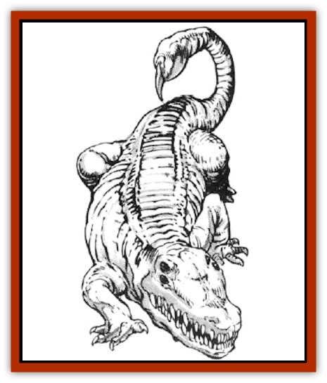

# Puffer

| Statistic | **Puffer** |
| --- | --- |
| **Activity Cycle:** | Any |
| **Alignment:** | Neutral |
| **Armor Class:** | 4 |
| **Climate/Terrain:** | Any space |
| **Damage/Attack:** | 1-12/1-6 |
| **Diet:** | Carnivore |
| **Frequency:** | Rare |
| **Hit Dice:** | 9 |
| **Intelligence:** | High (13-14) |
| **Magic Resistance:** | Nil |
| **Morale:** | Fanatic (18) |
| **Movement:** | 15 (active only) |
| **No. Appearing:** | 1 |
| **No. of Attacks:** | 3 |
| **Organization:** | Solitary |
| **Size:** | M (12' long) active state / L (20-40' diam.) dormant state |
| **Special Attacks:** | Poison stinger |
| **Special Defenses:** | Nil |
| **THAC0:** | 11 |
| **Treasure:** | Nil |
| **XP Value:** | 2,000 |

The puffer is a durable creature that can bear the rigors of wildspace for years at a time while in its dormant state. Yet, when it lands upon an asteroid or ship and becomes active, it can become a terrible killing machine, often leaving a wasteland in its wake.

In its dormant state the puffer resembles a tightly-stretched balloon - a featureless sphere floating through wildspace. It can be as large as 40' in diameter, or perhaps as small as half that, depending on how long it has been dormant. Upon close inspection, its smooth skin looks obviously different from an asteroid or other natural object.

When active, the puffer resembles a cross between a [[Crocodile|crocodile]] and a [[Scorpion|scorpion]]. It has a mouthful of sharp fangs and a poison stinger in its tail, which it keeps curled over its back, ready to strike a foe in any direction.

A puffer can propel itself slowly through wildspace by exhaling a small trickle of air. It cannot approach spelliammer speed, of course, but it can sense any ship or other large object within 100 miles. The puffer slowly approaches the object and, if it can catch it, lands and immediately becomes active.

A puffer can make some 5-10 attempts to land somewhere before its supply of air is exhausted. If this occurs before it can land, the puffer dies in space without reproducing.

**Combat:** A puffer can fight only in active mode. It can be slain when dormant, if characters reach it in wildspace. In fact, when thus killed, its body becomes a valuable source of air. As soon as a puffer comes into contact with more than one ton of air, however, it becomes active.

The bite of the puffer inflicts 1d12 points of damage, while the stinger causes 1d6. In addition, those struck by the stinger must roll a successful saving throw vs. poison or die.

**Habitat/Society:** Puffers spend most of their lives in the ultimate seclusion - the eternal dark and cold of wildspace beyond the outermost planets. Once in its life, however, a puffer tries to land. After landing, it must kill some creature to serve as host for its eggs. These it lays, and then it returns to wildspace to die.

The eggs hatch three to four weeks later, releasing 1d100 tiny, active puffers into whatever environment fortune has placed them (hp 1 each, AC 10, THAC0 19). These tiny puffers have stingers every bit as lethal as the adult's. Each of them seeks a warm-blooded animal as a victim, which they attempt to sting to death. If successful, the little puffer devours the kill, growing quickly as it does so.

After the meal, it slowly begins to inhale air, inflating until it is a dormant ball some 30-40' across. Then, with an expulsion of air, it shoots slowly into wildspace at non-spelljamming speed, where it will spend the next years or even decades.

**Ecology:** Puffers feed on meat, and they seek creatures of human size or larger for their kills. They can grow and lay their eggs using smaller creatures for sustenance, but it takes many of these for each activity, as opposed to one good-sized carcass of 150-200 lbs.

Puffers cannot survive the extreme of a fall from space to a fullsized planet, nor can their air-blown drives carry them from a planet into space. Thus, they confine their activities to ships, asteroids, and other small objects in space.

---
## Discovery & Documentation

**Source Publication:** MC7 Spelljammer Appendix I (1990)
**Campaign Setting:** Advanced Dungeons & Dragons 2nd Edition
**Author(s):** various

### Other Creatures Found in This Source Book
   * [[Aartuk|Aartuk]]
   * [[Albari|Albari]]
   * [[Ancient_Mariner|Ancient Mariner]]
   * [[Argos|Argos]]
   * [[Beholder_Abomination_Astereater|Beholder (Abomination), Astereater]]
   * [[Blazozoid|Blazozoid]]
   * [[Chattur|Chattur]]
   * [[Chevall|Chevall]]
   * [[Clockwork_Horror|Clockwork Horror]]
   * [[Colossus|Colossus]]
   * [[Delphinid|Delphinid]]
   * [[Dizantar|Dizantar]]
   * [[Dog|Dog]]
   * [[Dog_Bog_Hound|Dog, Bog Hound]]
   * [[Esthetic|Esthetic]]
   * [[Focoid|Focoid]]
   * [[Fractine|Fractine]]
   * [[Giant_Spacesea|Giant, Spacesea]]
   * [[Golem_Furnace|Golem, Furnace]]
   * [[Golem_Radiant|Golem, Radiant]]
   * [[Gravislayer|Gravislayer]]
   * [[Grommam|Grommam]]
   * [[Hadozee|Hadozee]]
   * [[Hamster_Giant_Space|Hamster, Giant Space]]
   * [[Jammer_Leech|Jammer Leech]]
   * [[Lakshu|Lakshu]]
   * [[Lumineaux|Lumineaux]]
   * [[Lutum|Lutum]]
   * [[Mimic_Space|Mimic, Space]]
   * [[Misi|Misi]]
   * [[Moon_Rogue|Moon, Rogue]]
   * [[Mortiss|Mortiss]]
   * [[Murderoid|Murderoid]]
   * [[Nay-Churr|Nay-Churr]]
   * [[Phlog-Crawler|Phlog-Crawler]]
   * [[Plasman|Plasman]]
   * [[Plasmoid_DeGleash|Plasmoid, DeGleash]]
   * [[Plasmoid_DelNoric|Plasmoid, DelNoric]]
   * [[Plasmoid_General_Information|Plasmoid, General Information]]
   * [[Plasmoid_Ontalak|Plasmoid, Ontalak]]
   * [[Q'nidar|Q'nidar]]
   * [[Rastipede|Rastipede]]
   * [[Reigar|Reigar]]
   * [[Rock_Hopper|Rock Hopper]]
   * [[Slinker|Slinker]]
   * [[Spider_Asteroid|Spider, Asteroid]]
   * [[Spiritjam|Spiritjam]]
   * [[Survivor|Survivor]]
   * [[Syllix|Syllix]]
   * [[Symbiont_Power|Symbiont, Power]]
   * [[Vine_Infinity|Vine, Infinity]]
   * [[Wiggle|Wiggle]]
   * [[Wizshade|Wizshade]]
   * [[Wryback|Wryback]]
   * [[Zard|Zard]]
   * [[Zodar|Zodar]]
