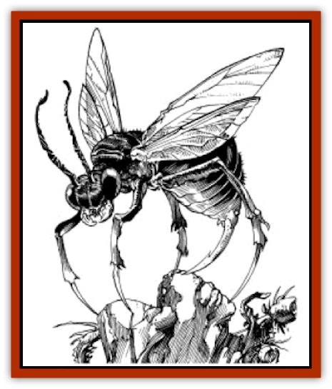

# Pulp Bee

| Statistic | **Pulp Bee** |
| --- | --- |
| **Activity Cycle:** | Day |
| **Alignment:** | Neutral |
| **Armor Class:** | 4 |
| **Climate/Terrain:** | Scrub plains |
| **Damage/Attack:** | 1-6 |
| **Diet:** | Herbivore |
| **Frequency:** | Rare |
| **Hit Dice:** | 7 |
| **Intelligence:** | Animal (1) |
| **Magic Resistance:** | Nil |
| **Morale:** | Average (8-10) |
| **Movement:** | Fl 18 (B) |
| **No. Appearing:** | 1-4 |
| **No. of Attacks:** | 1 |
| **Organization:** | Hive |
| **Size:** | S (2' long) |
| **Special Attacks:** | Paralysis/Poison |
| **Special Defenses:** | Nil |
| **THAC0:** | 13 |
| **Treasure:** | Nil (A) |
| **XP Value:** | 2,000 |

Pulp bees are large [[Hornet_Giant|wasps]] which inhabit the plains along the edges of the Athasian deserts. Pulp bees secrete a pasty substance which hardens into a material similar in texture and consistency to wood.

Pulp bees are usually two feet long, have four legs, and a sharp, stinger tail. Pulp bees are capable of flight, due to the two pairs of foot-long wings located on the creature's back. Like many [[Insect_Giant|insects]], pulp bees have the natural ability to cling to vertical surfaces (walls, rock ledges, etc.) The chitinous body of a pulp bee is black in color and is segmented from its head to its abdomen. The thorax and limbs of a pulp bee are colored bright red, making identification of this creature fairly easy.

**Combat:** Pulp bees attack any who threaten their hives, where the queen and her eggs live. When threatened, pulp bees attack with their stinger, through which they are able to inject a paralytic poison into their victims. The actual sting itself does 1d6 points of damage, but those successfully attacked must save vs. poison or suffer an additional 4-24 (4d6) points of damage. Any creature that fails the poison save must then save vs. paralysis or become paralyzed after 2-24 rounds. This paralysis lasts for 2-12 hours, after which time the victim will remain very weak for another 10-12 hours (-2 strength).

**Habitat/Society:** Like most insects, pulp bees gather in hives. Pulp bees make their homes on the plains which surround the deserts of Athas. Pulp bee nests are made of a substance which they secrete. It is a paste-like material which hardens to a near wooden consistency. The bees use this material to form their nests. Nests made of this material offer very good protection against any intruders.

Within a hive, there are three different types of pulp bees: fighters/builders, food gatherers/producers, and the queens. The queens are responsible for laying and hatching eggs, which produce more members of the hive. Food gatherers/producers are responsible for providing food for the hive. They go out and gather food from nearby plants and flowers, and return with it to the nest. Once there, they break down the food into a mushy paste, which they ingest. This paste serves as raw material for the food-producing bees, who then secrete a sweet liquid which, when it hardens, is the main source of food for the hive. Fighters/builders perform the same functions as soldiers and workers in other insect hives. They guard the nest while the queens. eggs are incubating, and they are the ones who build the nest itself. All members of the hive are identical in appearance, though the queen is generally a much larger specimen.

Aside from living in the wild, pulp bees are also cultivated by some Athasian cultures as a source of building material. Clans of both humans and elves have been known to raise pulp bees, often within a city or oasis village.

**Ecology:** The wood-like substance secreted by pulp bees is sought after by many cultures as a source of building materials. Also, the liquid secreted by food-producing bees is very tasty and nutritious. One quart of this liquid alone is capable of sustaining an adult in the desert for two days. When hardened, it looses some of its nutrition, but can still sustain an adult for up to one day.

---
## Discovery & Documentation

**Source Publication:** MC12 Dark Sun Appendix I - Terrors of the Desert (1991)
**Campaign Setting:** Dark Sun
**Author(s):** Tom Prusa, Louis J. Prosperi, Walter M. Baas

### Other Creatures Found in This Source Book
   * [[Animal_Herd_Athas|Animal, Herd (Athas)]]
   * [[Animal_Household_Athas|Animal, Household (Athas)]]
   * [[Antloid_Desert|Antloid, Desert]]
   * [[Banshee_Dwarf|Banshee, Dwarf]]
   * [[Beetle_Agony|Beetle, Agony]]
   * [[Bog_Wader|Bog Wader]]
   * [[Brambleweed|Brambleweed]]
   * [[B'rohg|B'rohg]]
   * [[Burnflower|Burnflower]]
   * [[Cat_Psionic|Cat, Psionic]]
   * [[Cha'thrang|Cha'thrang]]
   * [[Cistern_Fiend|Cistern Fiend]]
   * [[Clam_Giant|Clam, Giant]]
   * [[Cloud_Ray|Cloud Ray]]
   * [[Drake_Athas_Air|Drake (Athas), Air]]
   * [[Drake_Athas_Earth|Drake (Athas), Earth]]
   * [[Drake_Athas_Fire|Drake (Athas), Fire]]
   * [[Drake_Athas_Water|Drake (Athas), Water]]
   * [[Dune_Runner|Dune Runner]]
   * [[Dune_Trapper|Dune Trapper]]
   * [[Elemental_Athas_Greater_Air|Elemental (Athas), Greater, Air]]
   * [[Elemental_Athas_Greater_Earth|Elemental (Athas), Greater, Earth]]
   * [[Elemental_Athas_Greater_Fire|Elemental (Athas), Greater, Fire]]
   * [[Elemental_Athas_Greater_Water|Elemental (Athas), Greater, Water]]
   * [[Elemental_Athas_Lesser_Air_Earth|Elemental (Athas), Lesser, Air/Earth]]
   * [[Elemental_Athas_Lesser_Fire_Water|Elemental (Athas), Lesser, Fire/Water]]
   * [[Elemental_Athas_General_Information|Elemental (Athas), General Information]]
   * [[Erdland|Erdland]]
   * [[Esperweed|Esperweed]]
   * [[Flailer|Flailer]]
   * [[Floater|Floater]]
   * [[Giant_Athas|Giant (Athas)]]
   * [[Golem_Athas_I|Golem (Athas) I]]
   * [[Golem_Athas_II|Golem (Athas) II]]
   * [[Golem_Athas_III|Golem (Athas) III]]
   * [[Golem_Athas_General_Information|Golem (Athas), General Information]]
   * [[Halfling_Renegade|Halfling, Renegade]]
   * [[Hej-kin|Hej-kin]]
   * [[Id_Fiend|Id Fiend]]
   * [[Insect_Swarm_Athas|Insect Swarm (Athas)]]
   * [[Kank_Wild|Kank, Wild]]
   * [[Kirre|Kirre]]
   * [[Megapede|Megapede]]
   * [[Mul_Wild|Mul, Wild]]
   * [[Nightmare_Beast|Nightmare Beast]]
   * [[Plant_Carnivorous_Athas|Plant, Carnivorous (Athas)]]
   * [[Pterran|Pterran]]
   * [[Pterrax|Pterrax]]
   * [[Pyreen|Pyreen]]
   * [[Rasclinn|Rasclinn]]
   * [[Razorwing|Razorwing]]
   * [[Roc_Athas|Roc (Athas)]]
   * [[Sand_Bride|Sand Bride]]
   * [[Sand_Cactus|Sand Cactus]]
   * [[Sand_Vortex|Sand Vortex]]
   * [[Scrab|Scrab]]
   * [[Silt_Horror|Silt Horror]]
   * [[Silt_Runner|Silt Runner]]
   * [[Sink_Worm|Sink Worm]]
   * [[Sloth_Athas|Sloth (Athas)]]
   * [[So-ut|So-ut]]
   * [[Spider_Cactus|Spider Cactus]]
   * [[Spider_Crystal|Spider, Crystal]]
   * [[Spirit_of_the_Land|Spirit of the Land]]
   * [[T'Chowb|T'Chowb]]
   * [[Thrax|Thrax]]
   * [[Tohr-kreen_I|Tohr-kreen I]]
   * [[Villichi|Villichi]]
   * [[Zhackal|Zhackal]]
   * [[Zombie_Plant|Zombie Plant]]
