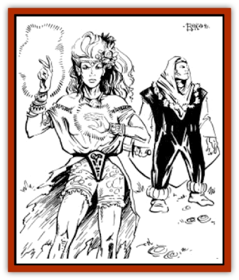

# Pyreen

| Statistic | **Pyreen** |
| --- | --- |
| **Activity Cycle:** | Any |
| **Alignment:** | Neutral good |
| **Armor Class:** | 0 (10) |
| **Climate/Terrain:** | Any |
| **Damage/Attack:** | By weapon +3 (strength) |
| **Diet:** | Omnivore |
| **Frequency:** | Very Rare |
| **Hit Dice:** | 16-20 |
| **Intelligence:** | Supra-Genius (19) |
| **Magic Resistance:** | 25% |
| **Morale:** | Fearless (20) |
| **Movement:** | 24 |
| **No. Appearing:** | 1 |
| **No. of Attacks:** | 1 |
| **Organization:** | Solitary |
| **Size:** | M (6-7') |
| **Special Attacks:** | Spells, see below |
| **Special Defenses:** | Spells, see below |
| **THAC0:** | 5 |
| **Treasure:** | V&times;3 |
| **XP Value:** | 14,000 |

**Psionics Summary**

| Level | Dis/Sci/Dev | Attack/Defense | Score | PSPs |
| --- | --- | --- | --- | --- |
| 13 | 4/7/16 | EW,PB/All | 16 | 1D100+225 |

**Clairsentience -** *Science:* aura sight; *Devotions:* danger sense, spirit sense.

**Psychometabolism -** *Sciences:* complete healing, energy containment; *Devotions:* absorb disease, chameleon power, chemical simulation, mind over body.

**Telepathy -** *Sciences:* tower of iron will, psionic blast, mind link, ejection; *Devotions:* conceal thoughts, empathy, identity penetration, intellect fortress, mental barrier, mind blank, psychic messenger, thought shield, truthear, contact, ego whip.

**Metapsionics -** *Science:* psychic surgery; *Devotions:* enhancement, gird, psionic sense.

Pyreens (or Peace-Bringers) are mysterious beings that roam the world of Athas. They are powerful psionicists and very powerful druids. They travel about Athas attempting to set things right, although it looks like a hopeless battle. Few know of their existence, and fewer still have ever met one. They are sworn enemies of defilers, and their actions indicate they are bent on the destruction of the sorcerer-kings.

Pyreens are humanoid, although they are not identifiable as any of the current humanoid or demi-human races - rather, they have characteristics of all of them. They have the broad bodies of [[Dwarf_Athas|dwarves]], the pointed ears of the [[Elf_Athas|elves]], the eyes of a human or giant, and the childlike face of the [[Halfling_Athas|halflings]]. Pyreens are almost never seen in their natural form, for with their druidic abilities they can take the form of any animal. Peace-bringers also have forms in each race and generally travel about looking like any of a thousand faceless wanderers on the roads.

Pyreens speak all of the languages of humans and demihumans. In addition, there is a 65% chance that they speak any other language spoken by intelligent creatures of Athas.

**Combat:** Pyreens do not like combat, but they are devastating foes if they do decide to fight. In addition to their formidable psionic powers, all pyreens are druids of at least 16th level. As such, they each have guarded lands, but these lands are huge (for instance, the entire Forest Ridge or the Ringing Mountains of the west). They have major access to the spheres of the Cosmos and to all of the elemental spheres. The pyreens are generally 16th level, although there are four at 17th level, four at 18th level, two at 19th level, and their leader, Alar Ch'Aranol, is 20th level.

In addition to psionics, spells, and the other druid powers, pyreens all carry several magic items, among which is usually a magical metal weapon. This is generally a dagger or knife, something easily concealed. The weapon is always highly enchanted (+3 or better) and sometimes has other special powers. Other magic items favored by pyreens include rings, *cloaks of protection*, and *bracers of defense*.

Pyreens are naturally immune to the initiative loss of defiler magic. Their connections with the spirits of the lands are strong enough that they never need to pray for spells, but instead receive them every morning without prayer.

A pyreen very rarely enters combat on someone else's behalf, although they might make an exception if a defiler is involved. This is not to imply that a peace-bringer is in any way fearful, but rather that they feel that someone who has lived thousands of years should not risk his life to save a short-lived human. The destruction of the land is another matter entirely. A party battling a defiler may suddenly find a sand elemental fighting on their side, or a sudden forceful wind may arise that knocks down the defiler, spoiling his spell. Such parties have been aided by a pyreen, although they will never see him nor find the slightest trace of him.

The chance for a pyreen to help a battling party is based entirely on the combat involved. If a pyreen observes a druid defending his guarded lands or a party fighting a defiler, he may lend his help. On the other hand, if he stumbles upon a group of adventurers simply battling a creature that wants to eat them, the pyreen is likely to just carry on about his business. This seemingly callous attitude is caused by the pyreen's thousands of years existence. A short-lived human or elf is just not worth a risk to the pyreen's greater mission.

In addition, pyreens have a good knowledge of the world. If the party is well known and powerful, the pyreen is 75% likely to know about them. In this case, the amount of help (or opposition) proffered by the pyreen depends entirely on the party's previous actions. If they are known for defeating a defiler, for instance, they stand a good chance of receiving some sort of aid from the pyreen, even against some lowly monster.

**Habitat/Society:** Pyreens are solitary creatures, even in the midst of a city. They usually have a mission to perform, something connected with restoring the land or defeating a defiler (the ultimate defilers, of course, being the sorcerer-kings). Alar Ch'Aranol's current mission is the ultimate destruction of the [[Dragon_of_Tyr|dragon of Tyr]]. While Alar is very powerful, he knows that he is no match for the Dragon. So, he is trying to see that good adventurers survive to reach levels of power even greater than his own. Much of his time is spent helping the land recover from visits by the Dragon, aiding enslaved humans and demihumans, and doing what he can to prevent the further destruction of the land. This has been his mission for almost a thousand years now, and it looks like it may take many more. He knows that his mission is virtually impossible, but he also knows that given enough time, anything can be accomplished.

Peace-bringers have no permanent home, although they may take up residence in one place for 50 or 100 years. Generally, they are travellers, seeking to do what they can to restore the land. This includes aiding druids in defending or restoring their guarded lands.

Pyreens have vast knowledge concerning the way Athas was before its ecology was ruined. They never reveal this knowledge, even to save their own lives. (They are also some of the very few beings who have traveled extensively in the Hinterlands.) The knowledge they possess might be shared with a deserving party, but only regarding the current condition of the land. A pyreen will never talk about the land's state as it used to be. They are perhaps the only beings who might know just where and how the dragon came to be, for it is thought that they even predate the dragon.

These noble beings can always recognize one another, in whatever form they are currently using. Only rarely do they work together, for each has slightly different ideas on what needs to be done to restore the world to its former state.

It is not known whether their extremely long life spans are a racial trait or are due to their incredible druid powers. There is no record of a pyreen ever dying of old age. There were once many more of them.

Pyreens are able to sustain themselves without water or nourishment anywhere on Athas, just as a high level druid in his guarded lands. They can and do eat and enjoy fine wines and foods.

Peace-bringers use their powers to aid the land and the people in it. Legends tell of a man dying of thirst in the desert finding a bottle of fresh cold water. Most people put this down to an "old elves" tale, but the man in question was actually helped by a pyreen. In general, if a pyreen can help without revealing himself, and if he feels it will benefit the land, he will help. A favorite trick is to shapechange into human or half-elven form and approach the party claiming to be a low-level druid. The pyreen is very careful never to reveal any of his powerful magic, even moderating the effects of his spells if necessary. Thus, he might use a *create water* that only creates two or three gallons of water, rather than the eight to ten he could normally create. A pyreen never becomes too involved with any individual or group of adventurers; if they need help more than once in their lifetimes, they are not the type of adventurers that a pyreen is looking for to aid his great mission.

**Ecology:** Pyreens are a throwback. As such, they have no real place in the ecology of Athas, although they certainly have an effect on it. An adventurer that battles a defiler may not be able to do anything about the destruction caused by the defiler. However, if he returns to the battle site a few months later, he may find grass and trees growing where none should. Unfortunately, a pyreen is only able to cast a *rejuvenate* spell once per month. This is a great weakness in their battle to restore the land, and perhaps the reason that they help parties to reach higher levels. If they actually witness a mage or priest casting a *rejuvenate* spell, they are likely to follow that being in animal form for quite some time. They seek to aid and protect someone who can do almost as much to restore the land as they can. In spite of this aid, the world is so big, and the peace-bringers so few, that an human may adventure his whole lifetime and never meet a pyreen.

---
## Discovery & Documentation

**Source Publication:** MC12 Dark Sun Appendix I - Terrors of the Desert (1991)
**Campaign Setting:** Dark Sun
**Author(s):** Tom Prusa, Louis J. Prosperi, Walter M. Baas

### Other Creatures Found in This Source Book
   * [[Animal_Herd_Athas|Animal, Herd (Athas)]]
   * [[Animal_Household_Athas|Animal, Household (Athas)]]
   * [[Antloid_Desert|Antloid, Desert]]
   * [[Banshee_Dwarf|Banshee, Dwarf]]
   * [[Beetle_Agony|Beetle, Agony]]
   * [[Bog_Wader|Bog Wader]]
   * [[Brambleweed|Brambleweed]]
   * [[B'rohg|B'rohg]]
   * [[Burnflower|Burnflower]]
   * [[Cat_Psionic|Cat, Psionic]]
   * [[Cha'thrang|Cha'thrang]]
   * [[Cistern_Fiend|Cistern Fiend]]
   * [[Clam_Giant|Clam, Giant]]
   * [[Cloud_Ray|Cloud Ray]]
   * [[Drake_Athas_Air|Drake (Athas), Air]]
   * [[Drake_Athas_Earth|Drake (Athas), Earth]]
   * [[Drake_Athas_Fire|Drake (Athas), Fire]]
   * [[Drake_Athas_Water|Drake (Athas), Water]]
   * [[Dune_Runner|Dune Runner]]
   * [[Dune_Trapper|Dune Trapper]]
   * [[Elemental_Athas_Greater_Air|Elemental (Athas), Greater, Air]]
   * [[Elemental_Athas_Greater_Earth|Elemental (Athas), Greater, Earth]]
   * [[Elemental_Athas_Greater_Fire|Elemental (Athas), Greater, Fire]]
   * [[Elemental_Athas_Greater_Water|Elemental (Athas), Greater, Water]]
   * [[Elemental_Athas_Lesser_Air_Earth|Elemental (Athas), Lesser, Air/Earth]]
   * [[Elemental_Athas_Lesser_Fire_Water|Elemental (Athas), Lesser, Fire/Water]]
   * [[Elemental_Athas_General_Information|Elemental (Athas), General Information]]
   * [[Erdland|Erdland]]
   * [[Esperweed|Esperweed]]
   * [[Flailer|Flailer]]
   * [[Floater|Floater]]
   * [[Giant_Athas|Giant (Athas)]]
   * [[Golem_Athas_I|Golem (Athas) I]]
   * [[Golem_Athas_II|Golem (Athas) II]]
   * [[Golem_Athas_III|Golem (Athas) III]]
   * [[Golem_Athas_General_Information|Golem (Athas), General Information]]
   * [[Halfling_Renegade|Halfling, Renegade]]
   * [[Hej-kin|Hej-kin]]
   * [[Id_Fiend|Id Fiend]]
   * [[Insect_Swarm_Athas|Insect Swarm (Athas)]]
   * [[Kank_Wild|Kank, Wild]]
   * [[Kirre|Kirre]]
   * [[Megapede|Megapede]]
   * [[Mul_Wild|Mul, Wild]]
   * [[Nightmare_Beast|Nightmare Beast]]
   * [[Plant_Carnivorous_Athas|Plant, Carnivorous (Athas)]]
   * [[Pterran|Pterran]]
   * [[Pterrax|Pterrax]]
   * [[Pulp_Bee|Pulp Bee]]
   * [[Rasclinn|Rasclinn]]
   * [[Razorwing|Razorwing]]
   * [[Roc_Athas|Roc (Athas)]]
   * [[Sand_Bride|Sand Bride]]
   * [[Sand_Cactus|Sand Cactus]]
   * [[Sand_Vortex|Sand Vortex]]
   * [[Scrab|Scrab]]
   * [[Silt_Horror|Silt Horror]]
   * [[Silt_Runner|Silt Runner]]
   * [[Sink_Worm|Sink Worm]]
   * [[Sloth_Athas|Sloth (Athas)]]
   * [[So-ut|So-ut]]
   * [[Spider_Cactus|Spider Cactus]]
   * [[Spider_Crystal|Spider, Crystal]]
   * [[Spirit_of_the_Land|Spirit of the Land]]
   * [[T'Chowb|T'Chowb]]
   * [[Thrax|Thrax]]
   * [[Tohr-kreen_I|Tohr-kreen I]]
   * [[Villichi|Villichi]]
   * [[Zhackal|Zhackal]]
   * [[Zombie_Plant|Zombie Plant]]
